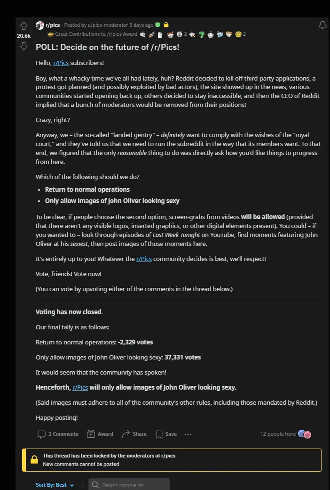

# What happened to reddit?

Why is everyone angry at reddit??

What went wrong?

A very short post, with a few links.

<!-- more -->

## Why is everyone leaving reddit all of a sudden?

Hint, this isn't due to the Apollo app. 

It never was. Apollo just happens to be one of the bigger applications affected- and the most vocal.

### 1. Reddit announced API changes, which would break/end most all 3rd party applications.

In addition, NSFW content, will no longer be available for 3rd-party applications.

### 2. Reddit did an AMA to address the changes.

[AMA Link](https://www.reddit.com/r/reddit/comments/145bram/addressing_the_community_about_changes_to_our_api/){target=_blank}

However, during this AMA, basically none of the questions were answered. 

And, during this process, spez was even caught copy and pasting from an answers sheet. [Archive Link](https://archive.ph/X6EJq){target=_blank}

He, of course, edited his reply. Hence the archive link.

### 3. Reddit goes offline to protest changes.

Over 75% of reddit subs went private in order to protest the changes.

* [Futurism.com](https://futurism.com/the-byte/reddit-rebellion-ceo){target=_blank}
* [BBC.com](https://www.bbc.com/news/technology-65855608){target=_blank}

### 4. Spez, refers to the moderators as noise, and says this protest will pass.

* [YouTube Link - Louis Rossmann](https://www.youtube.com/watch?v=ZOm_UKGyrZg){target=_blank}
* [Mac Rumors](https://www.macrumors.com/2023/06/13/reddit-ceo-blackouts-no-revenue-impact/){target=_blank}

### 5. Spez replaces moderators who were apart of the protest.

This of course, happened after reddit claimed it wouldn't be forcibly re-opening any of the subs.

* [nbcnews.com](https://www.nbcnews.com/tech/tech-news/reddit-protest-blackout-ceo-steve-huffman-moderators-rcna89544)
* [Forbes](https://www.forbes.com/sites/antoniopequenoiv/2023/06/16/reddit-may-replace-moderators-if-they-dont-open-their-pages-report-says/)

Will try and dig up some of the archive links from reddit posts which were deleted...

* <https://lemmyonline.com/post/2180>

### Users are reporting their deleted posts, are becoming undeleted.

### Many moderators after being threatened, re-opened their subs, with a twist.

#### John Oliver 
That twist is- you can only post pictures of John Oliver. 

Of course, this was voted on by the community, and not just forced by the mods.

[Link to poll](https://www.reddit.com/r/aww/comments/14bt0c1/poll_decide_on_the_future_of_raww/)

[Link to explanation](https://www.reddit.com/r/aww/comments/14cgp6d/henceforth_raww_will_only_feature_john_oliver/)

[Link to poll](https://www.reddit.com/r/pics/comments/14b2a6q/poll_decide_on_the_future_of_rpics/)

[Link to explanation](https://www.reddit.com/r/pics/comments/14bai7s/henceforth_rpics_will_feature_only_images_of_john/)

Many other subs are also participating in this movement. A fine example of r/maliciouscompliance... (Or- better yet- [c/maliciouscompliance](https://lemmyonline.com/c/maliciouscompliance@lemmy.world))

[News post - The Verge](https://www.theverge.com/2023/6/17/23764729/reddit-users-pics-gifs-subreddits-john-oliver)

#### r/steam - From steam (video game hosting) to Literal steam.

Play games on steam? Well, since r/steam was forced to re-open, they decided to only post pictures of literal steam!

#### r/horny - From NSFW sub, to NSFW Christian Minecraft Server sub

Despite how r/horny may appear- Its all pictures of a christian minecraft server now.

The sidebar is also worth a glance.

* [Related News Post](https://www.businessinsider.com/nsfw-reddit-community-now-christian-minecraft-server-new-protest-2023-6)

## Better News

The verge has created a consolidated news thread of all of the events occurring. 

I would highly recommending giving it a read. 

It is far more up to date as opposed to my post here, as they are actually paid to keep it current, and accurate. (I don't get compensated for this. I don't take your donations either.)

* <https://www.theverge.com/2023/6/8/23754780/reddit-api-updates-changes-news-announcements>