# Proxmox - Add Disk to Existing Thin-Provisioned LVM Pool

A very short guide on adding a new disk to an existing LVM pool.

<!-- more -->

## How to do it.

### Step 1. Identify the new disk.

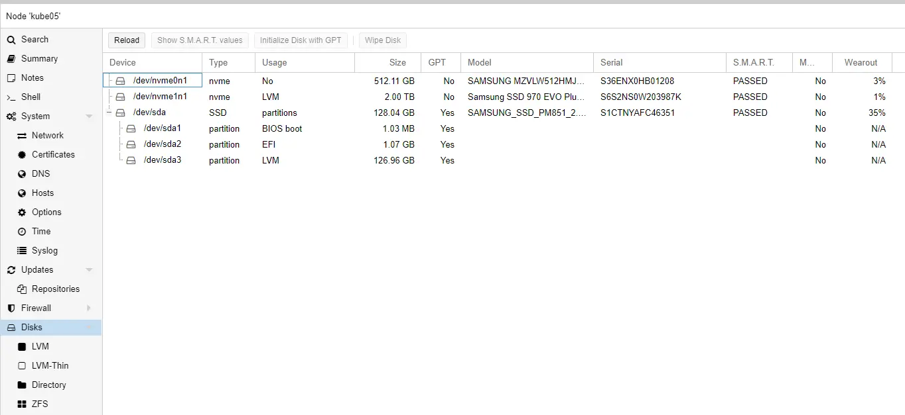

First, identify the disk. 

You can acquire this information via the GUI, or the CLI.

If you prefer the CLI, you can either use `lsblk`, `lvmdiskscan`, or `fdisk -l` to view disks on your system. 

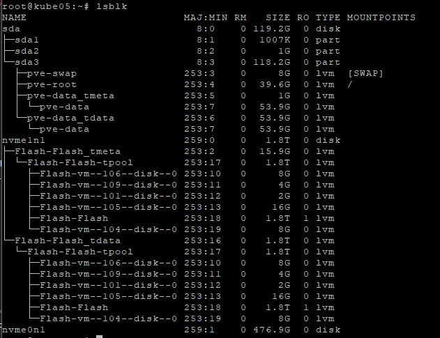

Again, in this case, `nvme0n1` is the empty disk I want to use.

### Step 2. Format the disk.

!!! danger
        If you format the incorrect disk, you may lose data! 

        Don't format the wrong disk.

For this step, we will need to use the CLI.

From a console/terminal, type the command `cfdisk /dev/nvme0n1` (Replace with the name of the disk you are wanting to add.)

For label type, choose GPT.

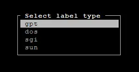

On the next screen, New will be selected by default. Press Enter.

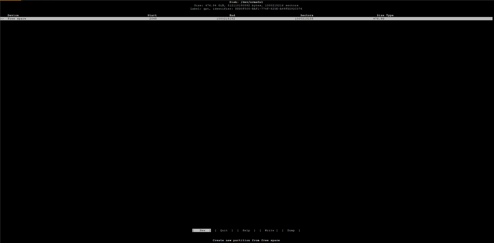

After you press enter, you will notice a prompt at the bottom. It should automatically fill with the usable size of the disk. Press enter again.

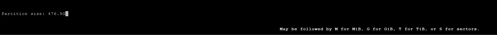

Afterwards, your screen should resemble the below picture. Press right, and select "Write". Press enter again.

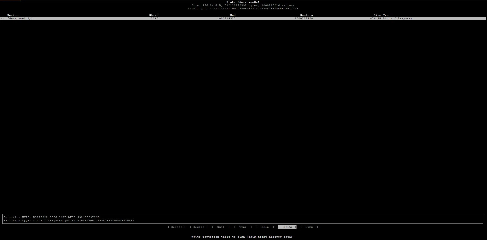

After you click write, you will to confirm your changes. Note- this will delete anything on the disk. Type `yes` followed by enter to confirm.

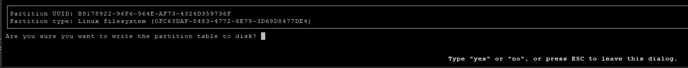

After your changes have been written, you may exist CFDisk.

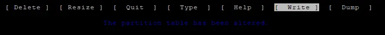

Now- you can see your new partition using `lsblk` or `fdisk -l`

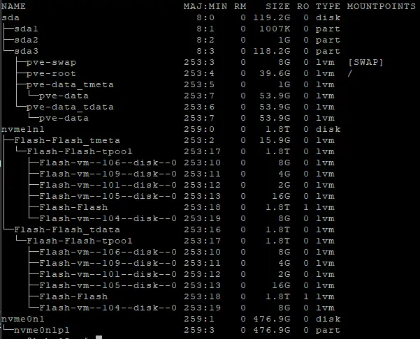

Take note of the new partition name, it will be needed in the next step. In this case, `nvme0n1p1` is the new partition.

### Step 3. Create a physical volume / PG

Just type `pvcreate /dev/nvme0n1p1` (The name of the partition created in the previous step.)

``` bash
root@kube05:~# pvcreate /dev/nvme0n1p1
  Physical volume "/dev/nvme0n1p1" successfully created.
```

### Step 4. Extend the existing volume group / VG

You will need the name of your existing VG / Volume Group. If you do not know it, just type `vgscan`

``` bash
root@kube05:~# vgscan
  Found volume group "pve" using metadata type lvm2
  Found volume group "Flash" using metadata type lvm2
```

In my case, `Flash` is the VG / LVM I wish to extend.

To extend the existing VG, we will use `vgextend VG_Name New_Device`

``` bash
root@kube05:~# vgextend Flash /dev/nvme0n1p1
  Volume group "Flash" successfully extended
```

### Step 5. Extend the Logical Volume / LV

First, you will need to find the device path for your existing LV. If you do not know it, just type `lvscan`

``` bash
root@kube05:~# lvscan
  ACTIVE            '/dev/pve/data' [<53.93 GiB] inherit
  ACTIVE            '/dev/pve/swap' [8.00 GiB] inherit
  ACTIVE            '/dev/pve/root' [<39.56 GiB] inherit
  ACTIVE            '/dev/Flash/Flash' [<1.79 TiB] inherit
  ACTIVE            '/dev/Flash/vm-106-disk-0' [8.00 GiB] inherit
  ACTIVE            '/dev/Flash/vm-104-disk-0' [8.00 GiB] inherit
  ACTIVE            '/dev/Flash/vm-109-disk-0' [4.00 GiB] inherit
  ACTIVE            '/dev/Flash/vm-105-disk-0' [16.00 GiB] inherit
  ACTIVE            '/dev/Flash/vm-101-disk-0' [2.00 GiB] inherit
```

In my case, `/dev/Flash/Flash` is the device path for the LV. Ignore the disks mounted to it.

To extend the LV, we will use the `lvextend` command.

In my example, I will be adding `+100%FREE` to add all of the remaining free space to my LV.

Just- replace `/dev/Flash/Flash` with your correct LV device path.

``` bash
root@kube05:~# lvextend /dev/Flash/Flash -l +100%FREE
  Size of logical volume Flash/Flash_tdata changed from <1.79 TiB (468708 extents) to 2.25 TiB (590898 extents).
  Logical volume Flash/Flash successfully resized.
```


### Done!

At this point, you are done. The space has been added to your LVM pool.

LVM Display, showing both disks completely assigned to the LV.

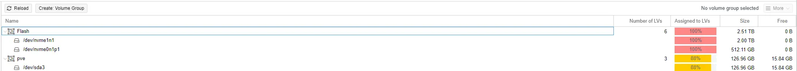

LVM-Thin Display, showing newly added space:

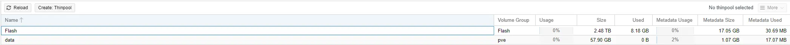

Enjoy.