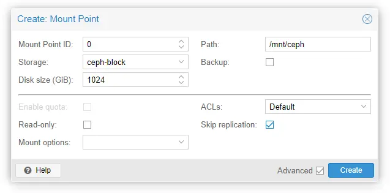
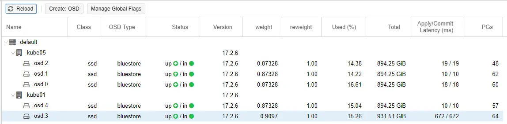
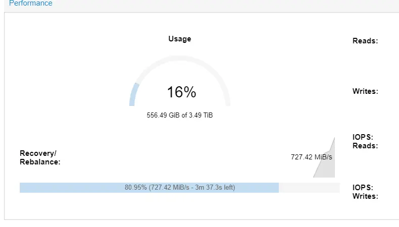

# Building a ceph cluster

My adventures in building out a small clustered ceph environment for redundant VM / Container storage. 

!!! quote
    Ceph is a great way to extract 10,000 IOPs from over 5 million IOPs worth of SSDs! -XtremeOwnage

<!-- more -->

--8<--- "docs/snippets/ebay-affiliate.md"

## Why should you use ceph?

In most cases, you shouldn't.

If you have a centralized storage server, or SAN, ceph is likely not the tool for you. 

As well, if you only have one or two nodes in a cluster, ceph is likely not the tool for you.

Ceph is useful, for when you want to decentralize your storage, without having a central storage server, or SAN.

You also should only use ceph, when you have AT LEAST three nodes. 

My reasons for wanting to use ceph:

1. Reduce my dependency on any single piece of hardware. I want to be able to performance maintenance on any server in my rack, with the least amount of service disruption. 
2. I want to be able to instantly "vMotion" VMs in my proxmox cluster, without having to wait for ZFS replication.
3. While I have previously leveraged ceph for my kubernetes cluster, I wanted to learn more about using it. For me, the best way to learn something, is to jump into it head first.
4. Distributed, and remote storage. Any new node I add to my proxmox cluster, automatically has access to anything stored in ceph, regardless if the node hosts ceph storage or not. The proxmox/ceph integration works very nicely.

## Cluster Details

For my proxmox cluster, I have a total of four machines.

1. Kube01 - Optiplex 7060 SFF
    - 32G DDR4
    - i7-8700 6c/12t
    - ConnectX-3 10G SFP+
2. Kube02 - Dell r730XD 2U
    - 256G DDR4
    - 2x E5-2697a v4 - 32c/64t total.
    - 10G RJ45
3. Kube05 - HP z240 SFF
    - 28G DDR4
    - i5-6500 4c/4t
    - ConnectX-3 10G SFP+
4. Kube06 - Dell Optiplex 7050m Micro
    - 16G DDR4
    - i7-6700T 4c/8t
    - Intel Gigabit (Motherboard)
    - USB Gigabit NIC

Note, all nodes except Kube06 have access to a dedicated network for ceph, which is running 9,000 MTU jumbo frames.

Only Kube01/02/05 will be running ceph storage. Kube06 will only consume it, if needed. (Its workloads are fine with local storage.)


## My first attempt - Failure

My first attempt was not very well documented. However, it consisted of...

* 2x 1T 970 evo
* 2x 1T 970 evo plus
* 1x 1T 980 evo

The NVMes were scattered between kube01/02/05. 

The results were so horrible, it would cause my VMs to completely lockup due to excessive IO wait.

After doing a lot of research, I discovered... ceph really does not like running on consumer SSDs/NVMes. 

This is due to... lower queue depths, lack of power loss protection (PLP), and a few other factors.

Long story short- don't toss ceph on a bunch of 970 evos and expect it to work well. Just trust me... don't run ceph on consumer SSDs.

### Ceph Benchmarks

Here are a few benchmarks I found across the internet. The results, also concluded that enterprise SSDs are a much better choice.

* [Google Sheet with Ceph Benchmarks for many drives](https://docs.google.com/spreadsheets/d/1E9-eXjzsKboiCCX-0u0r5fAjjufLKayaut_FOPxYZjc/edit#gid=0)
* [ceph-diskbench](https://github.com/TheJJ/ceph-diskbench)


## Attempt #2, Using Enterprise SSDs

After doing a lot of research, reading benchmarks, etc.... I decided to give ceph another try. But, this time, I planned on using the "proper" SSDs.

In the end, I decided on running 5x Samsung PM963 1T NVMes, along with 5x Samsung PM863 SATA SSDs. 

While, I would love to build an all-NVMe cluster, the optiplex machines have pretty limited expandability to work with. 

If, you are interested in the exact SSDs I purchased, here are the links:

* [Samsung PM963 1T NVMe](https://ebay.us/CtU0Rk){target=_blank}
* [Samsung PM863 1T SATA SSd](https://ebay.us/f3ElxH){target=_blank}

All 10 of the SSDs ordered, arrived with < 5% advertised wear.

#### Testing Method

Testing will be performed using a LXC container running on top of proxmox, with ceph-block storage mounted.

```
seq_wr: (g=0): rw=write, bs=(R) 128KiB-128KiB, (W) 128KiB-128KiB, (T) 128KiB-128KiB, ioengine=libaio, iodepth=256
seq_rd: (g=1): rw=read, bs=(R) 128KiB-128KiB, (W) 128KiB-128KiB, (T) 128KiB-128KiB, ioengine=libaio, iodepth=256
rand_rd: (g=2): rw=randread, bs=(R) 4096B-4096B, (W) 4096B-4096B, (T) 4096B-4096B, ioengine=libaio, iodepth=256
rand_wr: (g=3): rw=randwrite, bs=(R) 4096B-4096B, (W) 4096B-4096B, (T) 4096B-4096B, ioengine=libaio, iodepth=256
fio-3.33
```

For mounting the storage, no special options were used.



!!! info
    Note, this is not a good method for benchmarking ceph.

    However, I did not know this at the time of doing this, and I really don't want to break and reconfigure my cluster to run tests on other configurations...

    `rados bench` should instead be used.

!!! warning
    This is NOT a clean room test! I did have active workloads on my cluster through all of this testing. 

    As such, this tests could have been impacted by other cluster activity occurring.

### Testing Volume in LXC using fio

#### Test 1. 4x SATA SSD + 980 evo, Ran on remote node.

While I was waiting for the NVMes to arrive, I went ahead and ran this configuration:

1. Kube01 
    - 1x Samsung 980 evo
    - 1x Samsung PM863 SATA SSD
2. Kube05 
    - 3x PM863 SATA SSDs

This test was ran from Kube02.

This configuration was chosen, because Kube02 does not have room for any more 2.5" HDDs, and Kube01 only has power connectors for a single SATA drive, currently.

| Workload   | Read/Write | Block Size | Queue Depth | Bandwidth (KiB/s) | IOPS   |
|------------|------------|------------|-------------|-------------------|--------|
| seq_rd     | Read       | 128 KiB    | 256         | 190 MiB/s         | 1519   |
| seq_wr     | Write      | 128 KiB    | 256         | 86.0 MiB/s        | 688    |
| rand_rd    | Read       | 4 KiB      | 256         | 6215 KiB/s        | 1553   |
| rand_wr    | Write      | 4 KiB      | 256         | 7382 KiB/s        | 1845   |

One very interesting thing I noticed during the results, the latency for the 980 evo was literally through the roof.



Going back to the very first attempt with all 970/980 evos, Just imagine all 5 drives exhibiting this severe latency. 

??? "Raw Results"
    ```
    root@benchmark:~# fio bench
    seq_wr: (g=0): rw=write, bs=(R) 128KiB-128KiB, (W) 128KiB-128KiB, (T) 128KiB-128KiB, ioengine=libaio, iodepth=256
    seq_rd: (g=1): rw=read, bs=(R) 128KiB-128KiB, (W) 128KiB-128KiB, (T) 128KiB-128KiB, ioengine=libaio, iodepth=256
    rand_rd: (g=2): rw=randread, bs=(R) 4096B-4096B, (W) 4096B-4096B, (T) 4096B-4096B, ioengine=libaio, iodepth=256
    rand_wr: (g=3): rw=randwrite, bs=(R) 4096B-4096B, (W) 4096B-4096B, (T) 4096B-4096B, ioengine=libaio, iodepth=256
    fio-3.33
    Starting 4 processes
    seq_wr: Laying out IO file (1 file / 8192MiB)
    Jobs: 1 (f=1): [_(3),w(1)][57.2%][w=5258KiB/s][w=1314 IOPS][eta 03m:00s]
    seq_wr: (groupid=0, jobs=1): err= 0: pid=413: Tue Aug  8 14:19:43 2023
    write: IOPS=688, BW=86.0MiB/s (90.2MB/s)(5182MiB/60250msec); 0 zone resets
        slat (usec): min=143, max=1347.1k, avg=1448.11, stdev=22612.62
        clat (usec): min=30, max=1646.7k, avg=370440.14, stdev=384759.72
        lat (msec): min=48, max=1646, avg=371.89, stdev=385.23
        clat percentiles (msec):
        |  1.00th=[   82],  5.00th=[   96], 10.00th=[  100], 20.00th=[  109],
        | 30.00th=[  120], 40.00th=[  134], 50.00th=[  157], 60.00th=[  188],
        | 70.00th=[  321], 80.00th=[  776], 90.00th=[  995], 95.00th=[ 1150],
        | 99.00th=[ 1519], 99.50th=[ 1603], 99.90th=[ 1653], 99.95th=[ 1653],
        | 99.99th=[ 1653]
    bw (  KiB/s): min=  768, max=257534, per=98.97%, avg=87169.29, stdev=67124.92, samples=59
    iops        : min=    1, max= 2536, avg=757.70, stdev=620.52, samples=105
    lat (usec)   : 50=0.01%
    lat (msec)   : 50=0.13%, 100=10.78%, 250=55.94%, 500=4.76%, 750=7.16%
    lat (msec)   : 1000=11.35%, 2000=9.88%
    cpu          : usr=1.23%, sys=25.46%, ctx=4647, majf=0, minf=8264
    IO depths    : 1=0.1%, 2=0.1%, 4=0.1%, 8=0.1%, 16=0.1%, 32=0.1%, >=64=99.8%
        submit    : 0=0.0%, 4=100.0%, 8=0.0%, 16=0.0%, 32=0.0%, 64=0.0%, >=64=0.0%
        complete  : 0=0.0%, 4=100.0%, 8=0.0%, 16=0.0%, 32=0.0%, 64=0.0%, >=64=0.1%
        issued rwts: total=0,41457,0,0 short=0,0,0,0 dropped=0,0,0,0
        latency   : target=0, window=0, percentile=100.00%, depth=256
    seq_rd: (groupid=1, jobs=1): err= 0: pid=414: Tue Aug  8 14:19:43 2023
    read: IOPS=1519, BW=190MiB/s (199MB/s)(11.1GiB/60001msec)
        slat (usec): min=56, max=34096, avg=645.29, stdev=953.17
        clat (usec): min=55, max=429907, avg=166363.09, stdev=54024.19
        lat (msec): min=2, max=429, avg=167.01, stdev=54.21
        clat percentiles (msec):
        |  1.00th=[   83],  5.00th=[   84], 10.00th=[   85], 20.00th=[   86],
        | 30.00th=[  163], 40.00th=[  176], 50.00th=[  184], 60.00th=[  190],
        | 70.00th=[  197], 80.00th=[  203], 90.00th=[  215], 95.00th=[  234],
        | 99.00th=[  284], 99.50th=[  313], 99.90th=[  372], 99.95th=[  384],
        | 99.99th=[  426]
    bw (  KiB/s): min=95628, max=388352, per=100.00%, avg=194954.75, stdev=75586.78, samples=59
    iops        : min=  219, max= 3042, avg=1520.28, stdev=592.97, samples=117
    lat (usec)   : 100=0.01%
    lat (msec)   : 4=0.01%, 10=0.01%, 20=0.01%, 50=0.04%, 100=25.92%
    lat (msec)   : 250=70.78%, 500=3.24%
    cpu          : usr=0.89%, sys=53.93%, ctx=68655, majf=0, minf=32913
    IO depths    : 1=0.1%, 2=0.1%, 4=0.1%, 8=0.1%, 16=0.1%, 32=0.1%, >=64=99.9%
        submit    : 0=0.0%, 4=100.0%, 8=0.0%, 16=0.0%, 32=0.0%, 64=0.0%, >=64=0.0%
        complete  : 0=0.0%, 4=100.0%, 8=0.0%, 16=0.0%, 32=0.0%, 64=0.0%, >=64=0.1%
        issued rwts: total=91167,0,0,0 short=0,0,0,0 dropped=0,0,0,0
        latency   : target=0, window=0, percentile=100.00%, depth=256
    rand_rd: (groupid=2, jobs=1): err= 0: pid=415: Tue Aug  8 14:19:43 2023
    read: IOPS=1553, BW=6215KiB/s (6365kB/s)(364MiB/60001msec)
        slat (usec): min=7, max=140992, avg=633.19, stdev=1094.23
        clat (usec): min=27, max=1084.6k, avg=163558.83, stdev=48615.67
        lat (usec): min=1015, max=1085.3k, avg=164192.02, stdev=48758.65
        clat percentiles (msec):
        |  1.00th=[  105],  5.00th=[  126], 10.00th=[  136], 20.00th=[  144],
        | 30.00th=[  150], 40.00th=[  155], 50.00th=[  161], 60.00th=[  165],
        | 70.00th=[  171], 80.00th=[  178], 90.00th=[  188], 95.00th=[  203],
        | 99.00th=[  253], 99.50th=[  309], 99.90th=[  927], 99.95th=[  986],
        | 99.99th=[ 1083]
    bw (  KiB/s): min= 1048, max= 8404, per=99.70%, avg=6197.93, stdev=901.87, samples=59
    iops        : min=  228, max= 2502, avg=1551.79, stdev=251.36, samples=119
    lat (usec)   : 50=0.01%
    lat (msec)   : 2=0.01%, 4=0.01%, 10=0.01%, 20=0.02%, 50=0.05%
    lat (msec)   : 100=0.56%, 250=98.19%, 500=0.80%, 750=0.11%, 1000=0.20%
    lat (msec)   : 2000=0.05%
    cpu          : usr=1.91%, sys=5.80%, ctx=68497, majf=0, minf=1568
    IO depths    : 1=0.1%, 2=0.1%, 4=0.1%, 8=0.1%, 16=0.1%, 32=0.1%, >=64=99.9%
        submit    : 0=0.0%, 4=100.0%, 8=0.0%, 16=0.0%, 32=0.0%, 64=0.0%, >=64=0.0%
        complete  : 0=0.0%, 4=100.0%, 8=0.0%, 16=0.0%, 32=0.0%, 64=0.0%, >=64=0.1%
        issued rwts: total=93233,0,0,0 short=0,0,0,0 dropped=0,0,0,0
        latency   : target=0, window=0, percentile=100.00%, depth=256
    rand_wr: (groupid=3, jobs=1): err= 0: pid=416: Tue Aug  8 14:19:43 2023
    write: IOPS=1845, BW=7382KiB/s (7559kB/s)(433MiB/60009msec); 0 zone resets
        slat (usec): min=7, max=62524, avg=536.37, stdev=3408.27
        clat (usec): min=57, max=287346, avg=137716.21, stdev=65681.88
        lat (msec): min=3, max=287, avg=138.25, stdev=65.86
        clat percentiles (msec):
        |  1.00th=[    4],  5.00th=[    4], 10.00th=[    5], 20.00th=[  112],
        | 30.00th=[  129], 40.00th=[  140], 50.00th=[  161], 60.00th=[  161],
        | 70.00th=[  188], 80.00th=[  192], 90.00th=[  197], 95.00th=[  215],
        | 99.00th=[  232], 99.50th=[  249], 99.90th=[  259], 99.95th=[  259],
        | 99.99th=[  279]
    bw (  KiB/s): min= 4352, max=73508, per=99.81%, avg=7368.55, stdev=8806.33, samples=60
    iops        : min= 1024, max=31994, avg=1847.78, stdev=2827.66, samples=119
    lat (usec)   : 100=0.01%
    lat (msec)   : 4=9.63%, 10=4.49%, 20=0.11%, 50=0.93%, 100=4.56%
    lat (msec)   : 250=79.82%, 500=0.46%
    cpu          : usr=0.62%, sys=3.75%, ctx=3078, majf=0, minf=1419
    IO depths    : 1=0.1%, 2=0.1%, 4=0.1%, 8=0.1%, 16=0.1%, 32=0.1%, >=64=99.9%
        submit    : 0=0.0%, 4=100.0%, 8=0.0%, 16=0.0%, 32=0.0%, 64=0.0%, >=64=0.0%
        complete  : 0=0.0%, 4=100.0%, 8=0.0%, 16=0.0%, 32=0.0%, 64=0.0%, >=64=0.1%
        issued rwts: total=0,110746,0,0 short=0,0,0,0 dropped=0,0,0,0
        latency   : target=0, window=0, percentile=100.00%, depth=256    
    ```


#### Test 2. 980 evo removed.

The only change for the 2nd test, is to remove the Samsung 980 evo.

This was as simple as just removing the OSD, and giving the cluster a few minutes to rebuild itself.



##### Results / Comparison

With the Samsung 980 evo removed, we get these results:

| Workload   | IOPs  | Bandwidth (MiB/s) | Avg Latency (ms) | 99th Percentile Latency (ms) |
|------------|-------|-------------------|------------------|-----------------------------|
| seq_wr     | 1428  | 179               | 179              | 334                         |
| seq_rd     | 1326  | 166               | 191              | 334                         |
| rand_rd    | 1136  | 4.44              | 224              | 300                         |
| rand_wr    | 4320  | 16.9              | 59.09            | 163                         |

Overall, write performance doubled in both IOPs, and bandwidth by removing the 980 evo. Read performance was slightly reduced.

IOPs:

| Workload  | IOPs Attempt #1 | IOPs Attempt #2 | Percent Difference |
|-----------|-----------------|-----------------|--------------------|
| seq_wr    | 688             | 1428            | 107.56%            |
| seq_rd    | 1519            | 1326            | -12.74%            |
| rand_rd   | 1553            | 1136            | -26.85%            |
| rand_wr   | 1845            | 4320            | 134.06%            |

Bandwidth:

| Workload  | Bandwidth Attempt #1 (MiB/s) | Bandwidth Attempt #2 (MiB/s) | Percent Difference |
|-----------|-----------------------------|-----------------------------|--------------------|
| seq_wr    | 86.0                        | 179                         | 108.14%            |
| seq_rd    | 190                         | 166                         | -12.63%            |
| rand_rd   | 6.07                        | 4.44                        | -26.87%            |
| rand_wr   | 7.21                        | 16.9                        | 134.08%            |


??? "Raw Results - Test 2"
    ``` bash
    root@benchmark:~# fio bench
    seq_wr: (g=0): rw=write, bs=(R) 128KiB-128KiB, (W) 128KiB-128KiB, (T) 128KiB-128KiB, ioengine=libaio, iodepth=256
    seq_rd: (g=1): rw=read, bs=(R) 128KiB-128KiB, (W) 128KiB-128KiB, (T) 128KiB-128KiB, ioengine=libaio, iodepth=256
    rand_rd: (g=2): rw=randread, bs=(R) 4096B-4096B, (W) 4096B-4096B, (T) 4096B-4096B, ioengine=libaio, iodepth=256
    rand_wr: (g=3): rw=randwrite, bs=(R) 4096B-4096B, (W) 4096B-4096B, (T) 4096B-4096B, ioengine=libaio, iodepth=256
    fio-3.33
    Starting 4 processes
    seq_wr: Laying out IO file (1 file / 8192MiB)
    Jobs: 1 (f=1): [_(3),w(1)][57.9%][w=16.0MiB/s][w=4084 IOPS][eta 02m:46s]
    seq_wr: (groupid=0, jobs=1): err= 0: pid=442: Tue Aug  8 15:51:56 2023
    write: IOPS=1428, BW=179MiB/s (187MB/s)(8192MiB/45881msec); 0 zone resets
        slat (usec): min=150, max=203823, avg=694.06, stdev=3536.12
        clat (usec): min=48, max=332391, avg=178428.15, stdev=65918.98
        lat (usec): min=590, max=332660, avg=179122.21, stdev=65938.91
        clat percentiles (msec):
        |  1.00th=[   96],  5.00th=[  100], 10.00th=[  103], 20.00th=[  110],
        | 30.00th=[  120], 40.00th=[  138], 50.00th=[  171], 60.00th=[  203],
        | 70.00th=[  226], 80.00th=[  249], 90.00th=[  271], 95.00th=[  284],
        | 99.00th=[  309], 99.50th=[  317], 99.90th=[  326], 99.95th=[  330],
        | 99.99th=[  334]
    bw (  KiB/s): min=107520, max=236524, per=99.72%, avg=182318.29, stdev=23419.90, samples=45
    iops        : min=  707, max= 2102, avg=1423.04, stdev=256.51, samples=91
    lat (usec)   : 50=0.01%, 750=0.01%, 1000=0.01%
    lat (msec)   : 2=0.01%, 4=0.01%, 10=0.02%, 20=0.04%, 50=0.10%
    lat (msec)   : 100=5.43%, 250=74.79%, 500=19.60%
    cpu          : usr=2.78%, sys=57.57%, ctx=7069, majf=0, minf=16479
    IO depths    : 1=0.1%, 2=0.1%, 4=0.1%, 8=0.1%, 16=0.1%, 32=0.1%, >=64=99.9%
        submit    : 0=0.0%, 4=100.0%, 8=0.0%, 16=0.0%, 32=0.0%, 64=0.0%, >=64=0.0%
        complete  : 0=0.0%, 4=100.0%, 8=0.0%, 16=0.0%, 32=0.0%, 64=0.0%, >=64=0.1%
        issued rwts: total=0,65536,0,0 short=0,0,0,0 dropped=0,0,0,0
        latency   : target=0, window=0, percentile=100.00%, depth=256
    seq_rd: (groupid=1, jobs=1): err= 0: pid=443: Tue Aug  8 15:51:56 2023
    read: IOPS=1326, BW=166MiB/s (174MB/s)(9946MiB/60002msec)
        slat (usec): min=58, max=45807, avg=741.79, stdev=854.61
        clat (usec): min=27, max=336382, avg=191241.41, stdev=21380.44
        lat (usec): min=1610, max=336498, avg=191983.21, stdev=21415.07
        clat percentiles (msec):
        |  1.00th=[  155],  5.00th=[  163], 10.00th=[  169], 20.00th=[  178],
        | 30.00th=[  182], 40.00th=[  186], 50.00th=[  190], 60.00th=[  194],
        | 70.00th=[  199], 80.00th=[  205], 90.00th=[  211], 95.00th=[  220],
        | 99.00th=[  255], 99.50th=[  326], 99.90th=[  330], 99.95th=[  334],
        | 99.99th=[  334]
    bw (  KiB/s): min=96888, max=195139, per=99.60%, avg=169073.58, stdev=14409.01, samples=59
    iops        : min=  240, max= 1675, avg=1324.62, stdev=142.06, samples=115
    lat (usec)   : 50=0.01%
    lat (msec)   : 2=0.01%, 4=0.01%, 10=0.01%, 20=0.02%, 50=0.06%
    lat (msec)   : 100=0.10%, 250=98.70%, 500=1.09%
    cpu          : usr=0.88%, sys=49.28%, ctx=78969, majf=0, minf=49383
    IO depths    : 1=0.1%, 2=0.1%, 4=0.1%, 8=0.1%, 16=0.1%, 32=0.1%, >=64=99.9%
        submit    : 0=0.0%, 4=100.0%, 8=0.0%, 16=0.0%, 32=0.0%, 64=0.0%, >=64=0.0%
        complete  : 0=0.0%, 4=100.0%, 8=0.0%, 16=0.0%, 32=0.0%, 64=0.0%, >=64=0.1%
        issued rwts: total=79571,0,0,0 short=0,0,0,0 dropped=0,0,0,0
        latency   : target=0, window=0, percentile=100.00%, depth=256
    rand_rd: (groupid=2, jobs=1): err= 0: pid=444: Tue Aug  8 15:51:56 2023
    read: IOPS=1136, BW=4546KiB/s (4655kB/s)(266MiB/60001msec)
        slat (usec): min=250, max=22570, avg=865.61, stdev=361.25
        clat (usec): min=57, max=301459, avg=223429.76, stdev=29460.90
        lat (usec): min=1044, max=302476, avg=224295.36, stdev=29540.92
        clat percentiles (msec):
        |  1.00th=[  153],  5.00th=[  169], 10.00th=[  182], 20.00th=[  199],
        | 30.00th=[  211], 40.00th=[  220], 50.00th=[  228], 60.00th=[  234],
        | 70.00th=[  243], 80.00th=[  249], 90.00th=[  257], 95.00th=[  264],
        | 99.00th=[  275], 99.50th=[  288], 99.90th=[  300], 99.95th=[  300],
        | 99.99th=[  300]
    bw (  KiB/s): min= 2771, max= 5756, per=99.77%, avg=4536.03, stdev=463.77, samples=59
    iops        : min=  224, max= 1522, avg=1134.81, stdev=150.78, samples=119
    lat (usec)   : 100=0.01%
    lat (msec)   : 2=0.01%, 4=0.01%, 10=0.01%, 20=0.01%, 50=0.04%
    lat (msec)   : 100=0.07%, 250=82.20%, 500=17.67%
    cpu          : usr=1.79%, sys=6.22%, ctx=70817, majf=0, minf=997
    IO depths    : 1=0.1%, 2=0.1%, 4=0.1%, 8=0.1%, 16=0.1%, 32=0.1%, >=64=99.9%
        submit    : 0=0.0%, 4=100.0%, 8=0.0%, 16=0.0%, 32=0.0%, 64=0.0%, >=64=0.0%
        complete  : 0=0.0%, 4=100.0%, 8=0.0%, 16=0.0%, 32=0.0%, 64=0.0%, >=64=0.1%
        issued rwts: total=68195,0,0,0 short=0,0,0,0 dropped=0,0,0,0
        latency   : target=0, window=0, percentile=100.00%, depth=256
    rand_wr: (groupid=3, jobs=1): err= 0: pid=445: Tue Aug  8 15:51:56 2023
    write: IOPS=4320, BW=16.9MiB/s (17.7MB/s)(1013MiB/60015msec); 0 zone resets
        slat (usec): min=6, max=158293, avg=227.51, stdev=1960.14
        clat (usec): min=56, max=161774, avg=58859.96, stdev=18208.69
        lat (msec): min=2, max=161, avg=59.09, stdev=18.24
        clat percentiles (msec):
        |  1.00th=[    4],  5.00th=[    4], 10.00th=[   46], 20.00th=[   53],
        | 30.00th=[   61], 40.00th=[   64], 50.00th=[   64], 60.00th=[   65],
        | 70.00th=[   65], 80.00th=[   68], 90.00th=[   72], 95.00th=[   80],
        | 99.00th=[   90], 99.50th=[   96], 99.90th=[  130], 99.95th=[  163],
        | 99.99th=[  163]
    bw (  KiB/s): min=13709, max=89304, per=100.00%, avg=17287.20, stdev=9582.43, samples=59
    iops        : min= 3072, max=35180, avg=4322.13, stdev=2909.08, samples=119
    lat (usec)   : 100=0.01%
    lat (msec)   : 4=6.13%, 10=1.19%, 50=8.38%, 100=84.00%, 250=0.31%
    cpu          : usr=1.33%, sys=7.74%, ctx=5010, majf=0, minf=733
    IO depths    : 1=0.1%, 2=0.1%, 4=0.1%, 8=0.1%, 16=0.1%, 32=0.1%, >=64=100.0%
        submit    : 0=0.0%, 4=100.0%, 8=0.0%, 16=0.0%, 32=0.0%, 64=0.0%, >=64=0.0%
        complete  : 0=0.0%, 4=100.0%, 8=0.0%, 16=0.0%, 32=0.0%, 64=0.0%, >=64=0.1%
        issued rwts: total=0,259308,0,0 short=0,0,0,0 dropped=0,0,0,0
        latency   : target=0, window=0, percentile=100.00%, depth=256

    Run status group 0 (all jobs):
    WRITE: bw=179MiB/s (187MB/s), 179MiB/s-179MiB/s (187MB/s-187MB/s), io=8192MiB (8590MB), run=45881-45881msec

    Run status group 1 (all jobs):
    READ: bw=166MiB/s (174MB/s), 166MiB/s-166MiB/s (174MB/s-174MB/s), io=9946MiB (10.4GB), run=60002-60002msec

    Run status group 2 (all jobs):
    READ: bw=4546KiB/s (4655kB/s), 4546KiB/s-4546KiB/s (4655kB/s-4655kB/s), io=266MiB (279MB), run=60001-60001msec

    Run status group 3 (all jobs):
    WRITE: bw=16.9MiB/s (17.7MB/s), 16.9MiB/s-16.9MiB/s (17.7MB/s-17.7MB/s), io=1013MiB (1062MB), run=60015-60015msec

    Disk stats (read/write):
    rbd8: ios=107982/239016, merge=0/3623, ticks=141999/3002863, in_queue=3144862, util=90.38%
    ```

#### Test 3. Better data locality

Previous tests were ran on `kube02` which has no storage attached to it. As a result, all ceph traffic had to visit either `kube01` or `kube05`.

For this test, the benchmarks will be ran from `kube05`, which hosts 3 of the 4 currently active OSDs.

| Workload  |   IOPs | Bandwidth (MiB/s) | Avg Latency (ms) | 99th Percentile Latency (ms) |
|-----------|-------:|-------------------:|-----------------:|-----------------------------:|
| seq_wr    |   2280 |             285    |          112.23  |                        236    |
| seq_rd    |   2271 |             284    |          112.16  |                        171    |
| rand_rd   |   1822 |               7.29 |          140.23  |                        230    |
| rand_wr   |   4015 |              15.7  |           63.74  |                        107    |

##### Results / Comparison

For this test, it appears read performance went 60%, although, random write performance was slightly reduced. 

IOPs:

| Workload  | IOPs Attempt #2 | IOPs Attempt #3 | Percent Difference |
|-----------|-----------------|-----------------|--------------------|
| seq_wr    | 1428            | 2280            | 59.68%             |
| seq_rd    | 1326            | 2271            | 71.62%             |
| rand_rd   | 1136            | 1822            | 60.50%             |
| rand_wr   | 4320            | 4015            | -7.07%             |


Bandwidth:

| Workload  | Bandwidth Attempt #2 (MiB/s) | Bandwidth Attempt #3 (MiB/s) | Percent Difference |
|-----------|-----------------------------|-----------------------------|--------------------|
| seq_wr    | 179                         | 285                         | 59.22%             |
| seq_rd    | 166                         | 284                         | 71.08%             |
| rand_rd   | 4.44                        | 7.29                        | 64.11%             |
| rand_wr   | 16.9                        | 15.7                        | -7.10%             |


??? "Raw Results - Test 3"
    ``` bash
    root@benchmark:~# fio bench
    seq_wr: (g=0): rw=write, bs=(R) 128KiB-128KiB, (W) 128KiB-128KiB, (T) 128KiB-128KiB, ioengine=libaio, iodepth=256
    seq_rd: (g=1): rw=read, bs=(R) 128KiB-128KiB, (W) 128KiB-128KiB, (T) 128KiB-128KiB, ioengine=libaio, iodepth=256
    rand_rd: (g=2): rw=randread, bs=(R) 4096B-4096B, (W) 4096B-4096B, (T) 4096B-4096B, ioengine=libaio, iodepth=256
    rand_wr: (g=3): rw=randwrite, bs=(R) 4096B-4096B, (W) 4096B-4096B, (T) 4096B-4096B, ioengine=libaio, iodepth=256
    fio-3.33
    Starting 4 processes
    seq_wr: Laying out IO file (1 file / 8192MiB)
    Jobs: 1 (f=1): [_(3),w(1)][58.7%][w=13.5MiB/s][w=3456 IOPS][eta 02m:28s]
    seq_wr: (groupid=0, jobs=1): err= 0: pid=335: Tue Aug  8 16:01:12 2023
    write: IOPS=2280, BW=285MiB/s (299MB/s)(8192MiB/28740msec); 0 zone resets
        slat (usec): min=52, max=137961, avg=435.80, stdev=3313.71
        clat (usec): min=3, max=250114, avg=111794.30, stdev=62558.67
        lat (usec): min=71, max=250359, avg=112230.09, stdev=62565.95
        clat percentiles (msec):
        |  1.00th=[   18],  5.00th=[   20], 10.00th=[   32], 20.00th=[   49],
        | 30.00th=[   63], 40.00th=[   88], 50.00th=[  110], 60.00th=[  133],
        | 70.00th=[  155], 80.00th=[  176], 90.00th=[  199], 95.00th=[  215],
        | 99.00th=[  236], 99.50th=[  247], 99.90th=[  249], 99.95th=[  249],
        | 99.99th=[  251]
    bw (  KiB/s): min=247287, max=364672, per=99.99%, avg=291855.79, stdev=29980.58, samples=28
    iops        : min= 1755, max= 2976, avg=2273.82, stdev=342.63, samples=57
    lat (usec)   : 4=0.01%, 100=0.01%, 250=0.01%, 500=0.01%, 750=0.01%
    lat (usec)   : 1000=0.01%
    lat (msec)   : 2=0.02%, 4=0.04%, 10=0.12%, 20=6.67%, 50=14.90%
    lat (msec)   : 100=23.93%, 250=54.30%, 500=0.01%
    cpu          : usr=1.60%, sys=24.76%, ctx=3132, majf=1, minf=11
    IO depths    : 1=0.1%, 2=0.1%, 4=0.1%, 8=0.1%, 16=0.1%, 32=0.1%, >=64=99.9%
        submit    : 0=0.0%, 4=100.0%, 8=0.0%, 16=0.0%, 32=0.0%, 64=0.0%, >=64=0.0%
        complete  : 0=0.0%, 4=100.0%, 8=0.0%, 16=0.0%, 32=0.0%, 64=0.0%, >=64=0.1%
        issued rwts: total=0,65536,0,0 short=0,0,0,0 dropped=0,0,0,0
        latency   : target=0, window=0, percentile=100.00%, depth=256
    seq_rd: (groupid=1, jobs=1): err= 0: pid=336: Tue Aug  8 16:01:12 2023
    read: IOPS=2271, BW=284MiB/s (298MB/s)(16.6GiB/60001msec)
        slat (usec): min=13, max=26543, avg=435.03, stdev=561.63
        clat (usec): min=7, max=313590, avg=111721.25, stdev=16674.15
        lat (usec): min=601, max=313636, avg=112156.28, stdev=16711.79
        clat percentiles (msec):
        |  1.00th=[   95],  5.00th=[   97], 10.00th=[  100], 20.00th=[  102],
        | 30.00th=[  104], 40.00th=[  106], 50.00th=[  108], 60.00th=[  111],
        | 70.00th=[  114], 80.00th=[  121], 90.00th=[  128], 95.00th=[  138],
        | 99.00th=[  171], 99.50th=[  186], 99.90th=[  305], 99.95th=[  309],
        | 99.99th=[  313]
    bw (  KiB/s): min=117234, max=318464, per=100.00%, avg=291104.83, stdev=27494.18, samples=59
    iops        : min=  420, max= 2516, avg=2271.34, stdev=242.94, samples=119
    lat (usec)   : 10=0.01%, 750=0.01%
    lat (msec)   : 2=0.01%, 4=0.01%, 10=0.01%, 20=0.02%, 50=0.06%
    lat (msec)   : 100=14.49%, 250=85.25%, 500=0.17%
    cpu          : usr=0.97%, sys=14.32%, ctx=79247, majf=0, minf=8204
    IO depths    : 1=0.1%, 2=0.1%, 4=0.1%, 8=0.1%, 16=0.1%, 32=0.1%, >=64=100.0%
        submit    : 0=0.0%, 4=100.0%, 8=0.0%, 16=0.0%, 32=0.0%, 64=0.0%, >=64=0.0%
        complete  : 0=0.0%, 4=100.0%, 8=0.0%, 16=0.0%, 32=0.0%, 64=0.0%, >=64=0.1%
        issued rwts: total=136311,0,0,0 short=0,0,0,0 dropped=0,0,0,0
        latency   : target=0, window=0, percentile=100.00%, depth=256
    rand_rd: (groupid=2, jobs=1): err= 0: pid=337: Tue Aug  8 16:01:12 2023
    read: IOPS=1822, BW=7291KiB/s (7466kB/s)(427MiB/60001msec)
        slat (usec): min=109, max=37717, avg=542.78, stdev=446.78
        clat (usec): min=4, max=315550, avg=139682.85, stdev=36356.47
        lat (usec): min=372, max=315922, avg=140225.62, stdev=36463.40
        clat percentiles (msec):
        |  1.00th=[   90],  5.00th=[   96], 10.00th=[  101], 20.00th=[  107],
        | 30.00th=[  114], 40.00th=[  124], 50.00th=[  133], 60.00th=[  144],
        | 70.00th=[  157], 80.00th=[  171], 90.00th=[  190], 95.00th=[  205],
        | 99.00th=[  230], 99.50th=[  284], 99.90th=[  313], 99.95th=[  313],
        | 99.99th=[  317]
    bw (  KiB/s): min= 4303, max=10594, per=99.51%, avg=7255.12, stdev=1333.29, samples=59
    iops        : min=  830, max= 2729, avg=1816.28, stdev=373.48, samples=119
    lat (usec)   : 10=0.01%, 500=0.01%, 750=0.01%, 1000=0.01%
    lat (msec)   : 2=0.01%, 4=0.01%, 10=0.02%, 20=0.03%, 50=0.07%
    lat (msec)   : 100=9.94%, 250=89.25%, 500=0.67%
    cpu          : usr=1.28%, sys=4.39%, ctx=109724, majf=0, minf=266
    IO depths    : 1=0.1%, 2=0.1%, 4=0.1%, 8=0.1%, 16=0.1%, 32=0.1%, >=64=99.9%
        submit    : 0=0.0%, 4=100.0%, 8=0.0%, 16=0.0%, 32=0.0%, 64=0.0%, >=64=0.0%
        complete  : 0=0.0%, 4=100.0%, 8=0.0%, 16=0.0%, 32=0.0%, 64=0.0%, >=64=0.1%
        issued rwts: total=109367,0,0,0 short=0,0,0,0 dropped=0,0,0,0
        latency   : target=0, window=0, percentile=100.00%, depth=256
    rand_wr: (groupid=3, jobs=1): err= 0: pid=338: Tue Aug  8 16:01:12 2023
    write: IOPS=4015, BW=15.7MiB/s (16.4MB/s)(941MiB/60001msec); 0 zone resets
        slat (usec): min=2, max=207481, avg=247.62, stdev=2138.55
        clat (usec): min=9, max=383435, avg=63492.95, stdev=23711.14
        lat (usec): min=935, max=383439, avg=63740.58, stdev=23723.75
        clat percentiles (usec):
        |  1.00th=[   996],  5.00th=[  1156], 10.00th=[ 48497], 20.00th=[ 60031],
        | 30.00th=[ 64226], 40.00th=[ 64226], 50.00th=[ 64226], 60.00th=[ 64226],
        | 70.00th=[ 67634], 80.00th=[ 71828], 90.00th=[ 87557], 95.00th=[ 95945],
        | 99.00th=[107480], 99.50th=[111674], 99.90th=[312476], 99.95th=[312476],
        | 99.99th=[383779]
    bw (  KiB/s): min=11136, max=92856, per=100.00%, avg=16072.39, stdev=10302.29, samples=59
    iops        : min= 2180, max=43593, avg=4015.29, stdev=3688.06, samples=119
    lat (usec)   : 10=0.01%, 1000=1.04%
    lat (msec)   : 2=6.86%, 4=0.11%, 20=0.56%, 50=1.60%, 100=87.50%
    lat (msec)   : 250=2.23%, 500=0.11%
    cpu          : usr=0.32%, sys=2.25%, ctx=4108, majf=0, minf=11
    IO depths    : 1=0.1%, 2=0.1%, 4=0.1%, 8=0.1%, 16=0.1%, 32=0.1%, >=64=100.0%
        submit    : 0=0.0%, 4=100.0%, 8=0.0%, 16=0.0%, 32=0.0%, 64=0.0%, >=64=0.0%
        complete  : 0=0.0%, 4=100.0%, 8=0.0%, 16=0.0%, 32=0.0%, 64=0.0%, >=64=0.1%
        issued rwts: total=0,240951,0,0 short=0,0,0,0 dropped=0,0,0,0
        latency   : target=0, window=0, percentile=100.00%, depth=256

    Run status group 0 (all jobs):
    WRITE: bw=285MiB/s (299MB/s), 285MiB/s-285MiB/s (299MB/s-299MB/s), io=8192MiB (8590MB), run=28740-28740msec

    Run status group 1 (all jobs):
    READ: bw=284MiB/s (298MB/s), 284MiB/s-284MiB/s (298MB/s-298MB/s), io=16.6GiB (17.9GB), run=60001-60001msec

    Run status group 2 (all jobs):
    READ: bw=7291KiB/s (7466kB/s), 7291KiB/s-7291KiB/s (7466kB/s-7466kB/s), io=427MiB (448MB), run=60001-60001msec

    Run status group 3 (all jobs):
    WRITE: bw=15.7MiB/s (16.4MB/s), 15.7MiB/s-15.7MiB/s (16.4MB/s-16.4MB/s), io=941MiB (987MB), run=60001-60001msec

    Disk stats (read/write):
    rbd1: ios=177524/216481, merge=0/4047, ticks=165958/2962504, in_queue=3128462, util=95.02%
    ```

#### Test 4. Addition of 4x new OSDs

By this time, the 5x PM963 NVMes had arrived.

For this test, we will be adding 4 of those to my r730XD.

So... [I added 4x PM963 NVMe to my r730XD](2023-08-13-r730xd-more-nvme.md){target=_blank}

##### Results / Comparison

| Workload  | IOPs | Bandwidth (MiB/s) | Average Latency (ms) | 99th Percentile Latency (ms) |
|-----------|------|-------------------|----------------------|-----------------------------|
| seq_wr    | 2321 | 290               | 110.18               | 205                         |
| seq_rd    | 1959 | 245               | 130.12               | 243                         |
| rand_rd   | 1384 | 5.47              | 184.05               | 215                         |
| rand_wr   | 5171 | 20.2              | 49.43                | 137.36                      |

Although, oddly enough, read performance actually went down ~20%. Write performance, slightly improved.

I was not expecting these results.

IOPs:

| Workload  | IOPs Attempt #3 | IOPs Attempt #4 | Percent Difference |
|-----------|-----------------|-----------------|--------------------|
| seq_wr    | 2280            | 2321            | 1.79%              |
| seq_rd    | 2271            | 1959            | -13.79%            |
| rand_rd   | 1822            | 1384            | -24.00%            |
| rand_wr   | 4015            | 5171            | 28.87%             |

Bandwidth:

| Workload  | Bandwidth Attempt #3 (MiB/s) | Bandwidth Attempt #4 (MiB/s) | Percent Difference |
|-----------|-----------------------------|-----------------------------|--------------------|
| seq_wr    | 285                         | 290                         | 1.75%              |
| seq_rd    | 284                         | 245                         | -13.73%            |
| rand_rd   | 7.29                        | 5.47                        | -25.00%            |
| rand_wr   | 15.7                        | 20.2                        | 28.66%             |

??? "Raw Results"
    ``` bash
    root@benchmark:~# fio bench
    seq_wr: (g=0): rw=write, bs=(R) 128KiB-128KiB, (W) 128KiB-128KiB, (T) 128KiB-128KiB, ioengine=libaio, iodepth=256
    seq_rd: (g=1): rw=read, bs=(R) 128KiB-128KiB, (W) 128KiB-128KiB, (T) 128KiB-128KiB, ioengine=libaio, iodepth=256
    rand_rd: (g=2): rw=randread, bs=(R) 4096B-4096B, (W) 4096B-4096B, (T) 4096B-4096B, ioengine=libaio, iodepth=256
    rand_wr: (g=3): rw=randwrite, bs=(R) 4096B-4096B, (W) 4096B-4096B, (T) 4096B-4096B, ioengine=libaio, iodepth=256
    fio-3.33
    Starting 4 processes
    seq_wr: Laying out IO file (1 file / 8192MiB)
    Jobs: 1 (f=1): [_(3),w(1)][58.7%][w=19.1MiB/s][w=4879 IOPS][eta 02m:28s]
    seq_wr: (groupid=0, jobs=1): err= 0: pid=348: Tue Aug  8 19:56:18 2023
    write: IOPS=2321, BW=290MiB/s (304MB/s)(8192MiB/28235msec); 0 zone resets
        slat (usec): min=79, max=208042, avg=426.32, stdev=1816.82
        clat (usec): min=44, max=284619, avg=109753.76, stdev=36317.42
        lat (usec): min=493, max=284977, avg=110180.09, stdev=36336.85
        clat percentiles (msec):
        |  1.00th=[   54],  5.00th=[   59], 10.00th=[   65], 20.00th=[   77],
        | 30.00th=[   87], 40.00th=[   97], 50.00th=[  108], 60.00th=[  118],
        | 70.00th=[  128], 80.00th=[  140], 90.00th=[  157], 95.00th=[  169],
        | 99.00th=[  205], 99.50th=[  249], 99.90th=[  262], 99.95th=[  271],
        | 99.99th=[  284]
    bw (  KiB/s): min=240132, max=345177, per=99.76%, avg=296379.46, stdev=27464.12, samples=28
    iops        : min= 1529, max= 2919, avg=2313.96, stdev=263.69, samples=54
    lat (usec)   : 50=0.01%, 500=0.01%, 750=0.01%, 1000=0.01%
    lat (msec)   : 2=0.01%, 4=0.01%, 10=0.01%, 50=0.55%, 100=42.64%
    lat (msec)   : 250=56.38%, 500=0.40%
    cpu          : usr=5.57%, sys=73.40%, ctx=5909, majf=1, minf=41185
    IO depths    : 1=0.1%, 2=0.1%, 4=0.1%, 8=0.1%, 16=0.1%, 32=0.1%, >=64=99.9%
        submit    : 0=0.0%, 4=100.0%, 8=0.0%, 16=0.0%, 32=0.0%, 64=0.0%, >=64=0.0%
        complete  : 0=0.0%, 4=100.0%, 8=0.0%, 16=0.0%, 32=0.0%, 64=0.0%, >=64=0.1%
        issued rwts: total=0,65536,0,0 short=0,0,0,0 dropped=0,0,0,0
        latency   : target=0, window=0, percentile=100.00%, depth=256
    seq_rd: (groupid=1, jobs=1): err= 0: pid=349: Tue Aug  8 19:56:18 2023
    read: IOPS=1959, BW=245MiB/s (257MB/s)(14.3GiB/60001msec)
        slat (usec): min=35, max=29598, avg=501.42, stdev=661.47
        clat (usec): min=12, max=601588, avg=129618.12, stdev=38400.72
        lat (usec): min=620, max=601797, avg=130119.53, stdev=38499.67
        clat percentiles (msec):
        |  1.00th=[   93],  5.00th=[  102], 10.00th=[  106], 20.00th=[  111],
        | 30.00th=[  116], 40.00th=[  121], 50.00th=[  125], 60.00th=[  129],
        | 70.00th=[  134], 80.00th=[  140], 90.00th=[  150], 95.00th=[  165],
        | 99.00th=[  243], 99.50th=[  468], 99.90th=[  567], 99.95th=[  584],
        | 99.99th=[  592]
    bw (  KiB/s): min=112240, max=300288, per=99.76%, avg=250176.93, stdev=37797.35, samples=59
    iops        : min=  409, max= 2432, avg=1953.75, stdev=342.93, samples=115
    lat (usec)   : 20=0.01%, 750=0.01%
    lat (msec)   : 2=0.01%, 4=0.01%, 10=0.01%, 20=0.02%, 50=0.06%
    lat (msec)   : 100=3.79%, 250=95.13%, 500=0.70%, 750=0.29%
    cpu          : usr=0.94%, sys=46.74%, ctx=113094, majf=0, minf=39679
    IO depths    : 1=0.1%, 2=0.1%, 4=0.1%, 8=0.1%, 16=0.1%, 32=0.1%, >=64=99.9%
        submit    : 0=0.0%, 4=100.0%, 8=0.0%, 16=0.0%, 32=0.0%, 64=0.0%, >=64=0.0%
        complete  : 0=0.0%, 4=100.0%, 8=0.0%, 16=0.0%, 32=0.0%, 64=0.0%, >=64=0.1%
        issued rwts: total=117557,0,0,0 short=0,0,0,0 dropped=0,0,0,0
        latency   : target=0, window=0, percentile=100.00%, depth=256
    rand_rd: (groupid=2, jobs=1): err= 0: pid=350: Tue Aug  8 19:56:18 2023
    read: IOPS=1384, BW=5539KiB/s (5672kB/s)(325MiB/60001msec)
        slat (usec): min=174, max=13197, avg=712.18, stdev=316.75
        clat (usec): min=61, max=222946, avg=183336.42, stdev=17341.92
        lat (usec): min=1103, max=224050, avg=184048.61, stdev=17390.86
        clat percentiles (msec):
        |  1.00th=[  136],  5.00th=[  148], 10.00th=[  161], 20.00th=[  171],
        | 30.00th=[  180], 40.00th=[  184], 50.00th=[  188], 60.00th=[  190],
        | 70.00th=[  192], 80.00th=[  197], 90.00th=[  201], 95.00th=[  205],
        | 99.00th=[  215], 99.50th=[  218], 99.90th=[  222], 99.95th=[  222],
        | 99.99th=[  224]
    bw (  KiB/s): min= 3492, max= 6842, per=99.79%, avg=5527.17, stdev=447.19, samples=59
    iops        : min=  504, max= 1810, avg=1382.77, stdev=135.58, samples=119
    lat (usec)   : 100=0.01%
    lat (msec)   : 2=0.01%, 4=0.01%, 10=0.01%, 20=0.02%, 50=0.06%
    lat (msec)   : 100=0.08%, 250=99.83%
    cpu          : usr=1.25%, sys=4.82%, ctx=84221, majf=0, minf=1898
    IO depths    : 1=0.1%, 2=0.1%, 4=0.1%, 8=0.1%, 16=0.1%, 32=0.1%, >=64=99.9%
        submit    : 0=0.0%, 4=100.0%, 8=0.0%, 16=0.0%, 32=0.0%, 64=0.0%, >=64=0.0%
        complete  : 0=0.0%, 4=100.0%, 8=0.0%, 16=0.0%, 32=0.0%, 64=0.0%, >=64=0.1%
        issued rwts: total=83080,0,0,0 short=0,0,0,0 dropped=0,0,0,0
        latency   : target=0, window=0, percentile=100.00%, depth=256
    rand_wr: (groupid=3, jobs=1): err= 0: pid=351: Tue Aug  8 19:56:18 2023
    write: IOPS=5171, BW=20.2MiB/s (21.2MB/s)(1212MiB/60009msec); 0 zone resets
        slat (usec): min=3, max=122313, avg=188.41, stdev=1678.95
        clat (usec): min=79, max=223063, avg=49241.90, stdev=22938.69
        lat (usec): min=1519, max=223071, avg=49430.31, stdev=23023.38
        clat percentiles (usec):
        |  1.00th=[  1565],  5.00th=[  1893], 10.00th=[ 29230], 20.00th=[ 39060],
        | 30.00th=[ 44303], 40.00th=[ 47449], 50.00th=[ 47973], 60.00th=[ 49546],
        | 70.00th=[ 52691], 80.00th=[ 58459], 90.00th=[ 66847], 95.00th=[ 87557],
        | 99.00th=[137364], 99.50th=[154141], 99.90th=[189793], 99.95th=[204473],
        | 99.99th=[223347]
    bw (  KiB/s): min= 7792, max=96380, per=100.00%, avg=20700.69, stdev=10787.73, samples=59
    iops        : min= 1716, max=42076, avg=5176.01, stdev=3598.17, samples=119
    lat (usec)   : 100=0.01%
    lat (msec)   : 2=5.21%, 4=1.49%, 10=0.14%, 20=0.50%, 50=54.09%
    lat (msec)   : 100=35.10%, 250=3.47%
    cpu          : usr=2.35%, sys=17.74%, ctx=4361, majf=0, minf=2550
    IO depths    : 1=0.1%, 2=0.1%, 4=0.1%, 8=0.1%, 16=0.1%, 32=0.1%, >=64=100.0%
        submit    : 0=0.0%, 4=100.0%, 8=0.0%, 16=0.0%, 32=0.0%, 64=0.0%, >=64=0.0%
        complete  : 0=0.0%, 4=100.0%, 8=0.0%, 16=0.0%, 32=0.0%, 64=0.0%, >=64=0.1%
        issued rwts: total=0,310315,0,0 short=0,0,0,0 dropped=0,0,0,0
        latency   : target=0, window=0, percentile=100.00%, depth=256

    Run status group 0 (all jobs):
    WRITE: bw=290MiB/s (304MB/s), 290MiB/s-290MiB/s (304MB/s-304MB/s), io=8192MiB (8590MB), run=28235-28235msec

    Run status group 1 (all jobs):
    READ: bw=245MiB/s (257MB/s), 245MiB/s-245MiB/s (257MB/s-257MB/s), io=14.3GiB (15.4GB), run=60001-60001msec

    Run status group 2 (all jobs):
    READ: bw=5539KiB/s (5672kB/s), 5539KiB/s-5539KiB/s (5672kB/s-5672kB/s), io=325MiB (340MB), run=60001-60001msec

    Run status group 3 (all jobs):
    WRITE: bw=20.2MiB/s (21.2MB/s), 20.2MiB/s-20.2MiB/s (21.2MB/s-21.2MB/s), io=1212MiB (1271MB), run=60009-60009msec

    Disk stats (read/write):
    rbd1: ios=141860/286585, merge=0/1953, ticks=142339/2844110, in_queue=2986449, util=95.10%
    ```


#### Test 5. Recreated test volume

For the 5th test, I deleted, and recreated the volume used in the benchmarking LXC.

##### Results / Comparison

| Workload | IOPs  | Bandwidth (MiB/s) | Average Latency (ms) | 99th Percentile Latency (ms) |
|----------|-------|-------------------|----------------------|-----------------------------|
| seq_wr   | 2687  | 336               | 95.186               | 207                         |
| seq_rd   | 2249  | 281               | 112.753              | 317                         |
| rand_rd  | 1518  | 5.93              | 167.525              | 347                         |
| rand_wr  | 7569  | 29.6              | 33.748               | 95.945                      |

IOPs:

| Workload  | IOPs Attempt #4 | IOPs Attempt #5 | Percent Difference |
|-----------|-----------------|-----------------|--------------------|
| seq_wr    | 2321            | 2687            | 15.81%             |
| seq_rd    | 1959            | 2249            | 14.80%             |
| rand_rd   | 1384            | 1518            | 9.69%              |
| rand_wr   | 5171            | 7569            | 46.33%             |


Bandwidth: 

| Workload  | Bandwidth Attempt #4 (MiB/s) | Bandwidth Attempt #5 (MiB/s) | Percent Difference |
|-----------|-----------------------------|-----------------------------|--------------------|
| seq_wr    | 290                         | 336                         | 15.86%             |
| seq_rd    | 245                         | 281                         | 14.69%             |
| rand_rd   | 5.47                        | 5.93                        | 8.40%              |
| rand_wr   | 20.2                        | 29.6                        | 46.53%             |

Although, much better then test #4, I was honestly still expecting a bigger boost from the addition of more NVMe.

At this point, I was starting to question the method I was using for testing.

??? "Raw test results"
    ``` bash
    root@benchmark:~# fio bench
    seq_wr: (g=0): rw=write, bs=(R) 128KiB-128KiB, (W) 128KiB-128KiB, (T) 128KiB-128KiB, ioengine=libaio, iodepth=256
    seq_rd: (g=1): rw=read, bs=(R) 128KiB-128KiB, (W) 128KiB-128KiB, (T) 128KiB-128KiB, ioengine=libaio, iodepth=256
    rand_rd: (g=2): rw=randread, bs=(R) 4096B-4096B, (W) 4096B-4096B, (T) 4096B-4096B, ioengine=libaio, iodepth=256
    rand_wr: (g=3): rw=randwrite, bs=(R) 4096B-4096B, (W) 4096B-4096B, (T) 4096B-4096B, ioengine=libaio, iodepth=256
    fio-3.33
    Starting 4 processes
    seq_wr: Laying out IO file (1 file / 8192MiB)
    Jobs: 1 (f=1): [_(3),w(1)][58.7%][w=26.8MiB/s][w=6872 IOPS][eta 02m:24s]
    seq_wr: (groupid=0, jobs=1): err= 0: pid=337: Tue Aug  8 20:17:56 2023
    write: IOPS=2687, BW=336MiB/s (352MB/s)(8192MiB/24385msec); 0 zone resets
        slat (usec): min=89, max=116762, avg=369.04, stdev=1933.13
        clat (usec): min=28, max=206684, avg=94817.18, stdev=36327.82
        lat (usec): min=130, max=206795, avg=95186.22, stdev=36354.45
        clat percentiles (msec):
        |  1.00th=[   43],  5.00th=[   52], 10.00th=[   54], 20.00th=[   61],
        | 30.00th=[   68], 40.00th=[   78], 50.00th=[   89], 60.00th=[   99],
        | 70.00th=[  114], 80.00th=[  129], 90.00th=[  150], 95.00th=[  159],
        | 99.00th=[  190], 99.50th=[  201], 99.90th=[  207], 99.95th=[  207],
        | 99.99th=[  207]
    bw (  KiB/s): min=288032, max=451907, per=99.53%, avg=342387.96, stdev=33246.59, samples=24
    iops        : min= 2014, max= 3835, avg=2673.21, stdev=332.83, samples=48
    lat (usec)   : 50=0.01%, 250=0.01%, 500=0.01%, 750=0.01%, 1000=0.01%
    lat (msec)   : 2=0.01%, 4=0.01%, 10=0.04%, 20=0.06%, 50=1.99%
    lat (msec)   : 100=58.96%, 250=38.91%
    cpu          : usr=2.83%, sys=60.68%, ctx=7547, majf=0, minf=24720
    IO depths    : 1=0.1%, 2=0.1%, 4=0.1%, 8=0.1%, 16=0.1%, 32=0.1%, >=64=99.9%
        submit    : 0=0.0%, 4=100.0%, 8=0.0%, 16=0.0%, 32=0.0%, 64=0.0%, >=64=0.0%
        complete  : 0=0.0%, 4=100.0%, 8=0.0%, 16=0.0%, 32=0.0%, 64=0.0%, >=64=0.1%
        issued rwts: total=0,65536,0,0 short=0,0,0,0 dropped=0,0,0,0
        latency   : target=0, window=0, percentile=100.00%, depth=256
    seq_rd: (groupid=1, jobs=1): err= 0: pid=338: Tue Aug  8 20:17:56 2023
    read: IOPS=2249, BW=281MiB/s (295MB/s)(16.5GiB/60001msec)
        slat (usec): min=29, max=80659, avg=436.28, stdev=566.44
        clat (usec): min=13, max=319140, avg=112753.33, stdev=19021.22
        lat (usec): min=1510, max=319188, avg=113189.61, stdev=19042.83
        clat percentiles (msec):
        |  1.00th=[   83],  5.00th=[   91], 10.00th=[   95], 20.00th=[  102],
        | 30.00th=[  106], 40.00th=[  109], 50.00th=[  112], 60.00th=[  115],
        | 70.00th=[  118], 80.00th=[  124], 90.00th=[  130], 95.00th=[  136],
        | 99.00th=[  153], 99.50th=[  232], 99.90th=[  313], 99.95th=[  317],
        | 99.99th=[  317]
    bw (  KiB/s): min=217701, max=339539, per=99.92%, avg=287719.02, stdev=21760.39, samples=59
    iops        : min= 1018, max= 2632, avg=2250.11, stdev=228.05, samples=119
    lat (usec)   : 20=0.01%
    lat (msec)   : 2=0.01%, 4=0.01%, 10=0.01%, 20=0.01%, 50=0.04%
    lat (msec)   : 100=17.85%, 250=81.70%, 500=0.38%
    cpu          : usr=0.79%, sys=43.72%, ctx=135044, majf=0, minf=16454
    IO depths    : 1=0.1%, 2=0.1%, 4=0.1%, 8=0.1%, 16=0.1%, 32=0.1%, >=64=100.0%
        submit    : 0=0.0%, 4=100.0%, 8=0.0%, 16=0.0%, 32=0.0%, 64=0.0%, >=64=0.0%
        complete  : 0=0.0%, 4=100.0%, 8=0.0%, 16=0.0%, 32=0.0%, 64=0.0%, >=64=0.1%
        issued rwts: total=134985,0,0,0 short=0,0,0,0 dropped=0,0,0,0
        latency   : target=0, window=0, percentile=100.00%, depth=256
    rand_rd: (groupid=2, jobs=1): err= 0: pid=339: Tue Aug  8 20:17:56 2023
    read: IOPS=1518, BW=6073KiB/s (6219kB/s)(356MiB/60001msec)
        slat (usec): min=142, max=29636, avg=651.40, stdev=365.44
        clat (usec): min=34, max=346309, avg=167525.06, stdev=22943.41
        lat (usec): min=1140, max=347036, avg=168176.46, stdev=23012.90
        clat percentiles (msec):
        |  1.00th=[  110],  5.00th=[  129], 10.00th=[  140], 20.00th=[  150],
        | 30.00th=[  159], 40.00th=[  165], 50.00th=[  169], 60.00th=[  174],
        | 70.00th=[  178], 80.00th=[  186], 90.00th=[  194], 95.00th=[  199],
        | 99.00th=[  215], 99.50th=[  228], 99.90th=[  338], 99.95th=[  342],
        | 99.99th=[  347]
    bw (  KiB/s): min= 3929, max= 7723, per=99.93%, avg=6069.37, stdev=619.44, samples=59
    iops        : min=  584, max= 2090, avg=1515.55, stdev=193.83, samples=119
    lat (usec)   : 50=0.01%
    lat (msec)   : 2=0.01%, 4=0.01%, 10=0.01%, 20=0.01%, 50=0.04%
    lat (msec)   : 100=0.07%, 250=99.55%, 500=0.31%
    cpu          : usr=1.10%, sys=4.48%, ctx=92763, majf=0, minf=996
    IO depths    : 1=0.1%, 2=0.1%, 4=0.1%, 8=0.1%, 16=0.1%, 32=0.1%, >=64=99.9%
        submit    : 0=0.0%, 4=100.0%, 8=0.0%, 16=0.0%, 32=0.0%, 64=0.0%, >=64=0.0%
        complete  : 0=0.0%, 4=100.0%, 8=0.0%, 16=0.0%, 32=0.0%, 64=0.0%, >=64=0.1%
        issued rwts: total=91102,0,0,0 short=0,0,0,0 dropped=0,0,0,0
        latency   : target=0, window=0, percentile=100.00%, depth=256
    rand_wr: (groupid=3, jobs=1): err= 0: pid=340: Tue Aug  8 20:17:56 2023
    write: IOPS=7569, BW=29.6MiB/s (31.0MB/s)(1775MiB/60014msec); 0 zone resets
        slat (usec): min=3, max=94298, avg=129.84, stdev=1360.04
        clat (usec): min=30, max=96644, avg=33618.38, stdev=10991.64
        lat (usec): min=1506, max=96649, avg=33748.22, stdev=11020.58
        clat percentiles (usec):
        |  1.00th=[ 1598],  5.00th=[ 2147], 10.00th=[22152], 20.00th=[28443],
        | 30.00th=[31589], 40.00th=[32375], 50.00th=[32900], 60.00th=[35390],
        | 70.00th=[36963], 80.00th=[42730], 90.00th=[46924], 95.00th=[50070],
        | 99.00th=[55313], 99.50th=[58459], 99.90th=[67634], 99.95th=[95945],
        | 99.99th=[96994]
    bw (  KiB/s): min=24180, max=104840, per=100.00%, avg=30285.53, stdev=9957.62, samples=60
    iops        : min= 5760, max=42384, avg=7579.24, stdev=3271.05, samples=119
    lat (usec)   : 50=0.01%
    lat (msec)   : 2=4.87%, 4=0.48%, 10=0.08%, 20=2.53%, 50=87.23%
    lat (msec)   : 100=4.82%
    cpu          : usr=1.46%, sys=11.83%, ctx=4652, majf=0, minf=1476
    IO depths    : 1=0.1%, 2=0.1%, 4=0.1%, 8=0.1%, 16=0.1%, 32=0.1%, >=64=100.0%
        submit    : 0=0.0%, 4=100.0%, 8=0.0%, 16=0.0%, 32=0.0%, 64=0.0%, >=64=0.0%
        complete  : 0=0.0%, 4=100.0%, 8=0.0%, 16=0.0%, 32=0.0%, 64=0.0%, >=64=0.1%
        issued rwts: total=0,454286,0,0 short=0,0,0,0 dropped=0,0,0,0
        latency   : target=0, window=0, percentile=100.00%, depth=256

    Run status group 0 (all jobs):
    WRITE: bw=336MiB/s (352MB/s), 336MiB/s-336MiB/s (352MB/s-352MB/s), io=8192MiB (8590MB), run=24385-24385msec

    Run status group 1 (all jobs):
    READ: bw=281MiB/s (295MB/s), 281MiB/s-281MiB/s (295MB/s-295MB/s), io=16.5GiB (17.7GB), run=60001-60001msec

    Run status group 2 (all jobs):
    READ: bw=6073KiB/s (6219kB/s), 6073KiB/s-6073KiB/s (6219kB/s-6219kB/s), io=356MiB (373MB), run=60001-60001msec

    Run status group 3 (all jobs):
    WRITE: bw=29.6MiB/s (31.0MB/s), 29.6MiB/s-29.6MiB/s (31.0MB/s-31.0MB/s), io=1775MiB (1861MB), run=60014-60014msec

    Disk stats (read/write):
    rbd1: ios=158596/433614, merge=0/4598, ticks=146784/2822599, in_queue=2969383, util=94.45%
    root@benchmark:~#
    ```

### Overall Results?

| Workload  | Attempt #1 | Attempt #2 | Attempt #3 | Attempt #4 | Attempt #5 |
|-----------|------------|------------|------------|------------|------------|
| seq_wr    | 688 IOPS   | 1428 IOPS  | 2280 IOPS  | 2321 IOPS  | 2687 IOPS  |
| seq_rd    | 1519 IOPS  | 1326 IOPS  | 2271 IOPS  | 1959 IOPS  | 2249 IOPS  |
| rand_rd   | 1553 IOPS  | 1136 IOPS  | 1822 IOPS  | 1384 IOPS  | 1518 IOPS  |
| rand_wr   | 1845 IOPS  | 4320 IOPS  | 4015 IOPS  | 5171 IOPS  | 7569 IOPS  |
|-----------|------------|------------|------------|------------|------------|
| seq_wr    | 86.0 MiB/s | 179 MiB/s  | 285 MiB/s  | 290 MiB/s  | 336 MiB/s  |
| seq_rd    | 190 MiB/s  | 166 MiB/s  | 284 MiB/s  | 245 MiB/s  | 281 MiB/s  |
| rand_rd   | 6.07 MiB/s | 4.44 MiB/s | 7.29 MiB/s | 5.47 MiB/s | 5.93 MiB/s |
| rand_wr   | 7.21 MiB/s | 16.9 MiB/s | 15.7 MiB/s | 20.2 MiB/s | 29.6 MiB/s |

Here are the calculated differences between Attempt #1, and Attempt #5. 

| Workload  | IOPs Attempt #1 | IOPs Attempt #5 | Percent Difference |
|-----------|-----------------|-----------------|--------------------|
| seq_wr    | 688             | 2687            | 290.99%            |
| seq_rd    | 1519            | 2249            | 47.97%             |
| rand_rd   | 1553            | 1518            | -2.25%             |
| rand_wr   | 1845            | 7569            | 310.24%            |

| Workload  | Bandwidth Attempt #1 (MiB/s) | Bandwidth Attempt #5 (MiB/s) | Percent Difference |
|-----------|-----------------------------|-----------------------------|--------------------|
| seq_wr    | 86.0                        | 336                         | 290.70%            |
| seq_rd    | 190                         | 281                         | 47.89%             |
| rand_rd   | 6.07                        | 5.93                        | -2.31%             |
| rand_wr   | 7.21                        | 29.6                        | 311.36%            |


Overall, write performance was improved by 300%. Sequential reads improved by 50%

Random reads were actually worse. 


### Test 6. ceph tell

After noticing, far less then expected changes after test 4 and 5- I determined that perhaps my benchmarking strategy is flawed.

So, a few more tests.

First up, `ceph tell osd.* bench`

| OSD  | Bytes Written | Block Size | Elapsed Time (sec) | Bytes Per Second (MiB/s) | IOPS       |
|------|---------------|------------|--------------------|-------------------------|------------|
| osd.0 | 1.0 GiB       | 4 MiB      | 2.2576             | 453.6                   | 113.393    |
| osd.1 | 1.0 GiB       | 4 MiB      | 2.3308             | 440.1                   | 109.833    |
| osd.2 | 1.0 GiB       | 4 MiB      | 2.2770             | 454.7                   | 112.430    |
| osd.3 | 1.0 GiB       | 4 MiB      | 1.0902             | 939.8                   | 234.823    |
| osd.4 | 1.0 GiB       | 4 MiB      | 2.2956             | 445.1                   | 111.519    |
| osd.5 | 1.0 GiB       | 4 MiB      | 1.0839             | 944.6                   | 236.176    |
| osd.6 | 1.0 GiB       | 4 MiB      | 1.0796             | 948.6                   | 237.123    |
| osd.7 | 1.0 GiB       | 4 MiB      | 1.0729             | 953.2                   | 238.604    |


### Test 7. Rados

`rados bench -p scbench 10 write --no-cleanup`

| Metric                | Value         |
|-----------------------|---------------|
| Total time run        | 10.0457 sec   |
| Total writes made     | 1878          |
| Write size            | 4194304 bytes |
| Object size           | 4194304 bytes |
| Bandwidth (MB/sec)    | 747.784 MB/s  |
| Stddev Bandwidth      | 55.6433       |
| Max bandwidth (MB/sec)| 828 MB/s      |
| Min bandwidth (MB/sec)| 664 MB/s      |
| Average IOPS          | 186           |
| Stddev IOPS           | 13.9108       |
| Max IOPS              | 207           |
| Min IOPS              | 166           |
| Average Latency(s)    | 0.0855197 sec |
| Stddev Latency(s)     | 0.0543139 sec |
| Max latency(s)        | 0.394606 sec  |
| Min latency(s)        | 0.010446 sec  |


`rados bench -p scbench 10 seq`


## The final test

After ordering a few additional parts, I now have my cluster completed.

For the previous tests, due to not having enough distributed storage, I had my ceph pool configured for OSD redundancy.

This means- it didn't attempt to distribute data between hosts, but, instead, just ensured three copies were scattered amongst the cluster. 

Here is the final configuration:

1. Kube01
    - 1x 1T PM963 NVMe
    - 2x 1T PM863 SATA SSD
2. Kube02
    - 4x 1T PM963 NVMe
3. Kube05
    - 3x 1T PM863 SATA SSD

At this point each host has at least 3T of dedicated ceph storage. 

I reconfigured the cluster, and set the replication rule to do "host" redundancy. This means, each PG, will have three copies, all on different hosts. As such, loss of a host (or even two), will cause little impact to ceph storage availability.

!!! danger
    At the time this final test was completed, my ceph cluster was actively in production use, hosting a few handfuls of workloads.

    As such, it is extremely likely these results will be degraded due to other concurrent workloads occurring. 

    However- I am including these for completions sake.

### fio test

For FIO test, was performed on kube02. Data locality should not be an issue here, as the data is shared equally amongst kube01,02,05.

| Workload  | IOPs  | Bandwidth (MiB/s) | Average Latency (ms) | 99th Percentile Latency (ms) |
|-----------|-------|-------------------|----------------------|-----------------------------|
| seq_wr    | 6523  | 25.5              | 39.144               | 61.081                      |
| seq_rd    | 1591  | 199               | 158.674              | 192.317                     |
| rand_rd   | 1109  | 4.38              | 229.331              | 259                         |
| rand_wr   | 6523  | 25.5              | 39.145               | 124                         |


Compared to the initial benchmarks in Attempt #1-

| Workload  | IOPs % Diff | Bandwidth % Diff | Avg Latency % Diff | 99th Latency % Diff |
|-----------|-------------|-----------------|-------------------|--------------------|
| seq_wr    | 329.99%     | -70.35%         | -61.00%           | -74.16%            |
| seq_rd    | 19.63%      | 4.21%           | 22.72%            | 43.25%             |
| rand_rd   | -28.42%     | -27.86%         | 63.88%            | 12.83%             |
| rand_wr   | 253.01%     | 253.34%         | -20.82%           | -9.95%             |


Even with a production load in traffic, we are still able to achieve ~300% better write performance. 


### rados bench

`ceph osd pool create testbench 100 100`

`rados bench -p testbench 10 write --no-cleanup`

``` bash
root@kube02:~# rados bench -p testbench 10 write --no-cleanup
hints = 1
Maintaining 16 concurrent writes of 4194304 bytes to objects of size 4194304 for up to 10 seconds or 0 objects
Object prefix: benchmark_data_kube02_1190250
  sec Cur ops   started  finished  avg MB/s  cur MB/s last lat(s)  avg lat(s)
    0       0         0         0         0         0           -           0
    1      16       170       154   615.954       616   0.0572786   0.0947036
    2      16       316       300   599.933       584   0.0393151   0.0938681
    3      16       472       456    607.92       624   0.0561432    0.103634
    4      16       633       617   616.914       644   0.0341497    0.101492
    5      16       796       780   623.907       652    0.082976   0.0974648
    6      16       940       924   615.906       576   0.0670499   0.0943829
    7      16      1073      1057   603.909       532   0.0417127   0.0908596
    8      16      1230      1214   606.907       628   0.0791687    0.105166
    9      16      1393      1377   611.905       652    0.054615     0.10418
   10      16      1550      1534   613.504       628    0.040837    0.103617
Total time run:         10.074
Total writes made:      1550
Write size:             4194304
Object size:            4194304
Bandwidth (MB/sec):     615.444
Stddev Bandwidth:       38.5146
Max bandwidth (MB/sec): 652
Min bandwidth (MB/sec): 532
Average IOPS:           153
Stddev IOPS:            9.62866
Max IOPS:               163
Min IOPS:               133
Average Latency(s):     0.103814
Stddev Latency(s):      0.199058
Max latency(s):         3.1792
Min latency(s):         0.0220072
```

Sequential Read Performance:

``` bash
root@kube02:~# rados bench -p testbench 10 seq
hints = 1
  sec Cur ops   started  finished  avg MB/s  cur MB/s last lat(s)  avg lat(s)
    0       0         0         0         0         0           -           0
    1      16       268       252   1007.67      1008    0.127298    0.056575
    2      16       477       461   921.762       836    0.110868   0.0591162
    3      16       701       685   913.118       896   0.0439001   0.0529089
    4      16       894       878   877.814       772   0.0511282    0.069025
    5      16      1122      1106    884.62       912   0.0232856   0.0702106
    6      16      1341      1325   883.161       876   0.0330259   0.0696807
Total time run:       6.99335
Total reads made:     1550
Read size:            4194304
Object size:          4194304
Bandwidth (MB/sec):   886.556
Average IOPS:         221
Stddev IOPS:          19.7526
Max IOPS:             252
Min IOPS:             193
Average Latency(s):   0.0703867
Max latency(s):       2.86267
Min latency(s):       0.0108277
```

Random Read Performance:

``` bash
root@kube02:~# rados bench -p testbench 10 rand
hints = 1
  sec Cur ops   started  finished  avg MB/s  cur MB/s last lat(s)  avg lat(s)
    0       0         0         0         0         0           -           0
    1      16       222       206   823.722       824   0.0798764   0.0599234
    2      16       389       373   745.792       668    0.022481   0.0583019
    3      16       571       555   739.815       728   0.0208143   0.0495808
    4      16       755       739   738.829       736    0.292645   0.0839309
    5      16       939       923   738.244       736   0.0286373   0.0830419
    6      15      1129      1114   742.511       764  0.00882137   0.0783023
    7      16      1328      1312   749.564       792   0.0264771   0.0731896
    8      16      1525      1509   754.353       788   0.0329367    0.082967
    9      16      1714      1698   754.519       756   0.0422553   0.0826638
   10      16      1924      1908   763.055       840    0.415251   0.0817146
Total time run:       10.1227
Total reads made:     1924
Read size:            4194304
Object size:          4194304
Bandwidth (MB/sec):   760.269
Average IOPS:         190
Stddev IOPS:          12.6034
Max IOPS:             210
Min IOPS:             167
Average Latency(s):   0.0824948
Max latency(s):       3.27673
Min latency(s):       0.00710801
```

## Overall Conclusion

My first attempt at building a ceph cluster, using consumer-grade 970 evos, ended in absolute disaster. 

Anything I/O heavy, would cause workloads to completely lockup. Backups running, would cause application crashes due to excessive I/O latency. 

Now? 

I was able to run all of those benchmarks, without impact any of the other workloads currently running. Backups are unnoticeable to the workloads. 

Compared to running a normal ZFS pool, the performance is pretty bad. However, for the workloads I am running, the level of performance is perfectly adequate. 

I have also tested random yanking the power cord on nodes, and- the workloads will automatically fire right back up on another node, perfectly intact with little disruption.

Overall, I am happy. 

While, there is lots of potential to squeeze additional performance out of the cluster, I am happy with it, for now.