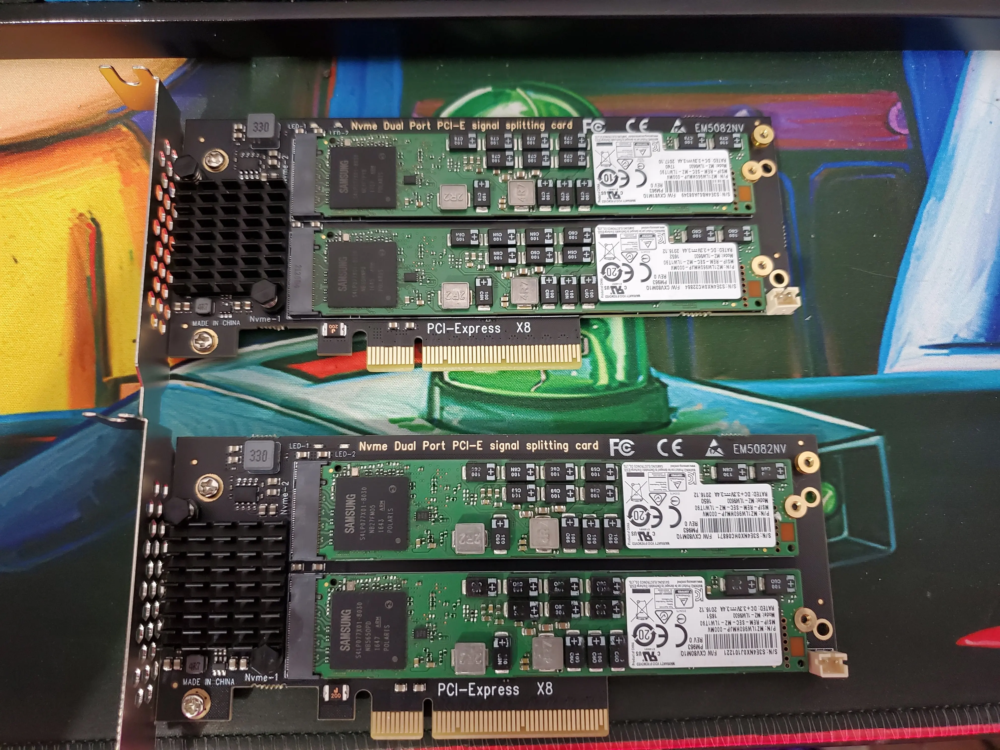
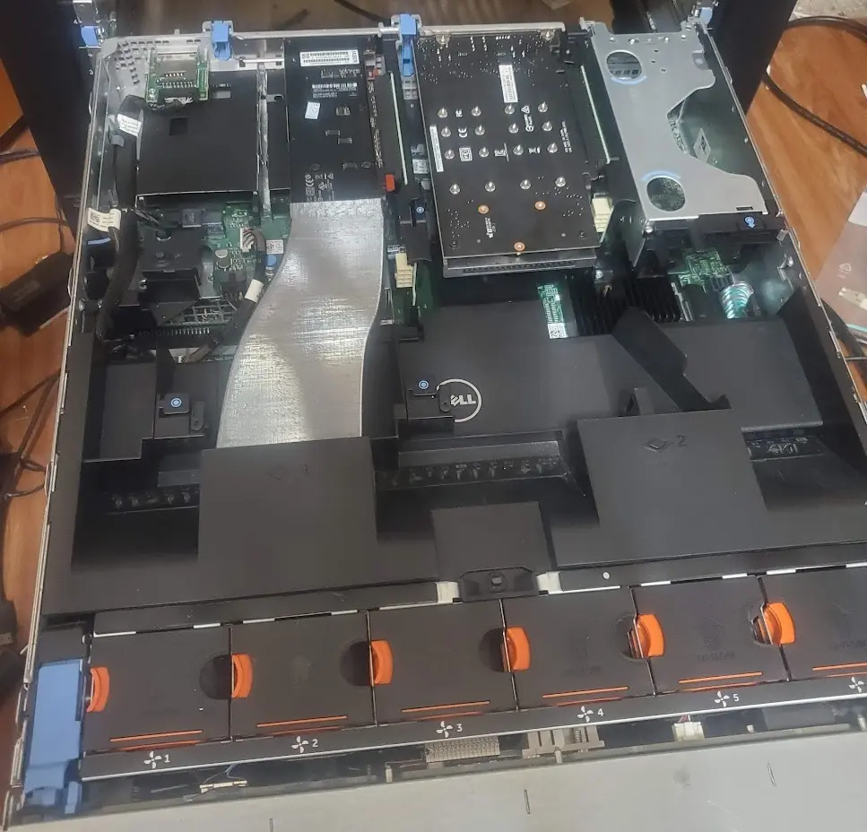
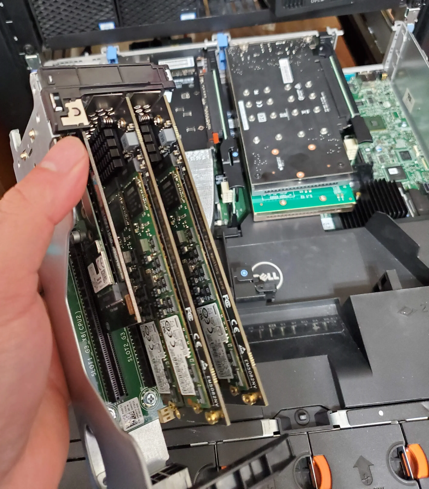
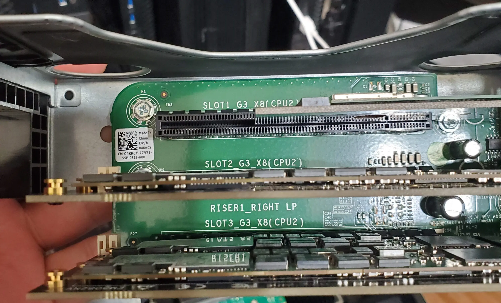
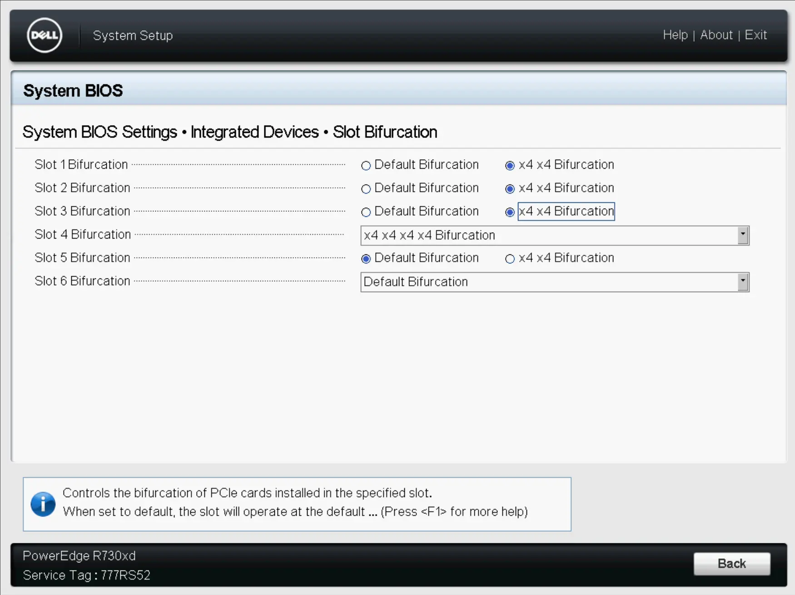
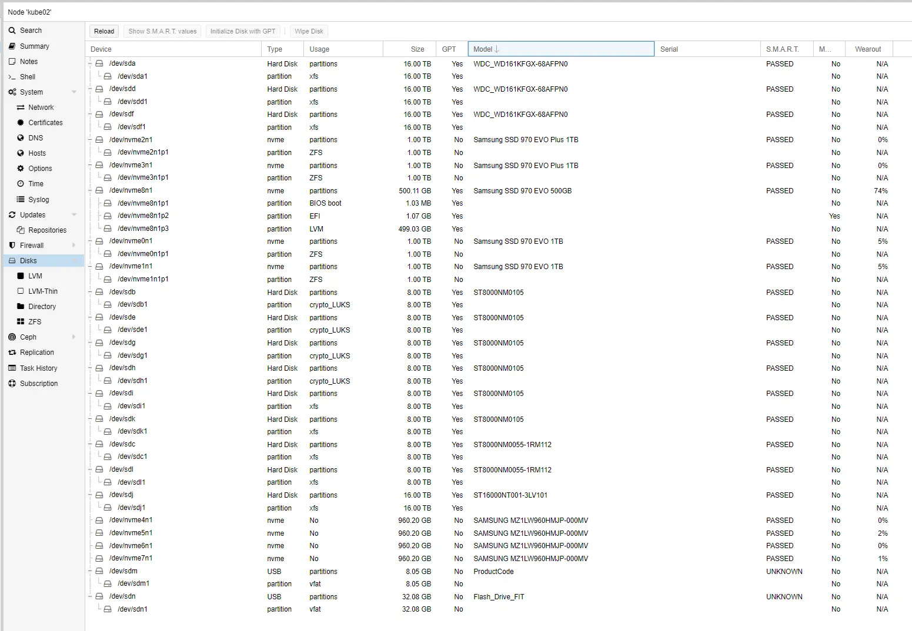

# Adding more NVMe to the r730XD

Adding 4 more enterprise NVMe drives to my r730XD.

This is just a short post about its troubleshooting, and.... what will replace it.

<!-- more -->

## Getting Started

For my [ceph cluster project](2023-08-08-proxmox-ceph.md){target=_blank}, I needed to add the proper amount of storage to each node, to make a decently performing, highly available ceph-cluster.

So, the first task, was to identify a good place to put them....

The problem is, my r730XD is already a tad on the full side.

The r730XD has 6 accessible PCIe slots. Three of which are half height, the rest are full height.

Current slot usage:

1. x8 Half 
    - Coral TPU 
2. Empty x8 Half
3. Empty x8 Half
4. x16 Full
    - [ASUS Hyper M.2](https://amzn.to/446qTqe){target=_blank}. Quad NVMe, Requires motherboard bifurcation
        - 1T Samsung 970 evo
        - 1T Samsung 970 evo
        - 1T Samsung 970 evo plus
        - 1T Samsung 970 evo plus
        - (All four of these NVMe are assigned to a striped-mirrors ZFS pool.)
5. x8 Full
    - [Quad NVMe Card](./../2022-01/R720XD-Bifurcation.md){target=_blank}. Does not require bifurcation. Fits 4x NVMe.
          - 500G Samsung 970 Evo (Proxmox boot drive)
          - empty
          - empty
          - empty
6. x16 Full
    - [Nvidia Tesla P4 GPU](https://ebay.us/S9k707){target=_blank}

Instead of putting the new NVMe into the PLX switch which had three empty slots, I felt it would be best to use the empty slots 1 and 2, and enable bifurcation.

Since, this is being used for my ceph project, enterprise NVMes were a must here. I went with 4x used enterprise [Samsung PM963 1T NVMe](https://ebay.us/CtU0Rk){target=_blank}.

For mounting the NVMe, I went with [Chinese Dual M.2 PCIe Adapter](https://amzn.to/454ed4d){target=_blank}. Note- requires motherboard bifurcation.

After all of the parts had arrived, the first order of business was to mount the NVMe into the adapter.

After the cards were loaded, I pulled out the right sled from the r730xd, and inserted the cards into slots 2 and 3.

Another angle.

And... after adding everything, we just need to enable bifurcation on the selected slots. This is handled through the BIOS.

Finally- I had the fun task of assigning the drives within Proxmox. 

The "fun" part- Four of the NVMe are assigned for a pool hosted inside of my Unraid VM.

Can- you spot which of the drives are the new ones, and which are the old? 

All done!