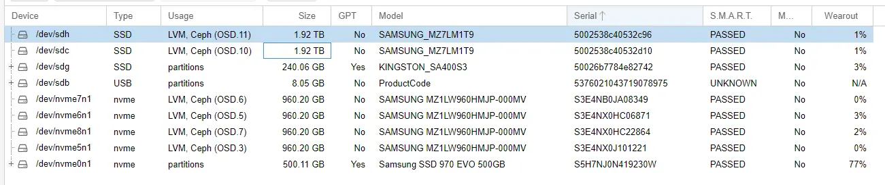
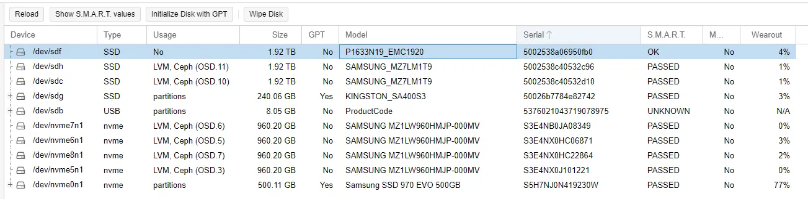

# Reusing EMC Drives in other systems

So, I picked up a EMC-branded 1.92TB PM1633 SAS drive off of ebay, to toss into my ceph cluster.

After acquiring it, I slapped it into my Dell MD1220, and was surprised that it was not appearing in proxmox.

This is a short post to help correct this issue.

<!-- more -->

First- here are the available drives showing inside of Proxmox



Note- the 1.92T drives being displayed are a pair of Samsung PM863A SSDs which are also mounted inside of the MD1220.

Lets run a `lsblk` to view the currently detected block devices.

``` bash
root@kube02:~# lsblk
NAME                                                                                                  MAJ:MIN RM   SIZE RO TYPE MOUNTPOINTS
sdb                                                                                                     8:16   1   7.5G  0 disk
└─sdb1                                                                                                  8:17   1   7.5G  0 part /mnt/thumbdrive
sdc                                                                                                     8:32   0   1.7T  0 disk
sdf                                                                                                     8:80   0     0B  0 disk
sdg                                                                                                     8:96   0 223.6G  0 disk
├─sdg1                                                                                                  8:97   0  1007K  0 part
├─sdg2                                                                                                  8:98   0     1G  0 part
└─sdg3                                                                                                  8:99   0 222.6G  0 part
sdh                                                                                                     8:112  0   1.7T  0 disk
rbd0                                                                                                  251:0    0     8G  0 disk
rbd1                                                                                                  251:16   0    16G  0 disk
rbd2                                                                                                  251:32   0     8G  0 disk
nvme0n1                                                                                               259:0    0 465.8G  0 disk
├─nvme0n1p1                                                                                           259:1    0  1007K  0 part
├─nvme0n1p2                                                                                           259:2    0     1G  0 part /boot/efi
└─nvme0n1p3                                                                                           259:3    0 464.8G  0 part
  ├─pve-swap                                                                                          252:0    0     8G  0 lvm  [SWAP]
  ├─pve-root                                                                                          252:1    0    96G  0 lvm  /
  ├─pve-data_tmeta                                                                                    252:6    0   3.4G  0 lvm
  │ └─pve-data                                                                                        252:8    0 337.9G  0 lvm
  └─pve-data_tdata                                                                                    252:7    0 337.9G  0 lvm
    └─pve-data                                                                                        252:8    0 337.9G  0 lvm
nvme6n1                                                                                               259:4    0 894.3G  0 disk
└─ceph--8e2310de--b5ed--46bd--a32e--5048af46cfe0-osd--block--e06ae6d2--d881--40a0--adcd--2c55020474d5 252:3    0 894.3G  0 lvm
nvme7n1                                                                                               259:5    0 894.3G  0 disk
└─ceph--126d8000--5cdd--4ced--ab77--38893cd88dc8-osd--block--6db92940--fc38--4b0b--9fb4--4c5ac6742921 252:2    0 894.3G  0 lvm
nvme5n1                                                                                               259:6    0 894.3G  0 disk
└─ceph--3f428911--5213--461d--a5fd--029f673d7ad2-osd--block--e65f3c81--23de--4f81--af2b--be185f6fef42 252:4    0 894.3G  0 lvm
nvme8n1                                                                                               259:7    0 894.3G  0 disk
└─ceph--25d71cae--e648--4a95--ae1f--c45f8fa547d7-osd--block--ae41fc24--8408--4656--8310--58e00a2a146b 252:5    0 894.3G  0 lvm
```


I am assuming `/dev/sdf` is the missing drive, but, it is reporting a size of 0B.

So, lets resolve this issue.

!!! info   
    Note- This guide assumes you are using a DAS / Disk-shelf, and uses sg3-utils to interact directly with the scsi device.
    
    For using local disks, there are easier methods to interact.

## TLDR - Too Long, didn't read

If- you don't want to read, and just want to get straight to the point, here is the summary. Otherwise, you can skip this section.

This issue occurs because EMC, Netapp, (and others), use a non-standard block size for their drives. We can easily correct this issue by reformatting the drive, with the correct block-size.

1. Install sg3-utils
    * `apt-get install sg3-utils`
2. Identify the drive using `sg_scan`
    * `sg_scan -i`
3. Identify the current block size using `sg_readcap`
    * `sg_readcap /dev/sg2`
4. Reformat the drive wit the correct block-size using `sg_format`
    * `sg_format --format --size=512 /dev/sg2`
5. Done.


## Getting Started

### Install sg3-utils

This will add the commands needed to interact with SCSI devices.

`apt-get install sg3-utils`

### Step 1. Scan SCSI using sg_scan

Next, lets scan for scsi drives, using [sg_scan](https://linux.die.net/man/8/sg_scan){target=_blank}

``` bash
root@kube02:~# sg_scan -i
/dev/sg0: scsi12 channel=0 id=0 lun=0 [em]
    VendorCo  ProductCode       2.00 [rmb=1 cmdq=0 pqual=0 pdev=0x0]
/dev/sg1: scsi11 channel=0 id=60 lun=0
    ATA       SAMSUNG MZ7LM1T9  104Q [rmb=0 cmdq=1 pqual=0 pdev=0x0]
/dev/sg2: scsi11 channel=0 id=65 lun=0
    SAMSUNG   P1633N19 EMC1920  EQPC [rmb=0 cmdq=1 pqual=0 pdev=0x0]
/dev/sg3: scsi11 channel=0 id=62 lun=0
    ATA       KINGSTON SA400S3  T1A3 [rmb=0 cmdq=1 pqual=0 pdev=0x0]
/dev/sg4: scsi11 channel=0 id=63 lun=0
    ATA       SAMSUNG MZ7LM1T9  204Q [rmb=0 cmdq=1 pqual=0 pdev=0x0]
/dev/sg5: scsi11 channel=0 id=64 lun=0
    DELL      MD1220            1.05 [rmb=0 cmdq=0 pqual=0 pdev=0xd]
```

We can clearly see /dev/sg2 is indeed the missing PM1633.

### Step 2. Identify the block size using sg_readcap

From previous experiences with Netapp / EMC, Its not uncommon for those drives to use non-standard / unusual block sizes, which causes issues when you try to reuse the drives.

We can use [sg_readcap](https://linux.die.net/man/8/sg_readcap){target=_blank} to detect this.

Looking at known-working drives, we can see a standard blocksize of 512.

``` bash
root@kube02:~# sg_readcap /dev/sg3
Read Capacity results:
   Last LBA=468862127 (0x1bf244af), Number of logical blocks=468862128
   Logical block length=512 bytes
Hence:
   Device size: 240057409536 bytes, 228936.6 MiB, 240.06 GB
root@kube02:~# sg_readcap /dev/sg4
Read Capacity results:
   Last LBA=3750748847 (0xdf8fe2af), Number of logical blocks=3750748848
   Logical block length=512 bytes
Hence:
   Device size: 1920383410176 bytes, 1831420.3 MiB, 1920.38 GB
```

However, looking at the EMC-branded drive, we get a returned block size of 520 bytes.

``` bash
root@kube02:~# sg_readcap /dev/sg2
Read Capacity results:
   Last LBA=3674210303 (0xdaffffff), Number of logical blocks=3674210304
   Logical block length=520 bytes
Hence:
   Device size: 1910589358080 bytes, 1822080.0 MiB, 1910.59 GB
```

### Step 3. Reformat the drive with the correct block size using sg_format

To reformat the drive, we can use [sg_format](https://linux.die.net/man/8/sg_format){target=_blank}, which will allow us to format the SCSI disk, with the correct block size.

The command we will use, is `sg_format --format --size=512 /dev/sg2` which will format /dev/sg2, with a new blocksize of 512bytes.

``` bash
root@kube02:~# sg_format --format --size=512 /dev/sg2
    SAMSUNG   P1633N19 EMC1920  EQPC   peripheral_type: disk [0x0]
      << supports protection information>>
      Unit serial number: P0NA0H905801
      LU name: 5002538a06950fb0
Mode Sense (block descriptor) data, prior to changes:
  Number of blocks=3674210304 [0xdb000000]
  Block size=520 [0x208]

A FORMAT UNIT will commence in 15 seconds
    ALL data on /dev/sg2 will be DESTROYED
        Press control-C to abort

A FORMAT UNIT will commence in 10 seconds
    ALL data on /dev/sg2 will be DESTROYED
        Press control-C to abort

A FORMAT UNIT will commence in 5 seconds
    ALL data on /dev/sg2 will be DESTROYED
        Press control-C to abort

Format unit has started
```

After, sending the command, it will take a while to format, and will occasionally yield a progress message.

``` bash
Format unit has started

Format unit in progress, 2.76% done
Format unit in progress, 5.90% done
Format unit in progress, 9.01% done
Format unit in progress, 12.11% done
Format unit in progress, 15.23% done
Format unit in progress, 18.33% done
Format unit in progress, 21.45% done
Format unit in progress, 24.55% done
Format unit in progress, 27.66% done
...
```

Afterwards, you can verify is now has the correct block size.

``` bash
root@kube02:~# sg_readcap /dev/sg2
Read Capacity results:
   Last LBA=3751804927 (0xdf9fffff), Number of logical blocks=3751804928
   Logical block length=512 bytes
Hence:
   Device size: 1920924123136 bytes, 1831936.0 MiB, 1920.92 GB
```

## All Done.

After removing the HDD, and re-inserting it, the drive correctly appeared within Proxmox.



`lsblk` also now correctly identifies the drive's size. (/dev/sdf)

``` bash
root@kube02:~# lsblk
NAME                                                                                                  MAJ:MIN RM   SIZE RO TYPE MOUNTPOINTS
sdb                                                                                                     8:16   1   7.5G  0 disk
└─sdb1                                                                                                  8:17   1   7.5G  0 part /mnt/thumbdrive
sdc                                                                                                     8:32   0   1.7T  0 disk
sdf                                                                                                     8:80   0   1.7T  0 disk
sdg                                                                                                     8:96   0 223.6G  0 disk
├─sdg1                                                                                                  8:97   0  1007K  0 part
├─sdg2                                                                                                  8:98   0     1G  0 part
└─sdg3                                                                                                  8:99   0 222.6G  0 part
sdh                                                                                                     8:112  0   1.7T  0 disk
rbd0                                                                                                  251:0    0     8G  0 disk
rbd1                                                                                                  251:16   0    16G  0 disk
rbd2                                                                                                  251:32   0     8G  0 disk
nvme0n1                                                                                               259:0    0 465.8G  0 disk
├─nvme0n1p1                                                                                           259:1    0  1007K  0 part
├─nvme0n1p2                                                                                           259:2    0     1G  0 part /boot/efi
└─nvme0n1p3                                                                                           259:3    0 464.8G  0 part
  ├─pve-swap                                                                                          252:0    0     8G  0 lvm  [SWAP]
  ├─pve-root                                                                                          252:1    0    96G  0 lvm  /
  ├─pve-data_tmeta                                                                                    252:6    0   3.4G  0 lvm
  │ └─pve-data                                                                                        252:8    0 337.9G  0 lvm
  └─pve-data_tdata                                                                                    252:7    0 337.9G  0 lvm
    └─pve-data                                                                                        252:8    0 337.9G  0 lvm
nvme6n1                                                                                               259:4    0 894.3G  0 disk
└─ceph--8e2310de--b5ed--46bd--a32e--5048af46cfe0-osd--block--e06ae6d2--d881--40a0--adcd--2c55020474d5 252:3    0 894.3G  0 lvm
nvme7n1                                                                                               259:5    0 894.3G  0 disk
└─ceph--126d8000--5cdd--4ced--ab77--38893cd88dc8-osd--block--6db92940--fc38--4b0b--9fb4--4c5ac6742921 252:2    0 894.3G  0 lvm
nvme5n1                                                                                               259:6    0 894.3G  0 disk
└─ceph--3f428911--5213--461d--a5fd--029f673d7ad2-osd--block--e65f3c81--23de--4f81--af2b--be185f6fef42 252:4    0 894.3G  0 lvm
nvme8n1                                                                                               259:7    0 894.3G  0 disk
└─ceph--25d71cae--e648--4a95--ae1f--c45f8fa547d7-osd--block--ae41fc24--8408--4656--8310--58e00a2a146b 252:5    0 894.3G  0 lvm
```