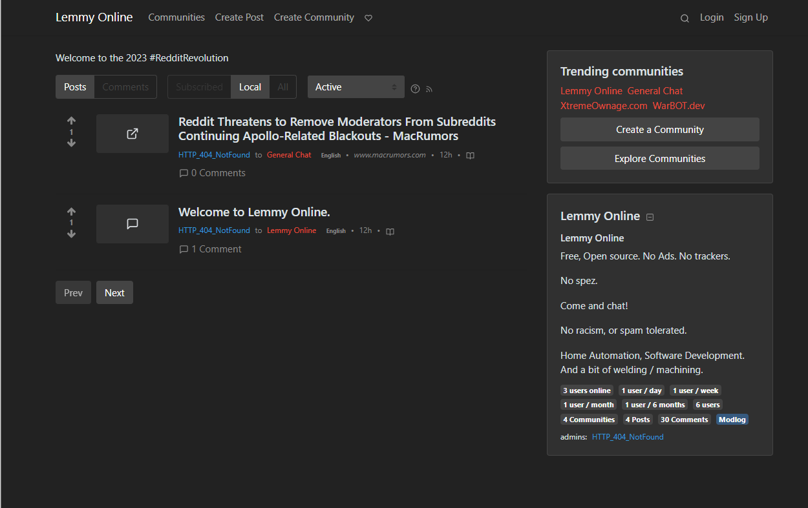
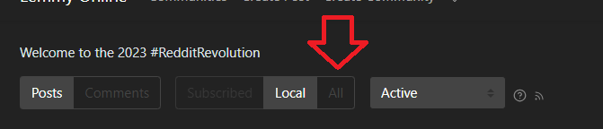
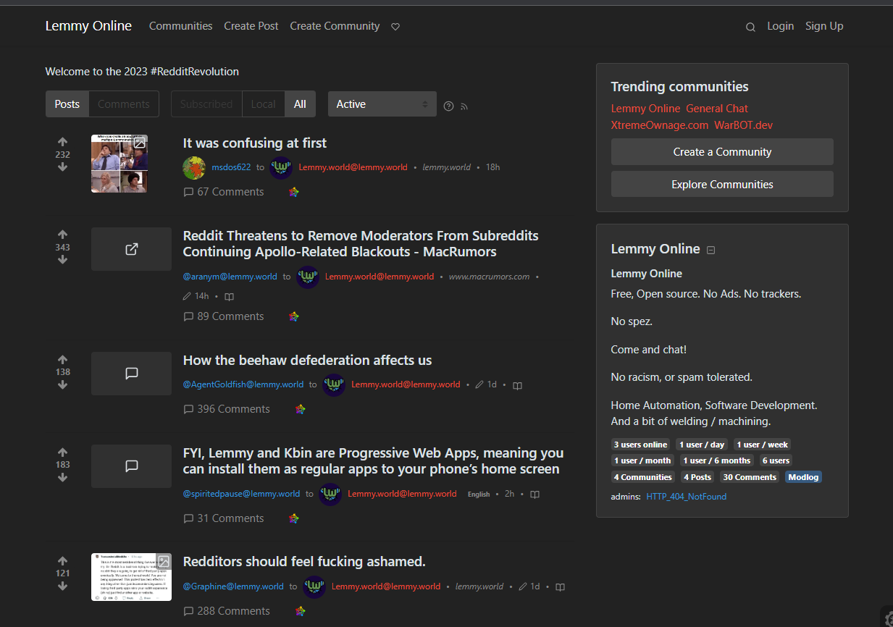
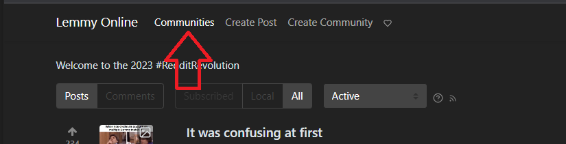
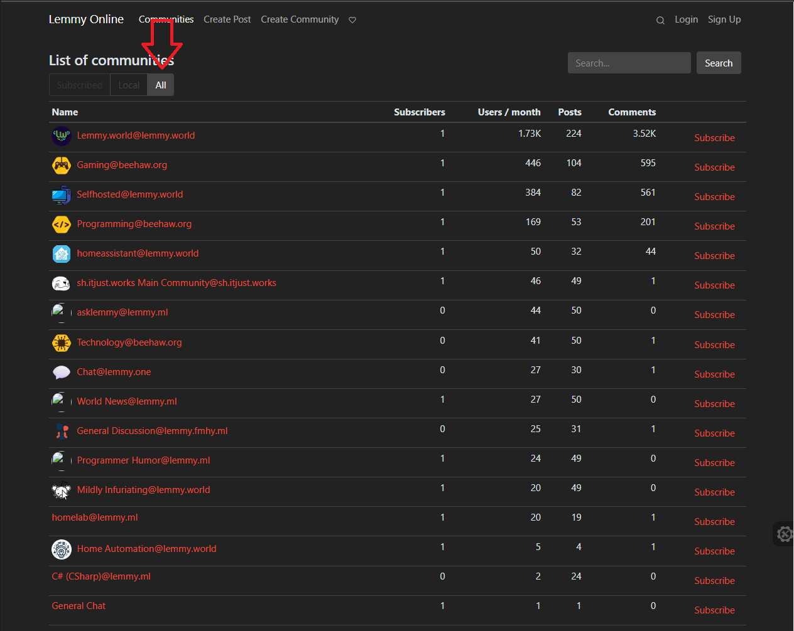
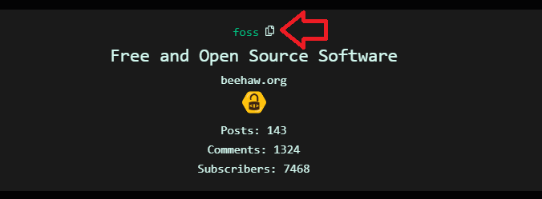
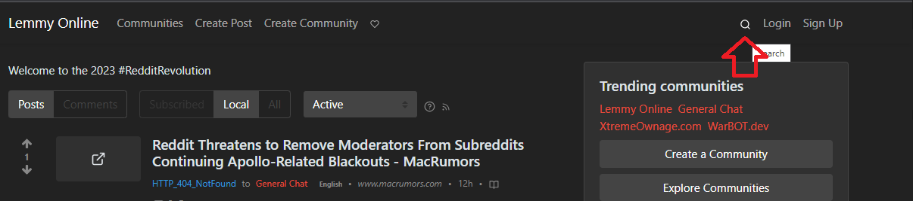
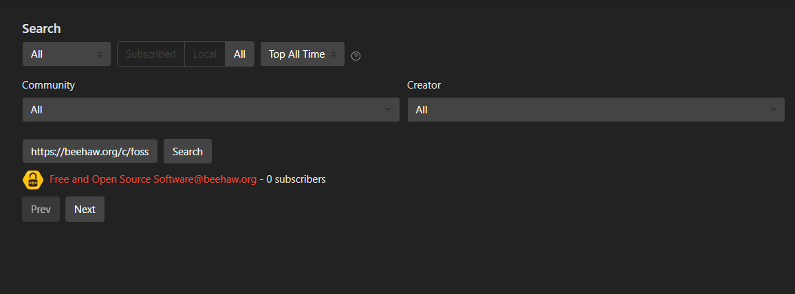
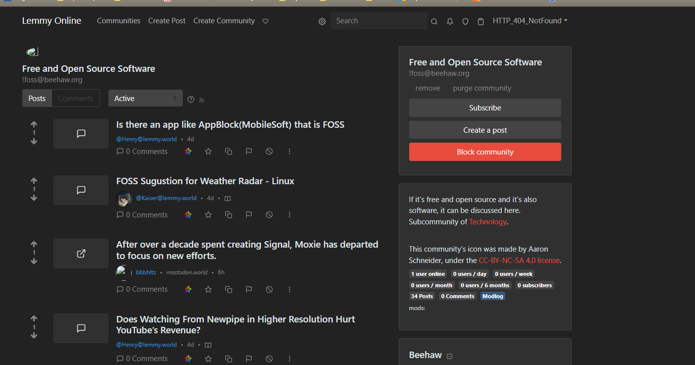

# Join the Fediverse

Want to learn more about how to use the fediverse? 

Here are a few short tips to get started.

<!-- more -->

## What is the fediverse?

The [Fediverse](https://en.wikipedia.org/wiki/Fediverse){target=_blank} refers to a group of interconnected, decentralized, and federated servers.

Mastadon, for example, works much like twitter.

KBin and Lemmy, for example, works in the same way as reddit.

ALL of these applications are interconnected.

If- you are out of the loop as to why everyone is looking for alternatives- see... [The end of reddit](2023-06-19-end-of-reddit.md)

## Useful Links

Here is a section of useful links, and locations.

### Tools

* [Lemmy Community-Browser](https://browse.feddit.de/)
* <https://fediverse.party/>
* [Lemmy Stats / The Federation](https://the-federation.info/)
* [Lemmy Stats / Fediverse](https://lemmy.fediverse.observer/dailystats)
* [Lemmy Server List (Shows uptime) / Fediverse](https://lemmy.fediverse.observer/list)
* [History of Lemmy](https://join-lemmy.org/docs/en/users/07-history-of-lemmy.html)
* [Subreddit Migration Finder](https://sub.rehab/)

* [Lemmy Account Migrator](https://github.com/wescode/lemmy_migrate){target=_blank}
    * Python Script - This migrates your subscribed communities from one instance, to another.

### Places to join

* <https://join-lemmy.org/>
* <https://joinmastodon.org/>
* [My Self-Hosted Lemmy Instance](https://lemmyonline.com/)

## How to Join 

### How to join lemmy?

You, can either join the server I am running [LemmyOnline.com](https://lemmyonline.com/){target=_blank}, or choose from one of the hundreds of available servers at [https://join-lemmy.org/](https://join-lemmy.org/){target=_blank}

Do note, the only importance of the server you choose, is uptime and performance. Content is visible from any instance, for any instance. 

So, it is possible, for example, a user on lemmyonline.com, to read a post on lemmy.world, written by a user on kbin.social... and to do so, all transparently. 

#### Why should I join XX instance, instead of lemmy.world?

1. Everything is federated. You can view any instance, from any other instance, as long as they aren't defederated. (Everything is federated by default.)
2. As such, the content you want to view, is not limited by your instance.
3. Joining a bigger instance MIGHT seem like the best thing to do, HOWEVER, you are likely to have a better user experience on a smaller, less loaded instance. This is due to less load.
4. I won't force you to join my instance. However, I do recommend you pick an instance with high uptime. [List of Instances](https://lemmy.fediverse.observer/list){target=_blank}

#### What if I want to host my own instance?

You can!

Follow the [Official Documentation for Lemmy](https://join-lemmy.org/docs/en/users/01-getting-started.html){target=_blank}

Do note, you WILL need a valid domain, and https certificate for federation to work. (Federation does not work without TLS)

### How to join mastadon?

[JoinMastodon](https://joinmastodon.org/){target=_blank}

Again, it is completely possible for a user on mastadon, to post onto a lemmy server. Remember, everything is interconnected. 

## How can I move my account?

The easy answer, you don't 

At this current time, you would need to create a new account, on a new server.

You can use the [Lemmy Account Migrator](https://github.com/wescode/lemmy_migrate){target=_blank} to migrate your subscriptions to your new server.

## How do I see other content?? I can't see any of the communities I want to see.
## How do I subscribe to communities from other instances?

I can't see anything!!

The first step- is to click "ALL". By default, only "LOCAL" posts/comments are displayed.

After clicking "ALL", you can see all of the communities your instance has subscribed to.

### What communities has my instance subscribed to?

Click Communities at the top

Once you open the communities screen, click "ALL". Afterwards, you will see all communities your instance has subscribed to.

### What if the community I am looking for is not there?

1. Use the [Community-Browser](https://browse.feddit.de/){target=_blank}

### How do I subscribe to a community which is not on my server?

Lets say, you see the FOSS community, and would like to join it.

Click the copy icon. This will copy `https://beehaw.org/c/foss` to your clipboard.

Open a search. 

In the search, paste the URL.

When the community pops up, click on it.

You are now viewing a federated community. 

You can subscribe to it. You can post on it. You can comment on it.

#### Its not working!

If the above steps aren't working for you-

1. Make sure you are logged in
2. Here are some more in-depth details on how to subscribe to remote communities [StackExchange](https://webapps.stackexchange.com/questions/170872/how-can-i-subscribe-to-a-remote-community-on-lemmy){target=_blank}
