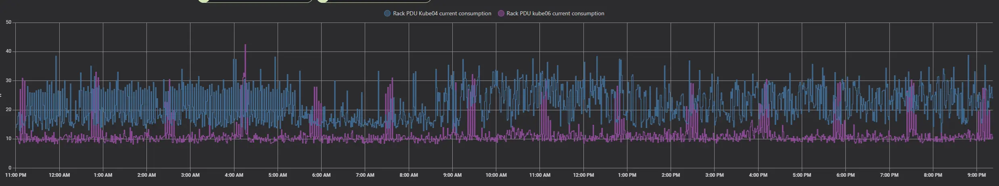
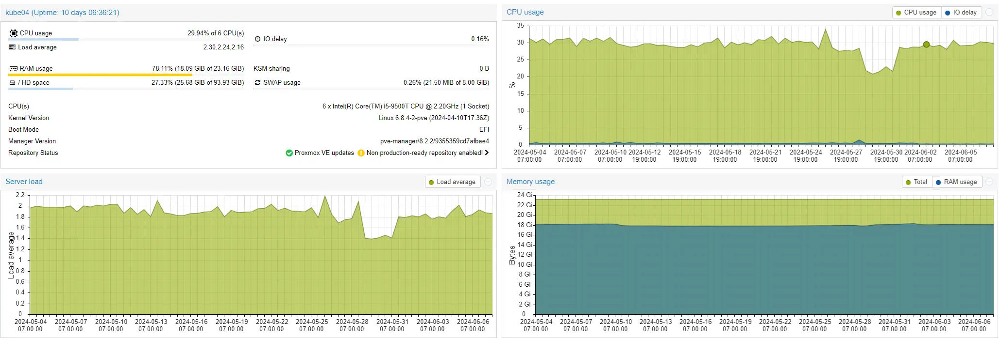
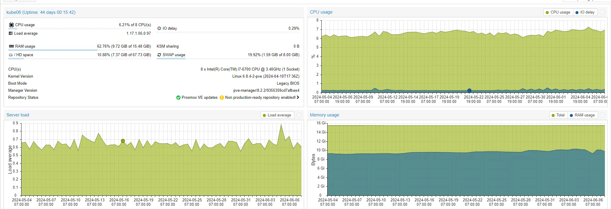
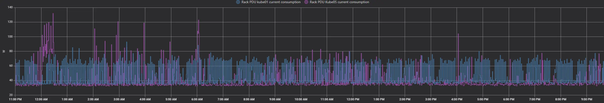

# Balancing Power Consumption and Cost: The True Price of Efficiency

Too often- I see the all too familiar post on reddit.

Hey guys- Look at this really nice hardware I got for free, or for cheap. 

And- there is ALWAYS a comment along the lines of, "Say good bye to your energy bill", or "Time to watch your meter spin!"

So- today, I am here to address a few common misconceptions. 

<!-- more -->

## Power Consumption of various Computer Components

With exceptions- The motherboard and CPU generally represent a small piece of the efficiency puzzle, in most cases.

What I mean by this....

### The Real Power Consumers: Accessories

The accessories you plug into a computer often consume the majority of power:

| Component                         | Typical Idle Power Consumption            | 100% Active Usage Power Consumption       |
|-----------------------------------|-------------------------------------------|-------------------------------------------|
| **3.5" HDDs**                     | 3 to 5 watts                              | 6 to 10 watts                              |
| **2.5" HDDs**                     | 1 to 3 watts                              | 2 to 5 watts                               |
| **15k SAS HDDs**                  | 10 to 15 watts                            | 15 to 20 watts                             |
| **SATA SSDs**                     | 2 to 4 watts                              | 4 to 6 watts                               |
| **NVMe SSDs**                     | 4 to 7 watts                              | 6 to 10 watts                              |
| **Each 1G port in use**           | Approximately 0.5 watts                   | 1 to 2 watts                               |
| **Each DIMM of DDR3**             | 2 to 5 watts                              | 3 to 7 watts                               |
| **Each DIMM of DDR4**             | 2 to 4 watts                              | 3 to 6 watts                               |
| **DDR3 ECC RAM (Non-buffered)**   | 2 to 5 watts                              | 3 to 7 watts                               |
| **DDR4 ECC RAM (Non-buffered)**   | 2 to 4 watts                              | 3 to 6 watts                               |
| **DDR3 ECC RAM (Buffered)**       | 3 to 6 watts                              | 4 to 8 watts                               |
| **DDR4 ECC RAM (Buffered)**       | 3 to 5 watts                              | 4 to 7 watts                               |
| **Every add-on card**             | Varies; up to 75 watts without dedicated power | Varies; up to 75 watts without dedicated power |
| **Copper 10G port**               | 3 to 6 watts                              | 6 to 10 watts                              |
| **Fiber 10G port with transceiver** | 1 to 2 watts (port) + 0.6 to 1 watt (transceiver) | 2 to 3 watts (port) + 1 to 1.5 watts (transceiver) |
| **SATA HBA**                      | 4 to 8 watts                              | 8 to 12 watts                              |
| **Dedicated GPU (idle)**          | 15 to 30 watts                            | 150 to 300 watts (varies widely based on model) |
| **Power Supply (80+ Bronze, 500W)** | 10 to 15 watts (efficiency loss)           | 50 to 70 watts (efficiency loss)           |
| **Power Supply (80+ Silver, 500W)** | 8 to 12 watts (efficiency loss)            | 40 to 60 watts (efficiency loss)           |
| **Power Supply (80+ Gold, 500W)**  | 5 to 10 watts (efficiency loss)            | 30 to 50 watts (efficiency loss)           |
| **Power Supply (80+ Platinum, 500W)** | 3 to 7 watts (efficiency loss)             | 20 to 40 watts (efficiency loss)           |
| **Power Supply (80+ Titanium, 500W)** | 2 to 5 watts (efficiency loss)             | 15 to 30 watts (efficiency loss)           |
| **Case Fans (120mm)**             | 1 to 3 watts                              | 2 to 5 watts                               |
| **CPU Cooler (Air)**              | 2 to 5 watts (varies based on size and speed) | 5 to 15 watts (under heavy load)           |
| **CPU Cooler (Liquid)**           | 2 to 8 watts (varies based on pump and fan speed) | 5 to 20 watts (under heavy load)        |

## Examples

### Case Study 1: Synology DS423+

Consider a [Synology DS423+](https://www.synology.com/en-global/products/DS423+#specs){target=_blank}, rated to idle at 8.5 watts with HDD Hibernation.

If you add:

- 4x 3.5" HDDs (I Mean... it is a NAS afterall... it doesn't work well without HDDs)
- Connect both gigabit ports
- Populate both NVMe slots

It's going to use 45-50 watts at idle, instead of the expected 8 watts, despite only having a lowly intel celeron processor.

Here- is my data. (What- you didn't think I was going to make claims without data, did you?)

That being said, this particular unit is only used for backups. 95% of the time, its sitting basically idle.

### Case Study 2: Optiplex Micros

I have a pair of optiplex Micros

- **i7-6700**: Optiplex 7050m - Idles around 20 watts- but, stays around 30% utilization.
- **i5-9500T**: Optiplex 3070m - Also idles around 8-12 watts with a small load. Stays around 7% utilization.

You would think, for only a 20% difference in utilization- the much newer i5-9500t would be leaps and bounds better then the i6-6700, right? I mean- Its three generations newer, and its a "t" variant with a much lower TDP. Also- its an i5, instead of an i7.

Wrong!

Again- here is 24 hours worth of usage.

Red line is the machine with the i7-6700, and the blue line is the i5-9500t

Because data is king- here is one months worth of utilization from these devices.

Kube04 (i5-9500t)

Kubeo6 (i7-6700)

### Case Study 3: Newer isn't always better (or is it?)

#### R720XD vs. R730XD

I used to run an R720XD, the server I built my [40G NAS Project](../../../../pages/Projects/40G-NAS.md){target=_blank} with. After many optimizations, its idle utilization WITH:

- 14 HDDs
- A ton of NVMe

Was down to 168 watts. While that sounds high, remember that includes a significant number of HDDs and NVMe.

Now, I have an R730XD with:

- v4 processors (compared to v2)
- DDR4 RAM (instead of DDR3)

Its load is quite a bit less due to more SFFs and micros spreading the load. However, I can't get it to idle under 240 watts, to save my life.

##### Why?

Its due to the accessories loaded in it.

My r720XD had most of the RAM removed, which a good bit of energy. My r730XD has 16 of the 24 slots populated currently, with 256G of ram. That- is 48 to 80 watts just worth of RAM.

The r720XD also had one of its processors removed. 

Are- these servers less efficient the my i5-8500t?

The answer- is not a simple yes or no. It depends on your needs.

If you need tons of ram, its more efficient to get one of these big servers, rather then to get a bunch of smaller ones.

##### Why?

128G of DDR4-ECC Server memory costs 100$ shipped. 128G of DDR4-Desktop memory, costs 200$ shipped.

My SFFs with i7-8700s can each fit 64G of RAM, and this ram costs 100$, and the machine is between 150-200$.

It would take four of those machines to match the current memory capacity as my r730xd. My r730XD costed me 500$ shipped + 100$ for another 128G of ram = 600$ total.

Four of those machines, would cost 600$ to 800$ for the machines, plus 400$ more for the ram. = 600-1,200$. 

The idle draw of my r730XD under typical load- is 220-240 watts, including 128T of spinning rust, a Nvidia GPU, and a dozen (not a typo) NVMes.

Here is 24 hours of consumption for my SFFs.

Between 35-50 watt idle for each of them. So- lets assume between 160-200 watts if we had four of them.

So- they are more efficient then, right?

Nope. They don't have over 100 watts worth of hard drives and NVMes. 

If- you don't need, or have a use for the resources- then by all means- they are more efficient. But- if you do need those resources- the server hardware becomes drastically cheaper, and more efficient.

Remember- servers are designed to be efficient... At Scale. (<-- Keyword)

If consumer hardware was "The way" for efficiency, you would see them being used in datacenters. 

### Case Study 4- Lower power processors, don't mean lower power.

While I was doing the 40G NAS project, one of my experiments to reduce power- was to change out the CPUs with more "efficient" models.

Originally, the server had [E5-2695v2 processors](https://www.intel.com/content/www/us/en/products/sku/75281/intel-xeon-processor-e52695-v2-30m-cache-2-40-ghz/specifications.html){target=_blank}

These were 12c/24t processors, with a 2.4/3.2 ghz base/boost clock. The TDP was 115W each.

So- I picked up a pair of [E5-2630L v2 processors](https://www.intel.com/content/www/us/en/products/sku/75791/intel-xeon-processor-e52630l-v2-15m-cache-2-40-ghz/specifications.html){target=_blank}. The L, standing for low energy.

These- were 6c/12t processors, with a 2.4/2.8ghz base/boost clock. The TDP was 60w each. Nearly half of the original processor.

What happened? 

An EXTREMELY slight drop in power consumption. Nearly un-noticeable, measuring at most, 10w. 

As- these processors were noticably slower then the originals- I decided to swap processors again.

This time, I swapped to a pair of [E5-2667v2 processors](https://ark.intel.com/content/www/us/en/ark/products/75273/intel-xeon-processor-e5-2667-v2-25m-cache-3-30-ghz.html){target=_blank}

These processors, are 8c/16t with a 3.3/4ghz base/boost clock. The TDP is 130W each.

Based on the TDP alone- these processors sound like the worst choice! Right?

Surprisingly- these were the most efficient processors, saving a whopping 30 watts over even the "L" variant processors.

#### Why is this the case?

Well- I had my theory that the faster processor was able to finish its work faster, and spend more time in an idle state. This- was just my theory.

Yesterday- `r/thepsyborg` confirmed my theory, and let me know of the term "race to sleep", or "race to halt"

Since- I am not knowledgeable enough to explain it- I am going to provide this summary here.

##### Understanding "Race to Sleep"

"Race to Sleep" refers to the competition among computer components to enter low-power sleep states quickly. This optimization is vital for energy efficiency in modern computing. Efficient power management extends battery life, reduces environmental impact, and saves costs. Challenges include balancing performance with power consumption and ensuring seamless transitions between states. Hardware and software optimizations address these challenges, promoting energy-efficient computing solutions.

### The Efficiency Myth: Raspberry Pi 4 8GB

Everyone touts the Raspberry Pi 4 8GB as being extremely efficient. 

They aren't. Their efficient is actually really horrible, for what they are. A pi-4 8g, will consume between 3-7 watts. The charger/wall bricks, are typically 80-90% efficient. (So- very little overhead here)

Remember- the optiplex micros from step 2? The ones that idle at 8-12 watts WHILE running VMs and containers?

Compare their CPU power to the Raspberry Pi 4 8GB:

- [Benchmark Comparison](https://www.cpubenchmark.net/compare/4297vs2598vs3454/BCM2711-vs-Intel-i7-6700-vs-Intel-i5-9500T)

They have **TEN TIMES** the CPU power and **DRASTICALLY** faster I/O, USB, etc.

And- the optiplex micro is idling at only around twice the consumption of a raspberry pi. (not factoring in- that is also has both a 2.5" SSD, and a NVMe)

## Conclusion: Power Consumption and Cost Efficiency

Understanding power consumption is crucial for making informed hardware decisions. 

- If you spend $200 more on a certain piece, but only save a few watts, it's pretty trivial to calculate the ROI to determine if it's actually worth it. More efficient does not always mean cheaper.

A few years back, I created an ROI calculator to assist with determining the ROI based on power consumption, price, and your cost of energy.

[Power Consumption versus Price](https://xtremeownage.com/2022/01/04/power-consumption-versus-price/).

In the end, there is no "Correct" answer, and at the time of writing this, there is no perfect solution. 

There- are simply too many variables, such as...

* Your cost of electricity.
* The amount of room you have (aka, is a standard tower too big? Rack server out of question?)
* How many accessories you add. (HDDs, NVMes, GPUs, etc)
* What is the average load. 
    * Under idle load- much faster processors will actually consume far less energy- because they finish the task faster, and spend more time in an idle state. TDP has basically no impact on idle draw.
    * Near max load - The TDP will have a drastic impact on efficiency- as TDP governs the maximum thermal power the CPU can generate for a duration.

Do the math. Do your research. 

Don't listen to every jackass who claims your electric meter is going to spin out of control.