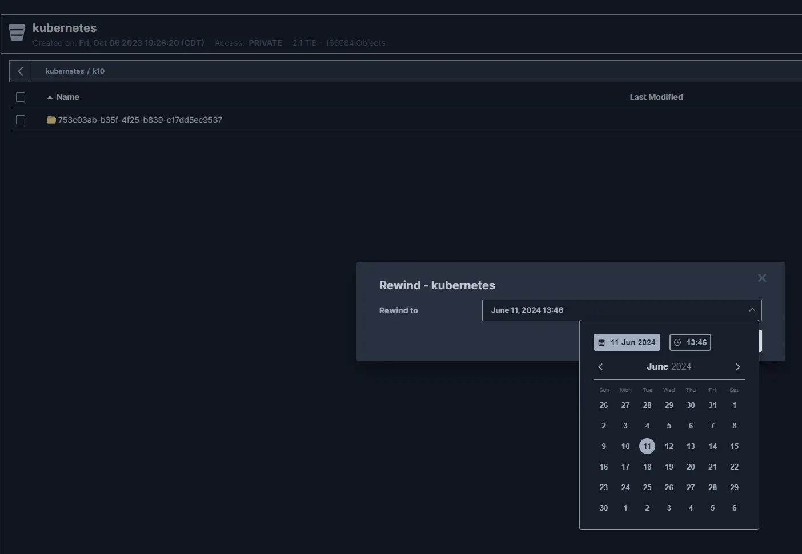
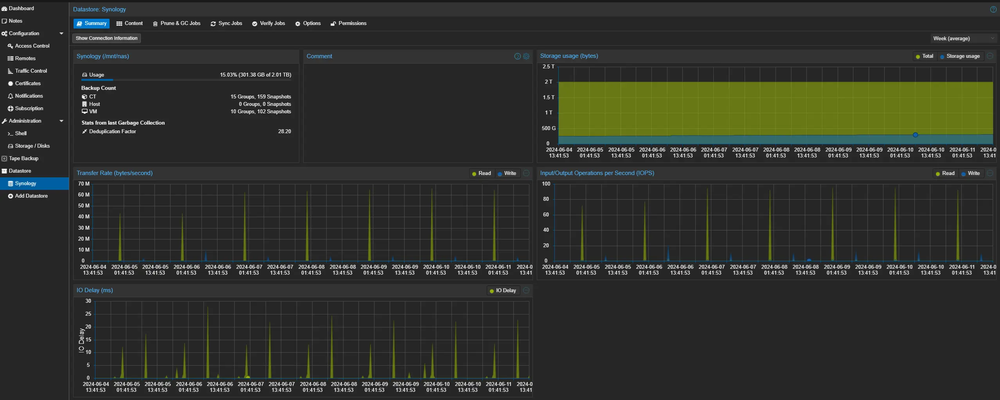
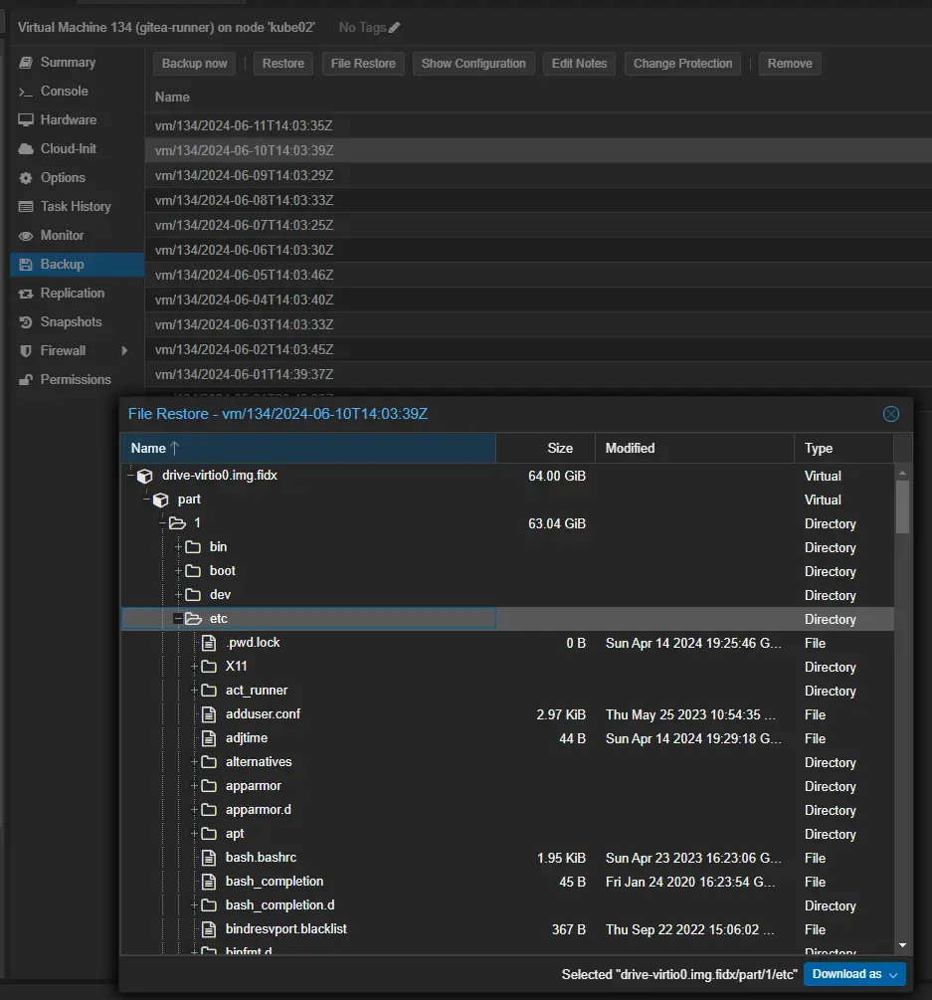
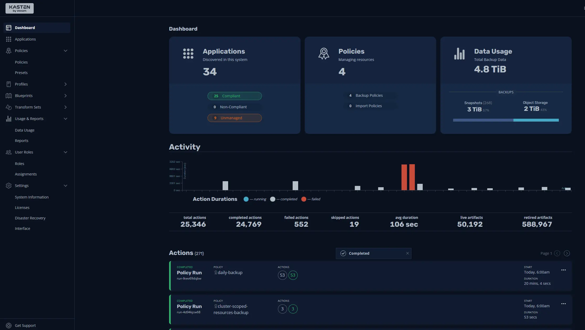
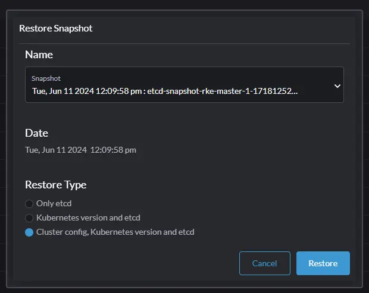
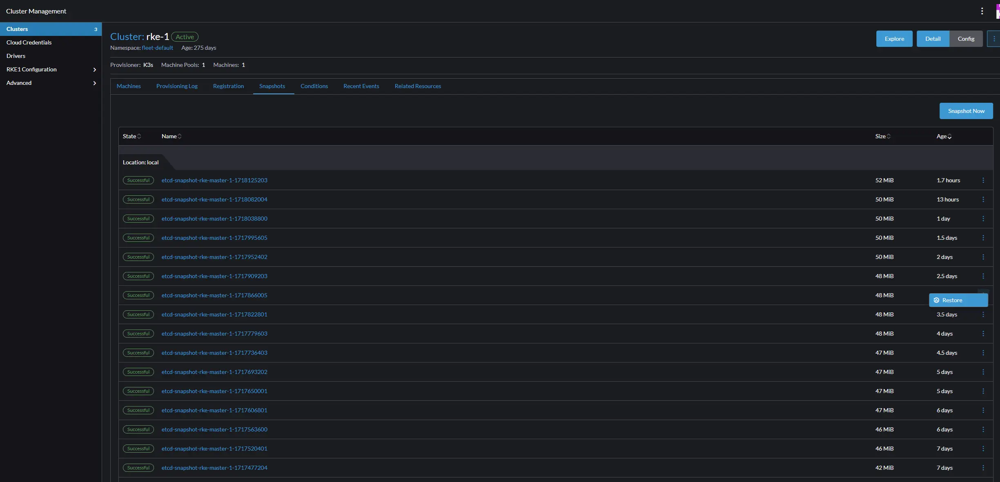
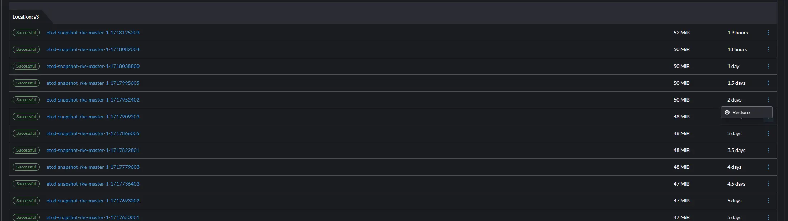

# My personal backup strategies. How I implement 3-2-1, or better.

This- is a short post explaining my personal backup strategies for VMs, Kubernetes, Personal Devices, etc.

I discuss my strategies for implementing, and exceeding the 3-2-1 backup rule, for Kubernetes, Proxmox, File Shares, and personal devices.

<!-- more -->

## What is the 3-2-1 rule?

The 3-2-1 Rule is a data protection strategy that recommends having three copies of your data, stored on two different types of media, with one copy kept off-site.

This means-
1. Maintain three copies of your data: This includes the original data and at least two copies.
2. Use two different types of media for storage: Store your data on two distinct forms of media to enhance redundancy.
3. Keep at least one copy off-site: To ensure data safety, have one backup copy stored in an off-site location, separate from your primary data and on-site backups.

Any data that cannot be replaced extremely easily, should try to follow this strategy. 

For data that is irreplaceable- 3-2-1 isn't good enough. 

As an example- for the decades worth of photos I have collected, I have AT MINIMUM 7 PHYSICAL copies, excluding snapshots.

## My Backup Strategies

### Synology Itself

As you will find in this post- My synology is one of the primary pieces of infrastructure for my various backup strategies.

All of the important shares, are protected by Immutable snapshots, which prevents the deletion of the data / share, until a timer has passed. This- is intended to prevent administrative action, or ransomware from being able to affect or touch the backups until a specified amount of time has past.

In addition to immutable snapshots of shares- All of the data gets  encrypted, and replicated off-site, two multiple locations.

I use a well-known, but, unspecified cloud S3 provider for one copy.

And- I have a friend whom we share space on each other's NAS/Networks for the purpose of storing backups. The data is encrypted so that neither party can look at each other's backups, and is transferred through a VPN tunnel between our networks. We are geographically separated by enough distance, that a singular event has little chance of taking out both of our networks.

That being said- this meets the 3-2-1 rule for anything backed up to the synology.

1. First copy on the NAS itself
    - Immutable snapshots to help protect against administrative failure, or ransomware.
2. One copy in the cloud.
    - Cloud provider has their own snapshots.
3. One copy at a friends house.

Lastly- ALL of my disks are encrypted at rest. Any data transferred outside of my network, is again encrypted by a key that only I know.

### Minio

[Minio](https://min.io/){target=_blank} is used for backups of my Kubernetes environment, and a few other services

If offers the advantage that I can store immutable buckets of data, automatically replicate that data, and have the ability to do a point-in-time restore.

Here is a [screenshot of the "Rewind" functionality.](https://min.io/product/object-versioning-bucket-versioning){target=_blank}

My [minio](https://min.io/){target=_blank} itself, has multiple layers of backups, and replication.

1. Primary instance hosted on my Unraid server
    - Automatic scheduled snapshot creation and retention via sanoid. (Its hosted on a ZFS array)
    - Underlying ZFS pool is redundant, and can tolerate loss of half of its disks.
2. Automatic replication between itself, and another minio instance hosted on my synology.
    - Automatic scheduled IMMUTABLE snapshot creation, and retention via Synology Snapshot Manager.
    - Underlying BTRFS pool is redundant, and can tolerate loss of half of its disks.
3. Automatic Encrypted S3 replication off-site to my S3 provider.
    - They maintain their own versioning
    - I'd assume they have redundant datacenters. But, never asked...

### Proxmox - VMs and Configuration

#### Proxmox VM / LXC Backups - Via Proxmox Backup Server w/iSCSI on Synology

Originally, I used a NFS target to unraid for my backups. When I picked up the synology, I decided to create a Proxmox Backup Server VM,  but, host its storage to the synology via iSCSI. 

Proxmox backup server is pretty great once you have it up and running. I am currently getting deduplication ratios of excess 40:1 for my backups. It does not consume many resources, and it only needs to transfer incremental (A NFS backup target did full backups, every time). In addition, you can do point in time, file-level restores.

Here is a picture of the Proxmox Backup Server Console, showing my iSCSI share.

Here is a screenshot showing the file-level store functionality offered when you use Proxmox Backup Server.

Overall- HUGE success. With the deltas, and incremental backups, the iSCSI over 1G has not been an issue at all. There- isn't much data transfer needed.

(Do note- I do not backup my Kubernetes worker-nodes. They have their own solution down below)

The iSCSI LUN was configured with the "SAN Manager" app, and also has immutable snapshots scheduled, and custom retention policies... So, even in the event the share gets completely nuked, I still have entire disk snapshots.

For this particular data- there will always be at least three copies, meeting the 3-2-1 rule.

1. Stored in Proxmox Backup Server - w/Storage hosted on the synology.
    - Immutable snapshots and retention policies scheduled for the LUN.
2. Replicated Cloud backup 
3. Encrypted copy replicated to a friend's NAS where we swap space for backups.

#### Proxmox Configuration - Via Synology App, "Active Backup for Business"

For backing up the running cluster state, and configuration, I found the "Active Backup for Business" to be the best fit. I configured one of my proxmox hosts with a SSH key, and configured it as a "File Server" using ssh/rsync.

Since- /etc/pve is a cluster file system on all of the nodes- backing up that directory from a single host is enough to capture the entire cluster state.

I was able to configure the synology to keep multi-versioned backups, which will allow me to execute a point-in-time recovery of any data.

Here- is a picture of the recovery portal. It is quite easy to use.

Like the VM backups- we have a minimum of three copies of the cluster configuration state, available with point in time file restores.

1. Stored on Synology
    - Immutable snapshots and retention policies scheduled for the LUN.
2. Replicated Cloud backup 
3. Encrypted copy replicated to a friend's NAS where we swap space for backups.

### Unraid / File Servers

#### Unraid Shares - Via Synology App, "Active Backup for Business"

Since, I have some important data stored on ZFS Pools within my Unraid cluster, I wanted to ensure I had backups for this as well.

I used the same "Active Backup for Business" as before- but, I configured these backups as "Mirrored" (which doesn't keep full versioning). 

It is still configured as a File Server via rsync/ssh. I use this to backup my unraid's `/mnt/cache/appdata`, `/boot`, and a few other important shares.

The shares hosted on ZFS, also have [sanoid](https://github.com/jimsalterjrs/sanoid){target=_blank} running to take automatic dataset snapshots on a schedule, and manage retention.

For these important shares- we have plenty of redundancy in backups.

1. (Redundancy) ZFS Striped-Mirrors. Will tolerate two failed disks before data-failure
      - (Local Backups) Scheduled snapshots, and retention of ZFS datasets via [sanoid](https://github.com/jimsalterjrs/sanoid){target=_blank}. This allows for lightning-fast point in time recovery, and cloning, without needing to touch backups.
2. (Remote, On-Site Backups) Synology replication / backups. This- gives me locally hosted backups remote from the NAS. Useful if I do something, like accidentally delete the zfs dataset or pool. 
      - (Remote, On-Site Backups) Scheduled synology immutable snapshots. I keep a few months worth of immutable snapshots for the share storing the backups. This- gives me the ability to do a point-in-time recovery as well.
3. (Replicated, Off-Site Backups) I use the Synology "Hyper-Backup" app to perform off-site replications to a few difference sources. These backups are encrypted, and are stored in various cloud-providers to ensure redundancy.
      - (Remote, Off-Site) My S3 provider also maintains immutable snapshots.
4. (Replicated, Off-Site Backups) An encrypted copy is replicated to a friends house, where we swap space for backups.
5. (and #6) (Manual, Secured) Every few months, for my most critical, irreplaceable shares, I also take a copy of the data, and store to both a 3.5" HDD, and a stack of Blue Ray Disks. The data gets both compressed, and encrypted, and is stored inside of a solid safe which is rated against fire, and other attacks. In the event the safe is compromised, the data obtained is useless, with the encryption keys. I have also considered taking the stack of Blue Ray disks, and keeping in a safety deposit box at a bank as well.

### Kubernetes

Since, a large portion of my workloads are ran in Kubernetes clusters- its important to have solid backups here.

#### Kubernetes - Manifests/Workloads/Data Via Veeam/Kasten K10 to minio

While, many people seem to prefer [Velero.io](https://velero.io/){target=_blank}, I have personally found [Veeam/Kasten K10](https://docs.kasten.io/latest/index.html){target=_blank} to be my favorite option. 

For a short summary- It handles backups, recovery, and DR for my entire kubernetes cluster. It keeps point in time copies of all manifests, and configurations, and captures disk images. 

It does also do immutable, encrypted backups, and it can effortlessly migrate applications to other clusters, clone entire applications, and perform rewrites of manifests when restoring. (For example- changing the storage class). You can also use kanister scripts to do operations such as... [application-consistent backups](https://docs.kasten.io/latest/kanister/testing.html#application-consistent-backups){target=_blank}. 

That being said- I am a fan. 

K10 Stores its encrypted backups to my minio cluster described above. 

Here is its dashboard.

In addition, all of the manifests for the workloads are also stored in a local gitea server, which is subject to Proxmox VM level backups / retention.

The local git repo is also always up to date on one of my linux VMs where I run kubectl, and manage my cluster via the CLI. Also- subject to Proxmox VM level backups / retention.

#### Kubernetes - etcd snapshots and master state

The final level of backups for my kubernetes environment- is the master node(s), and etcd. 

The master nodes themselves, are backed up by Proxmox backup server, in one of the above sections, along with the VM which runs Rancher.

Rancher, takes etcd snapshots of my cluster's state, multiple times per day, and stores these snapshots both locally, and via minio.

This- gives the ability to do a single-click restore of the state of my cluster.

Here are the restore options:

Here- is browsing through local backups- and the ability to restore any at a point in time.

And, of course, it can restore the immutable copies uploaded to my S3/minio server too.

### Desktop PCs / Files

For backup up important files on my desktop- I use the Synology Drive app, to automatically replicate the data to my local synology unit.

From there- as usual, it is subject to immutable snapshots, and the same snapshot/replication/backup policies as everything else.

The only downside- if you have the need to backup a hidden folder, aka, something in your `%appdata%` folder, the synology drive client, really sucks at this.

#### Why not full disk backups?

95% of the storage on my gaming PC, is worthless. I can re-download windows, and my license is stored within my Microsoft account.

I can re-download and reinstall the programs. Any programs I use frequently, or have a complex configuration- Gets backed up elsewhere.

I have over 2 terabytes of games on steam, which can be easily redownloaded, and as such, there is no reason for me to back them up locally. (Especially, when I can download them from steam just as fast as I can restore them from my synology.)

As such, I only backup the data that is important to me, and is NOT easily replaced, or redownloaded.

Also- windows itself, accumulates crap overtime, and generally works better with a fresh install every 2-5 years.

## Why go through all of this effort?

Do- you want to know the honest answer? When I see all of the green checkboxes next to my successful backups, and then I admire the deduplication ratios- It makes me quite happy.

Most of the data I backup, isn't exactly valuable, it would just be time-consuming to replace. 

The exception though- is irreparable things like photos and documents.

### How do I handle irreparable things?  

With lots of backups, of course!

Using my photos as an example- I have decades worth of photos. They aren't replaceable once lost.

They are subject to the same backup strategy as my "Important" file shares, as copied from above.

1. (Redundancy) ZFS Striped-Mirrors. Will tolerate two failed disks before data-failure
      - (Local Backups) Scheduled snapshots, and retention of ZFS datasets via [sanoid](https://github.com/jimsalterjrs/sanoid){target=_blank}. This allows for lightning-fast point in time recovery, and cloning, without needing to touch backups.
2. (Remote, On-Site Backups) Synology replication / backups. This- gives me locally hosted backups remote from the NAS. Useful if I do something, like accidentally delete the zfs dataset or pool. 
      - (Remote, On-Site Backups) Scheduled synology immutable snapshots. I keep a few months worth of immutable snapshots for the share storing the backups. This- gives me the ability to do a point-in-time recovery as well.
3. (Replicated, Off-Site Backups) I use the Synology "Hyper-Backup" app to perform off-site replications to a few difference sources. These backups are encrypted, and are stored in various cloud-providers to ensure redundancy.
      - (Remote, Off-Site) My S3 provider also maintains immutable snapshots.
4. (Replicated, Off-Site Backups) An encrypted copy is replicated to a friends house, where we swap space for backups.
      - Going to assume, he also keeps backups of this. But, never asked, nor bothered.
5. (and #6) (Manual, Secured) Every few months, for my most critical, irreplaceable shares, I also take a copy of the data, and store to both a 3.5" HDD, and a stack of Blue Ray Disks. The data gets both compressed, and encrypted, and is stored inside of a solid safe which is rated against fire, and other attacks. In the event the safe is compromised, the data obtained is useless, with the encryption keys. I have also considered taking the stack of Blue Ray disks, and keeping in a safety deposit box at a bank as well.

What wasn't listed above- These are also replicated to my phone (subject to local storage, retention policies), and also replicated to two OTHER major cloud providers (Google, and Amazon), leading to a total of 8 copies of this data. 

So- off the bat- we have 6 different, PHYSICAL copies of this data, ignoring that four of the copies also has snapshots.

Backup #1 protects me against `rm -rf /my/data`, and SOME administrative failures 
  - If you `zfs destroy -r YourPool/YourDataset` for example- That data, and all of its snapshots are Gone. This is why snapshots is not considered backups.

Backup #2 protects me against complete array / server failure, Or, deleting the ZFS dataset recursively. This, also protects against ransomware, and viruses which manages to NOT spread to the synology. 
  - But, it may not protect against Viruses / Malware / Attackers which have penetrated my home network. 
  - It will also not protect against physical location loss. Aka, Tornado, Fire, Flood.

Backup #3 protects me against attacks to the synology, as well as failure of the synology. 
  - It also protects against physical location failure (Tornado, Fire, Flood... I get all of these in the mid-west)
  - It "SHOULD" protect against attackers who manage to acquire the logon credentials to said cloud provider as you need my encryption key to touch or manage the backups. This- is not written or saved anywhere.

Backup #4 Provides many of the same benefits as backup #3, but, as I have basically no permissions on the friend's NAS, other then to be able to replicate my data using a private key, this can potentially protect the data against determined attackers. As well- the VPN tunnel we have setup between us, only allows the replication traffic. Nothing else. No UI access. Nothing.

Backup #5, Allows access to my saved data in the event the safe survives, and my hardware is destroyed. It also, works without needing internet access. (Backup #4 does this too- but, requires a long drive).

And- finally...

Backup #6, Protects against a very specific attack. Mass EMP.
  - While, I am not paranoid about EMPs dropping- I still remain prepared for many different scenarios.
  - Spinning HDDs, and SSDs can easily be wiped with a EMP pulse. And- A large EMP pulse can occur from other scenarios then nuclear weapons being detonated in the air...
  - For example- A massive solar storm, can generate significant EMP activity. While, unlikely, this is a threat nonetheless.
  - Finally- EMP pulses are actually quite common. Just- not powerful enough to do any actual damage. Flicking a light switch on for example, cases a very small EMP.

  Likely, my strategy is overkill... and completely over the top. But- Any data worth having, is worth protecting, and I REALLY enjoy watching my backups work like a well-oiled machine.

  The main scenarios I am actually worried about- are covered.

  1. Loss of property / devastation. Covered my multiple levels of offsite backups.
  2. Malware / Ransomware / Attacker. Should be covered by offsite replicated backups. Offline backups does cover this.
  3. Nuclear War / MAD - At this point, the value of the data drastically decreases. But- I will still have the physical, offline blue ray disks of my backups to enjoy for the few weeks before radiation poisoning kills me. 

# How should YOU do YOUR backups?

My answer to that is simple- Only you can decide.

If you have a raspberry pi, running pihole, and homarr, you prob don't need to worry about backups.

If you have a nice little server cluster, on-site VM backups might be nice to have.

If you are storing data that is not replaceable with significant value, financial impact, or historical meaning, You might want to consider adopting a multi-tiered strategy such as mine with multiple on-site backups, multiple-cloud backups, and offline/cold backups.