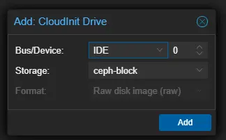

# Proxmox - Setup Debian Cloud-Init Templates

This post documents the steps needed to create a minified debian cloud image template, which you can easily clone, and have a running VM in seconds with no configuration needed.

This includes common packages, ssh-keys, IP information.

The end result of this project is...

1. You clone a template, and start it.
2. The cloned VM automatically starts up, updates itself, and starts running, with common packages installed, and your ssh details pre-configured.
3. A slimmed down distribution, without excess (My end result was a 400M image.)
4. No need to edit the VM after cloning, other then adding CPU/RAM, or other hardware as needed.

<!-- more -->

## Verbiage / Documentation

[Cloud-Init](https://cloud-init.io/){target=_blank} is a technology which allows you to clone a template, with customized user-settings. This is how you can spin up VMs in AWS in seconds.

[Debian Cloud Images](https://cloud.debian.org/images/cloud/){target=_blank}

These, are special images provided, which includes support for cloud-init. For this example, we will specifically be leveraging the "genericcloud" image, which is suitable for our VMs.

This- image does not include many bare metal hardware drivers, which aren't needed, since the focus of this post is creating a **VM** template.

[Proxmox Templates / Clones](https://pve.proxmox.com/wiki/VM_Templates_and_Clones){target=_blank} Documentation is here, if you wish to learn more.

## Getting Started

### Step 1. Acquire Cloud Image

From [Debian Official Cloud Images](https://cloud.debian.org/images/cloud/){target=_blank}, we want to select the [Bookworm](https://cloud.debian.org/images/cloud/bookworm/){target=_blank}/[Latest](https://cloud.debian.org/images/cloud/bookworm/latest/){target=_blank} folder at the bottom of the page.


Inside of this folder, is quite a few different files. 

We SPECIFICALLY want, the "genericcloud"-"amd64".qcow2 image. Its name is ["debian-12-genericcloud-amd64.qcow2"](https://cloud.debian.org/images/cloud/bookworm/latest/debian-12-genericcloud-amd64.qcow2){target=_blank}


!!! warning
    While- the above link DOES link to the image- I don't recommend blindly copying and pasting links from the internet.

We will now want to store this image on one of our proxmox nodes, in a temporary location.

``` bash
root@kube01:~/template# wget https://cloud.debian.org/images/cloud/bookworm/latest/debian-12-genericcloud-amd64.qcow2
...
2024-07-02 09:41:06 (15.7 MB/s) - ‘debian-12-genericcloud-amd64.qcow2’ saved [343378944/343378944]

root@kube01:~/template# ls -al
total 335344
drwxr-xr-x  2 root root      4096 Jul  2 09:40 .
drwx------ 10 root root      4096 Jul  2 09:40 ..
-rw-r--r--  1 root root 343378944 Jul  1 13:27 debian-12-genericcloud-amd64.qcow2
```

Keep this terminal open, we will come back to it in a bit.

### Step 2. Customize Image

At this point, we have a cloud init image. However, I personally like to customize my images, to install a few basic tools, as well as the qemu-guest-agent.

#### Install packages into the base image

You will need to install the `libguestfs-tools` package, via your package manager. If you don't wish to install the tools on your proxmox machine, feel free to customize the image on your desktop, a LXC, VM, etc.

``` bash
root@kube01:~/template# sudo apt-get install libguestfs-tools
```

Next- we can leverage [virt-customize](https://libguestfs.org/virt-customize.1.html){target=_blank} to customize our image.

I personally, install these utilities on most of my machines, so, I will include them into this template.

* curl
* wget
* nano
* rsync
* htop

At an absolute minimum though, we need to add the `qemu-guest-agent`

Place the packages names you would like, into the [virt-customize](https://libguestfs.org/virt-customize.1.html){target=_blank} command.

``` bash
root@kube01:~/template# virt-customize -a debian-12-genericcloud-amd64.qcow2 --install qemu-guest-agent,curl,wget,nano,rsync,htop
[   0.0] Examining the guest ...
[   8.8] Setting a random seed
virt-customize: warning: random seed could not be set for this type of
guest
[   8.9] Setting the machine ID in /etc/machine-id
[   8.9] Installing packages: qemu-guest-agent curl wget nano rsync htop
[  18.4] Finishing off
```

!!! info
    Please read the [Documentation](https://libguestfs.org/virt-customize.1.html){target=_blank} for virt-customize. There is far more functionality then just adding packages.

    I personally, rely on ansible to do the final provisioning, as such, I am only installing the bare minimum software.

#### (Optional) Fix DHCP Issue

By default, the cloud images uses the hostname as the DHCP identifier. This- works fine.... when it doesn't send the default template name for every cloned image.

A simple fix, is to just update the logic to use the hardware / mac address.

``` bash
root@kube01:~/cloud-init# virt-customize -a debian-12-genericcloud-amd64.qcow2 --run-command "sed -i 's|send host-name = gethostname();|send dhcp-client-identifier = hardware;|' /etc/dhcp/dhclient.conf"
[   0.0] Examining the guest ...
[   2.3] Setting a random seed
virt-customize: warning: random seed could not be set for this type of
guest
[   2.3] Setting the machine ID in /etc/machine-id
[   2.3] Running: sed -i 's|send host-name = gethostname();|send dhcp-client-identifier = hardware;|' /etc/dhcp/dhclient.conf
[   2.4] Finishing off
```

Want to learn more about this issue?

* <https://github.com/Telmate/terraform-provider-proxmox/issues/481>
* <https://forum.proxmox.com/threads/cloud-init-registering-dns-with-template-name.106726/>

For me- setting the dhcp-identifier to use the MAC address, works extremely well, as proxmox gives each clone a randomly generated MAC address when cloning.

#### Reset machine-id

One more step- we need to add a step to reset the machine-id. If this step is left out, machines will each acquire the same IP address when using DHCP (Regardless if your MAC is different)

``` bash
virt-customize -a debian-12-genericcloud-amd64.qcow2 --run-command "echo -n > /etc/machine-id"
```

#### (Optional) Compress and shrink the image

We can also use qemu-img to compress, and shrink the final image.

``` bash
root@kube01:~/template# qemu-img convert -O qcow2 -c -o preallocation=off debian-12-genericcloud-amd64.qcow2 debian-12-genericcloud-amd64-shrink.qcow2
root@kube01:~/template# qemu-img info debian-12-genericcloud-amd64-shrink.qcow2
image: debian-12-genericcloud-amd64-shrink.qcow2
file format: qcow2
virtual size: 16 GiB (17179869184 bytes)
disk size: 421 MiB
cluster_size: 65536
Format specific information:
    compat: 1.1
    compression type: zlib
    lazy refcounts: false
    refcount bits: 16
    corrupt: false
    extended l2: false
Child node '/file':
    filename: debian-12-genericcloud-amd64-shrink.qcow2
    protocol type: file
    file length: 422 MiB (442643456 bytes)
    disk size: 421 MiB
```

This- saved around 200M, which is pretty impressive when you consider the file was only 600M originally.

#### Commands used

Full commands used:
``` bash
# Install tools to manage images
apt-get install libguestfs-tools
# Install packages
virt-customize -a debian-12-genericcloud-amd64.qcow2 --install qemu-guest-agent,curl,wget,nano,rsync,htop
# Set DHCP-Identifier to use hardware address instead of hostname.
virt-customize -a debian-12-genericcloud-amd64.qcow2 --run-command "sed -i 's|send host-name = gethostname();|send dhcp-client-identifier = hardware;|' /etc/dhcp/dhclient.conf"
# Reset Machine-ID
virt-customize -a debian-12-genericcloud-amd64.qcow2 --run-command "echo -n > /etc/machine-id"
# Compress the image
qemu-img convert -O qcow2 -c -o preallocation=off debian-12-genericcloud-amd64.qcow2 debian-12-genericcloud-amd64-shrink.qcow2
```

At this point, we should have a suitable base image.

### Step 3. Create a VM

Now that we have a suitable image, we need to build a base VM template. I will be doing this step through the GUI.


For the general tab, give a name which implies this is a template.

I also have a template source pool, and tag I assigned. But, this is optional.

Finally- I set a shutdown timeout of 5 minutes. This- is also optional.


For the OS Tab- click "don't use any media". No other changes are needed here.


On the system tab, I enabled the checkbox for Qemu-Agent.


On the disks tab, you will want to REMOVE the default disks. We will add disks later.


For CPU / Memory tab- just set whatever defaults you want.

I chose 2 CPU cores, x86-64-v2-AES on the type as its easily compatible with all of my nodes.

For memory, I allocated 1024G of ram, and disabled ballooning. Remember- we will clone this template for creating VMs, and adjust the CPU/RAM there.

For network, I chose my default vlan interface, where I typically create new nodes. I did select firewall.


On the confirm tab- don't select start after created.


### Step 4. Attach qcow2 image to VM

Next, we will attach the .qcow2 image we downloaded earlier. 

Skip back into the terminal / ssh session from the first step.

Grab the ID from the VM we just created. Alternatively, you can find it via the CLI of the host you created it on.

``` bash
root@kube01:~/template# qm list
      VMID NAME                 STATUS     MEM(MB)    BOOTDISK(GB) PID
       139 DebianCloudInitTemplate stopped    1024               0.00 0
```

Next, attach it, using `qm importdisk $VM_ID $IMAGEPATH $YOUR_STORAGE`

I want to store my template on my ceph-cluster, which is named `ceph-block`

``` bash
root@kube01:~/template# qm importdisk 139 debian-12-genericcloud-amd64.qcow2 ceph-block
importing disk 'debian-12-genericcloud-amd64.qcow2' to VM 139 ...
transferred 0.0 B of 16.0 GiB (0.00%)
transferred 20.7 MiB of 16.0 GiB (1.01%)
...
transferred 2.0 GiB of 16.0 GiB (99.60%)
transferred 2.0 GiB of 16.0 GiB (100.00%)
Successfully imported disk as 'unused0:ceph-block:vm-139-disk-0'
root@kube01:~/template#
```


### Step 6. Template Tweaks

Lets go back to the VM in the GUI now.

#### Hardware Tab

Remove the CD/DVD drive (Unless- you need one.)


Attach the disk we created from the qcow2.

1. Click on the unused disk, then click edit. Set Bus/Device to "VirtIO Block" as position 0
2. I also like to set write back cache. However, this is optional.
3. Click Add.


Next- Click Add -> CloudInit Device


Select your storage. I leave IDE selected as the default bus.



Click Add.

If, you plan on using UEFI, you can also add an EFI disk at this step.


#### Cloud Init Tab

Now- we can customize the cloud init tab, with a default user, password (if desired), dns,ip, and ssh information.

Since, I use ansible to provision, and prepare all of my machines- My cloudinit is specific to allow it to log in.

Once it runs, it will automatically remove the temporary accounts, configure SSH, NTP, DNS, static IP options, etc.

But- the key here is, for its initial login, it can log into VMs cloned from this template, using the username "temp" with ansible's public key.

For the IP Config, I set dhcp as the default.


#### Options Tab

Under options, there are a few things we will need to customize.

First up- Boot order.

I always uncheck network boot, since I don't use it. As well, make sure to unselect the cloudinit drive. 

We only want the primary disk, containing our cloned qcow2 selected here.


### Script containing image customizations

Here is the list of CLI commands used to download, and customize the image.

``` bash
# The ID of the Template/VM.
VM_ID=139
# Desired proxmox storage for the new image.
STORAGE="ceph-block"

# Download Image
wget https://cloud.debian.org/images/cloud/bookworm/latest/debian-12-genericcloud-amd64.qcow2
# Install tools to manage images
apt-get install libguestfs-tools
# Install packages
virt-customize -a debian-12-genericcloud-amd64.qcow2 --install qemu-guest-agent,curl,wget,nano,rsync,htop
# Set the DHCP client identifier to use hardware address.
virt-customize -a debian-12-genericcloud-amd64.qcow2 --run-command "sed -i 's|send host-name = gethostname();|send dhcp-client-identifier = hardware;|' /etc/dhcp/dhclient.conf"
# Reset Machine-ID
virt-customize -a debian-12-genericcloud-amd64.qcow2 --run-command "echo -n > /etc/machine-id"
# Compress the image
qemu-img convert -O qcow2 -c -o preallocation=off debian-12-genericcloud-amd64.qcow2 debian-12-genericcloud-amd64-shrink.qcow2
# Import the image to our template.
qm importdisk $VM_ID debian-12-genericcloud-amd64-shrink.qcow2 $STORAGE
```

#### Final touches?

I personally, like customizing a default set of sane firewall rules for my VMs. However- this is completely optional, and up to you.

As a good example, I have a firewall rule defined at the data center level, for only allowing ssh access, for known, good hosts.

Here- is my personal starting point for firewall rules.


If you do plan on including firewall rules, make sure to enable "Firewall" under Firewall -> Options. It is not enabled by default.


### Step 6. Convert to template

This step is questionably optional, because you don't need to convert this to a template, in order to clone it.

!!! info
    If you wish to use a linked-clone, you DO need to convert your VM to a template.

!!! warning
    Without converting to a template, you will need to change the MAC address for every clone.

    (aka, you should make this a template, if you plan on cloning it)

To convert this to a template- Right click on the VM, and select, Convert to template.


After you have converted it to a template, you will no longer be able to start/stop or snapshot this machine. You would need to clone it first, and then start the clone.


One final configuration item- Edit the network interface on your template. Ensure its MAC Address to `00:00:00:00:00:00` (This will cause a random MAC address to be generated for every new clone)


!!! warning
    If you miss this step- all of your cloned VMs will have the same MAC address.

    This, will likely cause a lot of problems. Make sure to do this step!


## The final result

### Clone

Now- just clone the template, and voila- you will have a patched up debian machine ready for your workloads.

Right click the template (or VM, if you didn't convert to a template), and select Clone.


Select a target node and a new name for your new VM.

Next- the Mode dialog has a few options.

[Proxmox - Documentation for cloning](https://pve.proxmox.com/wiki/VM_Templates_and_Clones){target=_blank}

The TLDR;

IF you use a linked clone, your new VM only needs to store the "changes" from the base-template's image. These- can only be done to templates.

A full clone, is exactly that. Its a full clone. You can full clone VMs or templates.

!!! info
    If you don't have cluster-wide, reliable, shared storage for all of your nodes, I recommend using a full clone. 

    The linked clone, **MUST** remain on the same storage as the original template.

    The cloned VMs REQUIRES the image from the template.

!!! info
    Linked clones are implemented in the storage itself. So- you must have supported storage to use linked-clones.

    Per [The Documentation](https://pve.proxmox.com/wiki/VM_Templates_and_Clones){target=_blank}

    Linked Clones works for theses storages: files in raw, qcow2, vmdk format (either on local storage or nfs); LVM-thin, ZFS, rbd, sheepdog, nexenta.

    It's not supported with LVM & ISCSI storage.

If- you try to delete the image used by a linked clone, you will get this:


For this- I will be using a linked clone, as I leverage my [Ceph Cluster](./../2023/2023-08-08-proxmox-ceph.md){target=_blank} for cluster-wide storage.


After you have performed your changes, click Clone.

### Execute

Once you start your VM, it will automatically start the process of downloading updates, and configuring itself.


And- lastly, you will be left, with a login prompt.


If- you followed through with the step to update the base-image, to add qemu-guest-agent, you will also be able to see IP details via the proxmox web interface.


Lastly- since we specified the username, and ssh-keys via the CloudInit, we can also log into this VM.

``` bash
root@Ansible ~/Ansible# ssh temp@10.100.5.157
Linux my-new-vm 6.1.0-22-cloud-amd64 #1 SMP PREEMPT_DYNAMIC Debian 6.1.94-1 (2024-06-21) x86_64

The programs included with the Debian GNU/Linux system are free software;
the exact distribution terms for each program are described in the
individual files in /usr/share/doc/*/copyright.

Debian GNU/Linux comes with ABSOLUTELY NO WARRANTY, to the extent
permitted by applicable law.
```

And- all of our additional packages are installed.

``` bash
temp@my-new-vm:~$ which htop
/usr/bin/htop
temp@my-new-vm:~$ which nano
/usr/bin/nano
temp@my-new-vm:~$ which curl
/usr/bin/curl
```

## Other Notes

### Ceph- Editing disks after converting to template

If you edit the disks after converting them to a template. The new disks will not be properly flagged as "base".

To fix this, convert your template back into a VM.

``` bash
nano /etc/pve/qemu-server/139.conf

#Set template=1, to template=0
```

Then, once your GUI reflects the changes, convert the VM back into a template again.


### Patching linked clones through template

If- you are thinking of creating a template, spinning up linked clones, and patching the base template- this method isn't ideal for doing that.

### Ceph - Space Usage of Linked Clone vs Full Clone

Looking at ceph- my base image is only using 1.3G of total disk space. 


If- we look at a VM cloned using Full Clone- we can see, it is using 1.4G of disk space. The parent field is also empty (as it was a full copy)


Looking at a disk from a Linked clone, we can see, it is also using 1.3/1.4G of disk space, but, you can see the "layering" feature is enabled, and it has a parent specified.


Now- you might be saying- That doesn't sound right at all.

And, I would agree. I would assume it is working as intended. But- I am out of time to determine how to find the actual child's usage over the parent.

``` bash
# Get base image children.
root@kube01:~# rbd children  ceph-block/base-139-disk-0
ceph-block/vm-141-disk-0
# Get base image details
root@kube01:~# rbd info  ceph-block/base-139-disk-0
rbd image 'base-139-disk-0':
        size 16 GiB in 4096 objects
        order 22 (4 MiB objects)
        snapshot_count: 1
        id: 773ac59ea6a2db
        block_name_prefix: rbd_data.773ac59ea6a2db
        format: 2
        features: layering, exclusive-lock, object-map, fast-diff, deep-flatten
        op_features:
        flags:
        create_timestamp: Tue Jul  2 16:56:02 2024
        access_timestamp: Tue Jul  2 17:00:41 2024
        modify_timestamp: Tue Jul  2 16:56:02 2024
# Get image details for the specific snapshot the child is using
root@kube01:~# rbd info ceph-block/base-139-disk-0@__base__
rbd image 'base-139-disk-0':
        size 16 GiB in 4096 objects
        order 22 (4 MiB objects)
        snapshot_count: 1
        id: 773ac59ea6a2db
        block_name_prefix: rbd_data.773ac59ea6a2db
        format: 2
        features: layering, exclusive-lock, object-map, fast-diff, deep-flatten
        op_features:
        flags:
        create_timestamp: Tue Jul  2 16:56:02 2024
        access_timestamp: Tue Jul  2 17:00:41 2024
        modify_timestamp: Tue Jul  2 16:56:02 2024
        protected: True
# Get child image details.
root@kube01:~# rbd info  ceph-block/vm-141-disk-0
rbd image 'vm-141-disk-0':
        size 16 GiB in 4096 objects
        order 22 (4 MiB objects)
        snapshot_count: 0
        id: 7744398791b79f
        block_name_prefix: rbd_data.7744398791b79f
        format: 2
        features: layering, exclusive-lock, object-map, fast-diff, deep-flatten
        op_features:
        flags:
        create_timestamp: Tue Jul  2 17:12:12 2024
        access_timestamp: Tue Jul  2 17:12:12 2024
        modify_timestamp: Tue Jul  2 17:12:12 2024
        parent: ceph-block/base-139-disk-0@__base__
        overlap: 16 GiB
```

### How to add disk-space after cloning?

Easy- Add the disk space via proxmox. 

Then- you can take one of two paths.

#### Reboot the system

The debian cloud templates will automatically resize during boot.

Just- add disk space, and reboot.

``` bash
[    6.697063] EXT4-fs (vda1): resizing filesystem from 4161531 to 20938747 blocks
[    6.813343] EXT4-fs (vda1): resized filesystem to 20938747
```

#### Using growpart- no reboot needed.

SSH into the VM, and run `growpart`

``` bash
temp@test:~$ lsblk
NAME    MAJ:MIN RM  SIZE RO TYPE MOUNTPOINTS
sr0      11:0    1    4M  0 rom
vda     254:0    0   32G  0 disk
|-vda1  254:1    0 15.9G  0 part /
|-vda14 254:14   0    3M  0 part
`-vda15 254:15   0  124M  0 part /boot/efi
root@test:/home/temp# growpart /dev/vda 1
CHANGED: partition=1 start=262144 old: size=33292255 end=33554398 new: size=66846687 end=67108830
root@test:/home/temp# lsblk
NAME    MAJ:MIN RM  SIZE RO TYPE MOUNTPOINTS
sr0      11:0    1    4M  0 rom
vda     254:0    0   32G  0 disk
|-vda1  254:1    0 31.9G  0 part /
|-vda14 254:14   0    3M  0 part
`-vda15 254:15   0  124M  0 part /boot/efi
```


### Help, all of my machines are getting the same IP address from DHCP.

Edit the hardware of your template. Set the Network Device's MAC address to `00:00:00:00:00:00`

New machines will receive a random mac address.

(If- you missed the step above, and you have already cloned a dozen machines, you can "clear" the mac address field of the VMs NIC(s),  and a new address will be automatically configured.)