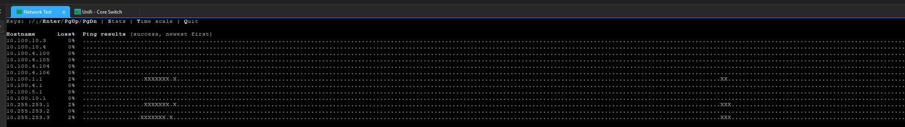
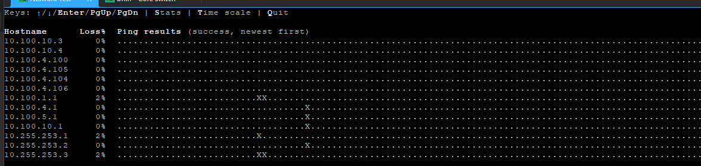
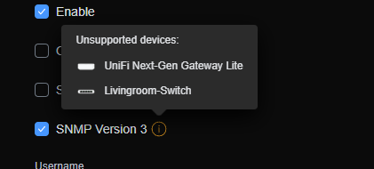
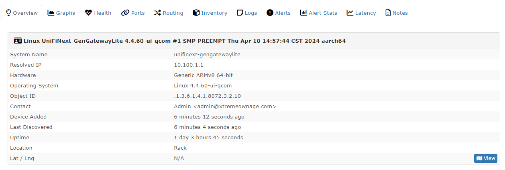

# Detecting a weird packet loss issue.

So- I recently installed a [Quad 100G Mikrotik CRS504-4XQ-IN Router](https://amzn.to/3Ll3sTa){target=_blank} into my lab recently, and moved my rack, and SFFs over to 100G NICs.

Around the time I did this- I also started experiencing tons of random, hard to pinpoint instances of latency across my network.

I validated flow-control was enabled for the network- and I checked various port counters to look for errors.

This- issue took me around a week or two to finally pinpoint.... this post- is going through a bit of the steps taken.


### Starting at the Mikrotik

``` bash
[admin@sw-100g] > /interface print stats
Flags: R - RUNNING; S - SLAVE
Columns: NAME, RX-BYTE, TX-BYTE, RX-PACKET, TX-PACKET, RX-DROP, TX-DROP, TX-QUEUE-DROP, RX-ERROR, TX-ERROR
 #    NAME                  RX-BYTE            TX-BYTE      RX-PACKET      TX-PACKET  RX-DROP  TX-DROP  TX-QUEUE-DROP  RX-ERROR  TX-ERROR
 0 R  ether1            201 163 444      3 040 455 588      2 264 797      2 543 603        0        0              1         0         0
;;; Kube01: 100G
 1 RS qsfp28-1-1  2 969 461 776 402  3 316 576 813 413  1 381 885 242  1 640 058 300                               26                    
 2    qsfp28-1-2                  0                  0              0              0                                0                    
 3    qsfp28-1-3                  0                  0              0              0                                0                    
 4    qsfp28-1-4                  0                  0              0              0                                0                    
;;; Kube02: 100G
 5 RS qsfp28-2-1  2 740 746 241 766  3 137 569 536 280  1 741 858 272  1 520 825 302                                0                    
 6    qsfp28-2-2                  0                  0              0              0                                0                    
 7    qsfp28-2-3                  0                  0              0              0                                0                    
 8    qsfp28-2-4                  0                  0              0              0                                0                    
;;; Kube05: 100G
 9 RS qsfp28-3-1  4 152 472 555 949  3 509 013 890 640  2 125 952 515  2 224 145 002                                0                    
10    qsfp28-3-2                  0                  0              0              0                                0                    
11    qsfp28-3-3                  0                  0              0              0                                0                    
12    qsfp28-3-4                  0                  0              0              0                                0                    
;;; Uplink: Core Switch Port 26
13 RS qsfp28-4-1    128 030 532 966    173 290 502 219    122 095 521    150 966 404                              486                    
14    qsfp28-4-2                  0                  0              0              0                                0                    
15    qsfp28-4-3                  0                  0              0              0                                0                    
16    qsfp28-4-4                  0                  0              0              0                                0                    
17 R  bridge1                     0            541 473              0          3 139        0        0              0         0         0
18 R  lo                  1 051 258          1 051 258          6 252          6 252        0        0              0         0         0
;;; V_SERVER
19 R  vlan4                       0            538 162              0          3 124        0        0              0         0         0
```

While there are a few TX drops on the uplink port going back to my Unifi USW-24-PRO core switch, 486 out of the millions of packets- isn't very concerning. Since, I updated all of the firmware for my switches, and routers yesterday- that is likely the cause of those drops.

Having- had lots of issues with STP / RSTP in the past- I decided to check the logs for flapping interfaces.

``` bash
[admin@sw-100g] > /interface print stats
 07-10 06:42:50 bridge,stp qsfp28-4-1:0 learning
 07-10 06:42:50 bridge,stp qsfp28-4-1:0 forwarding
 07-10 06:42:50 bridge,stp qsfp28-4-1:0 TCHANGE start
 07-10 06:42:50 bridge,info hardware offloading activated on bridge "bridge1" ports: qsfp28-4-1,qsfp28-3-1,qsfp28-1-1,qsfp28-2-1
 07-10 06:42:53 bridge,stp qsfp28-4-1:0 TCHANGE over
 07-10 06:42:53 bridge,stp qsfp28-3-1:0 learning
 07-10 06:42:53 bridge,stp qsfp28-3-1:0 forwarding
 07-10 06:42:53 bridge,stp qsfp28-1-1:0 learning
 07-10 06:42:53 bridge,stp qsfp28-1-1:0 forwarding
 07-10 06:42:53 bridge,stp qsfp28-2-1:0 learning
 07-10 06:42:53 bridge,stp qsfp28-2-1:0 forwarding
 07-10 13:07:40 interface,info qsfp28-4-1 link down
 07-10 13:07:40 interface,info qsfp28-4-1 link up (speed 10G, full duplex)
 07-10 13:07:40 bridge,stp qsfp28-4-1:0 becomes Designated
 07-10 13:07:41 bridge,stp qsfp28-4-1:0 becomes Root
 07-10 13:07:41 bridge,stp qsfp28-4-1:0 learning
 07-10 13:07:41 bridge,stp qsfp28-4-1:0 forwarding
 07-10 13:07:41 bridge,stp qsfp28-4-1:0 TCHANGE start
 07-10 13:07:43 bridge,stp qsfp28-4-1:0 TCHANGE over
 07-10 17:10:35 interface,info qsfp28-4-1 link down
 07-10 17:10:38 interface,info qsfp28-4-1 link up (speed 10G, full duplex)
 07-10 17:10:38 bridge,stp qsfp28-4-1:0 becomes Designated
 07-10 17:10:38 bridge,stp qsfp28-4-1:0 becomes Root
 07-10 17:10:38 bridge,stp qsfp28-4-1:0 learning
 07-10 17:10:38 bridge,stp qsfp28-4-1:0 forwarding
 07-10 17:10:38 bridge,stp qsfp28-4-1:0 TCHANGE start
 07-10 17:10:40 bridge,stp qsfp28-4-1:0 TCHANGE over
```

Note- most of the events you see above- was due to me changing around parameters. I did notice a high amount of RX-Pauses, and decided to see if toggling flow-control off would do anything of value. (It didn't)

After- not finding anything really of use- I decided to try a few difference approaches....

### Multi-Ping (Python)

After digging down quite a few rabbit holes, I started running [Python- multi-ping-ext](https://pypi.org/project/ping-multi-ext/){target=_blank}. This- is a simple python project, which pings multiple hosts at the same time, and keeps track of latency and failures.

And- it didn't take long for it to spot the issues.




For back-story, my network has 4 different routers, handling various pieces.

All of my 1G networking, is routed via the UXG-Lite (10.100.1.1, 10.255.253.1)

Most of my 10G networking, is routed by the USW-24-PRO (10.255.253.2)

10.255.253.3, is one of my internal routers for various 10G subnets. BUT- for traffic to reach it, it typically goes through the UXG-Lite, due to... Unifi's crappy layer 3 switch support.

The next question..... Where is this packet loss coming from? 

### Starting at the USW-24

Since- Unifi gives basically no details of use via the GUI / Interface, lets dig into the switch itself.

``` 
(UBNT) #show interface ethernet all

Port      Bytes Tx         Bytes Rx         Packets Tx       Packets Rx       Utilization Tx (%)   Utilization Rx (%)
------    --------         --------         ----------       ----------       ------------------   ------------------
0/1       45309732962      78659561832      50079930         67805477         1                   12
0/2       53058446789      1779656951       47792959         9648488          0                   0
0/3       38979425716      39846249001      51526480         51914192         0                   0
0/4       1173970958       174831946        2073311          1073446          0                   0
0/5       8343943807       109783344193     18746036         76815417         0                   0
0/6       24066682019      537929824        16833100         1724027          0                   0
0/7       0                0                0                0                0                   0
0/8       0                0                0                0                0                   0
0/9       0                0                0                0                0                   0
0/10      95260623684      141818291159     102760702        128171969        1                   13
0/11      0                0                0                0                0                   0
0/12      0                0                0                0                0                   0
0/13      4861040          1268167          57094            17508            0                   0
0/14      29821762         22472576         175979           47169            0                   0
0/15      0                0                0                0                0                   0
0/16      4799011          1204238          56230            16791            0                   0
0/17      48800564         665190853        501605           566173           0                   0
0/18      50779467155      3861213785       40912085         14892259         11                  0
0/19      0                0                0                0                0                   0
0/20      0                0                0                0                0                   0
0/21      0                0                0                0                0                   0
0/22      320095833288     61377643284      284889253        183029549        3                   0
0/23      6988361559       256695727474     102007331        200475378        0                   2
0/24      37968718630      13602255975      57136717         41141882         0                   0
0/25      23447404365      23682097617      18507312         22317363         1                   0
0/26      399311466370     371416678133     331286549        322562623        0                   0
3/1       98368179751      80439218783      97872889         77453965         0                   6
3/2       32410625826      110321274017     35579136         78539444         0                   0
```

Looking at the specific interface for the UXG-Lite, does not show anything of concern either.

```
(UBNT) #show interface 0/10

Packets Received Without Error................. 128826893
Packets Received With Error.................... 0
Broadcast Packets Received..................... 91668
Receive Packets Discarded...................... 18
Packets Transmitted Without Errors............. 103061722
Transmit Packets Discarded..................... 54
Transmit Packet Errors......................... 0
Collision Frames............................... 0
Number of link down events..................... 0
Load Interval.................................. 300
Bits Per Second Received....................... 120304808
Bits Per Second Transmitted.................... 15672624
Packets Per Second Received.................... 10643
Packets Per Second Transmitted................. 3365
Percent Utilization Received................... 12%
Percent Utilization Transmitted................ 1%
Time Since Counters Last Cleared............... 1 day 0 hr 59 min 11 sec
```

Really- nothing of value to see....

### UXG-Lite

Nearly instantly, after looking at the port counters- the issue was very clear.

The primary bridge appears to be dropping tons of packets.

``` bash
root@UniFiNext-GenGatewayLite:~# netstat --statistics
Ip:
    Forwarding: 1
    29023746 total packets received
    25114294 forwarded
    0 incoming packets discarded
    3747325 incoming packets delivered
    29195929 requests sent out
    1709 outgoing packets dropped
    44 dropped because of missing route
    15 reassemblies required
    5 packets reassembled ok
    1 fragments failed
Icmp:
    995633 ICMP messages received
    17 input ICMP message failed
    ICMP input histogram:
        destination unreachable: 259
        echo requests: 826570
        echo replies: 168804
    1080204 ICMP messages sent
    0 ICMP messages failed
    ICMP output histogram:
        destination unreachable: 80875
        redirect: 3819
        echo requests: 168940
        echo replies: 826570
IcmpMsg:
        InType0: 168804
        InType3: 259
        InType8: 826570
        OutType0: 826570
        OutType3: 80875
        OutType5: 3819
        OutType8: 168940
Tcp:
    78978 active connection openings
    31357 passive connection openings
    36080 failed connection attempts
    3 connection resets received
    3 connections established
    2494553 segments received
    2540942 segments sent out
    337 segments retransmitted
    0 bad segments received
    37405 resets sent
Udp:
    142428 packets received
    116282 packets to unknown port received
    370 packet receive errors
    507393 packets sent
    370 receive buffer errors
    0 send buffer errors
    IgnoredMulti: 3072
UdpLite:
TcpExt:
    41567 TCP sockets finished time wait in fast timer
    67157 delayed acks sent
    7842 delayed acks further delayed because of locked socket
    Quick ack mode was activated 244 times
    4061 packets directly queued to recvmsg prequeue
    1405 bytes directly in process context from backlog
    TCPDirectCopyFromPrequeue: 16537
    950638 packet headers predicted
    4 packet headers predicted and directly queued to user
    422349 acknowledgments not containing data payload received
    576758 predicted acknowledgments
    TCPDSACKUndo: 3
    12 congestion windows recovered without slow start after partial ack
    1 retransmits in slow start
    TCPTimeouts: 52
    TCPLossProbes: 253
    TCPLossProbeRecovery: 2
    TCPDSACKOldSent: 244
    TCPDSACKRecv: 221
    TCPDSACKIgnoredNoUndo: 115
    TCPSpuriousRTOs: 1
    TCPSackShiftFallback: 1
    IPReversePathFilter: 3261
    TCPRcvCoalesce: 44097
    TCPOFOQueue: 294
    TCPSpuriousRtxHostQueues: 17
    TCPAutoCorking: 1185
    TCPSynRetrans: 107
    TCPOrigDataSent: 1469084
    TCPHystartTrainDetect: 4
    TCPHystartTrainCwnd: 66
    TCPACKSkippedSeq: 10
IpExt:
    InNoRoutes: 2524
    InMcastPkts: 16772
    OutMcastPkts: 34423
    InBcastPkts: 21278
    OutBcastPkts: 17548
    InOctets: 24232842554
    OutOctets: 45517272843
    InMcastOctets: 1118364
    OutMcastOctets: 1828988
    InBcastOctets: 1251369
    OutBcastOctets: 567758
    InNoECTPkts: 32780595
    InECT1Pkts: 9
    InECT0Pkts: 2296
    InCEPkts: 2
```

``` bash
root@UniFiNext-GenGatewayLite:~# netstat -i
Kernel Interface table
Iface      MTU    RX-OK RX-ERR RX-DRP RX-OVR    TX-OK TX-ERR TX-DRP TX-OVR Flg
br0       1500   176609      0  18411 0        238268      0      0      0 BMRU
br13      1500     4191      0      0 0          2580      0      0      0 BMRU
eth0      1500 107188671      0     88 415    135637148      0    519      0 BMRU
eth1      1500 45873230      0      3 0      16769419      0      0      0 BMRU
```


``` bash
root@UniFiNext-GenGatewayLite:~# ip -s link show br0
13: br0: <BROADCAST,MULTICAST,UP,LOWER_UP> mtu 1500 qdisc noqueue state UP mode DEFAULT group default qlen 1000
    link/ether d8:b3:70:8d:e8:b4 brd ff:ff:ff:ff:ff:ff
    RX: bytes  packets  errors  dropped missed  mcast
    44763888   177339   0       18520   0       0
    TX: bytes  packets  errors  dropped carrier collsns
    78755044   238774   0       0       0       0
```

br0 is the primary interface which receives incoming traffic. Given, its high packet loss- this certainly explains the random latency, and disconnects.

The amount of current throughput, isn't very high- under 100Mbit/s.

``` bash
top - 19:45:13 up 1 day,  1:54,  1 user,  load average: 2.82, 2.38, 2.30
Tasks: 144 total,   1 running, 143 sleeping,   0 stopped,   0 zombie
%Cpu(s): 11.2 us,  4.2 sy,  0.0 ni, 73.2 id,  0.0 wa,  2.2 hi,  9.2 si,  0.0 st
MiB Mem :    974.1 total,    172.7 free,    261.1 used,    540.3 buff/cache
MiB Swap:    768.0 total,    761.1 free,      6.9 used.    530.4 avail Mem

    PID USER      PR  NI    VIRT    RES    SHR S  %CPU  %MEM     TIME+ COMMAND
   2165 root       5 -15  115492  23928  16488 S  18.0   2.4 127:56.77 ubios-udapi-ser
      3 root      20   0       0      0      0 S   7.4   0.0  63:56.26 ksoftirqd/0
   2729 root       5 -15  671156   7360   2232 S   3.2   0.7  47:30.15 utmdaemon
  50759 root       5 -15  380824  35984  22152 S   1.3   3.6  11:34.95 dpi-flow-stats
2083016 root      20   0    8920   3500   2728 R   1.0   0.4   0:00.26 top
   3284 root      20   0  101796  16896   9444 S   0.6   1.7  31:51.49 mcad
   3380 root      20   0  169904  12240   8784 S   0.6   1.2  29:59.01 exe
   1836 root      20   0   25060   9744   8272 S   0.3   1.0   5:09.99 utermd
  51799 root       5 -15   43288    744    644 S   0.3   0.1   0:22.12 dpinger
2062438 root      20   0   14928   7308   6160 S   0.3   0.7   0:00.59 sshd
2064428 root      20   0       0      0      0 D   0.3   0.0   0:00.72 kworker/u4:3
```

Top, shows current load average, is pretty high- but, not overwhelming.

``` bash

root@UniFiNext-GenGatewayLite:~# ethtool -a eth0
Pause parameters for eth0:
Autonegotiate:  on
RX:             off
TX:             off
RX negotiated:  off
TX negotiated:  off
```

Looks like flow-control is disabled by default too. So, as a test- I decided to enable it.

`ethtool -A eth0 rx on tx on`

While- this decreased the amount of packet drops, and the frequency- this did not correct the issue.

Looking through the logs- I notice tons of processes complaining about executions taking too long.

``` bash
root@UniFiNext-GenGatewayLite:/var/log# tail -n 40 -f messages | grep execution
2024-07-10T19:50:10-05:00 UniFiNext-GenGatewayLite ubios-udapi-server[2165]: utils-daemon: Routine execution time of 1156ms exceeds expectations in io_context_ext (process-manager-child-exit post event)
2024-07-10T19:50:13-05:00 UniFiNext-GenGatewayLite ubios-udapi-server[2165]: utils-daemon: Routine execution time of 557ms exceeds expectations in io_context_ext (nl-neighbors-poll timer event)
2024-07-10T19:50:29-05:00 UniFiNext-GenGatewayLite ubios-udapi-server[2165]: utils-daemon: Routine execution time of 554ms exceeds expectations in io_context_ext (nl-neighbors-poll timer event)
2024-07-10T19:50:33-05:00 UniFiNext-GenGatewayLite ubios-udapi-server[2165]: utils-daemon: Routine execution time of 1047ms exceeds expectations in ubios-udapi-server (single_filter_observer<wan_failover_interfaces_iface_observer> action tunovpnc1)
2024-07-10T19:50:34-05:00 UniFiNext-GenGatewayLite ubios-udapi-server[2165]: utils-daemon: Routine execution time of 1034ms exceeds expectations in ubios-udapi-server (single_filter_observer<wan_failover_interfaces_iface_observer> action tunovpnc1)
2024-07-10T19:50:35-05:00 UniFiNext-GenGatewayLite ubios-udapi-server[2165]: utils-daemon: Routine execution time of 1075ms exceeds expectations in io_context_ext (process-manager-child-exit post event)
2024-07-10T19:50:45-05:00 UniFiNext-GenGatewayLite ubios-udapi-server[2165]: utils-daemon: Routine execution time of 1029ms exceeds expectations in io_context_ext (nl-neighbors-poll timer event)
2024-07-10T19:50:58-05:00 UniFiNext-GenGatewayLite ubios-udapi-server[2165]: utils-daemon: Routine execution time of 910ms exceeds expectations in ubios-udapi-server (single_filter_observer<wan_failover_interfaces_iface_observer> action tunovpnc1)
2024-07-10T19:50:59-05:00 UniFiNext-GenGatewayLite ubios-udapi-server[2165]: utils-daemon: Routine execution time of 931ms exceeds expectations in ubios-udapi-server (single_filter_observer<wan_failover_interfaces_iface_observer> action tunovpnc1)
2024-07-10T19:51:00-05:00 UniFiNext-GenGatewayLite ubios-udapi-server[2165]: utils-daemon: Routine execution time of 1001ms exceeds expectations in io_context_ext (process-manager-child-exit post event)
2024-07-10T19:51:01-05:00 UniFiNext-GenGatewayLite ubios-udapi-server[2165]: utils-daemon: Routine execution time of 634ms exceeds expectations in io_context_ext (nl-neighbors-poll timer event)
2024-07-10T19:51:17-05:00 UniFiNext-GenGatewayLite ubios-udapi-server[2165]: utils-daemon: Routine execution time of 752ms exceeds expectations in io_context_ext (nl-neighbors-poll timer event)
2024-07-10T19:51:23-05:00 UniFiNext-GenGatewayLite ubios-udapi-server[2165]: utils-daemon: Routine execution time of 1094ms exceeds expectations in ubios-udapi-server (single_filter_observer<wan_
```

More importantly, I noticed one of my OpenVPN clients was busy connecting over and over.

``` bash
2024-07-10T19:51:50-05:00 UniFiNext-GenGatewayLite ubios-udapi-server[2165]: process: Got process exit event for process openvpn-raw-1
2024-07-10T19:51:50-05:00 UniFiNext-GenGatewayLite ubios-udapi-server[2165]: openvpn: tunnel tunovpnc1 wasn't being tracked
2024-07-10T19:51:50-05:00 UniFiNext-GenGatewayLite ubios-udapi-server[2165]: signal-out-notifier: Sending to mcad: EVT_VPN_ClientDisconnected server on /vpn/openvpn/raws/1
2024-07-10T19:51:51-05:00 UniFiNext-GenGatewayLite ubios-udapi-server[2165]: signal-out-notifier: Sending to mcad: EVT_VPN_ClientConnecting server on /vpn/openvpn/raws/1
2024-07-10T19:51:51-05:00 UniFiNext-GenGatewayLite ubios-udapi-server[2165]: process: Watchdog will restart process openvpn-raw-1 in 20s
2024-07-10T19:52:11-05:00 UniFiNext-GenGatewayLite ubios-udapi-server[2165]: process: Watchdog is restarting throttled process openvpn-raw-1
2024-07-10T19:52:15-05:00 UniFiNext-GenGatewayLite ubios-udapi-server[2165]: process: Got process exit event for process openvpn-raw-1
2024-07-10T19:52:15-05:00 UniFiNext-GenGatewayLite ubios-udapi-server[2165]: openvpn: tunnel tunovpnc1 wasn't being tracked
2024-07-10T19:52:15-05:00 UniFiNext-GenGatewayLite ubios-udapi-server[2165]: signal-out-notifier: Sending to mcad: EVT_VPN_ClientDisconnected server on /vpn/openvpn/raws/1
2024-07-10T19:52:16-05:00 UniFiNext-GenGatewayLite ubios-udapi-server[2165]: signal-out-notifier: Sending to mcad: EVT_VPN_ClientConnecting server on /vpn/openvpn/raws/1
2024-07-10T19:52:16-05:00 UniFiNext-GenGatewayLite ubios-udapi-server[2165]: process: Watchdog will restart process openvpn-raw-1 in 20s
2024-07-10T19:52:37-05:00 UniFiNext-GenGatewayLite ubios-udapi-server[2165]: process: Watchdog is restarting throttled process openvpn-raw-1
2024-07-10T19:52:41-05:00 UniFiNext-GenGatewayLite ubios-udapi-server[2165]: process: Got process exit event for process openvpn-raw-1
2024-07-10T19:52:41-05:00 UniFiNext-GenGatewayLite ubios-udapi-server[2165]: openvpn: tunnel tunovpnc1 wasn't being tracked
2024-07-10T19:52:41-05:00 UniFiNext-GenGatewayLite ubios-udapi-server[2165]: signal-out-notifier: Sending to mcad: EVT_VPN_ClientDisconnected server on /vpn/openvpn/raws/1
2024-07-10T19:52:42-05:00 UniFiNext-GenGatewayLite ubios-udapi-server[2165]: signal-out-notifier: Sending to mcad: EVT_VPN_ClientConnecting server on /vpn/openvpn/raws/1
2024-07-10T19:52:42-05:00 UniFiNext-GenGatewayLite ubios-udapi-server[2165]: process: Watchdog will restart process openvpn-raw-1 in 20s
```

### The root cause 
I decided to pause the failing connection, and to troubleshoot it later.

Interesting enough- as soon as I paused it, I noticed a bunch of interesting.... updates.

Also- while  digging around, I noticed one of my DDNS clients was failing. I went ahead and fix it.


Afterwards, load dropped down to 1.5... and all noticable packet loss stopped.

``` bash
top - 20:35:47 up 1 day,  2:44,  1 user,  load average: 1.52, 1.56, 1.65
Tasks: 143 total,   1 running, 142 sleeping,   0 stopped,   0 zombie
%Cpu(s):  9.7 us,  7.2 sy,  0.0 ni, 76.8 id,  0.0 wa,  2.0 hi,  4.3 si,  0.0 st
MiB Mem :    974.1 total,    144.0 free,    264.9 used,    565.2 buff/cache
MiB Swap:    768.0 total,    761.4 free,      6.6 used.    525.7 avail Mem

    PID USER      PR  NI    VIRT    RES    SHR S  %CPU  %MEM     TIME+ COMMAND
   3284 root      20   0  101796  16896   9444 S   6.8   1.7  33:06.78 mcad
   2165 root       5 -15  117296  26396  16836 S   6.2   2.6 132:09.44 ubios-udapi-ser
   3380 root      20   0  169904  12240   8784 S   3.6   1.2  31:04.44 exe
   2729 root       5 -15  671156   7360   2232 S   2.9   0.7  48:56.65 utmdaemon
2122585 root      20   0    8908   3420   2660 R   1.0   0.3   0:00.14 top
      3 root      20   0       0      0      0 S   0.6   0.0  65:22.61 ksoftirqd/0
     13 root      rt   0       0      0      0 S   0.3   0.0   0:18.67 migration/1
   1085 root      20   0       0      0      0 S   0.3   0.0   0:08.40 jbd2/mmcblk0p4-
   1836 root      20   0   25060   9744   8272 S   0.3   1.0   5:19.49 utermd
  50759 root       5 -15  380824  35984  22152 S   0.3   3.6  11:59.51 dpi-flow-stats
2062438 root      20   0   14928   7312   6160 S   0.3   0.7   0:01.27 sshd
2063867 root      20   0       0      0      0 D   0.3   0.0   0:04.59 kworker/u4:0
2079918 root      20   0  260128  16256  13864 S   0.3   1.6   0:05.55 syslog-ng
2090876 root      20   0       0      0      0 S   0.3   0.0   0:02.57 kworker/u4:4
      1 root      20   0  100268  10128   7364 S   0.0   1.0   1:12.42 systemd
      2 root      20   0       0      0      0 S   0.0   0.0   0:00.11 kthreadd
      5 root       0 -20       0      0      0 S   0.0   0.0   0:00.00 kworker/0:0H
```

So- the root cause, was due to a single OpenVPN client spamming reconnect attempts, and a DDNS client which was spamming retries.

## Next steps? Enable SNMP on the UXG-Lite (Unsupported)

!!! warn
    Note- installing software on the UXG-lite is unsupported.
    Firmware updates will likely remove any customizations you perform.

I have [libreNMS](https://www.librenms.org/){target=_blank} already running for every OTHER network device... EXCEPT the uxg-lite.



But- you know what? There is nothing special about the UXG-Lite. Its just an embedded system running a customized verison of debian.

Don't believe me? Look for yourself.

``` bash
root@UniFiNext-GenGatewayLite:/etc/snmp# cd ~
root@UniFiNext-GenGatewayLite:~# cat /etc/os-release
PRETTY_NAME="Debian GNU/Linux 11 (bullseye)"
NAME="Debian GNU/Linux"
VERSION_ID="11"
VERSION="11 (bullseye)"
VERSION_CODENAME=bullseye
ID=debian
HOME_URL="https://www.debian.org/"
SUPPORT_URL="https://www.debian.org/support"
BUG_REPORT_URL="https://bugs.debian.org/"
```

So- I'm going to enable SNMP on this thing.

What is interesting- there is a snmp.conf on the base image.

``` bash
root@UniFiNext-GenGatewayLite:/etc/snmp# ls -al
total 5
drwxr-xr-x 2 root root   32 Aug 15  2022 ./
drwxrwxr-x 1 root root 4096 Jul 10 20:31 ../
-rw-r--r-- 1 root root  510 Aug 15  2022 snmp.conf
root@UniFiNext-GenGatewayLite:/etc/snmp# cat /etc/snmp/snmp.conf
# As the snmp packages come without MIB files due to license reasons, loading
# of MIBs is disabled by default. If you added the MIBs you can reenable
# loading them by commenting out the following line.
mibs :

# If you want to globally change where snmp libraries, commands and daemons
# look for MIBS, change the line below. Note you can set this for individual
# tools with the -M option or MIBDIRS environment variable.
#
# mibdirs /usr/share/snmp/mibs:/usr/share/snmp/mibs/iana:/usr/share/snmp/mibs/ietf
```

Although, there are no snmp services, or daemons. I was unable to locate snmpd binaries either. So, I installed it.

``` bash
root@UniFiNext-GenGatewayLite:/etc/snmp# apt-get install snmpd
Reading package lists... Done
Building dependency tree... Done
Reading state information... Done
Suggested packages:
  snmptrapd
The following NEW packages will be installed:
  snmpd
0 upgraded, 1 newly installed, 0 to remove and 36 not upgraded.
Need to get 56.7 kB of archives.
After this operation, 142 kB of additional disk space will be used.
Get:1 https://deb.debian.org/debian bullseye/main arm64 snmpd arm64 5.9+dfsg-4+deb11u1 [56.7 kB]
Fetched 56.7 kB in 0s (165 kB/s)
Preconfiguring packages ...
Selecting previously unselected package snmpd.
(Reading database ... 24527 files and directories currently installed.)
Preparing to unpack .../snmpd_5.9+dfsg-4+deb11u1_arm64.deb ...
Unpacking snmpd (5.9+dfsg-4+deb11u1) ...
Setting up snmpd (5.9+dfsg-4+deb11u1) ...
adduser: Warning: The home directory `/var/lib/snmp' does not belong to the user you are currently creating.
Created symlink /etc/systemd/system/multi-user.target.wants/snmpd.service → /lib/systemd/system/snmpd.service.
```

After installing SNMPD, I modified the config file, and restarted the service.

``` bash
root@UniFiNext-GenGatewayLite:/etc/snmp# vi snmpd.conf
root@UniFiNext-GenGatewayLite:/etc/snmp# systemctl restart snmpd.service
```

And, afterwards, I was able to add it directly into LibreNMS without any issues.



Now- I can centerally report on its stats, performance, and packet loss.

Sure- it might get erased during the next firmware update- but, nothing an ansible playbook can't fix automatically.

## Why was this issue so hard to pinpoint?

### Reason #1- My UXG-Lite does not "SUPPORT" snmp to export data back to a central location. Have its data, in LibreNMS, would have made it much easier to pinpoint the exact location.
- This- was corrected by manually installing SNMP, and configuring it.
- As well- I created an ansible playbook to handle automatically reinstalling, and reconfiguring it when I do firmware updates.


### Reason #2- I have a overly complex network, with 7 switches, and 4 routers.

#### A large reason for this- is performance-based.
- 1G clients can easily use the UXG as a gateway.
- 10G clients, would limited to 1G MAX throughput by the UXG- so, their gateway is the 10G Layer 3 USW-Pro-24
    - Unifi's layer-3 support on switches is still, a laughable joke. Still, no IPv6 support. Can only add TWO static routes on a USW "PRO" switch. (Enterprise doesn't have this weird limitation)
- 100G clients, would also be bottlenecked when routing across the 10G. These client's use the Mikrotik for routing. It can do hardware asic routing, and can handle line-speed 100G with hardware offload.

#### Another reason- is reliability-oriented.

One goal of mine- is even when the internet is completely out, and backup circuits are unavailable- my entire network should continue to function normally.

Rather then making the internet-facing UXG-Lite router the "Center" of my network, I prefer to think of it as being just another component on the edge. 

#### Security Concerns.

While- the Unifi interface is nice, easy and simple. It does not have supported for getting intricuite with firewall rules.

For my Security, Management, and IOT vlans, I needed a robust solution which was powerful, easy to configure and monitor, and extremely reliable. So- I decided to use my 10 year old EdgeMAX.

This device- has never once failed me. Its CLI is basted on Vyatta (VyOS now), which is extremely powerful, flexible, and performs well.

So- it was chosen to host the sensitive items.

This- was also done- to assist in the event someone gains access into my network. By having all of the management interfaces, physical security, IOT, etc behind a seperate firewaell- it allows me to seperate those devices from the rest of my network, physically. (If- you pretend vlans on the core switch is enough seperation).

## Farewall

Thats it. Just sharing a brief capture of the issue that I have been trying to track down for weeks. Hopefully- you find something handy in here.