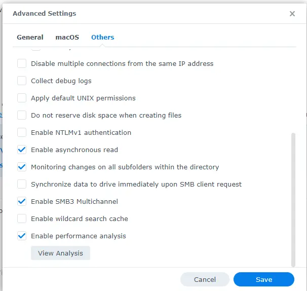
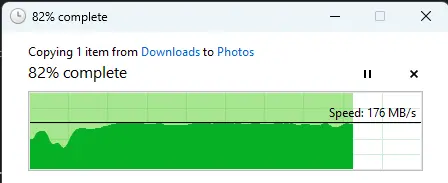
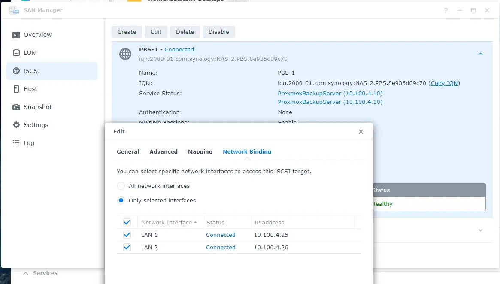
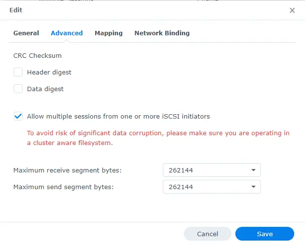

# Synology Multipath SMB, and iSCSI

So... normally when you want faster networking, you can just upgrade to faster NICs (10g, 25, 40, 50, 100g.. etc...).

However, in the case of my Synology DS423+, you get, two 1G ethernet ports with no expansion.

You would think the best course of action, would be to leverage LACP- however that is **NOT** the case.

Enabling Multichannel can double the amount of bandwidth per client, where as LACP, depending on hashing, only gives benefit up to the performance of one port.

This post details how to enable multipath for SMB, and how to configure iSCSI on linux with multiple paths.

<!-- more -->

## Synology Network Configuration

If, you previously had a LACP/LAGG group configured, delete it. 

Give each interface its own IP address.


Once you have done this, the steps are down below for individual protocols.

## SMB / CIFS

### Synology Configuration

Enabling SMB multi-channel on the Synology, is... pretty effortless.

Navigate to `Control Panel -> File Sharing -> File Services -> SMB`


Click on "Advanced Settings"

Goto the "Others" tab.

Enable `SMB3 Multichannel`



Thats it. Your done.

### Testing from Windows

From my windows test-PC, ZERO configuration was needed to take advantage.

Without changing anything- just copying a file was now running close to 200MB/s




The MAXIMUM transfer speed for a single 1G NIC, is around 120MB/s, and realistically, you will hit 110MB/s if everything is perfect.

For this test, I didn't tune anything. I enabled multichannel, and ran benchmarks. There is no jumbo frames, no tuning, etc... as well, my 4-disk array has encryption enabled... which takes a pretty heavy toll on its tiny processor.


### Results? Success

With only selecting a single checkbox, I was able to basically double the performance of SMB shares. 

## iSCSI

### Synology Configuration

iSCSI, is a bit more involved then a single checkbox.

1. Goto the "SAN Manager" application
2. Goto the "iSCSI" tab. 
3. Edit your portal, and ensure both network interfaces are selected.



4. Under advanced tab, you need to Allow Multiple Sessions.



### Linux Configuration

--- info
    If you already had iSCSI running, you will need to remove the lines from `/etc/fstab`, unmount it, and log out of the portal before following these steps.

#### Installing packages

First- we need to install a few things.

`apt-get install multipath-tools open-iscsi`

1. open-iscsi - This allows us to connect to an iscsi target.
2. multipath-tools - This manages the multipathing.

After these packages are install, lets enable the units.

``` bash
systemctl enable iscsid
```

This, will allow them to start at boot.

``` bash
root@network-test:~# systemctl enable iscsid
Synchronizing state of iscsid.service with SysV service script with /lib/systemd/systemd-sysv-install.
Executing: /lib/systemd/systemd-sysv-install enable iscsid
Created symlink /etc/systemd/system/sysinit.target.wants/iscsid.service → /lib/systemd/system/iscsid.service.
root@network-test:~# systemctl enable multipath-tools
Synchronizing state of multipath-tools.service with SysV service script with /lib/systemd/systemd-sysv-install.
Executing: /lib/systemd/systemd-sysv-install enable multipath-tools
Failed to enable unit: Refusing to operate on alias name or linked unit file: multipath-tools.service
```

Make sure both are running.

``` bash
root@network-test:~# systemctl status multipath-tools
● multipathd.service - Device-Mapper Multipath Device Controller
     Loaded: loaded (/lib/systemd/system/multipathd.service; enabled; preset: enabled)
     Active: active (running) since Tue 2024-07-23 01:54:37 UTC; 2min 3s ago
TriggeredBy: ○ multipathd.socket
   Main PID: 2048 (multipathd)
     Status: "up"
      Tasks: 7
     Memory: 19.4M
        CPU: 89ms
     CGroup: /system.slice/multipathd.service
             └─2048 /sbin/multipathd -d -s

Jul 23 01:54:37 network-test systemd[1]: Starting multipathd.service - Device-Mapper Multipath Device Controller...
Jul 23 01:54:37 network-test multipathd[2048]: multipathd v0.9.4: start up
Jul 23 01:54:37 network-test multipathd[2048]: reconfigure: setting up paths and maps
Jul 23 01:54:37 network-test systemd[1]: Started multipathd.service - Device-Mapper Multipath Device Controller.
root@network-test:~# systemctl status iscsid
○ iscsid.service - iSCSI initiator daemon (iscsid)
     Loaded: loaded (/lib/systemd/system/iscsid.service; enabled; preset: enabled)
     Active: inactive (dead)
TriggeredBy: ● iscsid.socket
       Docs: man:iscsid(8)
root@network-test:~#
```

#### Configure iSCSId to start at boot

--- info
    If- you forget this step, your mounts will not be automatically mounted after a reboot!

To automatically start iSCSI at boot, we need to edit `/etc/iscsi/iscsid.conf`

and change `node.startup = manual` to `node.startup = automatic`

Here- is a single command to update the file for you.

`sudo sed -i 's/^#*\s*node.startup\s*=\s*manual/node.startup = automatic/' /etc/iscsi/iscsid.conf`

#### Connecting to iSCSI

Next- lets discover the LUNs available to us.

Run `iscsiadm -m discovery -t st -p YOUR_IP_HERE` against each of the IPs on your Synology.

``` bash
root@network-test:~# iscsiadm -m discovery -t st -p 10.100.4.25
10.100.4.25:3260,1 iqn.2000-01.com.synology:NAS-2.TestTarget.8e935d09c70
10.100.4.26:3260,1 iqn.2000-01.com.synology:NAS-2.TestTarget.8e935d09c70
root@network-test:~# iscsiadm -m discovery -t st -p 10.100.4.26
10.100.4.25:3260,1 iqn.2000-01.com.synology:NAS-2.TestTarget.8e935d09c70
10.100.4.26:3260,1 iqn.2000-01.com.synology:NAS-2.TestTarget.8e935d09c70
```

Next, lets log into both targets using `iscsiadm -m node -T YOUR WWN HERE -p YOUR_IP_HERE --login`

The WWN, is the piece which looks like this: `iqn.2000-01.com.synology:NAS-2.TestTarget.8e935d09c70`

``` bash
root@network-test:~# iscsiadm -m node -T iqn.2000-01.com.synology:NAS-2.TestTarget.8e935d09c70 -p 10.100.4.25 --login
Logging in to [iface: default, target: iqn.2000-01.com.synology:NAS-2.TestTarget.8e935d09c70, portal: 10.100.4.25,3260]
Login to [iface: default, target: iqn.2000-01.com.synology:NAS-2.TestTarget.8e935d09c70, portal: 10.100.4.25,3260] successful.
root@network-test:~# iscsiadm -m node -T iqn.2000-01.com.synology:NAS-2.TestTarget.8e935d09c70 -p 10.100.4.26 --login
Logging in to [iface: default, target: iqn.2000-01.com.synology:NAS-2.TestTarget.8e935d09c70, portal: 10.100.4.26,3260]
Login to [iface: default, target: iqn.2000-01.com.synology:NAS-2.TestTarget.8e935d09c70, portal: 10.100.4.26,3260] successful.
```

The commands for each of the interface addresses should return successful.

IF, you run into this error, its because you didn't enable the "Allow multiple sessions" checkbox on your portal. Go back to the synology and check it.

``` bash
iscsiadm: Could not login to [iface: default, target: iqn.2000-01.com.synology:NAS-2.TestTarget.8e935d09c70, portal: 10.100.4.26,3260].
iscsiadm: initiator reported error (19 - encountered non-retryable iSCSI login failure)
iscsiadm: Could not log into all portals
```

Finally, flag the connections to autostart.

``` bash
root@network-test:~# iscsiadm -m node -T iqn.2000-01.com.synology:NAS-2.TestTarget.8e935d09c70 -p 10.100.4.25 --op=update -n node.startup -v automatic
root@network-test:~# iscsiadm -m node -T iqn.2000-01.com.synology:NAS-2.TestTarget.8e935d09c70 -p 10.100.4.26 --op=update -n node.startup -v automatic
```

Here are all of the commands used in this section:

``` bash
# Discover targets.
iscsiadm -m discovery -t st -p 10.100.4.25

# Connect to both targets.
iscsiadm -m node -T iqn.2000-01.com.synology:NAS-2.TestTarget.8e935d09c70 -p 10.100.4.25 --login
iscsiadm -m node -T iqn.2000-01.com.synology:NAS-2.TestTarget.8e935d09c70 -p 10.100.4.26 --login

# Set targets to automatically start.
iscsiadm -m node -T iqn.2000-01.com.synology:NAS-2.TestTarget.8e935d09c70 -p 10.100.4.25 --op=update -n node.startup -v automatic
iscsiadm -m node -T iqn.2000-01.com.synology:NAS-2.TestTarget.8e935d09c70 -p 10.100.4.26 --op=update -n node.startup -v automatic
```

#### Configuring Multipath

At this point, if you run `lsblk`, you will notice there are TWO devices showing for this LUN.

``` bash
root@network-test:~# lsblk
NAME    MAJ:MIN RM  SIZE RO TYPE MOUNTPOINTS
sda       8:0    0   20G  0 disk   <-- One here
sdb       8:16   0   20G  0 disk   <-- One here too!
sr0      11:0    1    4M  0 rom
vda     254:0    0   16G  0 disk
├─vda1  254:1    0 15.9G  0 part /
├─vda14 254:14   0    3M  0 part
└─vda15 254:15   0  124M  0 part /boot/efi
```

If, you attempt to use both, there is a good chance you can corrupt the LUN. Instead, we need to configure multipath now.

Lets go ahead and get the WWNs for our lun with this command: `udevadm info --query=all --name=/dev/sda | grep 'ID_WWN'`

The WWN SHOULD be the same for both. The `ID_WWN` is what we are interested in.

``` bash
root@network-test:~# udevadm info --query=all --name=/dev/sda | grep 'ID_WWN'
E: ID_WWN_WITH_EXTENSION=0x600140551aa592fd025ed4ef1da523db
E: ID_WWN=0x600140551aa592fd
root@network-test:~# udevadm info --query=all --name=/dev/sdb | grep 'ID_WWN'
E: ID_WWN_WITH_EXTENSION=0x600140551aa592fd025ed4ef1da523db
E: ID_WWN=0x600140551aa592fd
```

Lets make a new multipath configuration file. 

`nano /etc/multpath.conf`

Make sure to update the wwid, to YOUR WWN.

``` title="/etc/multpath.conf"
defaults {
    user_friendly_names yes
    find_multipaths yes
}

blacklist {
    devnode "^vda"
}

multipaths {
    multipath {
        wwid "3600140551aa592fd025ed4ef1da523db"
        alias mpath0
    }
}
```

After creating the above file, we need to restart multipath, using `systemctl restart multipath-tools`

After this is done, you can now see the multiple paths, using `multipath -ll`, and lsblk will show the new device.

``` bash
root@network-test:~# systemctl restart multipath-tools
root@network-test:~# multipath -ll
mpatha (3600140551aa592fd025ed4ef1da523db) dm-0 SYNOLOGY,Storage
size=20G features='0' hwhandler='1 alua' wp=rw
|-+- policy='service-time 0' prio=50 status=active
| `- 2:0:0:1 sda 8:0  active ready running
`-+- policy='service-time 0' prio=50 status=enabled
  `- 3:0:0:1 sdb 8:16 active ready running
root@network-test:~# lsblk
NAME     MAJ:MIN RM  SIZE RO TYPE  MOUNTPOINTS
sda        8:0    0   20G  0 disk
└─mpatha 253:0    0   20G  0 mpath
sdb        8:16   0   20G  0 disk
└─mpatha 253:0    0   20G  0 mpath
sr0       11:0    1    4M  0 rom
vda      254:0    0   16G  0 disk
├─vda1   254:1    0 15.9G  0 part  /
├─vda14  254:14   0    3M  0 part
└─vda15  254:15   0  124M  0 part  /boot/efi
root@network-test:~#
```

#### Formatting new mount.

(If- you are trying to enable multipath on an existing LUN, you should prob skip this step....)

Format the new mount using `mkfs.ext4 /dev/mapper/mpatha`

``` bash
root@network-test:~# mkfs.ext4 /dev/mapper/mpatha
mke2fs 1.47.0 (5-Feb-2023)
Discarding device blocks: done
Creating filesystem with 5242880 4k blocks and 1310720 inodes
Filesystem UUID: 199858b0-e453-4e00-8905-d9bcbe892da9
Superblock backups stored on blocks:
        32768, 98304, 163840, 229376, 294912, 819200, 884736, 1605632, 2654208,
        4096000

Allocating group tables: done
Writing inode tables: done
Creating journal (32768 blocks): done
Writing superblocks and filesystem accounting information: done
```

For this guide, we will be mounting this drive at `/mnt/multipath`. Go ahead and create an empty directory there.

`mkdir /mnt/multipath`

#### Mount at boot

To automatically mount this new partition, we will edit `/etc/fstab`, and add `/dev/mapper/mpatha /mnt/multipath ext4 _netdev 0 2`

``` bash
root@network-test:~# echo "/dev/mapper/mpatha /mnt/multipath ext4 _netdev 0 2" | sudo tee -a /etc/fstab
/dev/mapper/mpatha /mnt/multipath ext4 _netdev 0 2

root@network-test:~# cat /etc/fstab
PARTUUID=83c1818a-868c-4c97-832b-8195e4257804 / ext4 rw,discard,errors=remount-ro,x-systemd.growfs 0 1
PARTUUID=d6f6a0fe-5811-483b-a7a5-a6bf5b6372e5 /boot/efi vfat defaults 0 0
/dev/mapper/mpatha /mnt/multipath ext4 _netdev 0 2
```

After updating this file, run `systemctl daemon-reload`

Next, lets mount everything in `/etc/fstab`, using `mount -a`. After mounting, you should see the new LUN/Partition is now mounted.

``` bash
root@network-test:~# mount -a
root@network-test:~# lsblk
NAME     MAJ:MIN RM  SIZE RO TYPE  MOUNTPOINTS
sda        8:0    0   20G  0 disk
└─mpatha 253:0    0   20G  0 mpath /mnt/multipath
sdb        8:16   0   20G  0 disk
└─mpatha 253:0    0   20G  0 mpath /mnt/multipath
sr0       11:0    1    4M  0 rom
vda      254:0    0   16G  0 disk
├─vda1   254:1    0 15.9G  0 part  /
├─vda14  254:14   0    3M  0 part
└─vda15  254:15   0  124M  0 part  /boot/efi
```

Thats, mostly it. I would recommend a reboot at this point, just to ensure it automatically remounts as expected.

```
root@network-test:~# reboot
```

If, after a reboot, `lsblk` does not show the partitions, please address the issue. The "Configure iSCSId to start at boot" section above configures this.

You can use `iscsiadm -m session -o show` to determine if you have active sessions.

If- after your reboot- everything looks like this, you are good to go!

``` bash
Last login: Tue Jul 23 02:30:50 2024 from 10.100.64.2
root@network-test:~# lsblk
NAME     MAJ:MIN RM  SIZE RO TYPE  MOUNTPOINTS
sda        8:0    0   20G  0 disk
└─mpatha 253:0    0   20G  0 mpath /mnt/multipath
sdb        8:16   0   20G  0 disk
└─mpatha 253:0    0   20G  0 mpath /mnt/multipath
sr0       11:0    1    4M  0 rom
vda      254:0    0   16G  0 disk
├─vda1   254:1    0 15.9G  0 part  /
├─vda14  254:14   0    3M  0 part
└─vda15  254:15   0  124M  0 part  /boot/efi
root@network-test:~# iscsiadm -m session -o show
tcp: [1] 10.100.4.25:3260,1 iqn.2000-01.com.synology:NAS-2.PBS.8e935d09c70 (non-flash)
tcp: [2] 10.100.4.26:3260,1 iqn.2000-01.com.synology:NAS-2.PBS.8e935d09c70 (non-flash)
tcp: [3] 10.100.4.26:3260,1 iqn.2000-01.com.synology:NAS-2.TestTarget.8e935d09c70 (non-flash)
tcp: [4] 10.100.4.25:3260,1 iqn.2000-01.com.synology:NAS-2.TestTarget.8e935d09c70 (non-flash)
root@network-test:~# multipath -ll
mpatha (3600140551aa592fd025ed4ef1da523db) dm-0 SYNOLOGY,Storage
size=20G features='0' hwhandler='1 alua' wp=rw
|-+- policy='service-time 0' prio=50 status=active
| `- 4:0:0:1 sda 8:0  active ready running
`-+- policy='service-time 0' prio=50 status=enabled
  `- 5:0:0:1 sdb 8:16 active ready running
root@network-test:~#
```

#### Performance Testing

A quick performance test with `fio`

Command Used: `fio --name=seq_read_test --directory=/mnt/multipath --rw=read --bs=1M --size=1G --numjobs=1 --time_based --runtime=60 --group_reporting --ioengine=libaio --direct=1`

``` bash
root@network-test:~# apt-get install fio
Reading package lists... Done
Building dependency tree... Done
Reading state information... Done
fio is already the newest version (3.33-3).
0 upgraded, 0 newly installed, 0 to remove and 0 not upgraded.
root@network-test:~# fio --name=seq_read_test --directory=/mnt/multipath --rw=read --bs=1M --size=1G --numjobs=1 --time_based --runtime=60 --group_reporting --ioengine=libaio --direct=1
seq_read_test: (g=0): rw=read, bs=(R) 1024KiB-1024KiB, (W) 1024KiB-1024KiB, (T) 1024KiB-1024KiB, ioengine=libaio, iodepth=1
fio-3.33
Starting 1 process
seq_read_test: Laying out IO file (1 file / 1024MiB)
Jobs: 1 (f=0): [f(1)][100.0%][r=101MiB/s][r=101 IOPS][eta 00m:00s]
seq_read_test: (groupid=0, jobs=1): err= 0: pid=610: Tue Jul 23 02:40:09 2024
  read: IOPS=101, BW=102MiB/s (107MB/s)(6114MiB/60007msec)
    slat (usec): min=34, max=467, avg=67.39, stdev=30.11
    clat (usec): min=9459, max=13308, avg=9742.25, stdev=184.59
     lat (usec): min=9516, max=13358, avg=9809.64, stdev=201.90
    clat percentiles (usec):
     |  1.00th=[ 9503],  5.00th=[ 9634], 10.00th=[ 9634], 20.00th=[ 9634],
     | 30.00th=[ 9634], 40.00th=[ 9634], 50.00th=[ 9765], 60.00th=[ 9765],
     | 70.00th=[ 9765], 80.00th=[ 9765], 90.00th=[ 9896], 95.00th=[10028],
     | 99.00th=[10421], 99.50th=[10683], 99.90th=[11731], 99.95th=[12256],
     | 99.99th=[13304]
   bw (  KiB/s): min=100352, max=106709, per=100.00%, avg=104412.78, stdev=1260.34, samples=119
   iops        : min=   98, max=  104, avg=101.92, stdev= 1.23, samples=119
  lat (msec)   : 10=94.29%, 20=5.71%
  cpu          : usr=0.14%, sys=0.87%, ctx=6141, majf=0, minf=266
  IO depths    : 1=100.0%, 2=0.0%, 4=0.0%, 8=0.0%, 16=0.0%, 32=0.0%, >=64=0.0%
     submit    : 0=0.0%, 4=100.0%, 8=0.0%, 16=0.0%, 32=0.0%, 64=0.0%, >=64=0.0%
     complete  : 0=0.0%, 4=100.0%, 8=0.0%, 16=0.0%, 32=0.0%, 64=0.0%, >=64=0.0%
     issued rwts: total=6114,0,0,0 short=0,0,0,0 dropped=0,0,0,0
     latency   : target=0, window=0, percentile=100.00%, depth=1

Run status group 0 (all jobs):
   READ: bw=102MiB/s (107MB/s), 102MiB/s-102MiB/s (107MB/s-107MB/s), io=6114MiB (6411MB), run=60007-60007msec

Disk stats (read/write):
    dm-0: ios=6090/4, merge=0/1, ticks=59297/16, in_queue=59322, util=98.96%, aggrios=3057/2, aggrmerge=0/0, aggrticks=29731/3, aggrin_queue=29734, aggrutil=98.60%
  sdb: ios=0/0, merge=0/0, ticks=0/0, in_queue=0, util=0.00%
  sda: ios=6115/4, merge=0/0, ticks=59462/7, in_queue=59468, util=98.60%
```

102MiB/s, that is only a single connection! If your results resemble this, you did not correctly configure `/etc/multipath.conf`

In my case, it was because I forgot to add the `multipaths` section to `/etc/multipath.conf`. 

The benefit of reading my post- I have already went back up and added all of the wonderful steps that were missing before you got a chance to read it!

AFTER fixing `/etc/multipath.conf`, a **VERY** respectable 240MB/s. This is perfectly saturating both gigabit ports.

``` bash
root@network-test:~# fio --name=seq_read_test --directory=/mnt/multipath --rw=read --bs=1M --size=1G --numjobs=1 --time_based --runtime=60 --group_reporting --ioengine=libaio --direct=1
seq_read_test: (g=0): rw=read, bs=(R) 1024KiB-1024KiB, (W) 1024KiB-1024KiB, (T) 1024KiB-1024KiB, ioengine=libaio, iodepth=1
fio-3.33
Starting 1 process
seq_read_test: Laying out IO file (1 file / 1024MiB)
Jobs: 1 (f=1): [R(1)][100.0%][r=266MiB/s][r=266 IOPS][eta 00m:00s]
seq_read_test: (groupid=0, jobs=1): err= 0: pid=577: Tue Jul 23 02:50:39 2024
  read: IOPS=228, BW=229MiB/s (240MB/s)(13.4GiB/60003msec)
    slat (usec): min=25, max=1448, avg=66.48, stdev=47.39
    clat (usec): min=2458, max=50851, avg=4302.45, stdev=2230.52
     lat (usec): min=2485, max=50990, avg=4368.93, stdev=2245.90
    clat percentiles (usec):
     |  1.00th=[ 2802],  5.00th=[ 2999], 10.00th=[ 3097], 20.00th=[ 3261],
     | 30.00th=[ 3392], 40.00th=[ 3556], 50.00th=[ 3720], 60.00th=[ 3982],
     | 70.00th=[ 4490], 80.00th=[ 5080], 90.00th=[ 5800], 95.00th=[ 6521],
     | 99.00th=[ 9765], 99.50th=[19530], 99.90th=[34341], 99.95th=[43254],
     | 99.99th=[50070]
   bw (  KiB/s): min=141312, max=292864, per=100.00%, avg=234281.77, stdev=35620.16, samples=120
   iops        : min=  138, max=  286, avg=228.59, stdev=34.78, samples=120
  lat (msec)   : 4=60.57%, 10=38.46%, 20=0.49%, 50=0.47%, 100=0.01%
  cpu          : usr=0.52%, sys=2.22%, ctx=13754, majf=0, minf=267
  IO depths    : 1=100.0%, 2=0.0%, 4=0.0%, 8=0.0%, 16=0.0%, 32=0.0%, >=64=0.0%
     submit    : 0=0.0%, 4=100.0%, 8=0.0%, 16=0.0%, 32=0.0%, 64=0.0%, >=64=0.0%
     complete  : 0=0.0%, 4=100.0%, 8=0.0%, 16=0.0%, 32=0.0%, 64=0.0%, >=64=0.0%
     issued rwts: total=13717,0,0,0 short=0,0,0,0 dropped=0,0,0,0
     latency   : target=0, window=0, percentile=100.00%, depth=1

Run status group 0 (all jobs):
   READ: bw=229MiB/s (240MB/s), 229MiB/s-229MiB/s (240MB/s-240MB/s), io=13.4GiB (14.4GB), run=60003-60003msec

Disk stats (read/write):
  vda: ios=13803/146, merge=0/40, ticks=59027/59, in_queue=59124, util=97.39%
root@network-test:~#
```

| Metric                        | Value                          |
|-------------------------------|--------------------------------|
| **Read IOPS**                 | 228                            |
| **Read Bandwidth**            | 229 MiB/s (240 MB/s)           |
| **Total Read**                | 13.4 GiB (14.4 GB)             |
| **Test Duration**             | 60003 ms                       |
| **Bandwidth (min)**           | 141312 KiB/s                   |
| **Bandwidth (max)**           | 292864 KiB/s                   |
| **Bandwidth (avg)**           | 234281.77 KiB/s                |
| **Bandwidth (stdev)**         | 35620.16 KiB/s                 |
| **CPU Usage (user)**          | 0.52%                          |
| **CPU Usage (sys)**           | 2.22%                          |
| **Context Switches**          | 13754                          |
| **IO Depth**                  | 1                              |
| **Disk Utilization**          | 97.39%                         |

