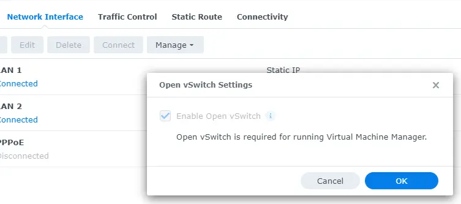
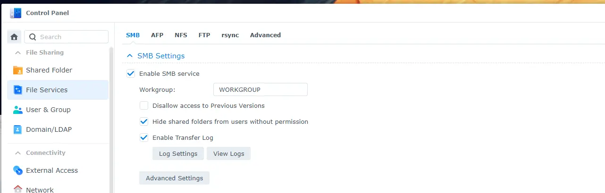
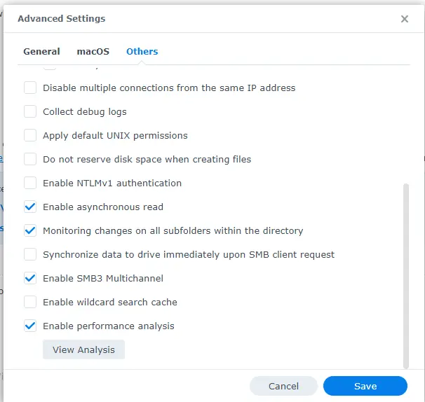
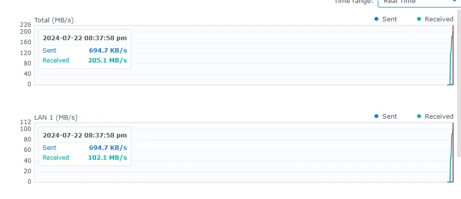
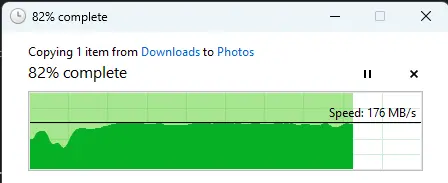
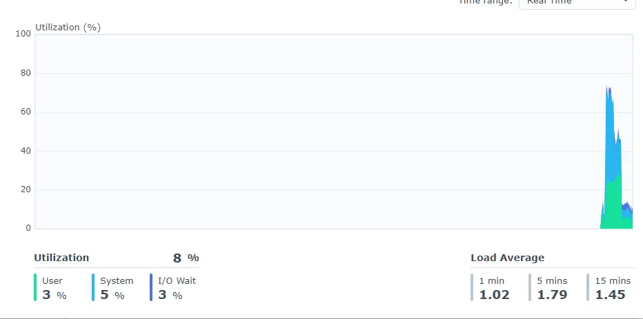
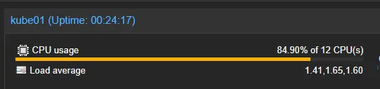
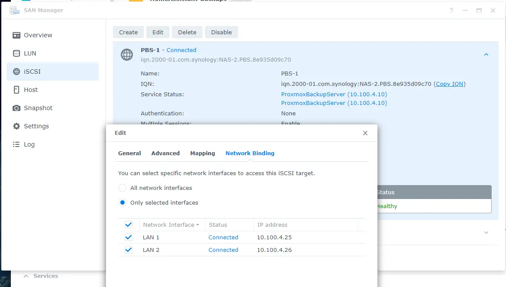
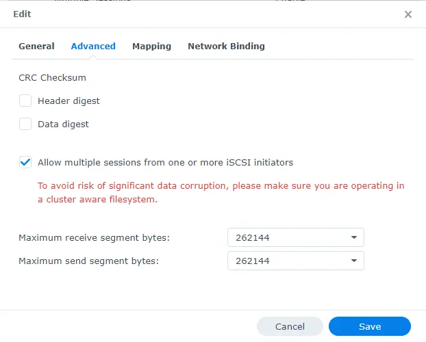

# Synology Multipath SMB, and iSCSI

So... normally when you want faster networking, you can just upgrade to faster NICs (10g, 25, 40, 50, 100g.. etc...).

However, in the case of my Synology DS423+, you get, two 1G ethernet ports with no expansion.

You would think the best course of action, would be to leverage LACP- however that is **NOT** the case.

Enabling Multichannel can double the amount of bandwidth per client, where as LACP, depending on hashing, only gives benefit up to the performance of one port.

This post details how to enable multipath for SMB, and how to configure iSCSI on linux with multiple paths.

<!-- more -->

## WHY?

LACP isn't perfect. With LACP, a single client's connection is typically limited to the maximum throughput of a single NIC, regardless of how many NICs you have.

There are settings you can change and tweak with LACP to help mitigate this problem, HOWEVER, enable multipathing is far easier, and from my testing, is EXTREMELY effective at maximizing the amount of throughput.

In short, LACP configured with round-robin, is extremely effective at letting your NAS access the rest of your network with full bandwidth, but, does little to help with clients accessing your NAS.

Multi pathing, allows clients to access your NAS with full bandwidth.

## Synology Network Configuration

If, you previously had a LACP/LAGG group configured, delete it. 

Give each interface its own IP address.


Once you have done this, the steps are down below for individual protocols.

#### **BUT YOU CAN'T HAVE MULTIPLE IP ADDRESSES ON THE SAME SUBNET!!!!!**

Despite what [jgreco@truenas says](https://www.truenas.com/community/threads/smb-multi-channel-crippled-by-truenas-nic-config.114694/post-795726){target=_blank}, and despite [the TrueNAS resource guide that says you can't...](https://www.truenas.com/community/resources/multiple-network-interfaces-on-a-single-subnet.45/){target=_blank}.


Sure you can.... with a small change.

Synology uses open-virtual-switch to make this happen. This happens automatically as long as you have the checkbox-checked.



``` bash
my-user@NAS-2:~$ ip link
3: eth0: <BROADCAST,MULTICAST,SLAVE,UP,LOWER_UP> mtu 1500 qdisc pfifo_fast master ovs-system state UP mode DEFAULT group default qlen 1000
    link/ether 90:09:d0:5e:93:03 brd ff:ff:ff:ff:ff:ff
4: eth1: <BROADCAST,MULTICAST,SLAVE,UP,LOWER_UP> mtu 1500 qdisc pfifo_fast master ovs-system state UP mode DEFAULT group default qlen 1000
    link/ether 90:09:d0:5e:93:04 brd ff:ff:ff:ff:ff:ff
111: ovs-system: <BROADCAST,MULTICAST> mtu 1500 qdisc noop state DOWN mode DEFAULT group default qlen 1
    link/ether 96:fa:b5:07:44:76 brd ff:ff:ff:ff:ff:ff
118: ovs_eth0: <BROADCAST,MULTICAST,UP,LOWER_UP> mtu 1500 qdisc noqueue state UP mode DEFAULT group default qlen 1
    link/ether 90:09:d0:5e:93:03 brd ff:ff:ff:ff:ff:ff
119: ovs_eth1: <BROADCAST,MULTICAST,UP,LOWER_UP> mtu 1500 qdisc noqueue state UP mode DEFAULT group default qlen 1
    link/ether 90:09:d0:5e:93:04 brd ff:ff:ff:ff:ff:ff
my-user@NAS-2:~$ ip a
3: eth0: <BROADCAST,MULTICAST,SLAVE,UP,LOWER_UP> mtu 1500 qdisc pfifo_fast master ovs-system state UP group default qlen 1000
    link/ether 90:09:d0:5e:93:03 brd ff:ff:ff:ff:ff:ff
4: eth1: <BROADCAST,MULTICAST,SLAVE,UP,LOWER_UP> mtu 1500 qdisc pfifo_fast master ovs-system state UP group default qlen 1000
    link/ether 90:09:d0:5e:93:04 brd ff:ff:ff:ff:ff:ff
111: ovs-system: <BROADCAST,MULTICAST> mtu 1500 qdisc noop state DOWN group default qlen 1
    link/ether 96:fa:b5:07:44:76 brd ff:ff:ff:ff:ff:ff
118: ovs_eth0: <BROADCAST,MULTICAST,UP,LOWER_UP> mtu 1500 qdisc noqueue state UP group default qlen 1
    link/ether 90:09:d0:5e:93:03 brd ff:ff:ff:ff:ff:ff
    inet 10.100.4.25/24 brd 10.100.4.255 scope global ovs_eth0
       valid_lft forever preferred_lft forever
119: ovs_eth1: <BROADCAST,MULTICAST,UP,LOWER_UP> mtu 1500 qdisc noqueue state UP group default qlen 1
    link/ether 90:09:d0:5e:93:04 brd ff:ff:ff:ff:ff:ff
    inet 10.100.4.26/24 brd 10.100.4.255 scope global ovs_eth1
       valid_lft forever preferred_lft forever
```
Linux in general has no problem doing this either, without open v-switch with two dhcp interfaces plugged in.

``` bash
root@network-test:~# ip a | grep -E "(UP|inet 10)"
1: lo: <LOOPBACK,UP,LOWER_UP> mtu 65536 qdisc noqueue state UNKNOWN group default qlen 1000
2: eth0: <BROADCAST,MULTICAST,UP,LOWER_UP> mtu 1500 qdisc fq_codel state UP group default qlen 1000
    inet 10.100.5.152/24 metric 100 brd 10.100.5.255 scope global dynamic eth0
3: eth1: <BROADCAST,MULTICAST,UP,LOWER_UP> mtu 1500 qdisc fq_codel state UP group default qlen 1000
    inet 10.100.5.157/24 metric 100 brd 10.100.5.255 scope global dynamic eth1
```

You can use different vlan/subnets if you prefer. 

The important part though- just ensure you have different IP addresses for each interface. Multi-channel requires this.

## SMB / CIFS

[Synology Documentation for SMB Multichannel](https://kb.synology.com/en-au/DSM/tutorial/smb3_multichannel_link_aggregation){target=_blank}


### Synology Configuration

Enabling SMB multi-channel on the Synology, is... pretty effortless.

Navigate to `Control Panel -> File Sharing -> File Services -> SMB`



Click on "Advanced Settings"

Goto the "Others" tab.

Enable `SMB3 Multichannel`



Thats it. Your done.

### Testing from Windows

From my windows test-PC, ZERO configuration was needed to take advantage.

Without changing anything- just copying a file was now running close to 200MB/s





The MAXIMUM transfer speed for a single 1G NIC, is around 120MB/s, and realistically, you will hit 110MB/s if everything is perfect.

For this test, I didn't tune anything. I enabled multichannel, and ran benchmarks. There is no jumbo frames, no tuning, etc... 



#### Results? Success

With only selecting a single checkbox, I was able to basically double the performance of SMB shares. 

### Linux - Not Supported?

After trying many different options to get multi-channel working from Linux, I was unsuccessful.

While- it works effortlessly from Windows, I have had no such luck from Linux.


#### Debugging MultiChannel

It appears, even with proper configuration, hardware, etc, the multi-channel support is missing from my kernel.

``` bash
root@network-test:~# mount -t cifs //10.100.4.25/temp /mnt/smb -o guest,vers=3.11,max_channels=2
# Dmesg output
[  252.757621] CIFS: Attempting to mount \\10.100.4.25\temp
[  252.863618] CIFS: Status code returned 0xc000000d STATUS_INVALID_PARAMETER
[  252.864442] cifs_setup_session: 2 callbacks suppressed
[  252.864443] CIFS: VFS: \\ Send error in SessSetup = -22
[  252.865646] cifs_try_adding_channels: 2 callbacks suppressed
[  252.865647] CIFS: VFS: failed to open extra channel on iface:10.100.4.26 rc=-22
[  252.875345] CIFS: Status code returned 0xc000000d STATUS_INVALID_PARAMETER
[  252.876222] CIFS: VFS: \\ Send error in SessSetup = -22
[  252.876910] CIFS: VFS: failed to open extra channel on iface:10.100.4.25 rc=-22
[  252.885845] CIFS: Status code returned 0xc000000d STATUS_INVALID_PARAMETER
[  252.886935] CIFS: VFS: \\ Send error in SessSetup = -22
[  252.887625] CIFS: VFS: failed to open extra channel on iface:10.100.4.26 rc=-22
[  252.896540] CIFS: Status code returned 0xc000000d STATUS_INVALID_PARAMETER
[  252.897377] CIFS: VFS: \\ Send error in SessSetup = -22
[  252.898050] CIFS: VFS: failed to open extra channel on iface:10.100.4.25 rc=-22
[  252.907580] CIFS: Status code returned 0xc000000d STATUS_INVALID_PARAMETER
[  252.908663] CIFS: VFS: \\ Send error in SessSetup = -22
[  252.909477] CIFS: VFS: failed to open extra channel on iface:10.100.4.26 rc=-22
[  252.919620] CIFS: Status code returned 0xc000000d STATUS_INVALID_PARAMETER
[  252.920382] CIFS: VFS: \\ Send error in SessSetup = -22
[  252.920985] CIFS: VFS: failed to open extra channel on iface:10.100.4.25 rc=-22
[  252.929712] CIFS: Status code returned 0xc000000d STATUS_INVALID_PARAMETER
[  252.930745] CIFS: VFS: \\ Send error in SessSetup = -22
[  252.931536] CIFS: VFS: failed to open extra channel on iface:10.100.4.26 rc=-22
[  252.940777] CIFS: Status code returned 0xc000000d STATUS_INVALID_PARAMETER
[  252.941788] CIFS: VFS: \\ Send error in SessSetup = -22
[  252.942668] CIFS: VFS: failed to open extra channel on iface:10.100.4.25 rc=-22
[  252.951648] CIFS: Status code returned 0xc000000d STATUS_INVALID_PARAMETER
[  252.952697] CIFS: VFS: \\ Send error in SessSetup = -22
[  252.953555] CIFS: VFS: failed to open extra channel on iface:10.100.4.26 rc=-22
[  252.962648] CIFS: Status code returned 0xc000000d STATUS_INVALID_PARAMETER
[  252.963572] CIFS: VFS: \\ Send error in SessSetup = -22
[  252.964207] CIFS: VFS: failed to open extra channel on iface:10.100.4.25 rc=-22
[  252.973347] CIFS: Status code returned 0xc000000d STATUS_INVALID_PARAMETER
[  252.981887] CIFS: Status code returned 0xc000000d STATUS_INVALID_PARAMETER
[  252.982771] CIFS: VFS: too many channel open attempts (1 channels left to open)
```

When trying to mount a SMB share which has multi-channel enabled, it appears we are getting invalid parameter responses.

I took an assumption, thinking this is due to using the guest account, and tried again, with an actual user.

``` bash
wall "Starting Test" && mount -t cifs //10.100.4.25/temp /mnt/smb -o credentials=/etc/samba/.testcreds,vers=3.11,max_channels=2 && ./bench && umount /mnt/smb
# fio output.
Run status group 0 (all jobs):
 READ: bw=103MiB/s (108MB/s), 103MiB/s-103MiB/s (108MB/s-108MB/s), io=516MiB (541MB), run=5009-5009msec
# Dmesg output
Starting Test

[  914.327269] CIFS: Attempting to mount \\10.100.4.25\temp
[  914.452549] CIFS: VFS: successfully opened new channel on iface:10.100.4.26
```

Hey- that looks very promising

Checking the `smbstatus` from the synology shows that indeed, multi-channel is working.

``` bash
ash-4.4# smbstatus -v --show-multichannel
using configfile = /etc/samba/smb.conf
Pid       Channel   Server IP                        Client IP
-----------------------------------------------------------------------------
14556     1         ipv4:10.100.4.25:445             ipv4:10.100.5.152:44060
14556     2         ipv4:10.100.4.26:445             ipv4:10.100.5.152:58238
```

So then- why are we only getting 1G / second?

As a test, I removed the 2nd NIC from this VM, and ran the test again.

``` bash
[ 3095.854200]  connection1:0: ping timeout of 5 secs expired, recv timeout 5, last rx 4295663616, last ping 4295664896, now 4295666176
[ 3095.855485]  connection1:0: detected conn error (1022)
[ 3095.856069]  connection2:0: ping timeout of 5 secs expired, recv timeout 5, last rx 4295663616, last ping 4295664896, now 4295666176
[ 3095.857363]  connection2:0: detected conn error (1022)
```

The test itself, failed, with pretty horrible results, indicating that it may have been using the 2nd interface.

After, rebooting, the test gave its usual 108MB/s, and the synology still reported multiple channels being leveraged.

So... next, I decided to test this VM's network bandwidth.

This, VM's host has 100G connectivity. The target host, also has 100G connectivity.

``` bash
# iperf test from proxmox, to another proxmox host:
[SUM] 0.0000-10.0007 sec  75.0 GBytes  64.4 Gbits/sec
# iperf test from VM, to ANOTHER proxmox host.
[SUM] 0.0000-10.0009 sec  45.4 GBytes  39.0 Gbits/sec
# iperf test from VM, to CURRENT proxmox host.
[SUM] 0.0000-10.0015 sec  12.1 GBytes  10.4 Gbits/sec

# I added a new virtual interface on the same subnet as the Proxmox host, and adjusted the ip routes to compensate.
# This yielded around 3x the performance, while keeping the host CPU usage below 30%.

# iperf test from VM to CURRENT proxmox host (with shared subnet, avoiding data needing to visit the router)
[SUM] 0.0000-10.0021 sec  35.5 GBytes  30.5 Gbits/sec
# However, SMB multi-channel performance, remained at 100MiB/s. EXACTLY 100MiB/s.
READ: bw=100.0MiB/s (105MB/s), 100.0MiB/s-100.0MiB/s (105MB/s-105MB/s), io=500MiB (524MB), run=5001-5001msec
# More tests, without any changes.
READ: bw=100.0MiB/s (105MB/s), 100.0MiB/s-100.0MiB/s (105MB/s-105MB/s), io=500MiB (524MB), run=5002-5002msec
READ: bw=99.9MiB/s (105MB/s), 99.9MiB/s-99.9MiB/s (105MB/s-105MB/s), io=500MiB (524MB), run=5003-5003msec
READ: bw=99.1MiB/s (104MB/s), 99.1MiB/s-99.1MiB/s (104MB/s-104MB/s), io=496MiB (520MB), run=5006-5006msec

# Hitting the other interface of the synology.
READ: bw=102MiB/s (106MB/s), 102MiB/s-102MiB/s (106MB/s-106MB/s), io=508MiB (533MB), run=5004-5004msec
READ: bw=101MiB/s (106MB/s), 101MiB/s-101MiB/s (106MB/s-106MB/s), io=508MiB (533MB), run=5005-5005msec
READ: bw=101MiB/s (106MB/s), 101MiB/s-101MiB/s (106MB/s-106MB/s), io=507MiB (532MB), run=5002-5002msec

```

Why- is the performance tests from the VM so slow? Simple. Host overhead. Virtio packets need to be processed by the host.



At this point, we have validated there is plenty of bandwidth from this VM, to the general network.

All of the tests are suspiciously consistent though. However, only saturating around 80-90% of a single 1g NIC.

Testing, random things and configurations, did find a few interesting items.

For example- disabling NFS for the specified samba share, did, make a very small difference, which was consistently reproducible.

``` bash
# Disabled NFS for the temp share.
READ: bw=102MiB/s (107MB/s), 102MiB/s-102MiB/s (107MB/s-107MB/s), io=509MiB (534MB), run=5004-5004msec
READ: bw=106MiB/s (111MB/s), 106MiB/s-106MiB/s (111MB/s-111MB/s), io=531MiB (557MB), run=5002-5002msec
READ: bw=102MiB/s (107MB/s), 102MiB/s-102MiB/s (107MB/s-107MB/s), io=509MiB (534MB), run=5007-5007msec
READ: bw=103MiB/s (108MB/s), 103MiB/s-103MiB/s (108MB/s-108MB/s), io=516MiB (541MB), run=5006-5006msec
```

While- only a few MB/s, this hints the limitation might not be network bandwidth, and instead could be related to either a bottleneck on the synology (Windows SMB had no issues!), or certain SMB options which may cause additional overhead.

Checking the synology's resource monitor, shows something extremely interesting. Each interface is using HALF.

So- the multi-channel is working, but, there is a bottleneck, somewhere, limiting to roughly gigabit.

Doing, a quick iperf test aginst the synology, didn't show any issues.

``` bash
iperf -c 10.100.4.25 &
iperf -c 10.100.4.26 &
wait


[ ID] Interval       Transfer     Bandwidth
[  1] 0.0000-10.0004 sec  1.10 GBytes   942 Mbits/sec
[ ID] Interval       Transfer     Bandwidth
[  1] 0.0000-10.0022 sec  1.10 GBytes   942 Mbits/sec
[1]-  Done                    iperf -c 10.100.4.25
```

So, I decided to test in a different way.

``` bash
# Test Setup: Additional NIC removed, Single NIC with Multiqueue set to 2.
# VM power-cycled after configuration change.
mount -t cifs //10.100.4.25/temp /mnt/smb -o credentials=/etc/samba/.testcreds,vers=3.11,max_channels=2
rsync -avh --info=progress2 /mnt/smb/test-file /tmp/test

root@network-test:~# rsync -avh --info=progress2 /mnt/smb/test-file /tmp/test
sending incremental file list
test-file
          1.40G   8%  110.81MB/s    0:02:22

## Try... DNS?
echo "10.100.4.25 nas" | sudo tee -a /etc/hosts
echo "10.100.4.26 nas" | sudo tee -a /etc/hosts
umount /mnt/smb
mount -t cifs //nas/temp /mnt/smb -o credentials=/etc/samba/.testcreds,vers=3.11,max_channels=2

## No Change..
root@network-test:~# rsync -avh --info=progress2 /mnt/smb/test-file /tmp/test
sending incremental file list
test-file
          1.05G   6%  110.42MB/s    0:02:25
```

Next, I decided to try and put the Synology's 2nd interface, on a completely different VLAN/Subnet.

``` bash
ash-4.4# smbstatus -v --show-multichannel
using configfile = /etc/samba/smb.conf
Pid       Channel   Server IP                        Client IP
-----------------------------------------------------------------------------
31620     1         ipv4:10.100.4.25:445             ipv4:10.100.5.152:36192
31620     2         ipv4:10.100.129.2:445            ipv4:10.100.5.152:55696

# But- still- same results.
Jobs: 1 (f=1): [R(1)][80.0%][r=103MiB/s][r=103 IOPS][eta 00m:12s]

### At this point....  I restarted samba on the Synology.
systemctl restart pkg-synosamba-smbd.service
# And rebooted my test host.
reboot

# Setup DNS
echo "10.100.4.25 nas" | sudo tee -a /etc/hosts
echo "10.100.129.2 nas" | sudo tee -a /etc/hosts

wall "Starting Test" && mount -t cifs //nas/temp /mnt/smb -o credentials=/etc/samba/.testcreds,vers=3.11,max_channels=2 && ./bench && umount /mnt/smb

# Synology shows connection as active.
ash-4.4# smbstatus -v --show-multichannel
using configfile = /etc/samba/smb.conf
Pid       Channel   Server IP                        Client IP
-----------------------------------------------------------------------------
1208      1         ipv4:10.100.4.25:445             ipv4:10.100.5.152:52510
1208      2         ipv4:10.100.129.2:445            ipv4:10.100.5.152:34582

# DMesg from test VM.
[  103.984999] CIFS: Attempting to mount \\nas\temp
[  104.118710] CIFS: VFS: successfully opened new channel on iface:10.100.129.2
[  171.880673] CIFS: Attempting to mount \\nas\temp
[  172.006065] CIFS: VFS: successfully opened new channel on iface:10.100.129.2
[  172.027001] CIFS: VFS: successfully opened new channel on iface:10.100.4.25


# But- tests are STILL giving the same results.
Jobs: 1 (f=1): [R(1)][48.3%][r=103MiB/s][r=103 IOPS][eta 00m:31s]
```

For, one last thing to try, I decided to test on the proxmox host itself.

``` bash
mount -t cifs //10.100.4.25/temp /mnt/smb -o credentials=/root/.testcreds,vers=3.11,max_channels=2
# Didn't wanna install extra packages on my proxmox hosts...
rsync -avh --info=progress2 /mnt/smb/test-file /tmp/test
sending incremental file list
test-file
          1.74G   9%  110.94MB/s    0:02:19
```


### Checking multi-channel SMB status from the synology.

You can check if SMB multi-channel is working from the synology by running a command via ssh.

In this example- This shows multi-channel NOT working from one of my linux test machines.

``` bash
ash-4.4# smbstatus smbstatus -v --show-multichannel
using configfile = /etc/samba/smb.conf
Pid       Channel   Server IP                        Client IP
-----------------------------------------------------------------------------
29565     1         ipv4:10.100.4.25:445             ipv4:10.100.5.152:42836
```

Here is the output while transferring a file to my synology from my windows machine, which is using multi-channel.

``` bash
ash-4.4# smbstatus -v --show-multichannel
using configfile = /etc/samba/smb.conf
Pid       Channel   Server IP                        Client IP
-----------------------------------------------------------------------------
6417      1         ipv4:10.100.4.25:445             ipv4:10.20.46.2:1735
6417      2         ipv4:10.100.4.26:445             ipv4:10.20.46.2:2346
```


## NFS

### Synology Configuration - NOT SUPPORTED

The best method to use multi pathing with NFS, is via using pNFS (Parallel NFS)

However, as of the time of this post, Synology does currently not support pNFS (Parallel NFS), and likely will not support it soon.

Here, is a request to add support from 2014:  [Issue opened in 2014 Requesting pNFS](https://community.synology.com/enu/forum/17/post/72407?reply=257654)

If, pNFS were enabled, nfs 4.1 would automatically take advantage of multiple paths.

You- can check if pNFS is enabled for your nfs, by running the below command from a client.

``` bash
root@network-test:/mnt# cat /proc/self/mounts
...
device 10.100.4.25:/volume1/temp mounted on /mnt/nfs2 with fstype nfs4 statvers=1.1
        ...
        nfsv4:  bm0=0xfdffafff,bm1=0xf9be3e,bm2=0x800,acl=0x0,sessions,pnfs=not configured,lease_time=90,lease_expired=0
```

[More information about pNFS](http://www.pnfs.com/){target=_blank}

[A slide deck regarding pNFS](https://www.snia.org/sites/default/files/files2/files2/SDC2013/presentations/NFS/AlexMcDonald_NFSV4%201_PNFS_Future_Dev.pdf)

## iSCSI

### Synology Configuration

iSCSI, is a bit more involved then a single checkbox.

1. Goto the "SAN Manager" application
2. Goto the "iSCSI" tab. 
3. Edit your portal, and ensure both network interfaces are selected.



4. Under advanced tab, you need to Allow Multiple Sessions.



### Linux Configuration

!!! info
    If you already had iSCSI running, you will need to remove the lines from `/etc/fstab`, unmount it, and log out of the portal before following these steps.

#### Installing packages

First- we need to install a few things.

`apt-get install multipath-tools open-iscsi`

1. open-iscsi - This allows us to connect to an iscsi target.
2. multipath-tools - This manages the multipathing.

After these packages are install, lets enable the units.

``` bash
systemctl enable iscsid
```

This, will allow them to start at boot.

``` bash
root@network-test:~# systemctl enable iscsid
Synchronizing state of iscsid.service with SysV service script with /lib/systemd/systemd-sysv-install.
Executing: /lib/systemd/systemd-sysv-install enable iscsid
Created symlink /etc/systemd/system/sysinit.target.wants/iscsid.service → /lib/systemd/system/iscsid.service.
root@network-test:~# systemctl enable multipath-tools
Synchronizing state of multipath-tools.service with SysV service script with /lib/systemd/systemd-sysv-install.
Executing: /lib/systemd/systemd-sysv-install enable multipath-tools
Failed to enable unit: Refusing to operate on alias name or linked unit file: multipath-tools.service
```

Make sure both are running.

``` bash
root@network-test:~# systemctl status multipath-tools
● multipathd.service - Device-Mapper Multipath Device Controller
     Loaded: loaded (/lib/systemd/system/multipathd.service; enabled; preset: enabled)
     Active: active (running) since Tue 2024-07-23 01:54:37 UTC; 2min 3s ago
TriggeredBy: ○ multipathd.socket
   Main PID: 2048 (multipathd)
     Status: "up"
      Tasks: 7
     Memory: 19.4M
        CPU: 89ms
     CGroup: /system.slice/multipathd.service
             └─2048 /sbin/multipathd -d -s

Jul 23 01:54:37 network-test systemd[1]: Starting multipathd.service - Device-Mapper Multipath Device Controller...
Jul 23 01:54:37 network-test multipathd[2048]: multipathd v0.9.4: start up
Jul 23 01:54:37 network-test multipathd[2048]: reconfigure: setting up paths and maps
Jul 23 01:54:37 network-test systemd[1]: Started multipathd.service - Device-Mapper Multipath Device Controller.
root@network-test:~# systemctl status iscsid
○ iscsid.service - iSCSI initiator daemon (iscsid)
     Loaded: loaded (/lib/systemd/system/iscsid.service; enabled; preset: enabled)
     Active: inactive (dead)
TriggeredBy: ● iscsid.socket
       Docs: man:iscsid(8)
root@network-test:~#
```

#### Configure iSCSId to start at boot

!!! info
    If- you forget this step, your mounts will not be automatically mounted after a reboot!

To automatically start iSCSI at boot, we need to edit `/etc/iscsi/iscsid.conf`

and change `node.startup = manual` to `node.startup = automatic`

Here- is a single command to update the file for you.

`sudo sed -i 's/^#*\s*node.startup\s*=\s*manual/node.startup = automatic/' /etc/iscsi/iscsid.conf`

#### Connecting to iSCSI

Next- lets discover the LUNs available to us.

Run `iscsiadm -m discovery -t st -p YOUR_IP_HERE` against each of the IPs on your Synology.

``` bash
root@network-test:~# iscsiadm -m discovery -t st -p 10.100.4.25
10.100.4.25:3260,1 iqn.2000-01.com.synology:NAS-2.TestTarget.8e935d09c70
10.100.4.26:3260,1 iqn.2000-01.com.synology:NAS-2.TestTarget.8e935d09c70
root@network-test:~# iscsiadm -m discovery -t st -p 10.100.4.26
10.100.4.25:3260,1 iqn.2000-01.com.synology:NAS-2.TestTarget.8e935d09c70
10.100.4.26:3260,1 iqn.2000-01.com.synology:NAS-2.TestTarget.8e935d09c70
```

Next, lets log into both targets using `iscsiadm -m node -T YOUR WWN HERE -p YOUR_IP_HERE --login`

The WWN, is the piece which looks like this: `iqn.2000-01.com.synology:NAS-2.TestTarget.8e935d09c70`

``` bash
root@network-test:~# iscsiadm -m node -T iqn.2000-01.com.synology:NAS-2.TestTarget.8e935d09c70 -p 10.100.4.25 --login
Logging in to [iface: default, target: iqn.2000-01.com.synology:NAS-2.TestTarget.8e935d09c70, portal: 10.100.4.25,3260]
Login to [iface: default, target: iqn.2000-01.com.synology:NAS-2.TestTarget.8e935d09c70, portal: 10.100.4.25,3260] successful.
root@network-test:~# iscsiadm -m node -T iqn.2000-01.com.synology:NAS-2.TestTarget.8e935d09c70 -p 10.100.4.26 --login
Logging in to [iface: default, target: iqn.2000-01.com.synology:NAS-2.TestTarget.8e935d09c70, portal: 10.100.4.26,3260]
Login to [iface: default, target: iqn.2000-01.com.synology:NAS-2.TestTarget.8e935d09c70, portal: 10.100.4.26,3260] successful.
```

The commands for each of the interface addresses should return successful.

IF, you run into this error, its because you didn't enable the "Allow multiple sessions" checkbox on your portal. Go back to the synology and check it.

``` bash
iscsiadm: Could not login to [iface: default, target: iqn.2000-01.com.synology:NAS-2.TestTarget.8e935d09c70, portal: 10.100.4.26,3260].
iscsiadm: initiator reported error (19 - encountered non-retryable iSCSI login failure)
iscsiadm: Could not log into all portals
```

Finally, flag the connections to autostart.

``` bash
root@network-test:~# iscsiadm -m node -T iqn.2000-01.com.synology:NAS-2.TestTarget.8e935d09c70 -p 10.100.4.25 --op=update -n node.startup -v automatic
root@network-test:~# iscsiadm -m node -T iqn.2000-01.com.synology:NAS-2.TestTarget.8e935d09c70 -p 10.100.4.26 --op=update -n node.startup -v automatic
```

Here are all of the commands used in this section:

``` bash
# Discover targets.
iscsiadm -m discovery -t st -p 10.100.4.25

# Connect to both targets.
iscsiadm -m node -T iqn.2000-01.com.synology:NAS-2.TestTarget.8e935d09c70 -p 10.100.4.25 --login
iscsiadm -m node -T iqn.2000-01.com.synology:NAS-2.TestTarget.8e935d09c70 -p 10.100.4.26 --login

# Set targets to automatically start.
iscsiadm -m node -T iqn.2000-01.com.synology:NAS-2.TestTarget.8e935d09c70 -p 10.100.4.25 --op=update -n node.startup -v automatic
iscsiadm -m node -T iqn.2000-01.com.synology:NAS-2.TestTarget.8e935d09c70 -p 10.100.4.26 --op=update -n node.startup -v automatic
```

#### Configuring Multipath

At this point, if you run `lsblk`, you will notice there are TWO devices showing for this LUN.

``` bash
root@network-test:~# lsblk
NAME    MAJ:MIN RM  SIZE RO TYPE MOUNTPOINTS
sda       8:0    0   20G  0 disk   <-- One here
sdb       8:16   0   20G  0 disk   <-- One here too!
sr0      11:0    1    4M  0 rom
vda     254:0    0   16G  0 disk
├─vda1  254:1    0 15.9G  0 part /
├─vda14 254:14   0    3M  0 part
└─vda15 254:15   0  124M  0 part /boot/efi
```

If, you attempt to use both, there is a good chance you can corrupt the LUN. Instead, we need to configure multipath now.

Lets go ahead and get the WWNs for our lun with this command: `udevadm info --query=all --name=/dev/sda | grep 'ID_WWN'`

The WWN SHOULD be the same for both. The `ID_WWN` is what we are interested in.

``` bash
root@network-test:~# udevadm info --query=all --name=/dev/sda | grep 'ID_WWN'
E: ID_WWN_WITH_EXTENSION=0x600140551aa592fd025ed4ef1da523db
E: ID_WWN=0x600140551aa592fd
root@network-test:~# udevadm info --query=all --name=/dev/sdb | grep 'ID_WWN'
E: ID_WWN_WITH_EXTENSION=0x600140551aa592fd025ed4ef1da523db
E: ID_WWN=0x600140551aa592fd
```

Lets make a new multipath configuration file. 

`nano /etc/multpath.conf`

Make sure to update the wwid, to YOUR WWN.

!!! info
    If you forget, or neglect to correctly set the multipaths, you will be limited to the speed of a single connection.

``` title="/etc/multpath.conf"
defaults {
    user_friendly_names yes
    find_multipaths yes
}

blacklist {
    devnode "^vda"
}

multipaths {
    multipath {
        wwid "3600140551aa592fd025ed4ef1da523db"
        alias mpath0
    }
}
```

After creating the above file, we need to restart multipath, using `systemctl restart multipath-tools`

After this is done, you can now see the multiple paths, using `multipath -ll`, and lsblk will show the new device.

``` bash
root@network-test:~# systemctl restart multipath-tools
root@network-test:~# multipath -ll
mpatha (3600140551aa592fd025ed4ef1da523db) dm-0 SYNOLOGY,Storage
size=20G features='0' hwhandler='1 alua' wp=rw
|-+- policy='service-time 0' prio=50 status=active
| `- 2:0:0:1 sda 8:0  active ready running
`-+- policy='service-time 0' prio=50 status=enabled
  `- 3:0:0:1 sdb 8:16 active ready running
root@network-test:~# lsblk
NAME     MAJ:MIN RM  SIZE RO TYPE  MOUNTPOINTS
sda        8:0    0   20G  0 disk
└─mpatha 253:0    0   20G  0 mpath
sdb        8:16   0   20G  0 disk
└─mpatha 253:0    0   20G  0 mpath
sr0       11:0    1    4M  0 rom
vda      254:0    0   16G  0 disk
├─vda1   254:1    0 15.9G  0 part  /
├─vda14  254:14   0    3M  0 part
└─vda15  254:15   0  124M  0 part  /boot/efi
root@network-test:~#
```

#### Formatting new mount.

(If- you are trying to enable multipath on an existing LUN, you should prob skip this step....)

Format the new mount using `mkfs.ext4 /dev/mapper/mpatha`

``` bash
root@network-test:~# mkfs.ext4 /dev/mapper/mpatha
mke2fs 1.47.0 (5-Feb-2023)
Discarding device blocks: done
Creating filesystem with 5242880 4k blocks and 1310720 inodes
Filesystem UUID: 199858b0-e453-4e00-8905-d9bcbe892da9
Superblock backups stored on blocks:
        32768, 98304, 163840, 229376, 294912, 819200, 884736, 1605632, 2654208,
        4096000

Allocating group tables: done
Writing inode tables: done
Creating journal (32768 blocks): done
Writing superblocks and filesystem accounting information: done
```

For this guide, we will be mounting this drive at `/mnt/multipath`. Go ahead and create an empty directory there.

`mkdir /mnt/multipath`

#### Mount at boot

To automatically mount this new partition, we will edit `/etc/fstab`, and add `/dev/mapper/mpatha /mnt/multipath ext4 _netdev 0 2`

``` bash
root@network-test:~# echo "/dev/mapper/mpatha /mnt/multipath ext4 _netdev 0 2" | sudo tee -a /etc/fstab
/dev/mapper/mpatha /mnt/multipath ext4 _netdev 0 2

root@network-test:~# cat /etc/fstab
PARTUUID=83c1818a-868c-4c97-832b-8195e4257804 / ext4 rw,discard,errors=remount-ro,x-systemd.growfs 0 1
PARTUUID=d6f6a0fe-5811-483b-a7a5-a6bf5b6372e5 /boot/efi vfat defaults 0 0
/dev/mapper/mpatha /mnt/multipath ext4 _netdev 0 2
```

After updating this file, run `systemctl daemon-reload`

Next, lets mount everything in `/etc/fstab`, using `mount -a`. After mounting, you should see the new LUN/Partition is now mounted.

``` bash
root@network-test:~# mount -a
root@network-test:~# lsblk
NAME     MAJ:MIN RM  SIZE RO TYPE  MOUNTPOINTS
sda        8:0    0   20G  0 disk
└─mpatha 253:0    0   20G  0 mpath /mnt/multipath
sdb        8:16   0   20G  0 disk
└─mpatha 253:0    0   20G  0 mpath /mnt/multipath
sr0       11:0    1    4M  0 rom
vda      254:0    0   16G  0 disk
├─vda1   254:1    0 15.9G  0 part  /
├─vda14  254:14   0    3M  0 part
└─vda15  254:15   0  124M  0 part  /boot/efi
```

Thats, mostly it. I would recommend a reboot at this point, just to ensure it automatically remounts as expected.

```
root@network-test:~# reboot
```

If, after a reboot, `lsblk` does not show the partitions, please address the issue. The "Configure iSCSId to start at boot" section above configures this.

You can use `iscsiadm -m session -o show` to determine if you have active sessions.

If- after your reboot- everything looks like this, you are good to go!

``` bash
Last login: Tue Jul 23 02:30:50 2024 from 10.100.64.2
root@network-test:~# lsblk
NAME     MAJ:MIN RM  SIZE RO TYPE  MOUNTPOINTS
sda        8:0    0   20G  0 disk
└─mpatha 253:0    0   20G  0 mpath /mnt/multipath
sdb        8:16   0   20G  0 disk
└─mpatha 253:0    0   20G  0 mpath /mnt/multipath
sr0       11:0    1    4M  0 rom
vda      254:0    0   16G  0 disk
├─vda1   254:1    0 15.9G  0 part  /
├─vda14  254:14   0    3M  0 part
└─vda15  254:15   0  124M  0 part  /boot/efi
root@network-test:~# iscsiadm -m session -o show
tcp: [1] 10.100.4.25:3260,1 iqn.2000-01.com.synology:NAS-2.PBS.8e935d09c70 (non-flash)
tcp: [2] 10.100.4.26:3260,1 iqn.2000-01.com.synology:NAS-2.PBS.8e935d09c70 (non-flash)
tcp: [3] 10.100.4.26:3260,1 iqn.2000-01.com.synology:NAS-2.TestTarget.8e935d09c70 (non-flash)
tcp: [4] 10.100.4.25:3260,1 iqn.2000-01.com.synology:NAS-2.TestTarget.8e935d09c70 (non-flash)
root@network-test:~# multipath -ll
mpatha (3600140551aa592fd025ed4ef1da523db) dm-0 SYNOLOGY,Storage
size=20G features='0' hwhandler='1 alua' wp=rw
|-+- policy='service-time 0' prio=50 status=active
| `- 4:0:0:1 sda 8:0  active ready running
`-+- policy='service-time 0' prio=50 status=enabled
  `- 5:0:0:1 sdb 8:16 active ready running
root@network-test:~#
```

#### Performance Testing

A quick performance test with `fio`

Command Used: `fio --name=seq_read_test --directory=/mnt/multipath --rw=read --bs=1M --size=1G --numjobs=1 --time_based --runtime=60 --group_reporting --ioengine=libaio --direct=1`

``` bash
root@network-test:~# apt-get install fio
Reading package lists... Done
Building dependency tree... Done
Reading state information... Done
fio is already the newest version (3.33-3).
0 upgraded, 0 newly installed, 0 to remove and 0 not upgraded.
root@network-test:~# fio --name=seq_read_test --directory=/mnt/multipath --rw=read --bs=1M --size=1G --numjobs=1 --time_based --runtime=60 --group_reporting --ioengine=libaio --direct=1
seq_read_test: (g=0): rw=read, bs=(R) 1024KiB-1024KiB, (W) 1024KiB-1024KiB, (T) 1024KiB-1024KiB, ioengine=libaio, iodepth=1
fio-3.33
Starting 1 process
seq_read_test: Laying out IO file (1 file / 1024MiB)
Jobs: 1 (f=0): [f(1)][100.0%][r=101MiB/s][r=101 IOPS][eta 00m:00s]
seq_read_test: (groupid=0, jobs=1): err= 0: pid=610: Tue Jul 23 02:40:09 2024
  read: IOPS=101, BW=102MiB/s (107MB/s)(6114MiB/60007msec)
    slat (usec): min=34, max=467, avg=67.39, stdev=30.11
    clat (usec): min=9459, max=13308, avg=9742.25, stdev=184.59
     lat (usec): min=9516, max=13358, avg=9809.64, stdev=201.90
    clat percentiles (usec):
     |  1.00th=[ 9503],  5.00th=[ 9634], 10.00th=[ 9634], 20.00th=[ 9634],
     | 30.00th=[ 9634], 40.00th=[ 9634], 50.00th=[ 9765], 60.00th=[ 9765],
     | 70.00th=[ 9765], 80.00th=[ 9765], 90.00th=[ 9896], 95.00th=[10028],
     | 99.00th=[10421], 99.50th=[10683], 99.90th=[11731], 99.95th=[12256],
     | 99.99th=[13304]
   bw (  KiB/s): min=100352, max=106709, per=100.00%, avg=104412.78, stdev=1260.34, samples=119
   iops        : min=   98, max=  104, avg=101.92, stdev= 1.23, samples=119
  lat (msec)   : 10=94.29%, 20=5.71%
  cpu          : usr=0.14%, sys=0.87%, ctx=6141, majf=0, minf=266
  IO depths    : 1=100.0%, 2=0.0%, 4=0.0%, 8=0.0%, 16=0.0%, 32=0.0%, >=64=0.0%
     submit    : 0=0.0%, 4=100.0%, 8=0.0%, 16=0.0%, 32=0.0%, 64=0.0%, >=64=0.0%
     complete  : 0=0.0%, 4=100.0%, 8=0.0%, 16=0.0%, 32=0.0%, 64=0.0%, >=64=0.0%
     issued rwts: total=6114,0,0,0 short=0,0,0,0 dropped=0,0,0,0
     latency   : target=0, window=0, percentile=100.00%, depth=1

Run status group 0 (all jobs):
   READ: bw=102MiB/s (107MB/s), 102MiB/s-102MiB/s (107MB/s-107MB/s), io=6114MiB (6411MB), run=60007-60007msec

Disk stats (read/write):
    dm-0: ios=6090/4, merge=0/1, ticks=59297/16, in_queue=59322, util=98.96%, aggrios=3057/2, aggrmerge=0/0, aggrticks=29731/3, aggrin_queue=29734, aggrutil=98.60%
  sdb: ios=0/0, merge=0/0, ticks=0/0, in_queue=0, util=0.00%
  sda: ios=6115/4, merge=0/0, ticks=59462/7, in_queue=59468, util=98.60%
```

102MiB/s, that is only a single connection! If your results resemble this, you did not correctly configure `/etc/multipath.conf`

In my case, it was because I forgot to add the `multipaths` section to `/etc/multipath.conf`. 

The benefit of reading my post- I have already went back up and added all of the wonderful steps that were missing before you got a chance to read it!

AFTER fixing `/etc/multipath.conf`, a **VERY** respectable 240MB/s. This is perfectly saturating both gigabit ports.

``` bash
root@network-test:~# fio --name=seq_read_test --directory=/mnt/multipath --rw=read --bs=1M --size=1G --numjobs=1 --time_based --runtime=60 --group_reporting --ioengine=libaio --direct=1
seq_read_test: (g=0): rw=read, bs=(R) 1024KiB-1024KiB, (W) 1024KiB-1024KiB, (T) 1024KiB-1024KiB, ioengine=libaio, iodepth=1
fio-3.33
Starting 1 process
seq_read_test: Laying out IO file (1 file / 1024MiB)
Jobs: 1 (f=1): [R(1)][100.0%][r=266MiB/s][r=266 IOPS][eta 00m:00s]
seq_read_test: (groupid=0, jobs=1): err= 0: pid=577: Tue Jul 23 02:50:39 2024
  read: IOPS=228, BW=229MiB/s (240MB/s)(13.4GiB/60003msec)
    slat (usec): min=25, max=1448, avg=66.48, stdev=47.39
    clat (usec): min=2458, max=50851, avg=4302.45, stdev=2230.52
     lat (usec): min=2485, max=50990, avg=4368.93, stdev=2245.90
    clat percentiles (usec):
     |  1.00th=[ 2802],  5.00th=[ 2999], 10.00th=[ 3097], 20.00th=[ 3261],
     | 30.00th=[ 3392], 40.00th=[ 3556], 50.00th=[ 3720], 60.00th=[ 3982],
     | 70.00th=[ 4490], 80.00th=[ 5080], 90.00th=[ 5800], 95.00th=[ 6521],
     | 99.00th=[ 9765], 99.50th=[19530], 99.90th=[34341], 99.95th=[43254],
     | 99.99th=[50070]
   bw (  KiB/s): min=141312, max=292864, per=100.00%, avg=234281.77, stdev=35620.16, samples=120
   iops        : min=  138, max=  286, avg=228.59, stdev=34.78, samples=120
  lat (msec)   : 4=60.57%, 10=38.46%, 20=0.49%, 50=0.47%, 100=0.01%
  cpu          : usr=0.52%, sys=2.22%, ctx=13754, majf=0, minf=267
  IO depths    : 1=100.0%, 2=0.0%, 4=0.0%, 8=0.0%, 16=0.0%, 32=0.0%, >=64=0.0%
     submit    : 0=0.0%, 4=100.0%, 8=0.0%, 16=0.0%, 32=0.0%, 64=0.0%, >=64=0.0%
     complete  : 0=0.0%, 4=100.0%, 8=0.0%, 16=0.0%, 32=0.0%, 64=0.0%, >=64=0.0%
     issued rwts: total=13717,0,0,0 short=0,0,0,0 dropped=0,0,0,0
     latency   : target=0, window=0, percentile=100.00%, depth=1

Run status group 0 (all jobs):
   READ: bw=229MiB/s (240MB/s), 229MiB/s-229MiB/s (240MB/s-240MB/s), io=13.4GiB (14.4GB), run=60003-60003msec

Disk stats (read/write):
  vda: ios=13803/146, merge=0/40, ticks=59027/59, in_queue=59124, util=97.39%
root@network-test:~#
```

| Metric                        | Value                          |
|-------------------------------|--------------------------------|
| **Read IOPS**                 | 228                            |
| **Read Bandwidth**            | 229 MiB/s (240 MB/s)           |
| **Total Read**                | 13.4 GiB (14.4 GB)             |
| **Test Duration**             | 60003 ms                       |
| **Bandwidth (min)**           | 141312 KiB/s                   |
| **Bandwidth (max)**           | 292864 KiB/s                   |
| **Bandwidth (avg)**           | 234281.77 KiB/s                |
| **Bandwidth (stdev)**         | 35620.16 KiB/s                 |
| **CPU Usage (user)**          | 0.52%                          |
| **CPU Usage (sys)**           | 2.22%                          |
| **Context Switches**          | 13754                          |
| **IO Depth**                  | 1                              |
| **Disk Utilization**          | 97.39%                         |

