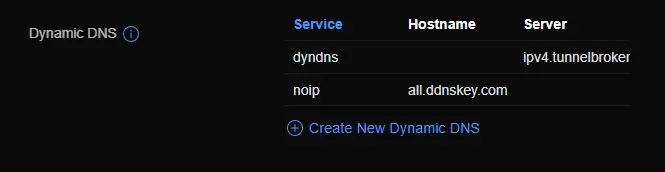

# Debugging DDNS for Unifi

This is a very short post on how to debug DDNS for Unifi.

<!-- more -->

## The issue

The reason this guide is being published- is because Unifi will give you no hints, or indications of any issues with your DDNS configuration via the User Interface.

Instead, you get a simple interface, which just displays your configured providers.



These, items will give you no indication if they are working, failing, etc.

### How to tell if its broken?

The only way I have found so far, other then looking at the DDNS provider, is by either looking at `/var/log/messages` on the Unifi Gateway, or running the ddns-update command (Explained further below).

Just- log into the gateway, and run this command: `tail -n 100 -f messages`

If- you have an issue, you will notice something along these lines:

``` bash
</html>
2024-07-22T14:20:53-05:00 UniFiNext-GenGatewayLite inadyn[2007]: Error response from DDNS server, ignoring ...
2024-07-22T14:22:53-05:00 UniFiNext-GenGatewayLite inadyn[2007]: Update forced for alias HE.NET, new IP# 1.2.3.4
2024-07-22T14:22:53-05:00 UniFiNext-GenGatewayLite inadyn[2007]: Update forced for alias My-DDNS.no-ip.com, new IP# 1.2.3.4
2024-07-22T14:22:53-05:00 UniFiNext-GenGatewayLite inadyn[2007]: Updating cache for HE.NET
2024-07-22T14:22:53-05:00 UniFiNext-GenGatewayLite inadyn[2007]: Fatal error in DDNS server response:
2024-07-22T14:22:53-05:00 UniFiNext-GenGatewayLite inadyn[2007]: [400 Bad Request] <html>
<head><title>400 Bad Request</title></head>
<body>
<center><h1>400 Bad Request</h1></center>
<hr><center>nginx</center>
</body>
</html>
2024-07-22T14:22:53-05:00 UniFiNext-GenGatewayLite inadyn[2007]: Error response from DDNS server, ignoring ...
2024-07-22T14:24:53-05:00 UniFiNext-GenGatewayLite inadyn[2007]: Update forced for alias HE.NET, new IP# 1.2.3.4
2024-07-22T14:24:53-05:00 UniFiNext-GenGatewayLite inadyn[2007]: Update forced for alias My-DDNS.no-ip.com, new IP# 1.2.3.4
2024-07-22T14:24:53-05:00 UniFiNext-GenGatewayLite inadyn[2007]: Updating cache for HE.NET
2024-07-22T14:24:54-05:00 UniFiNext-GenGatewayLite inadyn[2007]: Fatal error in DDNS server response:
2024-07-22T14:24:54-05:00 UniFiNext-GenGatewayLite inadyn[2007]: [400 Bad Request] <html>
<head><title>400 Bad Request</title></head>
<body>
<center><h1>400 Bad Request</h1></center>
<hr><center>nginx</center>
</body>
</html>
2024-07-22T14:24:54-05:00 UniFiNext-GenGatewayLite inadyn[2007]: Error response from DDNS server, ignoring ...
2024-07-22T14:26:54-05:00 UniFiNext-GenGatewayLite inadyn[2007]: Update forced for alias HE.NET, new IP# 1.2.3.4
2024-07-22T14:26:54-05:00 UniFiNext-GenGatewayLite inadyn[2007]: Update forced for alias My-DDNS.no-ip.com, new IP# 1.2.3.4
2024-07-22T14:26:54-05:00 UniFiNext-GenGatewayLite inadyn[2007]: Updating cache for HE.NET
2024-07-22T14:26:54-05:00 UniFiNext-GenGatewayLite inadyn[2007]: Fatal error in DDNS server response:
2024-07-22T14:26:54-05:00 UniFiNext-GenGatewayLite inadyn[2007]: [400 Bad Request] <html>
<head><title>400 Bad Request</title></head>
<body>
<center><h1>400 Bad Request</h1></center>
<hr><center>nginx</center>
</body>
</html>
2024-07-22T14:26:54-05:00 UniFiNext-GenGatewayLite inadyn[2007]: Error response from DDNS server, ignoring ...
2024-07-22T14:26:57-05:00 UniFiNext-GenGatewayLite mca-ctrl[554774]: mca-ctrl[554774]: mca-proto.service_json(): failed to contact mcad
2024-07-22T14:28:54-05:00 UniFiNext-GenGatewayLite inadyn[2007]: Update forced for alias HE.NET, new IP# 1.2.3.4
2024-07-22T14:28:54-05:00 UniFiNext-GenGatewayLite inadyn[2007]: Update forced for alias My-DDNS.no-ip.com, new IP# 1.2.3.4
2024-07-22T14:28:54-05:00 UniFiNext-GenGatewayLite inadyn[2007]: Updating cache for HE.NET
2024-07-22T14:28:54-05:00 UniFiNext-GenGatewayLite inadyn[2007]: Fatal error in DDNS server response:
2024-07-22T14:28:54-05:00 UniFiNext-GenGatewayLite inadyn[2007]: [400 Bad Request] <html>
<head><title>400 Bad Request</title></head>
<body>
<center><h1>400 Bad Request</h1></center>
<hr><center>nginx</center>
</body>
</html>
2024-07-22T14:28:54-05:00 UniFiNext-GenGatewayLite inadyn[2007]: Error response from DDNS server, ignoring ...
2024-07-22T14:30:54-05:00 UniFiNext-GenGatewayLite inadyn[2007]: Update forced for alias HE.NET, new IP# 1.2.3.4
2024-07-22T14:30:54-05:00 UniFiNext-GenGatewayLite inadyn[2007]: Update forced for alias My-DDNS.no-ip.com, new IP# 1.2.3.4
2024-07-22T14:30:55-05:00 UniFiNext-GenGatewayLite inadyn[2007]: Updating cache for HE.NET
2024-07-22T14:30:55-05:00 UniFiNext-GenGatewayLite inadyn[2007]: Fatal error in DDNS server response:
2024-07-22T14:30:55-05:00 UniFiNext-GenGatewayLite inadyn[2007]: [400 Bad Request] <html>
<head><title>400 Bad Request</title></head>
<body>
<center><h1>400 Bad Request</h1></center>
<hr><center>nginx</center>
</body>
</html>
2024-07-22T14:30:55-05:00 UniFiNext-GenGatewayLite inadyn[2007]: Error response from DDNS server, ignoring ...
2024-07-22T14:32:43-05:00 UniFiNext-GenGatewayLite syslog-ng[76927]: Syslog connection broken; fd='12', server='AF_INET(10.100.7.254:5514)', time_reopen='60'
2024-07-22T14:32:55-05:00 UniFiNext-GenGatewayLite inadyn[2007]: Update forced for alias HE.NET, new IP# 1.2.3.4
2024-07-22T14:32:55-05:00 UniFiNext-GenGatewayLite inadyn[2007]: Update forced for alias My-DDNS.no-ip.com, new IP# 1.2.3.4
2024-07-22T14:32:55-05:00 UniFiNext-GenGatewayLite inadyn[2007]: Updating cache for HE.NET
2024-07-22T14:32:55-05:00 UniFiNext-GenGatewayLite inadyn[2007]: Fatal error in DDNS server response:
2024-07-22T14:32:55-05:00 UniFiNext-GenGatewayLite inadyn[2007]: [400 Bad Request] <html>
<head><title>400 Bad Request</title></head>
<body>
<center><h1>400 Bad Request</h1></center>
<hr><center>nginx</center>
</body>
</html>
2024-07-22T14:32:55-05:00 UniFiNext-GenGatewayLite inadyn[2007]: Error response from DDNS server, ignoring ...
2024-07-22T14:34:55-05:00 UniFiNext-GenGatewayLite inadyn[2007]: Update forced for alias HE.NET, new IP# 1.2.3.4
2024-07-22T14:34:55-05:00 UniFiNext-GenGatewayLite inadyn[2007]: Update forced for alias My-DDNS.no-ip.com, new IP# 1.2.3.4
2024-07-22T14:34:56-05:00 UniFiNext-GenGatewayLite inadyn[2007]: Updating cache for HE.NET
2024-07-22T14:34:56-05:00 UniFiNext-GenGatewayLite inadyn[2007]: Fatal error in DDNS server response:
2024-07-22T14:34:56-05:00 UniFiNext-GenGatewayLite inadyn[2007]: [400 Bad Request] <html>
<head><title>400 Bad Request</title></head>
<body>
<center><h1>400 Bad Request</h1></center>
<hr><center>nginx</center>
```

!!! warning
    As a warning- Unifi does not have sane retry logic.

    If your provider is failing, It will retry every two minutes.

    If, uncaught, your gateway can literally spend months, spamming the upstream provider with bad DDNS requests.


### How to debug

Debugging, is actually pretty simple. The first thing we need to do, is determine where the configuration file is.

You can do this by checking the running processes arguments by using: `ps aux | grep inadyn`

The piece we need, is the path.

``` bash hl_lines="1"
root@UniFiNext-GenGatewayLite:/var/log# ps aux | grep inadyn
root      564878  0.0  0.5   6636  5192 ?        S<   14:43   0:00 /usr/sbin/inadyn -n -s -C -f /run/ddns-ppp0-inadyn.conf
root      569939  0.0  0.0   4796   648 pts/0    S+   14:51   0:00 grep --color inadyn
```

We specifically need the configuration file, which in the above example is `/run/ddns-ppp0-inadyn.conf`

Afterwards, you can run the DDNS client manually using `inadyn -n -1 --force -f /run/YOUR_CONFIGURE_PATH_HERE.conf`   

``` bash title="Running inadyn without debug"
root@UniFiNext-GenGatewayLite:/var/log# inadyn -n -1 --force -f /run/ddns-ppp0-inadyn.conf
inadyn[575347]: In-a-dyn version 2.9.1 -- Dynamic DNS update client.
inadyn[575347]: Guessing DDNS plugin 'default@no-ip.com' from 'no-ip:2'
inadyn[575347]: Update forced for alias HE.NET, new IP# 1.2.3.4
inadyn[575347]: Update forced for alias all.ddnskey.com, new IP# 1.2.3.4
inadyn[575347]: Updating cache for HE.NET
inadyn[575347]: Fatal error in DDNS server response:
inadyn[575347]: [401 Unauthorized] badauth
inadyn[575347]: Error response from DDNS server, exiting!
inadyn[575347]: Error code 50: Authentication failure
```

IF, the generated logs are not descriptive enough, add `-l debug`, like so: `inadyn -n -1 -l debug --force -f /run/YOUR_CONFIGURE_PATH_HERE.conf`   

``` bash title="Running inadyn with debug"
root@UniFiNext-GenGatewayLite:/var/log# inadyn -n -1 -l debug --force -f /run/ddns-ppp0-inadyn.conf
inadyn[574090]: In-a-dyn version 2.9.1 -- Dynamic DNS update client.
inadyn[574090]: Guessing DDNS plugin 'default@no-ip.com' from 'no-ip:2'
inadyn[574090]: Cached IP# 1.2.3.4 for HE.NET from previous invocation.
inadyn[574090]: Last update of HE.NET on Mon Jul 22 14:57:46 2024
inadyn[574090]: Cached IP# 1.2.3.4 for all.ddnskey.com from previous invocation.
inadyn[574090]: Last update of all.ddnskey.com on Mon Jul 22 14:57:46 2024
inadyn[574090]: Get address for custom
inadyn[574090]: Checking for IP# change, querying interface ppp0
inadyn[574090]: Checking IPv4 address 1.2.3.4 ...
inadyn[574090]: IPv4 address 1.2.3.4 is valid.
inadyn[574090]: Checking IPv4 address 1.2.3.4 ...
inadyn[574090]: IPv4 address 1.2.3.4 is valid.
inadyn[574090]: No IP# change detected for custom, still at 1.2.3.4
inadyn[574090]: Get address for default@no-ip.com
inadyn[574090]: Checking for IP# change, querying interface ppp0
inadyn[574090]: Checking IPv4 address 1.2.3.4 ...
inadyn[574090]: IPv4 address 1.2.3.4 is valid.
inadyn[574090]: Checking IPv4 address 1.2.3.4 ...
inadyn[574090]: IPv4 address 1.2.3.4 is valid.
inadyn[574090]: No IP# change detected for default@no-ip.com, still at 1.2.3.4
inadyn[574090]: Update forced for alias HE.NET, new IP# 1.2.3.4
inadyn[574090]: Update forced for alias all.ddnskey.com, new IP# 1.2.3.4
inadyn[574090]: Sending IP# update to DDNS server, connecting to ipv4.tunnelbroker.net(:443)
inadyn[574090]: Sending IP# update to DDNS server, initiating HTTPS ...
inadyn[574090]: SSL connection using TLS_AES_256_GCM_SHA384
inadyn[574090]: Certificate OK
inadyn[574090]: SSL server cert subject: /CN=tunnelbroker.net
inadyn[574090]: SSL server cert issuer: /C=US/ST=Arizona/L=Scottsdale/O=Starfield Technologies, Inc./OU=http://certs.starfieldtech.com/repository//CN=Starfield Secure Certificate Authority - G2
inadyn[574090]: Sending alias table update to DDNS server: GET /nic/update?hostname=HE.NET HTTP/1.0
Host: ipv4.tunnelbroker.net
Authorization: <redacted>
User-Agent: inadyn/2.9.1 https://github.com/troglobit/inadyn/issues

inadyn[574090]: Successfully sent HTTPS request!
inadyn[574090]: Successfully received HTTPS response (380/8191 bytes)!
inadyn[574090]: DDNS server response: HTTP/1.0 429 NI
Date: Mon, 22 Jul 2024 19:59:33 GMT
Server: Apache/2.4.52 (Ubuntu)
Strict-Transport-Security: max-age=31536000; includeSubDomains; preload
Set-Cookie: referer=Direct%20Access; path=/; secure
Content-Security-Policy: frame-ancestors 'self'
X-Content-Type-Options: nosniff
Content-Length: 6
Connection: close
Content-Type: text/html; charset=utf-8

abuse
inadyn[574090]: Fatal error in DDNS server response:
inadyn[574090]: [429 NI] abuse
inadyn[574090]: Sending IP# update to DDNS server, connecting to dynupdate.no-ip.com([158.247.7.204]:443)
inadyn[574090]: Sending IP# update to DDNS server, initiating HTTPS ...
inadyn[574090]: SSL connection using ECDHE-RSA-AES256-GCM-SHA384
inadyn[574090]: Certificate OK
inadyn[574090]: SSL server cert subject: /CN=*.no-ip.com
inadyn[574090]: SSL server cert issuer: /C=US/O=DigiCert Inc/OU=www.digicert.com/CN=RapidSSL TLS RSA CA G1
inadyn[574090]: Sending alias table update to DDNS server: GET /nic/update?hostname=all.ddnskey.com&myip=1.2.3.4 HTTP/1.0
Host: dynupdate.no-ip.com
Authorization: <redacted>
User-Agent: inadyn/2.9.1 https://github.com/troglobit/inadyn/issues

inadyn[574090]: Successfully sent HTTPS request!
inadyn[574090]: Successfully received HTTPS response (226/8191 bytes)!
inadyn[574090]: DDNS server response: HTTP/1.1 200 OK
Server: nginx
Content-Type: text/plain; charset=UTF-8
Connection: close
Cache-Control: private, must-revalidate
Date: Mon, 22 Jul 2024 19:59:33 GMT
pragma: no-cache
expires: -1

nochg 1.2.3.4
inadyn[574090]: Successful alias table update for all.ddnskey.com => new IP# 1.2.3.4
inadyn[574090]: Updating cache for all.ddnskey.com
inadyn[574090]: Error response from DDNS server, exiting!
inadyn[574090]: Error code 48: DDNS server response not OK
root@UniFiNext-GenGatewayLite:/var/log#
```

At this point, you should have plenty of details to hopefully determine the issue. 

Make your corrections to fix the issue through either the Unifi interface, or via manually editing the file (You will need to still update the unifi interface afterwards!). And- test again.

``` bash
root@UniFiNext-GenGatewayLite:/var/log# inadyn -n -1 --force -f /run/ddns-ppp0-inadyn.conf
inadyn[578851]: In-a-dyn version 2.9.1 -- Dynamic DNS update client.
inadyn[578851]: Guessing DDNS plugin 'default@no-ip.com' from 'no-ip:2'
inadyn[578851]: Update forced for alias HE.NET, new IP# 1.2.3.4
inadyn[578851]: Update forced for alias all.ddnskey.com, new IP# 1.2.3.4
inadyn[578851]: Updating cache for HE.NET
inadyn[578851]: Updating cache for all.ddnskey.com
root@UniFiNext-GenGatewayLite:/var/log#
```


