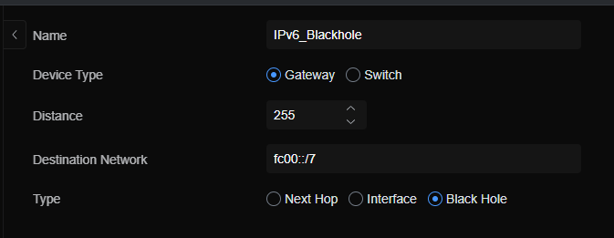

# HE.NET IPv6 tunnel behind Unifi

[HE.NET Tunnelbroker](https://tunnelbroker.net/){target=_blank} will give you a /48 block of IPv6 addresses completely free of charge.

This, is extremely handy for when your ISP does not offer IPv6.

The problem, comes, when your primary firewall is Unifi, as it does not technically support IP6to4/GIF tunnels.

Rather, then to customize / hack up the unifi console, I instead elected to host the tunnel from within my network.

This- is the steps on how I accomplished it.


## Step 1. Register, and get a tunnel.

``` bash
#!/bin/bash

# Fill in the details from https://tunnelbroker.net/tunnel_detail.php

# Server IPv6 Address:
YOUR_IPv6_WAN_IP="2001:470:1f0e:bc::1/64"

# Client IPv6 Address
YOUR_IPv6_LOCAL_IP="2001:470:1f0e:bc::2/64"

# Server IPv4 Address:
YOUR_IPv4_ENDPOINT="184.105.253.10"

# You will need to alter this command, depending on what type of internet you have. I have a PPPOE-based connection. This- gets my current IPv4 address.
YOUR_IPv4_WAN_IP=$(ip -4 addr show dev ppp0 | grep -oP '(?<=inet\s)\d+(\.\d+){3}')


tunnel add he-ipv6 mode sit remote $YOUR_IPv4_ENDPOINT local $YOUR_IPv4_WAN_IP ttl 255
link set he-ipv6 up

echo "* * * * * /mnt/data/on_boot.d/42-he-ipv6-ip6tables.sh" > /etc/cron.d/enforce-he-ipv6-ip6tables

ip address add $YOUR_IPv6_LOCAL_IP dev he-ipv6
ip route add ::/0 dev he-ipv6

logger -s -t enable-he-ipv6 -p INFO HE-IPV6 enabled
```

### Test to ensure the connection is working

``` bash
root@UniFiNext-GenGatewayLite:/var/log# ping -6 google.com
PING google.com(jl-in-x71.1e100.net (2607:f8b0:4001:c16::71)) 56 data bytes
64 bytes from jl-in-x71.1e100.net (2607:f8b0:4001:c16::71): icmp_seq=1 ttl=112 time=34.7 ms
64 bytes from jl-in-x71.1e100.net (2607:f8b0:4001:c16::71): icmp_seq=2 ttl=112 time=34.3 ms
64 bytes from jl-in-x71.1e100.net (2607:f8b0:4001:c16::71): icmp_seq=3 ttl=112 time=34.0 ms
```

If- you are getting responses, fantastic.  If not- go back and double check all of your values.

## Optional - Configure NAT / Prefix Remapping

I personally, use local IPv6 ranges inside of my network.

The address range `fc00::/7` is allocated for private networks. (Its the IPv6 equivalent of RFC1918)

I do this- because it means my internal IP allocations is not affected by My ISP, My HE.NET tunnel, etc.

If, my ISP decides tomorrow to start offering IPv6 service, I can easily configure it at my firewall, and everything will still work without issues.

If, you would like to do so- here is my script to configure this.

``` bash
#!/bin/bash

# Define the external interface and prefix
EXTERNAL_INTERFACE="he-ipv6"
EXTERNAL_IPV6_PREFIX="2001:470:b893:"  # YOUR allocated /48 block prefix

# Define an array of VLAN numbers and their hexadecimal equivalents
VLAN_NUMBERS=(5 64 12 1)
VLAN_HEX=("5" "40" "c" "1")

# Clear existing NAT rules
ip6tables -t nat -F
ip6tables -t nat -X

# Loop through the array of VLAN numbers and set up NAT66
for i in "${!VLAN_NUMBERS[@]}"; do
    VLAN=${VLAN_NUMBERS[$i]}
    VLAN_HEX_VAL=${VLAN_HEX[$i]}
    
    # Internal subnet prefix (fc00:VLAN::/64)
    INTERNAL_SUBNET="fc00:${VLAN_HEX_VAL}::/64"
    
    # External subnet prefix (2001:470:b893:VLAN::/64)
    EXTERNAL_SUBNET="${EXTERNAL_IPV6_PREFIX}${VLAN_HEX_VAL}::/64"
    
    # Add NAT66 rule
    ip6tables -t nat -A POSTROUTING -o $EXTERNAL_INTERFACE -s $INTERNAL_SUBNET -j SNAT --to $EXTERNAL_SUBNET
done

# Save the ip6tables rules to ensure they persist across reboots
ip6tables-save > /etc/ip6tables.rules

# Load ip6tables rules on boot
echo '#!/bin/bash' > /etc/network/if-up.d/ip6tables
echo 'ip6tables-restore < /etc/ip6tables.rules' >> /etc/network/if-up.d/ip6tables
chmod +x /etc/network/if-up.d/ip6tables

echo "NAT66 configuration complete."

```

## Configure Route to prevent Local IPv6 addresses from leaving your network.

While- the upstream tunnel will discard the local addresses- We still want to keep the local traffic from leaving our network.

We can do this by using a black hole route.

Create a new static route, for `fc00::\7`, as a blackhole, with a high value for distance.



You will want to create a few different routes though.

* fc00::/7 (Unique Local Addresses)
* fe80::/10 (Link-Local Addresses)

## How to delete / remove.

To remove the connection, and cleanup everything...

``` bash
#!/bin/bash

# Variables (replace these with actual values)
YOUR_IPv6_LOCAL_IP="your_ipv6_local_ip"

# Remove the IPv6 route
/sbin/ip route del ::/0 dev he-ipv6

# Remove the IPv6 address from the tunnel interface
/sbin/ip addr del $YOUR_IPv6_LOCAL_IP dev he-ipv6

# Remove the cron job that enforces the ip6tables rules
rm /etc/cron.d/enforce-he-ipv6-ip6tables

# Bring down the tunnel interface
/sbin/ip link set he-ipv6 down

# Delete the tunnel interface
/sbin/ip tunnel del he-ipv6

echo "All configurations have been removed."
```
