# A reasonably priced, individually switched and metered PDU.

For years- I have been using a combination of [Sonoff S31 Plugs](./../../Home-Automation/2023/sonoff-s31-low-cost-energy-plug.md){target=_blank} and a [Kasa HS300 Strip](./../../Home-Automation/2022/kasa-powerstrip.md) to monitor, and measure my power consumption.

This- allowed me to fully visualize my rack's power consumption, [into a sankey diagram](./../../Home-Automation/2023/home-assistant-energy-flow-diagram.md). 

However- the form-factor of neither solution was ideal, and as my rack has become nearly full, I needed a better solution as PDUs filled with smart-plugs, isn't exactly ideal.

The issue is, there are not many 120v PDUs, for a 24U rack. As a matter of fact, there are not many zero-U PDUs at all for 24U racks.

But- I finally found an option, for a fully managed PDU, with INDIVIDUALLY metered and switched outlets, which CAN^1 plug into a standard 120v outlet.

<!-- more -->

## The Vertiv NU30117

So- as a warning- there is basically no public documentation I was able to find for these units. The manufacturer does not even list the datasheets anymore as these units are EOL.

However- As I purchased a unit, racked it up, and put it into use- I will tell you- these do work, and they work quite well. 

At this time, they can be acquired for "BRAND NEW", in the original packaging, with the original manuals^2, for 170$. However- I will also say- there are 27 units available still, and ZERO other results on eBay.

So... if you are reading this post in one month- there is a good chance, they will all be gone.

### General Specifications

Input Connection: NEMA L5-30R (120v, 30 amp locking plug) - Input connections are metered.

Output Connections: 12x NEMA 5-20R (120v plug which supports standard 5-15R plugs, as well as 20amp 5-20R plugs.) All outputs are individually metered, and switched.

Dimensions: 1U, rack mountable

No licenses appear to be needed. Comes with web interface, SSH, SNMP. No additional "cards" needed to enable connectivity features.

Has the ability to trigger outlets based on conditions.

Dual, Redundant 100M network connections.

### Where can you get it?

[Ebay Link - Affiliated](https://ebay.us/41ex8R){target=_blank}

--8<--- "docs/snippets/ebay-affiliate.md"

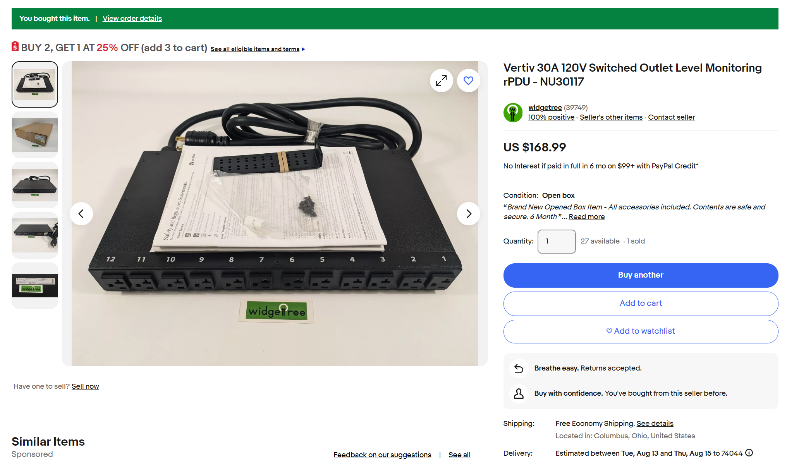

As of this time, this is the ONLY posting on eBay for this model. And, only a few dozen are left.

### How to use it?

#### Plug Adapter / Converter

!!! warning
    This unit uses a 30 amp plug, because this unit can pass 30 amps worth of current!

    There are always potential safety concerns when using adapters. 
    
    However- your 15 or 20 amp breaker "SHOULD" be the weak-link in your circuit.

    Do at your own risk.

You will need a special adapter to convert the NEMA L5-30R, into a standard NEMA 5-15P (or 5-20P)

L5-30R, stands for...

L = Locking (plug has a "lock", which requires it to be twisted to remove, or connect.)
5 = Number of poles. 5 specifically means, 125V with GND, HOT, Neutral. This- is the standard for circuits in North America. (5-15P, for example- is a normal outlet)
-
30 = Amperage rating. 30 amps. 
R = Receptacle (P = Plug)

So, if you intend on plugging this into a standard wall-outlet, You need to an adapter from L5-30R to 5-15P

[Amazon Link - L530R to 5-15P](https://amzn.to/4fwtArQ){target=_blank}

##### My personal strategy

For my personal needs- I will be cutting the code for the PDU. I plan on shortening the cable to only a few feet and installing a NEMA 5-20P.

[Amazon Link - NEMA 5-20P Connector](https://amzn.to/4dD7CBL){target=_blank}

My reasons for doing so-

1. The included cable is much, much longer then I need.
2. I plan on connecting this PDU, to a transfer switch, mounted next to the PDU. (inches away)
3. I have YEARS worth of history on the exact power consumption for each element in my lab. I know my consumption will not warrant needing 30 amps of current.
    - At which point I need more then 15 amps of 120v, the next step is to run a dedicated 240v plug to my server room. 240V PSUs are typically more efficient in servers too.
4. The adapter linked before- has a large diameter, and is not very flexible. I need this to all fit within 2 rack units.

### Pictures

The front.

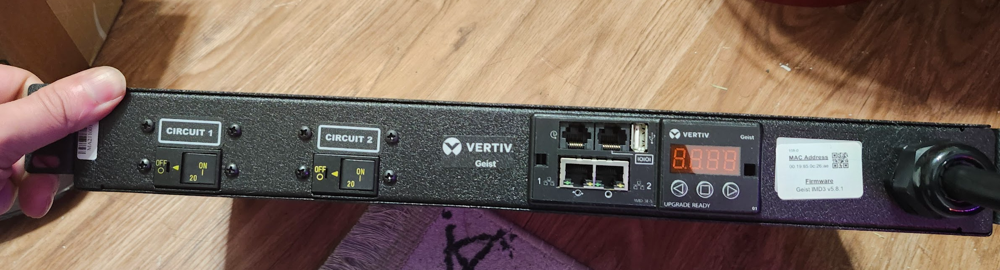

The rear.

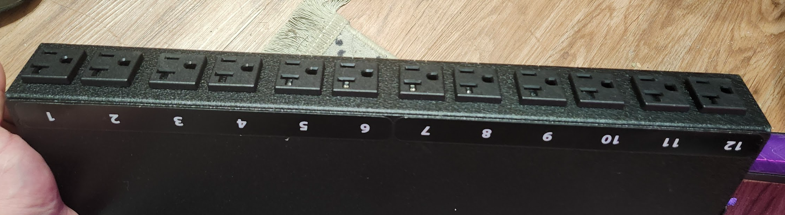

Here- is a picture of the unit mounted in my rack. It is mounted securely on the rear of the rack in a vertical orientation. 

This, unusual mounting, is due to limited spaces in the rack, and, I want to get the mess of power cables OUT of the rack. 

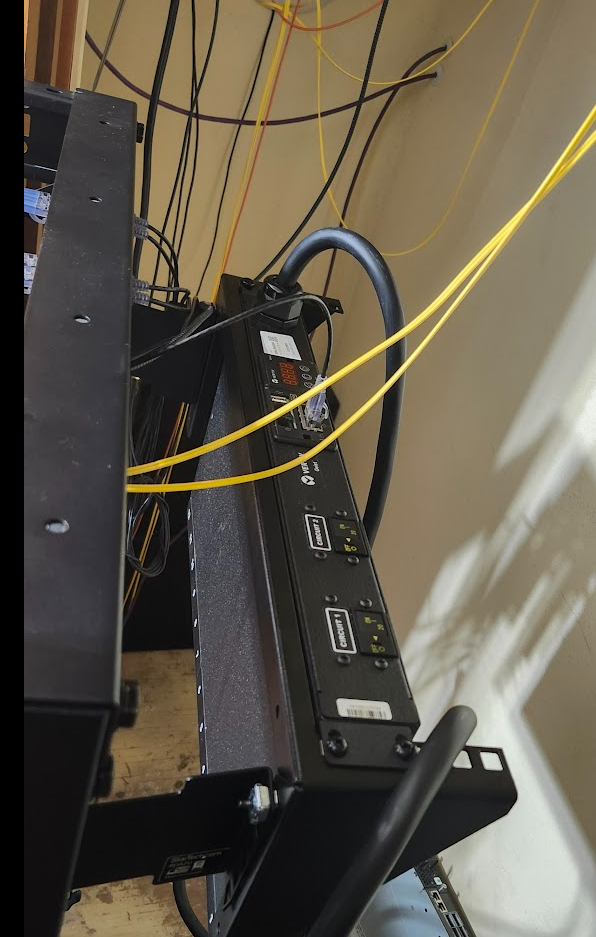

### Web Interface Walkthrough

#### Sensors 

##### Sensors > Overview

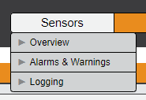

Main Screen, showing connected devices, configurable labels, current, voltage, wattage.

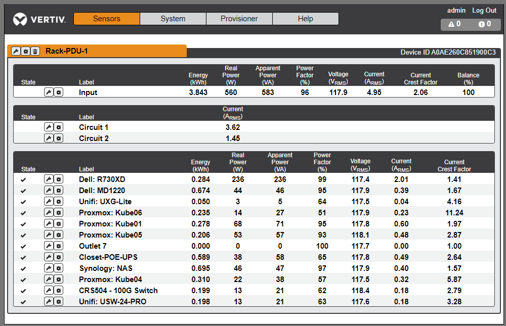

Each plug, has configurable label, and mode. The PDU can enact automated actions to turn plugs on or off as needed, based on criteria you specify.

As well- you can adjust the delay/behavior when power cycling, or rebooting.

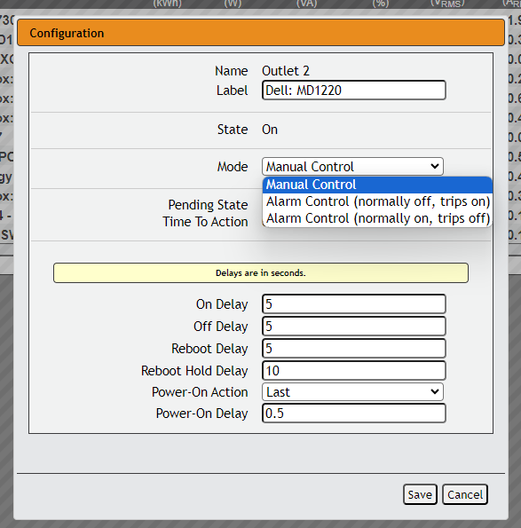

For the actions for a plug- you can turn on, off, power cycle, or reset energy data. You can optionally include a delay.

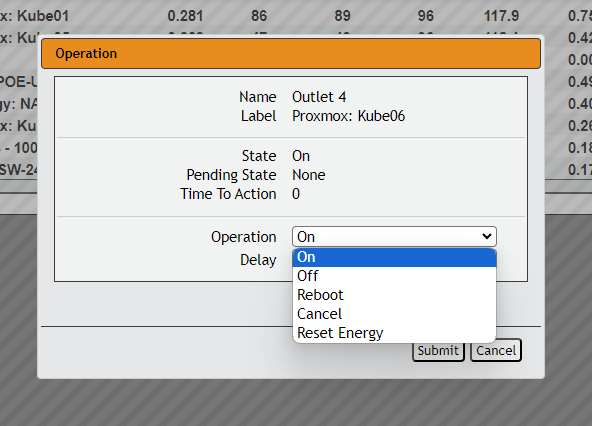

For the circuits, and primary input, you have the ability to reset energy usage data.

At the top/pdu level, you have a few actions for it. Reboot, Reset, Reset to defaults, etc.

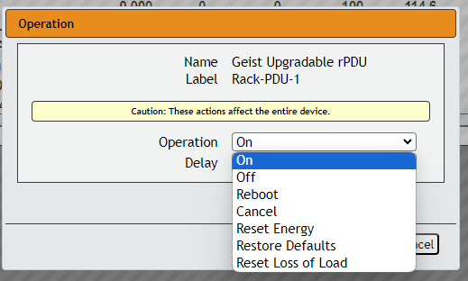

#### Sensors > Logging

The logging tab has a few interesting features.

1. Ability to export data in either JSON, or CSV format. Exported data includes basically everything seen on the main tab.
2. Adjustable logging period, store data more, or less frequently.
3. Ability to enable/disable logging for specific plugs.

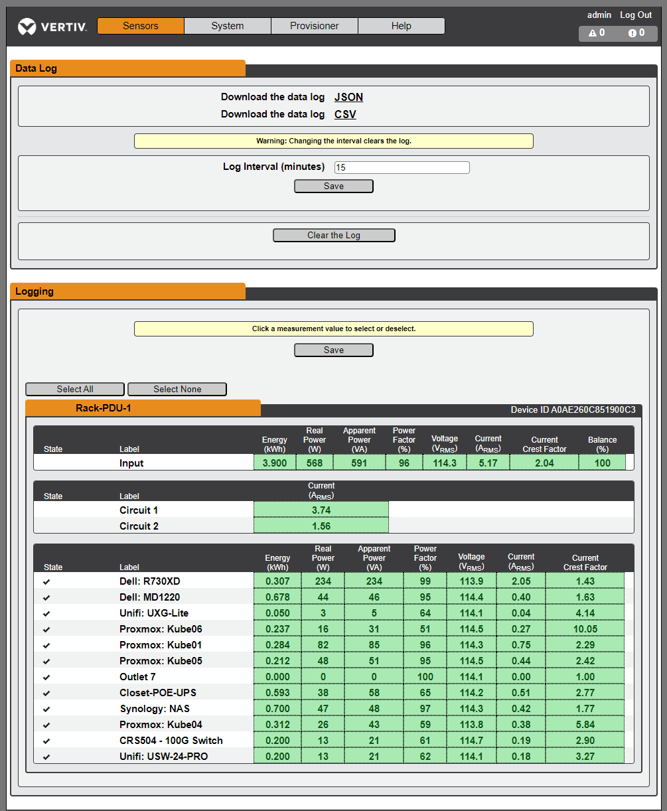

#### Sensors > Alarms & Warnings

For the warnings / alarms tab- there are few nice features here as well.

1. You can specify alarms for plug,circuit, or pdu level, for current,voltage,status,energy, power factor, etc...
2. Alarms can have a configurable time-slots.
3. This- can be used to turn a plug on automatically, at certain times of day. Or, to toggle a plug based on other conditions.

#### System Tab(s)

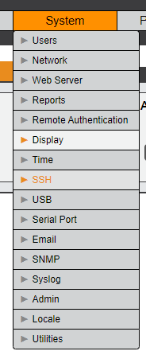

##### System > Users
For the users tab, multiple users can be specified. You can also optionally scope users access to only specific items.

The guest account allows viewing an overview of current data, without logging in.

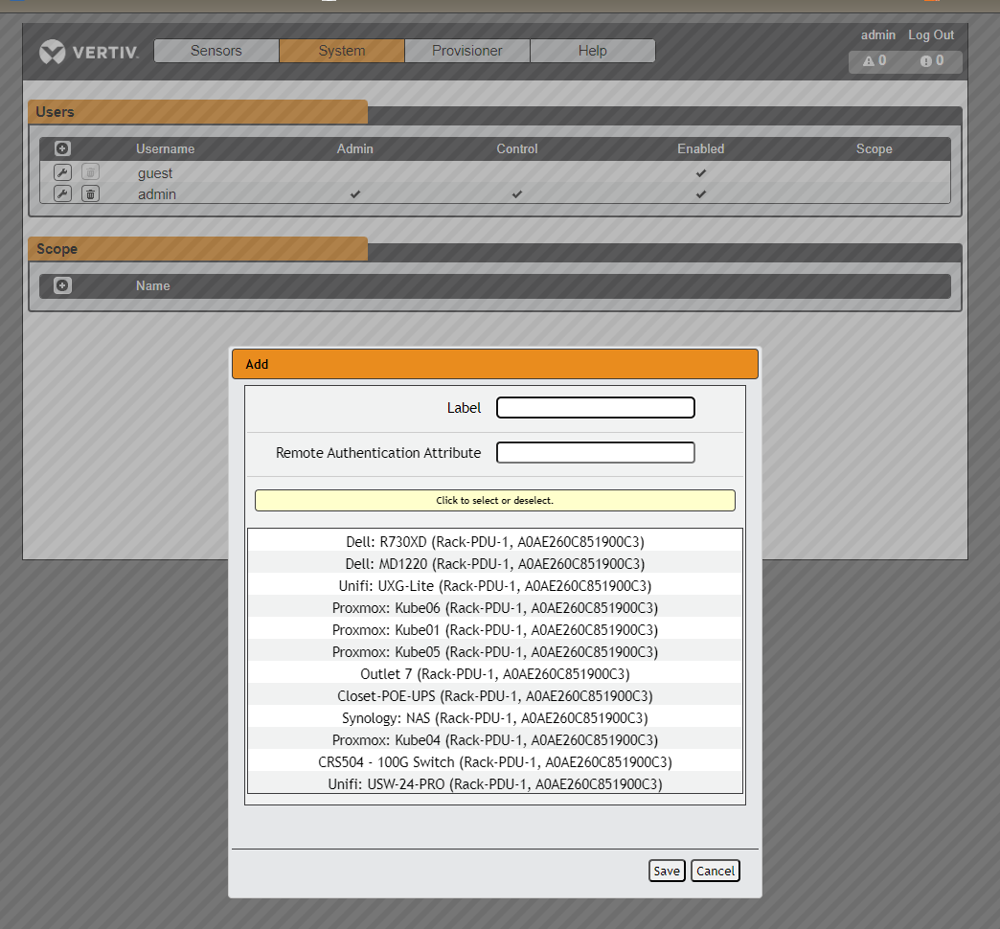

When creating users, you can specify if they are allowed to control plugs, if they have administrator rights (aka, adjust device configuration).

And- you can optionally assign a scope which limits access to specific plugs. (These options can also be edited for existing users)

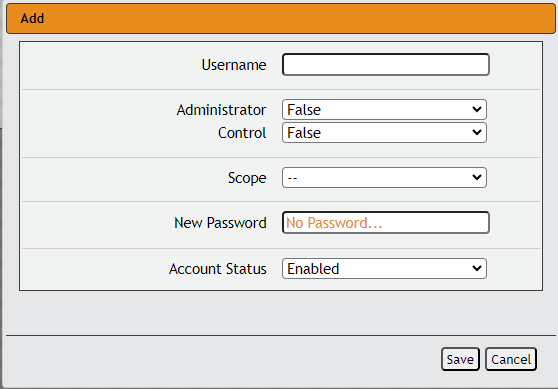

##### System > Network

For the networking tab- you can configure...

1. the ethernet bridge (by default- both ethernet ports are bridged).
2. IP Routing
3. IPv4 Addresses (Multiple, are allowed)
4. IPv6 Addresses (Multiple, are allowed)
5. DHCP for IPv4.
6. Optional RSTP for the bridge, with adjustable metric / cost.
7. DNS Server(s)

Image- Note- internal layer 2 / layer 3 addresses are removed.

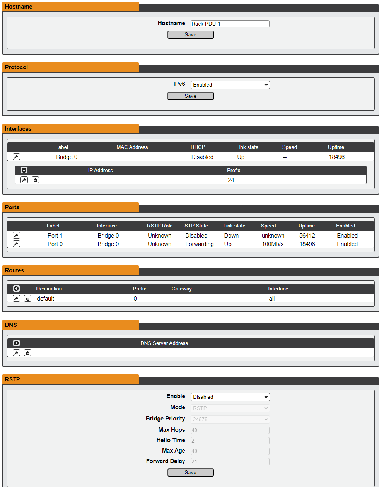

##### System > Web Server

For webserver options- HTTP can be enabled or disabled. HTTPs is always enabled. You can specify a SSL certificate and password for SSL.

##### System > Reporting / Email

Interestingly, this PDU has the ability to automatically generate and email reports. The- options are not very flexible, however, still an interesting option.

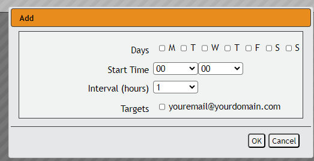

Email Configuration:

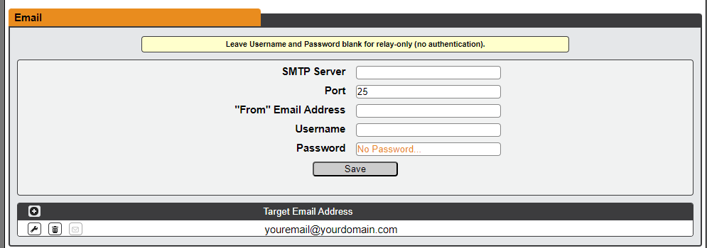

##### System > Authentication

For external authentication, there are options to configure...

1. LDAP / Active Directory
2. TACACS+
3. Radius

Note- only ONE option can be selected. You can't use LDAP AND Radius, for example.

Here- are the options-

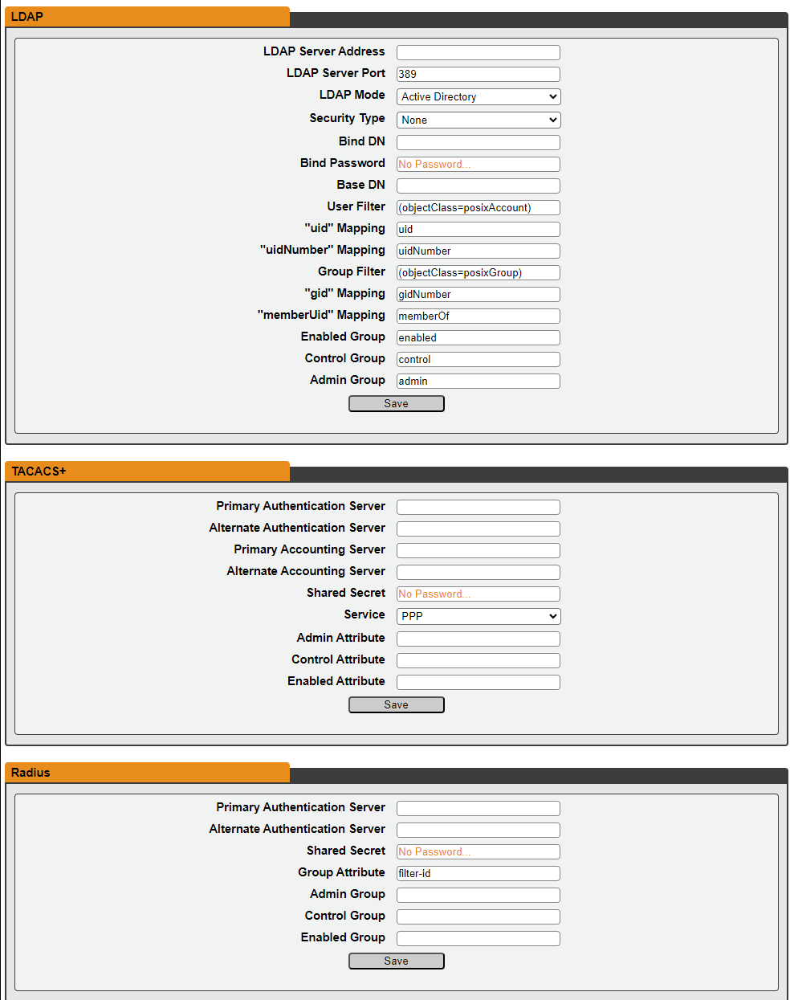

##### System > Display

You have the ability to configure the display on the PDU itself. 

##### System > SSH

This unit has SSH access enabled by default. You can enable, or disable it, and change the port.

There is no option to disallow password-login, or change any other functionality.

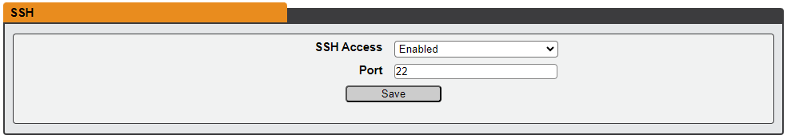

If you use key-based authentication, configure public keys in the user's tab.

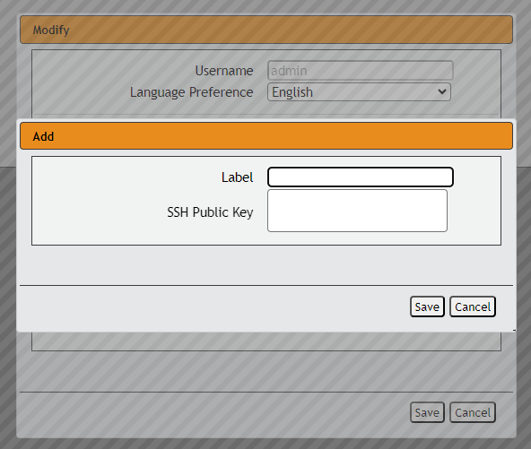

##### System > SNMP

The SNMP tab, has one extremely useful feature that you rarely see. It has link to download the MIBs for this PDU.

For- those who have configured SNMP based monitoring and data collection- You will know exactly how great this feature is... (Especially, since there is ZERO documentation for this PDU... easily accessible)

You can optional enable, or disable SNMP v1/2, and v3. You can adjust the port.

Version 3 is supported, with NoAuth,NoPriv, or Auth,NoPriv, Or Auth&Priv.

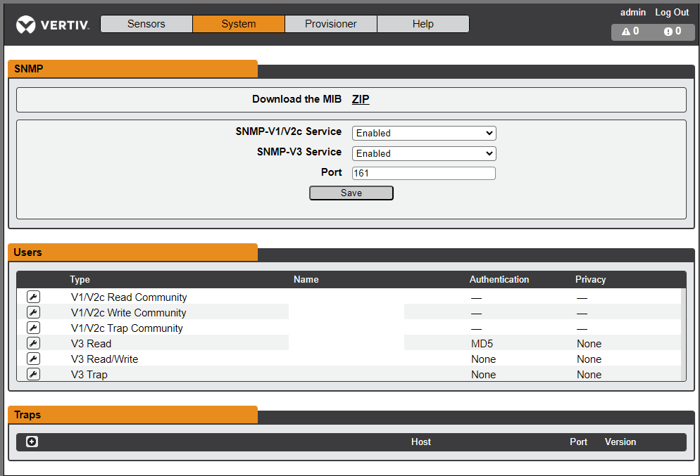

Multiple SNMP traps can be specified, with configurable host, version, port.

Individual Alarms, or warnings can be configured to send to the traps specified.

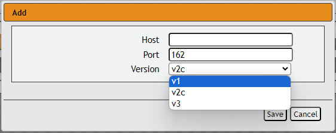

Details for SNMP location/contact/phone/etc are adjustable in the System > Admin tab.

##### System > Syslog

The syslog settings allows you to export the event log.

!!! info
    The exported eventlog, at least for me, seems to have an error, causing the columns to be mismatched.

    This, issue appears to carry over to remote syslog as well.

Events include configuration changes, network interface changes/events(up/down), authentication, and system service status changes and notifications.

You can configure a remote syslog server.

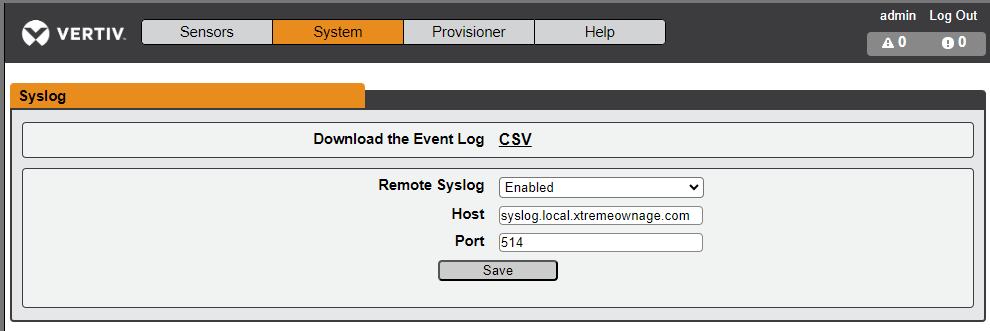

This unit does not appear to use the correct facility codes when used with a remote syslog server.

My testing shows all events being sent to user:notice. However, events do contain a field for service, which

##### System > Utilities

The utilities tab, allows backup, and restore of configuration, along with factory reset.

The aggregation section, I assume, is used with vendor-specific central management tools.

Firmware is upgradable, if you can find it.

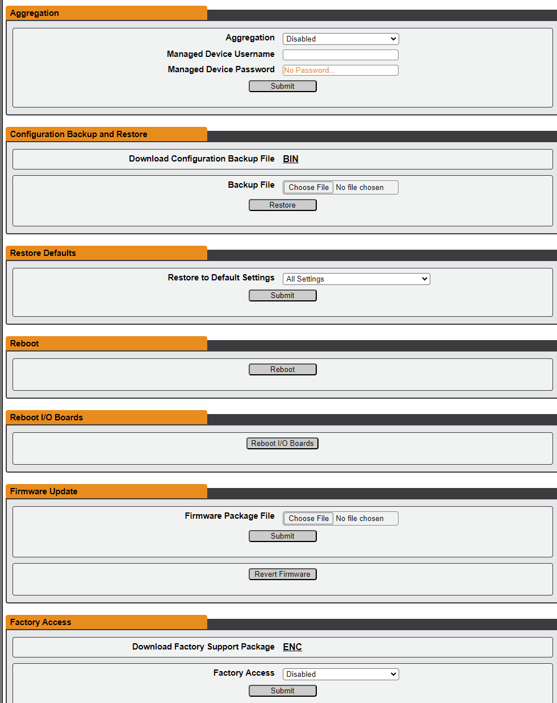

##### System - Misc 

For the system's time, NTP servers are supported, with configurable time-zone.

There is a USB tab, which allows enabling, or disabling USB, along with a listing of devices, serial, max power. (Not- sure the intended purpose here)

The serial port is configurable, with adjustable baud rate. Data/Stop/Parity are configured to 8/1/None with no ability to change.

Units of F, or C are settable.

Appears a few language options are selectable.

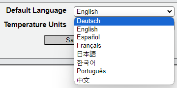

#### Provisioner Tab

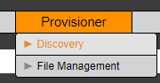

##### Provisioner > Discovery

As, again, documentation is pretty hard to come by, I am not sure of the intended purpose for this tab.

This- is being included for completeness. 

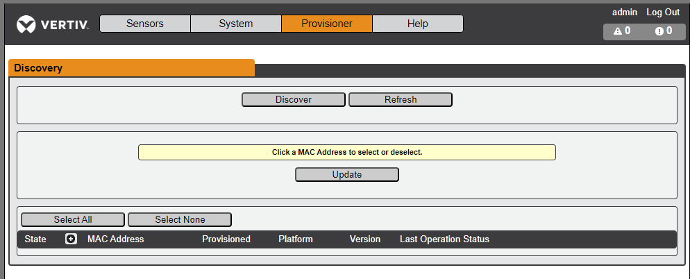

##### Provisioner > File Management

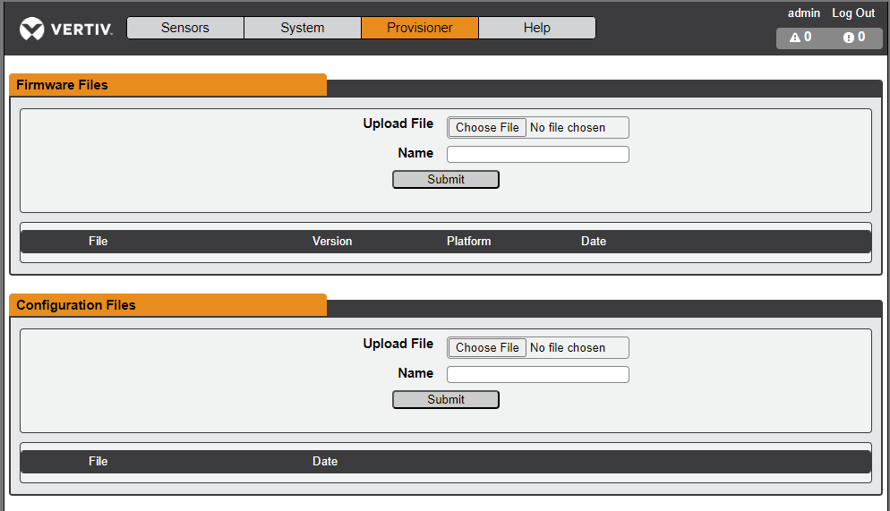

#### Help Tab

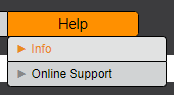

##### Help > Info

The info tab has a nice display showing current versions, firmware, serial, and lifetime energy.

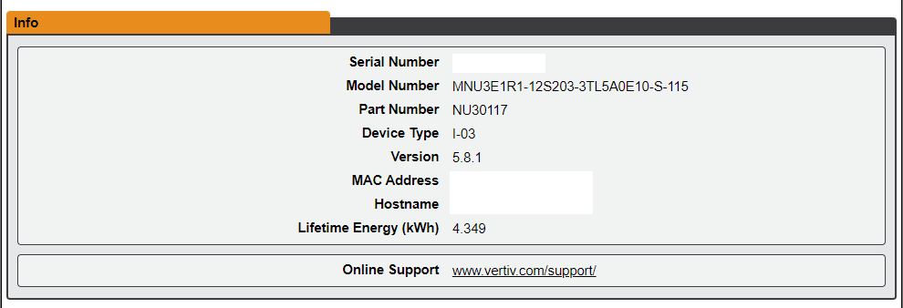

##### Help > Online Support

This option redirects you to vertiv's support page.

### SNMP Information

Using LibreNMS, I was able to effortless add this device. It was able to pull in common information with no configuration needed.

Included data automatically populated- contains voltage, amperage, and wattage details, for The unit, and the two internal circuits.

By default, individual plugs are not listed.

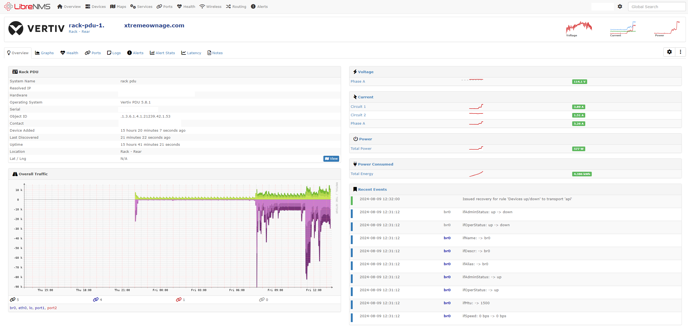

The included MIB sheet, is detailed, with names, OIDs, required access, units, and methods.

Common options have methods to remotely update and manage via SNMP. You, can issue a power-cycle for a plug for example.

The included MIBs, contains quite a few options not displayed in the GUI as well...

#### Example of available MIBs

Here, are the MIBS listed for "config and control for outlets with switching", and "metering data"

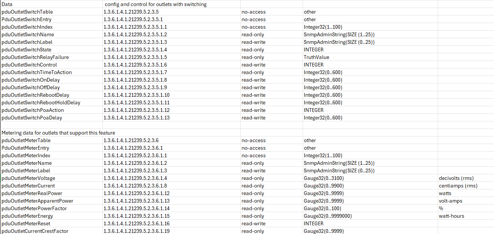

I will note, the sheets, includes hundreds of MIBs across two separate CSVs. .MIB files are also included.

I- am not going to dig into detail here on how to consume these MIBs, but, I will note, My goal is to automatically feed this data into EmonCMS, and from there, consume it with home assistant.

Keep- an eye out for a separate post regarding this.

^1 - With- the correct adapter to connect a NEMA L5-30R into a standard NEMA 5-15R, or 5-20R.
^2 - The linked posting advertising as including original packaging, and manuals. My unit which was purchased from the same listing, did come in the original packages, unopened, with all original documentation, and accessories. 