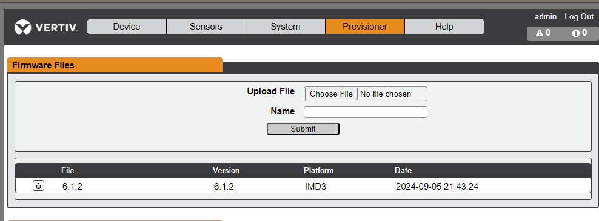
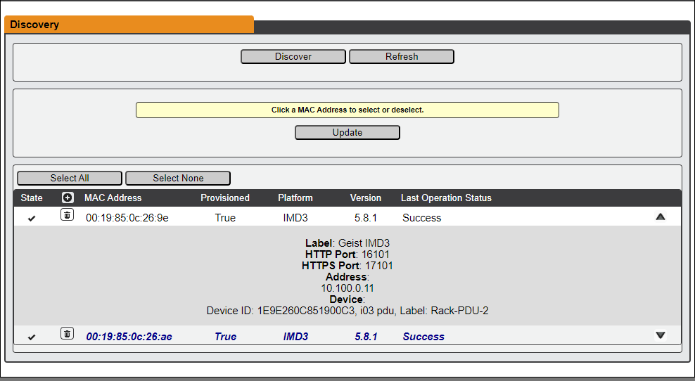
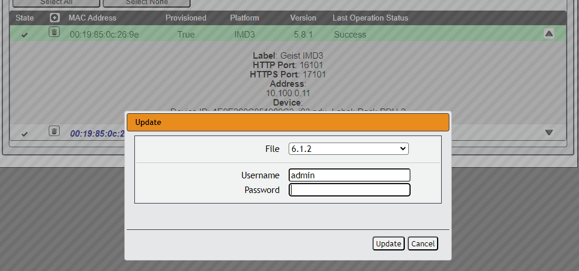
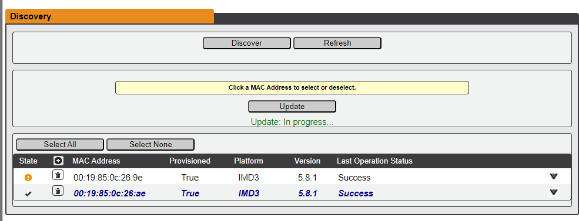
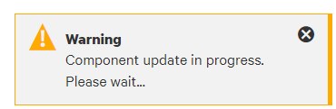
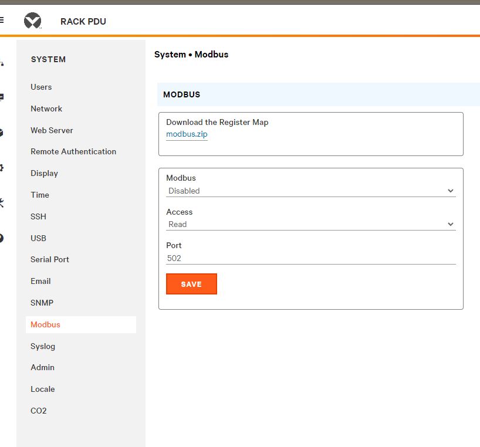

# Vertiv rPDU - Round 2

This is a follow up from the [vertiv rpdu post](./2024-08-09-vertiv-giest-pdu.md).

This post, includes details for updating firmware, integrating with Home Assistant, emoncms, etc.

<!-- more -->

## Give me a title.

### Upgrading the firmware

A fellow on [my discord](https://static.xtremeownage.com/discord){target=_blank} sent me a link for where to download updated firmware.

At this time, I have two of these units. Both of my units arrived with version 5.8.1. The latest available version is v6.1.2

You can download the firmware [HERE](https://www.vertiv.com/en-us/support/software-download/power-distribution/geist-upgradeable-series-v6-firmware/){target=_blank}

To note 6.1.2 was released April 30th, 2024, and is pretty fresh.

I did find [Release Notes](https://www.vertiv.com/49a924/globalassets/images/70935-geist-upgradeable-rack-pdu-firmware-release-notes-v6.1.2_revh.pdf){target=_blank} attached to the post.

To note, you will need to create an account. The email to confirm the account, also was auto-routed to my spam folder. So- make sure to check there.

You can upload multiple firmware versions to the device itself.

#### Upgrading Linked / Child devices.

Since, these PDUs support linking multiple units togather, you can upgrade child devices directly through the parent interface.

Just- click the device you want to update, click update, and select the firmware file you uploaded.

Afterwards, a status message, will be displayed, letting you know the device is updating.

The firmware updates will take a few minutes.

AFTER the firmware completes, the unit may need to update the individual hardware components. This may take a while.

#### New Interface

#### Other new features

I did find a new configuration area for modbus.

