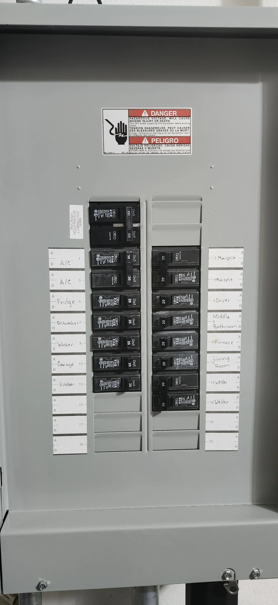
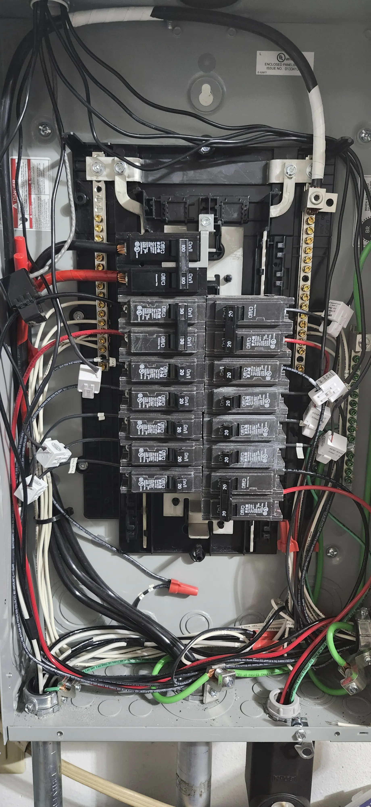
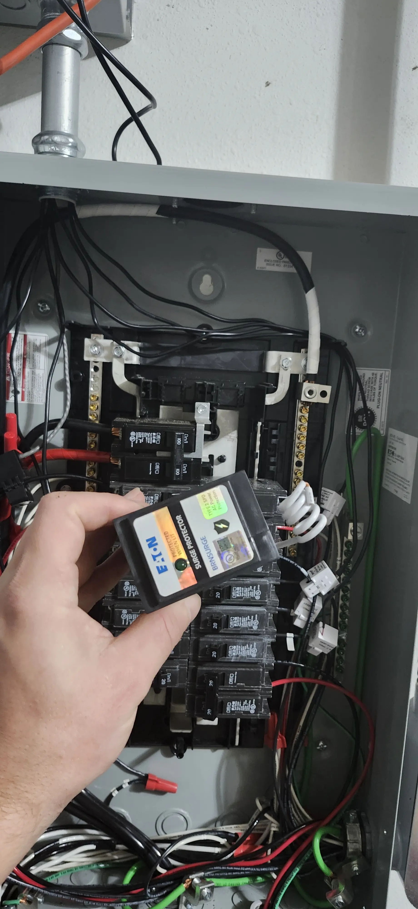
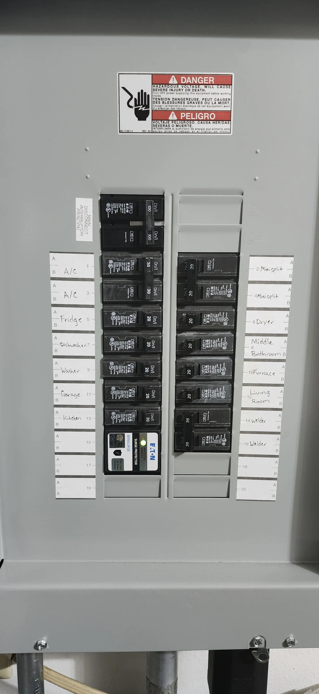
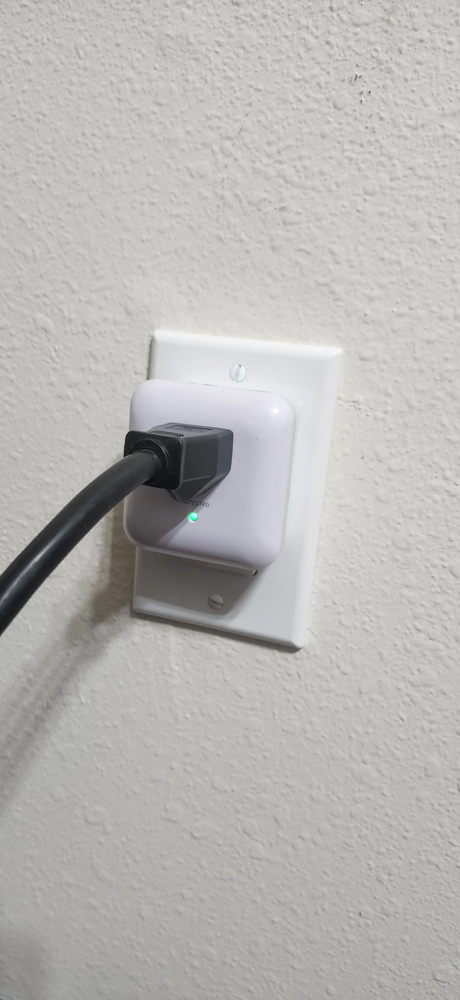

# Surge Protection - Entire Home, Rack-Only, etc.

A few months back, I noticed one of my ESP32s, got smoked during a few nasty thunderstorms.

And- it got me thinking- what happens if a large surge hits my house? 

Is, it going to smoke my fridge? My TV? How about my server rack full of expensive gear?

So- I went on a project to upgrade the surge protection for my house.

<!-- more -->

## Protecting the house

So- first of all, I wanted to add a bit more protection to the general house.

There- are quite a few options here, ranging from a few bucks (cheap surge protection), up to the thousands.

I don't intend to being able to stop a DIRECT lightning strike- that takes a lot more then a small piece of hardware. My goal was to add some protection from near-strikes, or strikes to the distribution line.

Ideally, this would be handled through a surge device directly after your service-entrance meter. 

After pondering, I decided to pick up a [Eaton BRNSURGE Type BR](https://amzn.to/3BcGrzM){target=_blank}. This fits into your breaker panel into an available double-slot, and provides protection for both poles.

The price, was very reasonable, under 100$. If- it gets used once- that can easily justify itself.

This- unit is rated to handle a 18,000 amp surge.

If, you want an even better option (Eaton's wording, not mine!)- Consider a brick. The [CHSPT2ULTRA](https://amzn.to/3Xw891W){target=_blank} costs double-the price,  but- there is a big-advantage-

Eaton's warranty on these devices, will pay to replace any damaged equipment. 

See [Eaton Residential Surge Protection](https://www.eaton.com/content/dam/eaton/products/residential/electrical-safety/nec-surge-protection-cc003013en.pdf){target=_blank}

This- is not covered under the "basic" [BRNSURGE](https://amzn.to/3BcGrzM){target=_blank} which I am using.

### Installing the unit

!!! danger
    Obligatory disclaimer

    If you aren't an electrician, Don't go digging around with mains voltage.

    It can kill you. You have been warned.

#### Step 1. Identify your panel

The first part- before you consider ordering one of these- go find your panel.

Make sure you have an available slot for a double-breaker!

In my case, you can see what appears to be an ideal spot at the top-right, along with available slots on the bottom.

#### Step 2. Remove the front-cover

You have already been warned to not play with live-voltage!!!!

But- the next part, is to remain the front of the panel, to gain access to the breakers and wiring.

Now- a few things were discovered at this point-

1. The conductors for the main breaker have stick-out- that is no bueno. But- a problem for another day.
2. Remember that nice spot at the top-right? Its blocked.
3. If- you are curious about the weird white things around half of the cables- that is my [Per-Breaker Energy Monitoring](./../../Solar/solar-part-4-monitoring.md){target=_blank}.

As a random note- there is no romex here- everything is THHN/THWN, because it travels through conduit.

#### Step 3. Identify a suitable location for the surge arrestor

IDEALLY- you want this to be as close to the main-breaker as possible. 

In my case- there isn't a ton of slack to go around, and the top-right spot is filled. So- I slapped it into the bottom socket. 

Make sure to also connect the neutral leg.

The green light, lets you know the unit is functioning correctly. If you don't see a green light, something was done incorrectly.

#### Final Step - Reinstall the cover

#### BUT, BUT, BUT....

Yes... I know. The arm-chair warriors are furious this is not installed next to the main-breaker.

And- I am not worried. Would you like to know why?

First- the [manufacturer documentation](https://www.eaton.com/content/dam/eaton/products/backup-power-ups-surge-it-power-distribution/temporary-power/surge/chpsurge-surge-protective-devices-instruction-leaflet%20il010005en.pdf){target=_blank} does not specify location. Eaton knows more then you do. I promise. They have been doing this for over one hundred years.

Next- I have received comments- It can't do ANYTHING at the bottom of the panel.

On the happy side- mains panels don't use a token ring for energy distribution. Everything runs in parallel along the massive back-plane.

The resistance from the main-breaker, to this surge protection device, is MUCH LESS then the resistance to the next-connected device.

Remember- that THHN/THWN I mentioned? There is 20 foot of it. Afterwards, it goes into a junction box, where it gets translated into romex, which travels throughout the house.

There is SIGNIFICANTLY less resistance through 8 inches of the 200amp panel's back-plane, then there is through 20 foot of 12/14AWG THHN/THWN + 20-80 foot of romex.

Not to mention- the amount of inductance along the length of the wire.

Long story short- I am not worried about it, and Eaton does not specify this needs to happen, and the product/warranty terms, also, do not specify this.

Yes- I will agree, that the closer to the mains it is, the more effective it should be. However, I am not in the least bit worried about it. And- neither is eaton's 

## Project Two- Better surge protection for my rack.

Since, none of the [PDUs](./2024-08-09-vertiv-giest-pdu.md) on my rack explicitly say, "Surge Protection"- I wanted to add an in-line device just as a fail-safe.

And- for under 10$, [Monoprice 1 Outlet Surge](https://www.amazon.com/Monoprice-68-207-7382R-Outlet-Protector-Service/dp/B076CRH2DN){https://amzn.to/3TBF981}{target=_blank} both fits the bill, and fits the need.

The [specifications](https://www.monoprice.com/product?p_id=27850){target=_blank} list a rating of 400v, with a max current capacity of 15amps, and a < 1ns response, which fits my needs perfectly.

In, one nanosecond, light will travel 300 millimeters in a vacuum. Now- electricity, travels at the speed of light. 

Theoretically- this means, a massive voltage-surge will travel roughly one foot, before the device reacts. Since- there is 6 foot of cable between this device, and the next-connected load (An APC PDU), everything should be just fine.

As a bonus- installation is very easy. You plug it in.

So- dirt-cheap, and effortless install. These are the best types of devices.

## Closing notes

Not- really the most exciting topic to post about. 

However, most of these posts are documented for my needs as well.

I have found myself frequently needing to review previous documentation to determine the state of something in the past, or exactly how something was done.

Or- maybe I have a friend, co-worker, or fellow Redditor looking to do something similar. In either case, this documentation comes in handy pretty frequently.

And- I don't mine sharing my experiences. So- Enjoy!

--8<--- "docs/snippets/amazon-affiliate.md"
