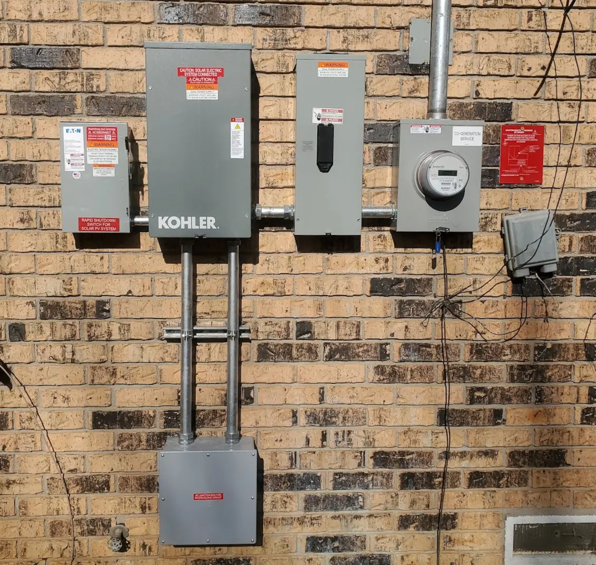

# My homelab - End of 2024

This post will go over my lab, as a whole as of December 2024.

<!-- more -->

## Overview

I will split this post into a few sections.

1. Compute
    - Discuss the servers, and workloads.
2. Storage
    - Discuss the various types of storage used.
    - Backups
3. Power
    - How is my lab powered? 
    - Solar-powered lab
4. Networking
    - A overview of how the network is setup, technologies used.
5. Rack Accessories, Organization
    - This- is the section for things seen in the rack. Finger trays, custom enclosures, the rear-mounted power management, etc.
    - If anyone is looking for any of the specific products you see in my rack, I will include links.

But- first, a brief overview.

### Pictures

#### Rack itself

This, is the front of my rack.

This- is the bottom, rear of the rack.

This, is the top-rear. I have my PDUs, and ATS mounted here.

This, is the top of the rack, looking down. (The ESP you see is a BT proxy for Home Assistant)

When- I am not working on my rack, It lives in the closet.

#### Power Delivery

I will go into this more in-depth further down- but, I have a pretty comprehensive power delivery system, with a few redundancies

## Compute

### Servers / Hardware

For servers, I have a balance between small, efficient hardware and enterprise servers.

I run 5 machines, 24x7. The compute element of my lab uses around 350-400 watts.

ALL of my servers run Proxmox as the base OS. 

#### Optiplex SFFs

First- I have a pair of optiplex SFFs- These are the "core" compute elements of my lab.

These machines are reasonably efficient, and quite flexible. 

- 2x Optiplex 5060 SFF [eBay](https://ebay.us/UVsUiU){target=_blank}
    - i7-8700 (6c / 12t @ 3.20ghz)
    - 64G DDR4 (MAX Ram: 64G, 4 DIMMs, No ECC)
    - LSI 9287-8e SAS HBA (External) [eBay](https://ebay.us/O73eWN)
        - This connects to the MD1220 disk shelf, which contains both SAS and SATA SSDs primarily used for CEPH.
        - Each SFF, has access to "Half" of the shelf. (The shelf is running in "split" mode)
    - Mellanox ConnectX-4 CX-416A 100GBe Dual Port NIC [eBay](https://ebay.us/W0nsy0){target=_blank}
        - This is the primary network connection.
        - One port on each host connects to the 100G switch
        - The other port, is used for failover, and is connected to my 10G Unifi Aggregation Switch.
        - I picked these up for around 125$ each.
    - 128G Kioxia NVMe [eBay](https://ebay.us/r4L130){target=_blank}
        - These things are dirt-cheap, and make great boot drives.
    - **Power**: These machines average around 50 watts. 
        - These are the backbone of my ceph cluster, which houses the majority of my lab's storage.
        - 100GBe + SAS Controllers, does not do any favors for energy consumption.

These machines are literally the backbone of my ceph cluster. The i7-8700 offers pretty good performance, and runs the bulk of my VMs.

#### Optiplex Micros

Next up, I have a pair of Optiplex Micros.

??? note "If- you are curious about the enclosure- Its homemade in my garage (Click to expand..)"
    I honestly, was not very happy with the outcome of this enclosure- However, it does work well.

    

    

    

    All of the imperfections are hidden by blanks.

    

1. (Left) Optiplex Micro 3070m [eBay](https://ebay.us/oCNyPq){target=_blank}
    - i5-9500t (6c / 6t @ 2.20ghz)
    - 24G DDR4
    - **Boot Drive**: Samsung 980 1T [Amazon](https://amzn.to/4gM0ZhU){target=_blank}
    - **NVR Storage**: Samsung 870 QVO 4T SATA [Amazon](https://amzn.to/3DsBtjH){target=_blank}
        - This- is the primary storage for my NVR.
        - SSD is used here instead of spinning rust for power efficiency. 
        - Also, makes accessing historical footage, snappy fast.
    - **Power**: This machine averages around 20w, while running my NVR 24/7/365.

While this machine is inside of my proxmox cluster, its primary purpose is to run my NVR.

It runs a Blue Iris VM, with over a handful of 5MP Reolink POE Cameras. It does an amazing job of it.

It also runs a kubernetes VM, where Frigate runs. Frigate has a USB-Type C Coral TPU attached for object detection.

2. (Right) Optiplex 7050m [eBay](https://ebay.us/GXjVcD){target=_blank}
    - i7-6700 (4c / 8t # 3.40ghz)
    - 16G DDR4
    - **Boot Drive**: 256G Liteon SATA SSD
    - **VM Storage**: 1T Samsung 980 1TB
    - **Power**: 10w average.

This, is one of the oldest machines in my lab. Its extremely efficient, and it works very well.

Its silent. Its efficient.

This is also the ONLY machine I have local storage for VMs. 

This machine hosts my Home Assistant VM, and a backup DNS server, both of which are on local storage.

These- are on local storage- to ensure my home assistant remains working, even when I break my network....

#### Rack Servers

Now- we get to the big hardware.

1. (Top) Dell R730XD [eBay](https://ebay.us/z2Fhg0)
    - 2x [E5-2697a V4](https://www.intel.com/content/www/us/en/products/sku/91768/intel-xeon-processor-e52697a-v4-40m-cache-2-60-ghz/specifications.html){target=_blank} (16c / 32t @ 2.6/3.6ghz ). Total: 32c, 64t
    - 256GB DDR4 ECC
    - PCIe to M.2 Adapters...
        - I have, quite a few.
        - 2x Asus Hyper M.2 [Amazon](https://amzn.to/404xvX5){target=_blank}
            - These are used in the x16 slots. These cards REQUIRE bifurcation support from the bios/motherboard.
        - 2x "Generic" dual M.2 cards [Amazon](https://amzn.to/4fLf0vL){target=_blank}
            - These are used in the "short" x8 slots, to hold more NVMe.
            - These cards require bifurcation.
            - Each of these holds 2x PM963
            - [Post: Adding more NVMe to the r730XD](../2023/2023-08-13-r730xd-more-nvme.md){target=_blank} (This shows the cards, installation, etc.)
        - 1x Quad M.2 PLX Switch
            - This card does NOT require bifurcation. It is used in one of the x8 slots, to hold another 4 M.2
            - [Post: Adding Bifurcation to the r720XD](../2022/R720XD-Bifurcation.md){target=_blank} (More detail about the cards, what cards to get, installation, etc.)
            - These were originally used in the r720xd, but, are now used in the r730xd too, just to squeeze in a few more M.2
    - 9x Samsung 1T PM963 Enterprise NVMe [eBay](https://ebay.us/sjMRc8){target=_blank}
        - 8 of these are used as Ceph OSDs.
        - 1 is used as the primary partition for Proxmox
    - 1x Samsung 970 EVO NVMe
        - This is used as ZFS storage for my [AMP server](https://cubecoders.com/AMP){target=_blank}. (Aka, Game servers)
    - Dell P2R3R PERC HBA330 Mini [eBay](https://ebay.us/ro1bQe)
        - This is a JBOD-ONLY HBA. I replaced the raid HBA with this, for use with ZFS.
        - This is passed directly into the Unraid VM.
    - 2x M.2 Coral TPUs 
    - Mellanox ConnectX-4 CX-416A 100GBe Dual Port NIC [eBay](https://ebay.us/W0nsy0){target=_blank} 
        - This is the primary network adapter used. 
        - Installed in one of the x8 short slots. (Limits max throughput to around 60Gbit/s)
    - Dell 8887V ConnectX-4121C Dual port 25GBe [eBay](https://ebay.us/xaBbgX){target=_blank}
        - Not used. These- are honestly DIRT cheap. They are literally only 11$ as of right now.
        - Very nice NIC though.
    - 32G Samsung FIT
        - This runs Clover bootloader. My r730xd cannot boot from the M.2 which contains proxmox.
        - So- I have a thumb drive which contains clover, which automatically boots into proxmox.
    - Unraid VM
        - My unraid server runs as a VM on this host, with quite a bit of hardware passed through.
        - 2x Samsung 970 Evo Plus NVMe
            - These are used in a Mirrored ZFS Pool, INSIDE of Unraid. This- is my primary cache pool.
        - 1x Samsung 970 EVO 1TB
            - This is used as another cache pool, for certain applications which are frequently writing data.
            - Non-redundant.
        - 5x 8T Seagate Exos
            - In 2021, I ordered 12x of these USED.
            - It will be 2025 in less than two weeks, I have only had to return a single drive.
            - Four of these are used in a ZFS Striped Mirror combination, for my "Important" data.
            - The last is used in the main Unraid "Array"
        - 4x 16T Sata
            - Three are WD Drives. The fourth is a Seagate Iron Wolf.
            - These form the main Unraid "Array", where I do bulk storage duties.
        - 32G Samsung FIT
            - This is my original flash drive for unraid, purchased in 2020.
            - This is Unraid's boot drive.
    
!!! note "Purpose"
    This server's primary purpose is to host the Unraid VM, and its associated storage.

    It also hosts a significant amount of NVMe storage used with Ceph.

    I have HA rules configured to try to prioritize other hardware, as the other hardware uses less energy for a given amount of compute.

    HOWEVER- This machine has enough resources to literally host EVERYTHING. It has LITERALLY half of the resources.

    64 of the 102 CPUs is from this machine. 256G of the 416GB of ram is from this machine.

    

    Maintenance is much easier when you have enough resources to live-migrate multiple machines at a time.

    This machine was acquired after my [R720 Died at the beginning of 2023.](../2023/2023-01-13-r720xd-death.md){target=_blank}

2. (Bottom) Dell R720XD

TODO: SamSung FIT Containing Clover bootloader for 