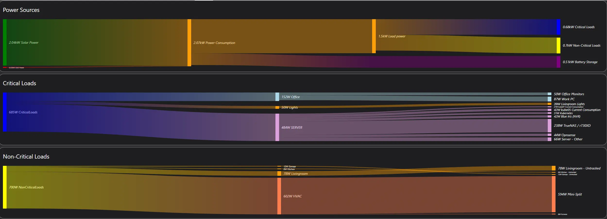

# My homelab - End of 2024

This post will go over my lab, as a whole as of December 2024.

<!-- more -->

## Overview

I will split this post into a few sections.

1. [Compute](#compute)
    - Discuss the servers, and workloads.
2. [Storage](#storage)
    - Discuss the various types of storage used.
    - Backups
3. [Power](#power)
    - How is my lab powered? 
    - Solar-powered lab
    - How are outages handled?
4. Networking
    - A overview of how the network is setup, technologies used.
5. Rack Accessories, Organization
    - This- is the section for things seen in the rack. Finger trays, custom enclosures, the rear-mounted power management, etc.
    - If anyone is looking for any of the specific products you see in my rack, I will include links.

But- first, a brief overview.

### Pictures

#### Rack itself

This, is the front of my rack.

This- is the bottom, rear of the rack.

This, is the top-rear. I have my PDUs, and ATS mounted here.

This, is the top of the rack, looking down. (The ESP you see is a BT proxy for Home Assistant)

When- I am not working on my rack, It lives in the closet.

#### Power Delivery

I will go into this more in-depth further down- but, I have a pretty comprehensive power delivery system, with a few redundancies

## Compute

### Servers / Hardware

For servers, I have a balance between small, efficient hardware and enterprise servers.

I run 5 machines, 24x7. The compute element of my lab uses around 350-400 watts.

ALL of my servers run Proxmox as the base OS. 

#### Optiplex SFFs

First- I have a pair of optiplex SFFs- These are the "core" compute elements of my lab.

These machines are reasonably efficient, and quite flexible. 

- 2x Optiplex 5060 SFF [[eBay]](https://ebay.us/UVsUiU){target=_blank}[^ebay]
    - i7-8700 (6c / 12t @ 3.20ghz)
    - 64G DDR4 (MAX Ram: 64G, 4 DIMMs, No ECC)
    - LSI 9287-8e SAS HBA (External) [[eBay]](https://ebay.us/O73eWN)[^ebay]
        - This connects to the MD1220 disk shelf, which contains both SAS and SATA SSDs primarily used for CEPH.
        - Each SFF, has access to "Half" of the shelf. (The shelf is running in "split" mode)
    - Mellanox ConnectX-4 CX-416A 100GBe Dual Port NIC [[eBay]](https://ebay.us/W0nsy0){target=_blank}[^ebay]
        - This is the primary network connection.
        - One port on each host connects to the 100G switch
        - The other port, is used for failover, and is connected to my 10G Unifi Aggregation Switch.
        - I picked these up for around 125$ each.
    - 128G Kioxia NVMe [[eBay]](https://ebay.us/r4L130){target=_blank}[^ebay]
        - These things are dirt-cheap, and make great boot drives.
    - **Power**: These machines average around 50 watts. 
        - These are the backbone of my ceph cluster, which houses the majority of my lab's storage.
        - 100GBe + SAS Controllers, does not do any favors for energy consumption.

These machines are literally the backbone of my ceph cluster. The i7-8700 offers pretty good performance, and runs the bulk of my VMs.

#### Optiplex Micros

Next up, I have a pair of Optiplex Micros.

??? note "If- you are curious about the enclosure- Its homemade in my garage (Click to expand..)"
    I honestly, was not very happy with the outcome of this enclosure- However, it does work well.

    

    

    

    All of the imperfections are hidden by blanks.

    

##### (Left) Optiplex Micro 3070m 

[eBay: Optiplex 3070m](https://ebay.us/oCNyPq){target=_blank}[^ebay]

Specs:
    - **CPU**: i5-9500t (6c / 6t @ 2.20ghz)
    - **RAM**: 24G DDR4
    - **Boot Drive**: Samsung 980 1T [[Amazon]](https://amzn.to/4gM0ZhU){target=_blank}[^amazon]
    - **NVR Storage**: Samsung 870 QVO 4T SATA [[Amazon]](https://amzn.to/3DsBtjH){target=_blank}[^amazon]
        - This- is the primary storage for my NVR.
        - SSD is used here instead of spinning rust for power efficiency. 
        - Also, makes accessing historical footage, snappy fast.
    - **Power**: This machine averages around 20w, while running my NVR 24/7/365.

While this machine is inside of my proxmox cluster, its primary purpose is to run my NVR.

It runs a Blue Iris VM, with over a handful of 5MP Reolink POE Cameras. It does an amazing job of it.

It also runs a kubernetes VM, where Frigate runs. Frigate has a USB-Type C Coral TPU attached for object detection.

##### (Right) Optiplex 7050m

[eBay: Optiplex 7050m](https://ebay.us/GXjVcD){target=_blank}[^ebay]

Specs:
    - **CPU**: i7-6700 (4c / 8t # 3.40ghz)
    - **RAM**: 16G DDR4
    - **Boot Drive**: 256G Liteon SATA SSD
    - **VM Storage**: 1T Samsung 980 1TB
    - **Power**: 10w average.

This, is one of the oldest machines in my lab. Its extremely efficient, and it works very well.

Its silent. Its efficient.

This is also the ONLY machine I have local storage for VMs. 

This machine hosts my Home Assistant VM, and a backup DNS server, both of which are on local storage.

These- are on local storage- to ensure my home assistant remains working, even when I break my network....

#### Rack Servers

Now- we get to the big hardware.

##### (Top) Dell R730XD

[[Ebay: Dell R730XD]](https://ebay.us/z2Fhg0)[^ebay]

- **Processor**: 2x [E5-2697a V4](https://www.intel.com/content/www/us/en/products/sku/91768/intel-xeon-processor-e52697a-v4-40m-cache-2-60-ghz/specifications.html){target=_blank} (16c / 32t @ 2.6/3.6ghz ). Total: 32c, 64t
- **Memory**: 256GB DDR4 ECC (16 of 24 DIMMs populated)
- **Primary NIC**: 100Gbit Mellanox CX-4 [[eBay]](https://ebay.us/W0nsy0){target=_blank}[^ebay]
- **Secondary NIC**: Dell 8887V ConnectX-4121C Dual port 25GBe [[eBay]](https://ebay.us/xaBbgX){target=_blank}[^ebay]
    - Not used. These- are honestly DIRT cheap. They are literally only 11$ as of right now.
    - Very nice NIC though.
- **Storage**: 
    - 16x M.2 NVMe
        - I really like my NVMe. If you can't tell.
    - 4x 16T 3.5" SATA
    - 8x 8T 3.5" SATA
    - 32G Samsung FIT
        - This runs Clover bootloader. My r730xd cannot boot from the M.2 which contains proxmox.
        - So- I have a thumb drive which contains clover, which automatically boots into proxmox.
    - 32G Samsung FIT
        - Unraid's Boot Drive
- **HBA**: Dell P2R3R PERC HBA330 Mini [[eBay]](https://ebay.us/ro1bQe)[^ebay]
    - This is a JBOD-ONLY HBA. I replaced the raid HBA with this, for use with ZFS.
    - This is passed directly into the Unraid VM.
- **Power Consumption**: Yes.
    - This server is an energy hog.
    - **Average Consumption**: 238w

??? note "Expansion Slot Details. Click to expand"
    - **Slot 1**: "Generic" dual M.2 cards [[Amazon]](https://amzn.to/4fLf0vL){target=_blank}[^amazon]
        - 2x Samsung 1T PM963 Enterprise NVMe [[eBay]](https://ebay.us/sjMRc8){target=_blank}[^ebay]
        - [Blog Post: Installing more NVMe into the r730XD](../2023/2023-08-13-r730xd-more-nvme.md){target=_blank}
        - 4x4 bifurcation
    - **Slot 2**: "Generic" dual M.2 cards [[Amazon]](https://amzn.to/4fLf0vL){target=_blank}[^amazon]
        - 2x Samsung 1T PM963 Enterprise NVMe [[eBay]](https://ebay.us/sjMRc8){target=_blank}[^ebay]
        - 4x4 bifurcation
    - **Slot 3**: Mellanox ConnectX-4 CX-416A 100GBe Dual Port NIC [[eBay]](https://ebay.us/W0nsy0){target=_blank}[^ebay]
        - This is the primary network adapter used. 
        - Installed in one of the x8 short slots. (Limits max throughput to around 60Gbit/s)
        - No bifurcation
    - **Slot 4**: Asus Hyper M.2 [[Amazon]](https://amzn.to/404xvX5){target=_blank}[^amazon]
        - 4x Samsung 1T PM963 Enterprise NVMe [[eBay]](https://ebay.us/sjMRc8){target=_blank}[^ebay]
        - 4x4x4x4 bifurcation
    - **Slot 5**: Quad M.2 PLX Switch
        - [Post: Adding Bifurcation to the r720XD](../2022/R720XD-Bifurcation.md){target=_blank} (More detail about the cards, what cards to get, installation, etc.)
        - These were originally used in the r720xd, but, are now used in the r730xd too, just to squeeze in a few more M.2
        - No bifurcation
        - 1x Samsung 1T PM963 Enterprise NVMe [[eBay]](https://ebay.us/sjMRc8){target=_blank}[^ebay]
            - Proxmox Boot Drive
        - 2x Samsung 970 Evo Plus NVMe
            - Unraid ZFS Cache Pool (Mirrored)
        - 1x Samsung 970 Evo NVMe
            - Unraid "Scratch/Cache" Pool
    - **Slot 6**: Asus Hyper M.2 [[Amazon]](https://amzn.to/404xvX5){target=_blank}[^amazon]
        - 4x Samsung 1T PM963 Enterprise NVMe [[eBay]](https://ebay.us/sjMRc8){target=_blank}[^ebay]
        - 4x4x4x4 bifurcation

A fair amount of hardware is passed directly into Unraid.

??? note "Unraid Passthrough Hardware (Click to expand)"

    - Unraid VM
        - **CPU**: 32 Cores (Logical, Not Physical)
        - **Memory**: 64G
        - 2x Samsung 970 Evo Plus NVMe
            - These are used in a Mirrored ZFS Pool, INSIDE of Unraid. This- is my primary cache pool.
        - 1x Samsung 970 EVO 1TB
            - This is used as another cache pool, for certain applications which are frequently writing data.
            - Non-redundant.
        - 8x 8T Seagate Exos
            - In 2021, I ordered 12x of these USED.
            - It will be 2025 in less than two weeks, I have only had to return a single drive.
            - Four of these are used in a ZFS Striped Mirror combination, for my "Important" data.
            - One is used in the main Unraid "Array"
        - 4x 16T Sata
            - Three are WD Drives. The fourth is a Seagate Iron Wolf.
            - These form the main Unraid "Array", where I do bulk storage duties.
        - 32G Samsung FIT
            - This is my original flash drive for unraid, purchased in 2020.
            - This is Unraid's boot drive.
    
!!! note "Purpose"
    This server's primary purpose is to host the Unraid VM, and its associated storage.

    It also hosts a significant amount of NVMe storage used with Ceph.

    I have HA rules configured to try to prioritize other hardware, as the other hardware uses less energy for a given amount of compute.

    HOWEVER- This machine has enough resources to literally host EVERYTHING. It has LITERALLY half of the resources.

    64 of the 102 CPUs is from this machine. 256G of the 416GB of ram is from this machine.

    

    Maintenance is much easier when you have enough resources to live-migrate multiple machines at a time.

    This machine was acquired after my [R720 Died at the beginning of 2023.](../2023/2023-01-13-r720xd-death.md){target=_blank}

!!! note "Unraid's Purpose"
    The primary purpose of Unraid, is for my "Media center".

    It hosts plex, along with a handful of containers which supports media streaming.

    It is also my primary SMB, and NFS host.

##### (Bottom) Dell R720XD

The r720XD is the server which was used in my [40G NAS Project](../../../../pages/Projects/40G-NAS.md){target=_blank}.

After it [died last year](../2023/2023-01-13-r720xd-death.md), the r730xd was picked up to replace it. 

Its use case: Storage for DDR3 DIMMs, Unused 10G NICs, Extra HBAs, etc.

It makes a very useful drawer in my rack.

??? note "R720XD Specs"

    - **CPU**: 2x [Intel Xeon E5-2667v2](https://www.intel.com/content/www/us/en/products/sku/75273/intel-xeon-processor-e52667-v2-25m-cache-3-30-ghz/specifications.html){target=_blank}
        - 8c / 16t @ 3.3/4.0Ghz
    - **Memory**: 128G DDR3
    - **HBA**: Dell Perc H310 Flashed to IT Mode
        - [Fohdeesha Guide](https://fohdeesha.com/docs/H310-full.html){target=_blank}

### Applications / Services

#### Proxmox

As previously stated, Proxmox runs bare metal on all of my servers. 

It has built in ceph cluster management, built in firewall rules, ACLs... It has built in backups, and overall, its just a fantastic base OS.

Once upon a time, I did run Kubernetes (microk8s) bare metal. However, while out on a work-related trip, The cluster decided to.... Not work.

Everything was wiped the following week, and Proxmox was installed bare metal. It has been that way ever since.

#### Kubernetes

Kubernetes is used to run around 90% of my containers. 

I am currently running Rancher + K3s. 

My K3s cluster has 7 VMs, scattered amongst the various servers. 

1. rancher
    - This is a VM which only runs a single docker container, containing rancher.
        - I do this, to allow me to separately upgrade and maintain rancher, as rancher itself, is used to upgrade and maintain the cluster.
2. rke-master-1
    - This is the master server. I only run a single master, as I rely on hypervisor redundancy here.
        - A single master reduces complexity, where the proxmox cluster itself, can handle the redundancy.
3. k8s-admin
    - Generic admin box. Gotta manage the cluster!
4. Worker VMs (4)
    - 1-3, have HA policies which prefers a specific machine. In this case, Both SFFs, and the r730XD get a VM.
    - In the event of issues, cluster maintenance, these VMs are free to migrate as needed.
    - rke-worker-4, this node is tainted to only allow NVR-related activities to run. It is pinned to the optiplex micro which runs my NVR.

#### Unraid

Unraid itself, is running as a VM, on the R730XD. It is noted here as it runs all of the "media-related" compute.

Aka, all of the associated docker containers, runs directly on unraid.

## Storage

Storage for my lab is provided by a few different means.

1. CEPH
    - Ceph provides the primary storage used for both Proxmox VMs, LXCs, and Kubernetes containers.
    - Hosted by both [Optiplex SFFs](#optiplex-sffs) as well as the [R730XD](#top-dell-r730xd).
    - [Blog Post: Building a ceph cluster](../2023/2023-08-08-proxmox-ceph.md)
        - While- I have quite a few more OSDs now, and have 100G networking instead of 10G- Its still the same basic cluster.
2. Unraid
    - Unraid provides SMB, and NFS storage.
    - Its primary use-case is providing energy efficient BULK storage.
    - As noted [above](#top-dell-r730xd), it is running as a VM on the r730xd.
3. Synology
    - This is used for backups only.
    - [Blog Post: My Backup Strategies](../2024/2024-06-11-Backup-Strategies.md){target=_blank}
        - This goes over how backups are performed from Kubernetes, Unraid, and Proxmox.

Inside of the rack- you may have noticed the storage arrays as well.

### Hardware

#### Dell MD1220

[Ebay: Dell MD1220](https://ebay.us/NV0dY1){target=_blank}[^ebay]

Specs:
    - **Bays**: 24x 2.5" SAS / SATA
    - **Controllers**: 2x 6Gbit SAS
    - **Power Consumption**: 45 watts. Empty shelf will use 35-40 watts.

??? note Purpose
    This storage shelf's only purpose is to present a JBOD of SSDs to the two [Optiplex SFFs](#optiplex-sffs). 

    All of the installed SSDs are used by ceph.

    This shelf is running in "Split Mode". This "Splits" the shelf between  both SFFs.

    For- more information, please read the [MD1200 series manual](https://dl.dell.com/manuals/common/powervault-md12xx-om-en-us.pdf){target=_blank}, Page 19-20.

As a random note- my shelf arrived with 24x 2.5" 15k SAS disks. Nearly 300 watts worth of them.

#### Dell MD1200

Specs:
    - **Bays**: 12 3.5" SAS / SATA
    - **Controllers**: 2x 6Gbit SAS
    - **Power Consumption**: Empty shelf will use 35-40 watts.
        - Fully loaded with 3.5" disks, this shelf will consume around 150w, 24/7.
        - 3.5" disks, 8-12w each.

??? note Purpose
    This shelf does not yet have a purpose.

    I have been trying to decide between two potential use-cases.

    1. Moving all of my unraid storage to this shelf, giving unraid the ability to migrate around the cluster, as SAS can multipath.
    2. Offline / Cold storage.

    Until a purpose has been determined, this shelf is powered off.

#### Synology DS423+

I picked this model specifically, due to its Intel processor. 

If- I ever wanted to repurpose this into a plex streaming box, the integrated quicksync iGPU would become extremely handy.

??? note "Specs"
    Specs:
        - **CPU**: Intel Celeron J4125
        - **RAM**: 18GB
            - 2GB is on the board itself.
            - I added an additional 16G Curcial stick. Max "Officially" supported RAM is 6GB. Can confirm, it works. Exact ram used is linked below.
            - [Amazon](https://amzn.to/3ZKXQs5){target=_blank}[^amazon]
            - [Newegg](https://www.newegg.com/crucial-16gb-260-pin-ddr4-so-dimm/p/N82E16820156262){target=_blank}
        - **Storage**: 4x 8T Seagate Exos
        - **Storage (NVMe)**: 1x Samsung 970 Evo.
            - Used as READ cache.

As stated above- this box's sole purpose is backups, and replication.

[Read more: My backup strategies](../2024/2024-06-11-Backup-Strategies.md){target=_blank} (This post details exactly how it is used.)

Also notable- I am using SMB, NFS, and iSCSI Multipathing to get 2Gbits of throughput consistently. This was much more effective then using LACP.

[Post: How to: Synology Multipathing](2024-07-22-Synology-Multipath.md){target=_blank} (Outlines how to configure SMB, NFS, and iSCSI multipathing to take FULL advantage of multiple NICs without using LACP.)

## Power

Power- is the element of my lab which has received the most attention and funding.

As- the power in my city has been historically unstable, and unreliable- I have taken many steps to attempt to compensate.

Back in 2021, I build a homemade UPS out of a hand truck, and a LiFePO4 battery. It has went through quite a few outages, and has held up beautifully. Although- It might be replaced very soon..... with [a solar generator](./2024-12-20-solar-generator-ups.md){target=_blank}.

In 2022, I made the decision to completely redo the power for my entire house, and outfit the entire home with solar power generation, and battery backup for EVERYTHING. This project was completed early 2023.

If- you are interested to learn more about this project- Please see.... [My Solar Project](../../../../pages/Projects/Solar-Project.md){target=_blank}

Nonetheless- Lets dig into how everything works.

### Mains power delivery

#### Mains Power Diagram

Here is a diagram which details the flow of mains power through my house.

Lets start on the exterior of the house.

#### Exterior

Power comes into my meter from the pole- this part is pretty standard.

After, the first box, is just a switch which will isolate my house from the GRID. 

Next- we enter the ATS (Automation transfer switch). This- is where most of the magic happens.

!!! info "How the ATS is configured"
    My main breaker panel connects to the transfer switch.

    When in "normal" operation, the transfer switch is connected to the grid. 

    However, when grid frequency, voltage goes out of spec, the ATS will switch to "backup" mode. 

    In backup mode, The transfer switch is fed from a 60amp breaker in my "Critical loads panel", which is fed directly from the inverter.

    This means- when the grid goes down- the entire house is powered directly from the inverter.

In addition, there is a rapid shutdown breaker, which will cause the solar panels to become inactive.

All of the needed cables enter a race, which leads to the garage on the other side of the house.

#### Garage

Inside of the garage, is where all of the fancy hardware is stored.

Note- this is an older picture- I have moved the battery rack, and installed an additional box which contains hardware for monitoring energy.

[Post: Adding Per-Breaker Energy Monitoring](../../Solar/solar-part-4-monitoring.md){target=_blank} (This post details both the software, and hardware used to monitor energy consumption.)

Power enters the garage through the bottom box, and goes inside of the cable race. From there- the main breaker panel is fed directly from the transfer switch.

The Inverter, is connected on the MAINS side of the transfer switch.

The critical loads panel, is connected directly to the inverter. 

The rack on the left currently contains a total of 20kwh of LiFEPO4 batteries, with 4/6 bays filled. The inverter is capable of 10-12kw continuous power, and up to 24kw peak bursts.

It is fully capable of running the ENTIRE HOUSE, including the central AC unit, when fully off grid.

A year or so back- this was tested. After a 100mph wind gust knocked out power for nearly two zipcodes, I [ran completely off grid for most of a week](../../Solar/june-2023-lessons-learned.md){target=_blank} (Of course- everything was documented, including lessons learned)

The server rack, is fed directly from the critical loads panel. If grid power drops, there is a maximum of 6ms before it is powered from battery.

Honestly- there is no need for a UPS at this point.

??? note "Generator Power"
    In the event the batteries are nearly discharged, and the sun is not shining, I will start up the Harbor freight predator 9000 generator.

    This- is not an inverter generator, and tends to produce pretty noisy power when under load.

    This is documented [in this post](../../Solar/june-2023-lessons-learned.md){target=_blank}

    To compensate for this, The generator feeds directly into a 5,000 watt 48V DC Charger, which feeds directly into the battery bank.

    Then, the 12kw solark 12k produces clean pure sine wave power from the provided DC.

Before- we move to the server rack- there is one other thing to note-

[Multiple forms of surge protection are used](2024-09-15-Surge-Protection.md){target=_blank}.

### Server Rack Power

#### Diagram

With the mains power out of the way, lets dig into my miniature data center itself, starting with a diagram.

#### Networking Closet

One goal of mine, is to allow the house to resume "normal operation" even if my entire rack of servers is offline.

To do this, The main "LAN/WAN" is handled with low-power hardware.

1. Unifi UXG-Lite
    - **Link**: [Unifi](https://store.ui.com/us/en/products/uxg-lite){target=_blank}
    - This is the primary LAN/WAN Firewall/Router at the time of this post.
    - Very soon, a Mikrotik HEX Refresh will become the primary WAN Router/Firewall, leaving the Unifi for LAN duties.
    - **Consumption**: MAX 3.8 watts
2. 2x Unifi USW-Lite-8-POE
    - **Link**: [Unifi](https://store.ui.com/us/en/category/switching-utility/products/usw-lite-8-poe){target=_blank}
    - One of these powers a pair of access points, as well as a pair of [usw-flex](https://store.ui.com/us/en/category/switching-utility/products/usw-flex){target=_blank} switches located in the living room, and garage.
    - The other, powers all of my POE security cameras.
    - **Consumption**: MAX 8w (Excluding POE Consumption)
    - Note- If the [USW-Ultra](https://store.ui.com/us/en/category/switching-utility/collections/pro-ultra/products/usw-ultra){target=_blank} existed when I installed these... there wouldn't be two POE switches.
        - I will note, I did attempt to run a [TPLink TL-SG1005P](https://amzn.to/4fqWUyV){target=_blank}[^amazon] for my POE cameras. However- it caused them to frequently crash. 

These devices are powered with a small, dedicated cyber power UPS unit. In the event of catastrophic failure, loss of solar, generator, and battery- This would keep the primary LAN/WAN online, along with the security cameras.

#### Server Rack

On the rear of the server rack, I have the incoming power supply.

I have a pair of vertiv rPDUs to distribute power to my servers. These are 120v PDUs, with individually switched AND metered outlets. These units also cluster together.

I did a full write-up of the capabilities here: [Vertiv rPDU](2024-08-09-vertiv-giest-pdu.md){target=_blank}

Overall- these units have been OUTSTANDING. I am- still working on creating a MQTT-based integration which connects them to both [home assistant](https://www.home-assistant.io/){target=_blank}, and [emoncms.](https://emoncms.org/){target=_blank}

If- you are interested in this- [please checkout its GitHub](https://github.com/XtremeOwnage/rPDU2MQTT){target=_blank}.

I do this- because I like to be able to visualize every single watt which travels through my house.

This is an older picture, and far more monitoring has been added since. Nearly every light fixture, every device. There are very few things I don't have monitored now for the entire house.

I do have a related post for [Building energy flow diagram in home assistant](../../Home-Automation/2023/home-assistant-energy-flow-diagram.md){target=_blank}

??? note "Why emoncms"
    I do often get asked why I use Emoncms, when Home Assistant exists, Influx, Prometheus, etc...

    The reason is- Its STUPID simple, and reliable. It does one thing. It collects and stores data.

    Not- in a database, but, in a simple flat-file format, where YEARS of energy data at a 15 second interval, only takes up a few kilobytes.

    The simplicity is key here. I need it to be as reliable as possible. And- it achieves this.

    Home assistant, occasionally has an update, which will rename entities, causing the energy data to break. As well, occasionally, something will happen, which just destroys its energy diagrams. 

    I have 4 years of data in emoncms. If something is not reporting in data, it will let me know. Things do NOT change in here, without me explicitly changing them.

    So, TLDR; Its all about consistency, and reliability. Ecmoncms can run on a potato, and has zero external dependencies.

## Disclaimers, etc...

[^ebay]:
    --8<--- "docs/snippets/ebay-affiliate.md"
[^amazon]:
    --8<--- "docs/snippets/amazon-affiliate.md"
