## Why you should avoid Unifi "Layer 3" Switches

### Reason Number 1. Layer 3 Routing does not work.

So- the main reason you typically buy a layer 3 route, is for the ability to route traffic, right?

Well, lets go through the process of adding a static route to a unifi layer 3 switch.

!!! info
    You CAN manually add routes via the CLI. However, these will be lost whenever the switch provisions or reboots.

    The switches hardware is perfectly capable, and suitable for layer 3 routing. 

First, create your route through the Unifi's Static routes page. Make sure to click DeviceType: Switch, and select your Layer 3 switch.

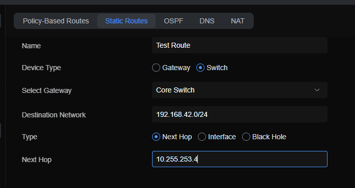

Afterwards, wait a second for your device to provision.

At this point, you would expect the layer 3 route to exist on your switch. But- it doesn't.

``` bash
CoreSwitch-US.7.0.50# ip route | grep -v .100
default via 10.255.253.1 dev rt_v4040  proto icos  metric 16
10.255.253.0/24 dev rt_v4040  proto kernel  scope link  src 10.255.253.2
```

But- perhaps the issue is, the management's routes differ from the routes in the config.

Nope. The routes don't exist there either.

``` bash
CoreSwitch-US.7.0.50# cli
Warning!
The changes may break controller settings and only be effective until reboot.
Entering character mode
Escape character is '^]'.
(UBNT) >enable
(UBNT) #show ip route
Route Codes: C - Connected, S - Static

Default Gateway(s): 10.255.253.1

S      0.0.0.0/0 [1/0] via 10.255.253.1,   4/1
...
C      10.255.253.0/24 [0/0] directly connected,   4/1
```

( I removed the routes for the subnets which are hosted by this switch. Those, work fine.)

So, lets check the configuration.

``` bash
(UBNT) #show running-config
...

no errdisable recovery cause keepalive
ip route 0.0.0.0 0.0.0.0 10.255.253.1 description Inter-VLAN routing
exit
```

Ok, so, the only route that exists, is the default "inter-vlan" routing route.


Summary?

You cannot add your own routes via the Unifi interface.


### Reason #2, Non-Configurable default "VLAN 4040" / Default Route.

Unifi "layer 3" switches, are shipped with a default route, of `0.0.0.0/0` via `10.255.253.1` on vlan 4040.

You can read about this feature via [Unifi's Official Documentation](https://help.ui.com/hc/en-us/articles/360042281174-Layer-3-Routing)

The short version, If you want to use a Unifi "layer 3" switch behind your existing firewall, you MUST configure your existing firewall, with an interface on vlan 4040, with an ip address of `10.255.253.1`

And no, per Unifi, you cannot change the VLAN ID.

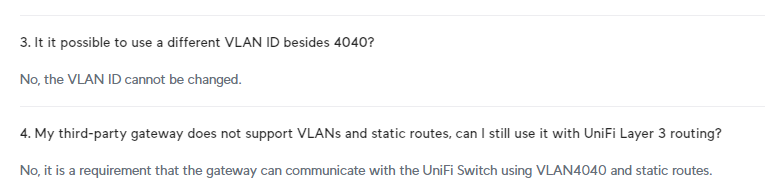

Even if you have a Unifi UDM/UXG/Other Gateway- this default route, and vlan will always exist, on every Unifi Layer 3 switch you have.

``` bash
(UBNT) >enable

(UBNT) #show ip route

Route Codes: C - Connected, S - Static

Default Gateway(s): 10.255.253.1

S      0.0.0.0/0 [1/0] via 10.255.253.1,   4/1
```

Although, interesting, when your gateway does come online, the Linux kernel, will add a default route via your gateway, with a slightly higher priority.

``` bash
CoreSwitch-US.7.0.50# ip route
default via 10.100.1.1 dev eth0
default via 10.255.253.1 dev rt_v4040  proto icos  metric 16
```

### Reason #3, There MAY be a limitation of "TWO" static routes

!!! info
    This limitation exists for the "PRO" switches. 
    
    However, it does not appear to exist for the "ENTERPRISE" switches.

Imagine picking up a 400$ layer 3 unifi switch, and being excited to get all of your routes for your network configured.... and then....

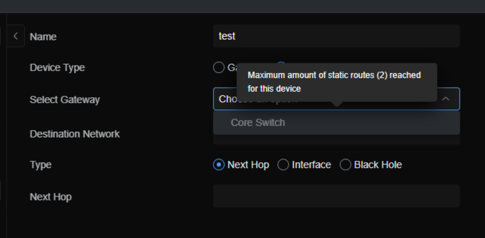

You discover, there is a limitation of **TWO** static routes. Rights right, Two.

You better make those routes count. Because you only get TWO of them.

I don't know why there is only two allowed- I tested the hardware to see how many it would accept.

``` bash
ip route 192.168.0.0 255.255.255.0 Null0 100 description "Dummy Route 0"
ip route 192.168.1.0 255.255.255.0 Null0 100 description "Dummy Route 1"
ip route 192.168.2.0 255.255.255.0 Null0 100 description "Dummy Route 2"
ip route 192.168.3.0 255.255.255.0 Null0 100 description "Dummy Route 3"
ip route 192.168.4.0 255.255.255.0 Null0 100 description "Dummy Route 4"
ip route 192.168.5.0 255.255.255.0 Null0 100 description "Dummy Route 5"
ip route 192.168.6.0 255.255.255.0 Null0 100 description "Dummy Route 6"
ip route 192.168.7.0 255.255.255.0 Null0 100 description "Dummy Route 7"
ip route 192.168.8.0 255.255.255.0 Null0 100 description "Dummy Route 8"
ip route 192.168.9.0 255.255.255.0 Null0 100 description "Dummy Route 9"
ip route 192.168.10.0 255.255.255.0 Null0 100 description "Dummy Route 10"
ip route 192.168.11.0 255.255.255.0 Null0 100 description "Dummy Route 11"
ip route 192.168.12.0 255.255.255.0 Null0 100 description "Dummy Route 12"
ip route 192.168.13.0 255.255.255.0 Null0 100 description "Dummy Route 13"
ip route 192.168.14.0 255.255.255.0 Null0 100 description "Dummy Route 14"
ip route 192.168.15.0 255.255.255.0 Null0 100 description "Dummy Route 15"
ip route 192.168.16.0 255.255.255.0 Null0 100 description "Dummy Route 16"
ip route 192.168.17.0 255.255.255.0 Null0 100 description "Dummy Route 17"
ip route 192.168.18.0 255.255.255.0 Null0 100 description "Dummy Route 18"
ip route 192.168.19.0 255.255.255.0 Null0 100 description "Dummy Route 19"
ip route 192.168.20.0 255.255.255.0 Null0 100 description "Dummy Route 20"
ip route 192.168.21.0 255.255.255.0 Null0 100 description "Dummy Route 21"
ip route 192.168.22.0 255.255.255.0 Null0 100 description "Dummy Route 22"
ip route 192.168.23.0 255.255.255.0 Null0 100 description "Dummy Route 23"
ip route 192.168.24.0 255.255.255.0 Null0 100 description "Dummy Route 24"
ip route 192.168.25.0 255.255.255.0 Null0 100 description "Dummy Route 25"
ip route 192.168.26.0 255.255.255.0 Null0 100 description "Dummy Route 26"
ip route 192.168.27.0 255.255.255.0 Null0 100 description "Dummy Route 27"
ip route 192.168.28.0 255.255.255.0 Null0 100 description "Dummy Route 28"
ip route 192.168.29.0 255.255.255.0 Null0 100 description "Dummy Route 29"
ip route 192.168.30.0 255.255.255.0 Null0 100 description "Dummy Route 30"
ip route 192.168.31.0 255.255.255.0 Null0 100 description "Dummy Route 31"
ip route 192.168.32.0 255.255.255.0 Null0 100 description "Dummy Route 32"
ip route 192.168.33.0 255.255.255.0 Null0 100 description "Dummy Route 33"
ip route 192.168.34.0 255.255.255.0 Null0 100 description "Dummy Route 34"
ip route 192.168.35.0 255.255.255.0 Null0 100 description "Dummy Route 35"
ip route 192.168.36.0 255.255.255.0 Null0 100 description "Dummy Route 36"
ip route 192.168.37.0 255.255.255.0 Null0 100 description "Dummy Route 37"
ip route 192.168.38.0 255.255.255.0 Null0 100 description "Dummy Route 38"
ip route 192.168.39.0 255.255.255.0 Null0 100 description "Dummy Route 39"
ip route 192.168.40.0 255.255.255.0 Null0 100 description "Dummy Route 40"
ip route 192.168.41.0 255.255.255.0 Null0 100 description "Dummy Route 41"
ip route 192.168.42.0 255.255.255.0 Null0 100 description "Dummy Route 42"
ip route 192.168.43.0 255.255.255.0 Null0 100 description "Dummy Route 43"
ip route 192.168.44.0 255.255.255.0 Null0 100 description "Dummy Route 44"
ip route 192.168.45.0 255.255.255.0 Null0 100 description "Dummy Route 45"
ip route 192.168.46.0 255.255.255.0 Null0 100 description "Dummy Route 46"
ip route 192.168.47.0 255.255.255.0 Null0 100 description "Dummy Route 47"
ip route 192.168.48.0 255.255.255.0 Null0 100 description "Dummy Route 48"
ip route 192.168.49.0 255.255.255.0 Null0 100 description "Dummy Route 49"
ip route 192.168.50.0 255.255.255.0 Null0 100 description "Dummy Route 50"
ip route 192.168.51.0 255.255.255.0 Null0 100 description "Dummy Route 51"
ip route 192.168.52.0 255.255.255.0 Null0 100 description "Dummy Route 52"
ip route 192.168.53.0 255.255.255.0 Null0 100 description "Dummy Route 53"
ip route 192.168.54.0 255.255.255.0 Null0 100 description "Dummy Route 54"
ip route 192.168.55.0 255.255.255.0 Null0 100 description "Dummy Route 55"
ip route 192.168.56.0 255.255.255.0 Null0 100 description "Dummy Route 56"
ip route 192.168.57.0 255.255.255.0 Null0 100 description "Dummy Route 57"
ip route 192.168.58.0 255.255.255.0 Null0 100 description "Dummy Route 58"
ip route 192.168.59.0 255.255.255.0 Null0 100 description "Dummy Route 59"
ip route 192.168.60.0 255.255.255.0 Null0 100 description "Dummy Route 60"
ip route 192.168.61.0 255.255.255.0 Null0 100 description "Dummy Route 61"
ip route 192.168.62.0 255.255.255.0 Null0 100 description "Dummy Route 62"
ip route 192.168.63.0 255.255.255.0 Null0 100 description "Dummy Route 63"
ip route 192.168.64.0 255.255.255.0 Null0 100 description "Dummy Route 64"
ip route 192.168.65.0 255.255.255.0 Null0 100 description "Dummy Route 65"
ip route 192.168.66.0 255.255.255.0 Null0 100 description "Dummy Route 66"
ip route 192.168.67.0 255.255.255.0 Null0 100 description "Dummy Route 67"
ip route 192.168.68.0 255.255.255.0 Null0 100 description "Dummy Route 68"
ip route 192.168.69.0 255.255.255.0 Null0 100 description "Dummy Route 69"
ip route 192.168.70.0 255.255.255.0 Null0 100 description "Dummy Route 70"
ip route 192.168.71.0 255.255.255.0 Null0 100 description "Dummy Route 71"
ip route 192.168.72.0 255.255.255.0 Null0 100 description "Dummy Route 72"
ip route 192.168.73.0 255.255.255.0 Null0 100 description "Dummy Route 73"
ip route 192.168.74.0 255.255.255.0 Null0 100 description "Dummy Route 74"
ip route 192.168.75.0 255.255.255.0 Null0 100 description "Dummy Route 75"
ip route 192.168.76.0 255.255.255.0 Null0 100 description "Dummy Route 76"
ip route 192.168.77.0 255.255.255.0 Null0 100 description "Dummy Route 77"
ip route 192.168.78.0 255.255.255.0 Null0 100 description "Dummy Route 78"
ip route 192.168.79.0 255.255.255.0 Null0 100 description "Dummy Route 79"
ip route 192.168.80.0 255.255.255.0 Null0 100 description "Dummy Route 80"
ip route 192.168.81.0 255.255.255.0 Null0 100 description "Dummy Route 81"
ip route 192.168.82.0 255.255.255.0 Null0 100 description "Dummy Route 82"
ip route 192.168.83.0 255.255.255.0 Null0 100 description "Dummy Route 83"
ip route 192.168.84.0 255.255.255.0 Null0 100 description "Dummy Route 84"
ip route 192.168.85.0 255.255.255.0 Null0 100 description "Dummy Route 85"
ip route 192.168.86.0 255.255.255.0 Null0 100 description "Dummy Route 86"
ip route 192.168.87.0 255.255.255.0 Null0 100 description "Dummy Route 87"
ip route 192.168.88.0 255.255.255.0 Null0 100 description "Dummy Route 88"
ip route 192.168.89.0 255.255.255.0 Null0 100 description "Dummy Route 89"
ip route 192.168.90.0 255.255.255.0 Null0 100 description "Dummy Route 90"
ip route 192.168.91.0 255.255.255.0 Null0 100 description "Dummy Route 91"
ip route 192.168.92.0 255.255.255.0 Null0 100 description "Dummy Route 92"
ip route 192.168.93.0 255.255.255.0 Null0 100 description "Dummy Route 93"
ip route 192.168.94.0 255.255.255.0 Null0 100 description "Dummy Route 94"
ip route 192.168.95.0 255.255.255.0 Null0 100 description "Dummy Route 95"
ip route 192.168.96.0 255.255.255.0 Null0 100 description "Dummy Route 96"
ip route 192.168.97.0 255.255.255.0 Null0 100 description "Dummy Route 97"
ip route 192.168.98.0 255.255.255.0 Null0 100 description "Dummy Route 98"
ip route 192.168.99.0 255.255.255.0 Null0 100 description "Dummy Route 99"
```

And, it appears it will accept around 60 routes total, before the hardware throws errors.

``` bash
Route Codes: C - Connected, S - Static


Default Gateway(s): 10.255.253.1


S      0.0.0.0/0 [1/0] via 10.255.253.1,   4/1
(Four routes were excluded from here)
C      10.255.253.0/24 [0/0] directly connected,   4/1
S      192.168.0.0/24 [100/0] directly connected,   Null0 Discard
S      192.168.1.0/24 [100/0] directly connected,   Null0 Discard
S      192.168.2.0/24 [100/0] directly connected,   Null0 Discard
S      192.168.3.0/24 [100/0] directly connected,   Null0 Discard
S      192.168.4.0/24 [100/0] directly connected,   Null0 Discard
S      192.168.5.0/24 [100/0] directly connected,   Null0 Discard
S      192.168.6.0/24 [100/0] directly connected,   Null0 Discard
S      192.168.7.0/24 [100/0] directly connected,   Null0 Discard
S      192.168.8.0/24 [100/0] directly connected,   Null0 Discard
S      192.168.9.0/24 [100/0] directly connected,   Null0 Discard
S      192.168.10.0/24 [100/0] directly connected,   Null0 Discard
S      192.168.11.0/24 [100/0] directly connected,   Null0 Discard
S      192.168.12.0/24 [100/0] directly connected,   Null0 Discard
S      192.168.13.0/24 [100/0] directly connected,   Null0 Discard
S      192.168.14.0/24 [100/0] directly connected,   Null0 Discard
S      192.168.15.0/24 [100/0] directly connected,   Null0 Discard
S      192.168.16.0/24 [100/0] directly connected,   Null0 Discard
S      192.168.17.0/24 [100/0] directly connected,   Null0 Discard
S      192.168.18.0/24 [100/0] directly connected,   Null0 Discard
S      192.168.19.0/24 [100/0] directly connected,   Null0 Discard
S      192.168.20.0/24 [100/0] directly connected,   Null0 Discard
S      192.168.21.0/24 [100/0] directly connected,   Null0 Discard
S      192.168.22.0/24 [100/0] directly connected,   Null0 Discard
S      192.168.23.0/24 [100/0] directly connected,   Null0 Discard
S      192.168.24.0/24 [100/0] directly connected,   Null0 Discard
S      192.168.25.0/24 [100/0] directly connected,   Null0 Discard
S      192.168.26.0/24 [100/0] directly connected,   Null0 Discard
S      192.168.27.0/24 [100/0] directly connected,   Null0 Discard
S      192.168.28.0/24 [100/0] directly connected,   Null0 Discard
S      192.168.29.0/24 [100/0] directly connected,   Null0 Discard
S      192.168.30.0/24 [100/0] directly connected,   Null0 Discard
S      192.168.31.0/24 [100/0] directly connected,   Null0 Discard
S      192.168.32.0/24 [100/0] directly connected,   Null0 Discard
S      192.168.33.0/24 [100/0] directly connected,   Null0 Discard
S      192.168.34.0/24 [100/0] directly connected,   Null0 Discard
S      192.168.35.0/24 [100/0] directly connected,   Null0 Discard
S      192.168.36.0/24 [100/0] directly connected,   Null0 Discard
S      192.168.37.0/24 [100/0] directly connected,   Null0 Discard
S      192.168.38.0/24 [100/0] directly connected,   Null0 Discard
S      192.168.39.0/24 [100/0] directly connected,   Null0 Discard
S      192.168.40.0/24 [100/0] directly connected,   Null0 Discard
S      192.168.41.0/24 [100/0] directly connected,   Null0 Discard
S      192.168.42.0/24 [100/0] directly connected,   Null0 Discard
S      192.168.43.0/24 [100/0] directly connected,   Null0 Discard
S      192.168.44.0/24 [100/0] directly connected,   Null0 Discard
S      192.168.45.0/24 [100/0] directly connected,   Null0 Discard
S      192.168.46.0/24 [100/0] directly connected,   Null0 Discard
S      192.168.47.0/24 [100/0] directly connected,   Null0 Discard
S      192.168.48.0/24 [100/0] directly connected,   Null0 Discard
S      192.168.49.0/24 [100/0] directly connected,   Null0 Discard
S      192.168.50.0/24 [100/0] directly connected,   Null0 Discard
S      192.168.51.0/24 [100/0] directly connected,   Null0 Discard
S      192.168.52.0/24 [100/0] directly connected,   Null0 Discard
S      192.168.53.0/24 [100/0] directly connected,   Null0 Discard
S      192.168.54.0/24 [100/0] directly connected,   Null0 Discard
S      192.168.55.0/24 [100/0] directly connected,   Null0 Discard
S      192.168.56.0/24 [100/0] directly connected,   Null0 Discard
S      192.168.57.0/24 [100/0] directly connected,   Null0 Discard  hw-failure
S      192.168.58.0/24 [100/0] directly connected,   Null0 Discard  hw-failure
S      192.168.59.0/24 [100/0] directly connected,   Null0 Discard  hw-failure
S      192.168.60.0/24 [100/0] directly connected,   Null0 Discard  hw-failure
S      192.168.61.0/24 [100/0] directly connected,   Null0 Discard  hw-failure
S      192.168.62.0/24 [100/0] directly connected,   Null0 Discard  hw-failure
S      192.168.63.0/24 [100/0] directly connected,   Null0 Discard  hw-failure
S      192.168.64.0/24 [100/0] directly connected,   Null0 Discard  hw-failure
S      192.168.65.0/24 [100/0] directly connected,   Null0 Discard  hw-failure
S      192.168.66.0/24 [100/0] directly connected,   Null0 Discard  hw-failure
S      192.168.67.0/24 [100/0] directly connected,   Null0 Discard  hw-failure
S      192.168.68.0/24 [100/0] directly connected,   Null0 Discard  hw-failure
S      192.168.69.0/24 [100/0] directly connected,   Null0 Discard  hw-failure
S      192.168.70.0/24 [100/0] directly connected,   Null0 Discard  hw-failure
S      192.168.71.0/24 [100/0] directly connected,   Null0 Discard  hw-failure
S      192.168.72.0/24 [100/0] directly connected,   Null0 Discard  hw-failure
S      192.168.73.0/24 [100/0] directly connected,   Null0 Discard  hw-failure
S      192.168.74.0/24 [100/0] directly connected,   Null0 Discard  hw-failure
S      192.168.75.0/24 [100/0] directly connected,   Null0 Discard  hw-failure
S      192.168.76.0/24 [100/0] directly connected,   Null0 Discard  hw-failure
S      192.168.77.0/24 [100/0] directly connected,   Null0 Discard  hw-failure
S      192.168.78.0/24 [100/0] directly connected,   Null0 Discard  hw-failure
S      192.168.79.0/24 [100/0] directly connected,   Null0 Discard  hw-failure
S      192.168.80.0/24 [100/0] directly connected,   Null0 Discard  hw-failure
S      192.168.81.0/24 [100/0] directly connected,   Null0 Discard  hw-failure
S      192.168.82.0/24 [100/0] directly connected,   Null0 Discard  hw-failure
S      192.168.83.0/24 [100/0] directly connected,   Null0 Discard  hw-failure
S      192.168.84.0/24 [100/0] directly connected,   Null0 Discard  hw-failure
S      192.168.85.0/24 [100/0] directly connected,   Null0 Discard  hw-failure
S      192.168.86.0/24 [100/0] directly connected,   Null0 Discard  hw-failure
S      192.168.87.0/24 [100/0] directly connected,   Null0 Discard  hw-failure
S      192.168.88.0/24 [100/0] directly connected,   Null0 Discard  hw-failure
S      192.168.89.0/24 [100/0] directly connected,   Null0 Discard  hw-failure
S      192.168.90.0/24 [100/0] directly connected,   Null0 Discard  hw-failure
S      192.168.91.0/24 [100/0] directly connected,   Null0 Discard  hw-failure
S      192.168.92.0/24 [100/0] directly connected,   Null0 Discard  hw-failure
S      192.168.93.0/24 [100/0] directly connected,   Null0 Discard  hw-failure
S      192.168.94.0/24 [100/0] directly connected,   Null0 Discard  hw-failure
S      192.168.95.0/24 [100/0] directly connected,   Null0 Discard  hw-failure
S      192.168.96.0/24 [100/0] directly connected,   Null0 Discard  hw-failure
S      192.168.97.0/24 [100/0] directly connected,   Null0 Discard  hw-failure
S      192.168.98.0/24 [100/0] directly connected,   Null0 Discard  hw-failure
S      192.168.99.0/24 [100/0] directly connected,   Null0 Discard  hw-failure
```

So, yup. TWO static routes.


### Reason #4. No IPv6 when using "Layer 3" switches.

So, when you are creating a network on a UXG/UDM/etc.... You have quite a few features.

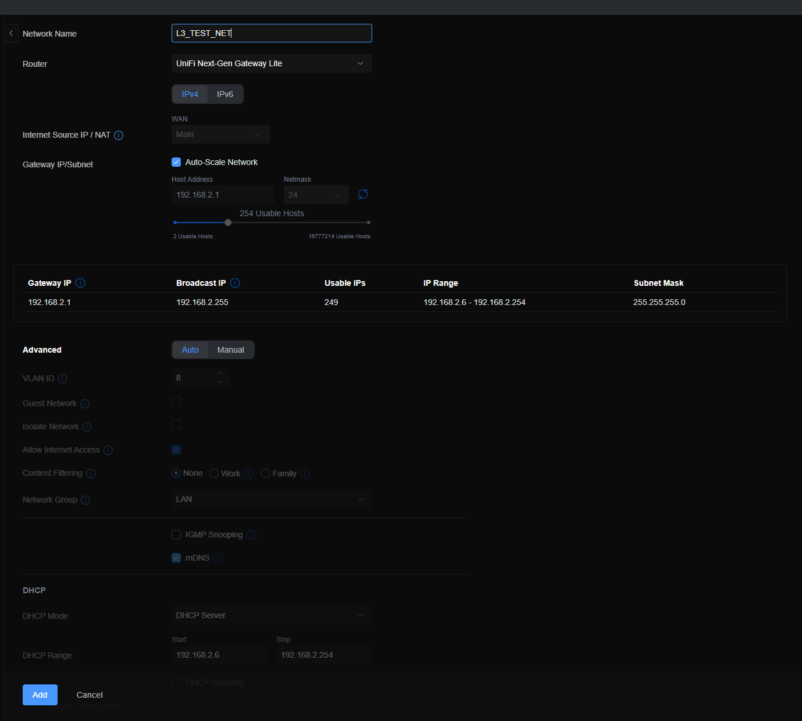

But, When you decide that you want to use that fancy 10 gig layer 3 switch to speed up traffic a bit... You will notice quite a few features disappears.

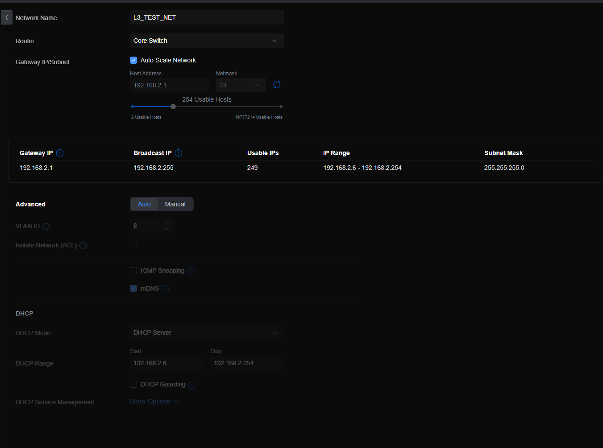

Notably, you lose the ability to configure any form of IPv6. No SLAAC, No DHCP-v6, No prefix delegation. Nothing.

In this case, the ability likely isn't actually implemented. However- this is something to be aware of.

**This also means, NO support for IPv6 routing**

IPv6 traffic can pass over layer 2 just fine. However, there is **ZERO** support for doing anything with IPv6 on this switch.

### But- Unifi does not advertise these as layer-3 routing anymore.

As of 2024-07-19, the front page advertises this as a "Layer 3" switch, with "Layer 3 switching"

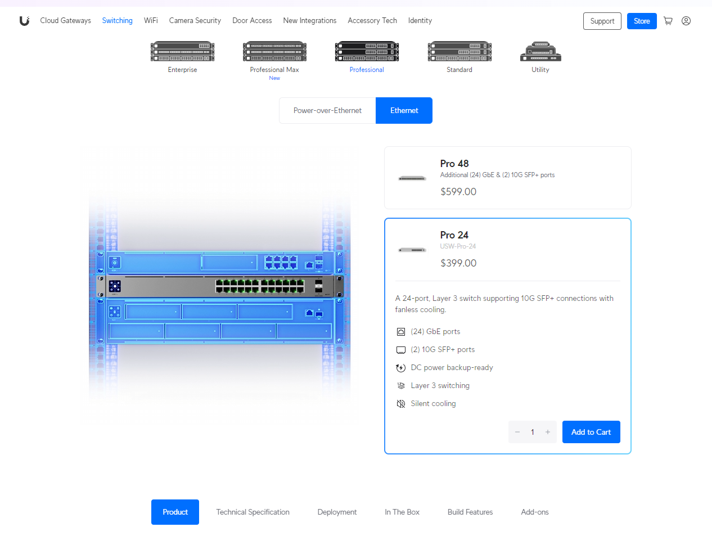

Under Technical Specifications, it lists "Static routing between local networks"

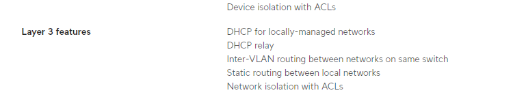


Unifi's [Layer 3 Routing Documentation](https://help.ui.com/hc/en-us/articles/360042281174-Layer-3-Routing){target=_blank}

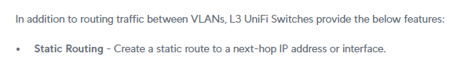


## Other Complaints about Unifi in General

### UXG-Lite "does not support SNMP"

While, this is a pretty minor compliant- You cannot enable SNMP on the UXG-Lite via the Unifi interface.

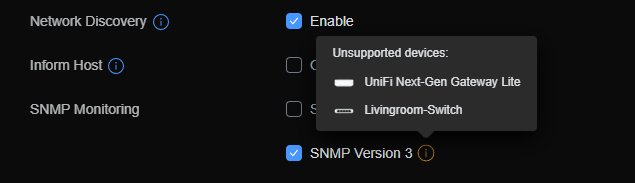

Although, you can enable it manually pretty easily. It just will not persist across reboots.

``` bash
root@UniFiNext-GenGatewayLite:/var/log# apt-get install snmp
Reading package lists... Done
Building dependency tree... Done
Reading state information... Done
The following NEW packages will be installed:
  snmp
0 upgraded, 1 newly installed, 0 to remove and 36 not upgraded.
Need to get 170 kB of archives.
After this operation, 639 kB of additional disk space will be used.
Get:1 https://deb.debian.org/debian bullseye/main arm64 snmp arm64 5.9+dfsg-4+deb11u1 [170 kB]
Fetched 170 kB in 0s (617 kB/s)
Selecting previously unselected package snmp.
(Reading database ... 24657 files and directories currently installed.)
Preparing to unpack .../snmp_5.9+dfsg-4+deb11u1_arm64.deb ...
Unpacking snmp (5.9+dfsg-4+deb11u1) ...
Setting up snmp (5.9+dfsg-4+deb11u1) ...
root@UniFiNext-GenGatewayLite:/var/log# service snmpd start
```

### No support for GRE, GIF, or Tunnels in general.

So, you want IPv6. Your ISP does not offer IPv6. You pick up a /48 block of ip addresses from HE.Net's Tunnelbroker, which is delivered via a GIF tunnel.

Don't bother trying to set it up via Unifi. There is zero support.

!!! info
    Although, as usual- you CAN manually add it via ssh/cli on your gateway.

    Just- don't expect it to persist.

### Real time metrics

This- is an issue I ran across recently when I was working on my [Packet Loss](./2024-07-10-packet-loss.md) issue.

None of the data in Unifi is real-time. NONE of it.

There is no way, you can view, anywheres near a live-traffic view for debugging and diagnosing issues. 

Sure, you can look at switch insights... But, this data is all aggregated, and does not update frequently.

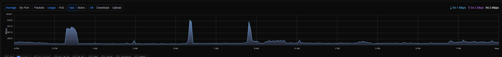

Meanwhile, compared to my Mikrotik, which updates every piece of data in the entire interface... every half second...

(Granted- this is a flat picture, which doesn't show updates.... But- know, those values update every half second or so.)

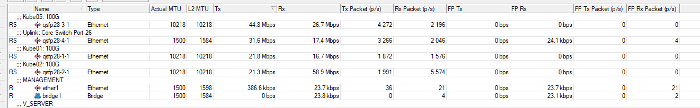

The best option you have, for getting any form of "Useful" diagnostics from Unifi- is by using a monitoring tool... Nagios, Zabbix, LibreNMS, etc.

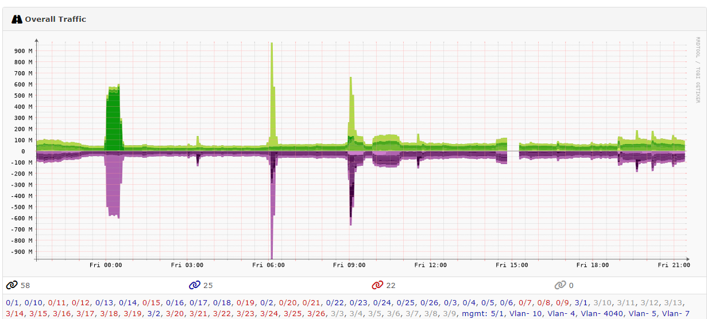

Honestly, I am not kidding. I have to use a 3rd party tool to get any USEFUL metrics from Unifi.

Going back to my [Packet Loss](./2024-07-10-packet-loss.md) issue, One of the items I had to do for troubleshooting, was to look for STP issues, Packet drops, and delay issues.

So, Mikrotik RouterOS makes it easy to view TX/RX drops...

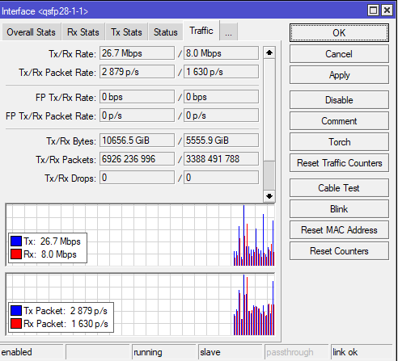

Mikrotik's SwOS also makes it easy to view Drops/Pauses/Issues.

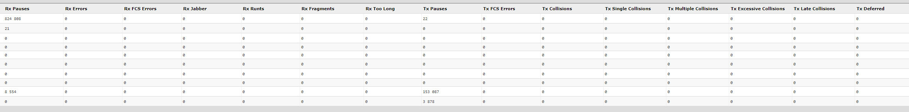

So, one would think, it shouldn't be hard to do via Unifi, right?

Well, the ONLY stats I can find in Unifi for packet issues, is when I click one of my APs from the Port Insights Page. And- it gives excellent information.

!!! info
    After some googling, I did manage to find where switch-port interface stats are, at least for tx/rx drops.

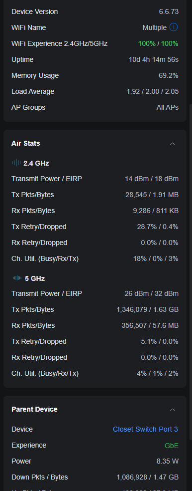

Turns out- the feature DOES exist. Port Insights, Top right, Enable the columns.

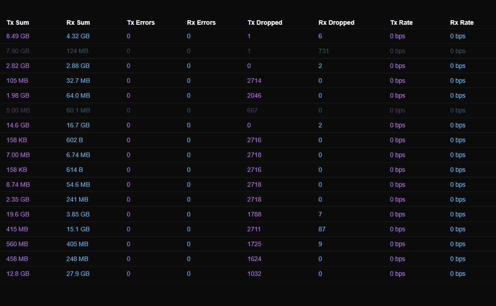

Oddly enough those, this is the only location I can find the view the stats. You cannot just click on a device and see the packet drops/pauses.

Still- there isn't a display to show paused packets.

If, you drop to a CLI, you can see TONS of useful information. Just- not on the GUI.

UXG-Lite:

``` bash
root@UniFiNext-GenGatewayLite:/var/log# netstat --statistics
Ip:
    Forwarding: 1
    3785691 total packets received
    3032238 forwarded
    0 incoming packets discarded
    729421 incoming packets delivered
    3810233 requests sent out
    33 outgoing packets dropped
    10 dropped because of missing route
Icmp:
    66129 ICMP messages received
    16 input ICMP message failed
    ICMP input histogram:
        destination unreachable: 218
        echo requests: 23591
        echo replies: 42320
    70112 ICMP messages sent
    0 ICMP messages failed
    ICMP output histogram:
        destination unreachable: 4129
        redirect: 17
        echo requests: 42375
        echo replies: 23591
IcmpMsg:
        InType0: 42320
        InType3: 218
        InType8: 23591
        OutType0: 23591
        OutType3: 4129
        OutType5: 17
        OutType8: 42375
Tcp:
    18429 active connection openings
    8005 passive connection openings
    9153 failed connection attempts
    9 connection resets received
    3 connections established
    587307 segments received
    595567 segments sent out
    74 segments retransmitted
    0 bad segments received
    9368 resets sent
Udp:
    45904 packets received
    4239 packets to unknown port received
    0 packet receive errors
    123152 packets sent
    0 receive buffer errors
    0 send buffer errors
    IgnoredMulti: 27650
UdpLite:
TcpExt:
    8799 TCP sockets finished time wait in fast timer
    15497 delayed acks sent
    1619 delayed acks further delayed because of locked socket
    Quick ack mode was activated 29 times
    1282 packets directly queued to recvmsg prequeue
    TCPDirectCopyFromPrequeue: 4460
    214851 packet headers predicted
    116260 acknowledgments not containing data payload received
    123131 predicted acknowledgments
    TCPTimeouts: 26
    TCPLossProbes: 27
    TCPDSACKOldSent: 29
    TCPDSACKRecv: 25
    1 connections reset due to early user close
    1 connections aborted due to timeout
    TCPDSACKIgnoredNoUndo: 17
    IPReversePathFilter: 343
    TCPRetransFail: 3
    TCPRcvCoalesce: 12421
    TCPOFOQueue: 136
    TCPSpuriousRtxHostQueues: 16
    TCPAutoCorking: 2132
    TCPSynRetrans: 49
    TCPOrigDataSent: 342918
    TCPHystartTrainDetect: 4
    TCPHystartTrainCwnd: 64
    TCPACKSkippedSeq: 3
    TCPKeepAlive: 79
IpExt:
    InNoRoutes: 2682
    InMcastPkts: 2450
    OutMcastPkts: 6852
    InBcastPkts: 32217
    OutBcastPkts: 4406
    InOctets: 2409440431
    OutOctets: 4166885278
    InMcastOctets: 168688
    OutMcastOctets: 310328
    InBcastOctets: 2731381
    OutBcastOctets: 146366
    InNoECTPkts: 3957265
    InECT1Pkts: 9
    InECT0Pkts: 3646
```

USW-PRO-24 (via CLI)

Again, TONS of information to see here.

``` bash
(UBNT) #show interface ethernet 0/1

Total Packets Received (Octets)................ 4738969822
Packets Received 64 Octets..................... 19047
Packets Received 65-127 Octets................. 1118147
Packets Received 128-255 Octets................ 212154
Packets Received 256-511 Octets................ 274117
Packets Received 512-1023 Octets............... 99508
Packets Received 1024-1518 Octets.............. 2382400
Packets Received 1519-2047 Octets.............. 680274
Packets Received 2048-4095 Octets.............. 0
Packets Received 4096-9216 Octets.............. 0
Good Packets Received > 1518 Octets............ 680274
Packets RX and TX 64 Octets.................... 315750
Packets RX and TX 65-127 Octets................ 1822694
Packets RX and TX 128-255 Octets............... 398190
Packets RX and TX 256-511 Octets............... 348459
Packets RX and TX 512-1023 Octets.............. 163115
Packets RX and TX 1024-1518 Octets............. 2960678
Packets RX and TX 1519-2047 Octets............. 0
Packets RX and TX 2048-4095 Octets............. 0
Packets RX and TX 4096-9216 Octets............. 0

Total Packets Received Without Errors.......... 4785647
Unicast Packets Received....................... 4777342
Multicast Packets Received..................... 4758
Broadcast Packets Received..................... 3547

Receive Packets Discarded...................... 6

Total Packets Received with MAC Errors......... 0
Jabbers Received............................... 0
Fragments Received............................. 0
Undersize Received............................. 0
Alignment Errors Received...................... 0
FCS Errors Received............................ 0
Overruns Received.............................. 0
URPF Discards.................................. 0

Total Received Packets Not Forwarded........... 6
802.3x Pause Frames Received................... 0
Unacceptable Frame Type........................ 6

Total Packets Transmitted (Octets)............. 9651421756
Packets Transmitted 64 Octets.................. 296703
Packets Transmitted 65-127 Octets.............. 704547
Packets Transmitted 128-255 Octets............. 186036
Packets Transmitted 256-511 Octets............. 74342
Packets Transmitted 512-1023 Octets............ 63607
Packets Transmitted 1024-1518 Octets........... 578278
Packets Transmitted > 1518 Octets.............. 5671553
Max Frame Size................................. 1518
Maximum Transmit Unit.......................... 1500

Total Packets Transmitted Successfully......... 7575066
Unicast Packets Transmitted.................... 7561291
Multicast Packets Transmitted.................. 2281
Broadcast Packets Transmitted.................. 11494

Transmit Packets Discarded..................... 1

Total Transmit Errors.......................... 0
FCS Errors Transmitted......................... 0
Transmit errors................................ 0
Jabbers Transmitted............................ 0

Total Transmit Packets Discarded............... 0
Single Collision Frames........................ 0
Multiple Collision Frames...................... 0
Excessive Collision Frames..................... 0

802.3x Pause Frames Transmitted................ 0
GVRP PDUs received............................. 0
GVRP PDUs Transmitted.......................... 0
GVRP Failed Registrations...................... 0
GMRP PDUs Received............................. 0
GMRP PDUs Transmitted.......................... 0
GMRP Failed Registrations...................... 0

STP BPDUs Transmitted.......................... 0
STP BPDUs Received............................. 0
RSTP BPDUs Transmitted......................... 0
RSTP BPDUs Received............................ 0
MSTP BPDUs Transmitted......................... 0
MSTP BPDUs Received............................ 0
SSTP BPDUs Transmitted......................... 0
SSTP BPDUs Received............................ 0

EAPOL Frames Transmitted....................... 0
EAPOL Start Frames Received.................... 0

Load Interval.................................. 300
Bits Per Second Received....................... 6714128
Bits Per Second Transmitted.................... 16502240
Packets Per Second Received.................... 928
Packets Per Second Transmitted................. 1589
Percent Utilization Received................... 0%
Percent Utilization Transmitted................ 1%

Time Since Counters Last Cleared............... 0 day 1 hr 37 min 35 sec

(UBNT) #
```

### Routing - BGP/OSPF/etc.

Unifi DID recently release [OSPF routing.](https://help.ui.com/hc/en-us/articles/12115251061143-UniFi-Gateway-OSPF-Advanced){target=_blank}

And, while its a very basic implementation, it does work, mostly.

But, it does NOT support the layer 3 switches, which is a shame as any routes you are passing back to Unifi, will route through your gateway, instead of your 10G layer 3 unifi switch.

If- this was supported on the Layer 3 switches, I don't think this post would have even been written, let alone published.

BGP- Supposedly- BGP is coming in a future update. 

[Source](https://community.ui.com/releases/UniFi-Network-Application-8-1-113/af46fd38-8afe-4cef-8de1-89636b02b52c)

> Addition of the BGP Dynamic Routing Protocol is scheduled for an upcoming release.


My complaint here, It took nearly a decade before we got support for a single dynamic routing protocol.


