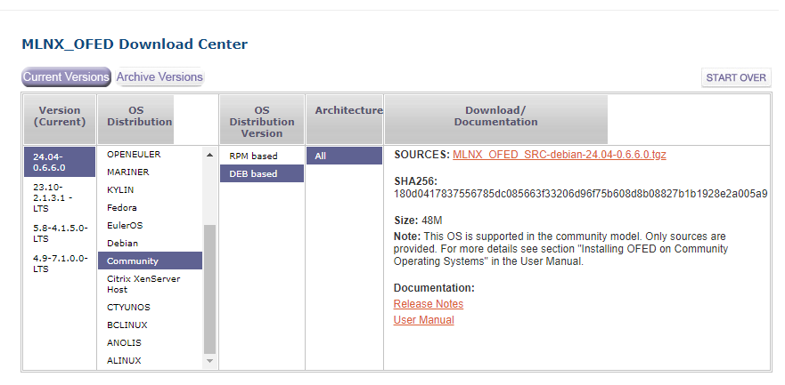

# Enabling SRV-IOV for Mellonax ConnectX-3 on Proxmox

## Why?

SRV-IOV essentially lets you pass your physical NIC directly into a VM, giving direct access to the underlying hardware.

This, is required for RDMA functionality.

The use-cases here:
1. Improved network performance, as the network packets are processed by the NIC, instead of needing to go through the host CPU, iptables, etc.
2. Enables the ability to use RDMA-based technologies.
3. Lower latency, potentially higher bandwidth.
4. VLAN tagging can be handled by the NIC, instead of the hypervisor.

## The process

### Step 1. Enable IOMMU

This, is documented in a separate post HERE [Fix text](./wip-Proxmox-iGPU-Passthrough.md)

Once- you have IOMMU working, and verified, go to step 2.

### Step 2. Install MLNX_OFED Drivers

You can download those from [Nvidia's MLNX_OFED Download Page](https://network.nvidia.com/products/infiniband-drivers/linux/mlnx_ofed/){target=_blank}

If- you don't know which distribution you are using- `cat /etc/*-release`

``` bash
root@kube01:~# cat /etc/*-release
PRETTY_NAME="Debian GNU/Linux 12 (bookworm)"
NAME="Debian GNU/Linux"
VERSION_ID="12"
VERSION="12 (bookworm)"
VERSION_CODENAME=bookworm
ID=debian
HOME_URL="https://www.debian.org/"
SUPPORT_URL="https://www.debian.org/support"
BUG_REPORT_URL="https://bugs.debian.org/"
```

Download, and install the driver. I personally, chose to download the debian package.




``` bash
# Make a random directory to keep everything.
root@kube01:~# mkdir ~/mlnx && cd ~/mlnx

# Download
root@kube01:~/mlnx# wget https://www.mellanox.com/downloads/ofed/MLNX_OFED-24.04-0.6.6.0/MLNX_OFED_SRC-debian-24.04-0.6.6.0.tgz
--2024-06-14 20:14:46--  https://www.mellanox.com/downloads/ofed/MLNX_OFED-24.04-0.6.6.0/MLNX_OFED_SRC-debian-24.04-0.6.6.0.tgz
Resolving www.mellanox.com (www.mellanox.com)... 23.64.119.206, 23.64.119.175
Connecting to www.mellanox.com (www.mellanox.com)|23.64.119.206|:443... connected.
HTTP request sent, awaiting response... 301 Moved Permanently
Location: https://content.mellanox.com/ofed/MLNX_OFED-24.04-0.6.6.0/MLNX_OFED_SRC-debian-24.04-0.6.6.0.tgz [following]
--2024-06-14 20:14:46--  https://content.mellanox.com/ofed/MLNX_OFED-24.04-0.6.6.0/MLNX_OFED_SRC-debian-24.04-0.6.6.0.tgz
Resolving content.mellanox.com (content.mellanox.com)... 107.178.241.102
Connecting to content.mellanox.com (content.mellanox.com)|107.178.241.102|:443... connected.
HTTP request sent, awaiting response... 200 OK
Length: 49558762 (47M) [application/x-tar]
Saving to: ‘MLNX_OFED_SRC-debian-24.04-0.6.6.0.tgz’

MLNX_OFED_SRC-debian-24.04-0.6.6.0.tgz                        100%[=================================================================================================================================================>]  47.26M  14.4MB/s    in 3.3s

2024-06-14 20:14:49 (14.4 MB/s) - ‘MLNX_OFED_SRC-debian-24.04-0.6.6.0.tgz’ saved [49558762/49558762]

# Extract
root@kube01:~/mlnx# tar -zxvf MLNX_OFED_SRC-debian-24.04-0.6.6.0.tgz
MLNX_OFED_SRC-24.04-0.6.6.0/
MLNX_OFED_SRC-24.04-0.6.6.0/DEBS/
MLNX_OFED_SRC-24.04-0.6.6.0/SOURCES/
MLNX_OFED_SRC-24.04-0.6.6.0/SOURCES/ibarr_0.1.3.orig.tar.gz
MLNX_OFED_SRC-24.04-0.6.6.0/SOURCES/ibdump_6.0.0.orig.tar.gz
MLNX_OFED_SRC-24.04-0.6.6.0/SOURCES/ibsim_0.12.orig.tar.gz
MLNX_OFED_SRC-24.04-0.6.6.0/SOURCES/iser_24.04.OFED.24.04.0.6.6.1.orig.tar.gz
MLNX_OFED_SRC-24.04-0.6.6.0/SOURCES/isert_24.04.OFED.24.04.0.6.6.1.orig.tar.gz
MLNX_OFED_SRC-24.04-0.6.6.0/SOURCES/kernel-mft_4.28.0.92.orig.tar.gz
MLNX_OFED_SRC-24.04-0.6.6.0/SOURCES/knem_1.1.4.90mlnx3.orig.tar.gz
MLNX_OFED_SRC-24.04-0.6.6.0/SOURCES/libvma_9.8.60.orig.tar.gz
MLNX_OFED_SRC-24.04-0.6.6.0/SOURCES/libxlio_3.30.5.orig.tar.gz
MLNX_OFED_SRC-24.04-0.6.6.0/SOURCES/mlnx-ethtool_6.7.orig.tar.gz
MLNX_OFED_SRC-24.04-0.6.6.0/SOURCES/mlnx-iproute2_6.7.0.orig.tar.gz
MLNX_OFED_SRC-24.04-0.6.6.0/SOURCES/mlnx-nfsrdma_24.04.OFED.24.04.0.6.6.1.orig.tar.gz
MLNX_OFED_SRC-24.04-0.6.6.0/SOURCES/mlnx-nvme_24.04.OFED.24.04.0.6.6.1.orig.tar.gz
MLNX_OFED_SRC-24.04-0.6.6.0/SOURCES/mlnx-ofed-kernel_24.04.OFED.24.04.0.6.6.1.orig.tar.gz
MLNX_OFED_SRC-24.04-0.6.6.0/SOURCES/mlnx-tools_24.04.0.orig.tar.gz
MLNX_OFED_SRC-24.04-0.6.6.0/SOURCES/mlx-steering-dump_1.0.0.orig.tar.gz
MLNX_OFED_SRC-24.04-0.6.6.0/SOURCES/mpitests_3.2.23.orig.tar.gz
MLNX_OFED_SRC-24.04-0.6.6.0/SOURCES/mstflint_4.16.1.orig.tar.gz
MLNX_OFED_SRC-24.04-0.6.6.0/SOURCES/ofed-scripts_24.04.OFED.24.04.0.6.6.orig.tar.gz
MLNX_OFED_SRC-24.04-0.6.6.0/SOURCES/openmpi_4.1.7a1.orig.tar.gz
MLNX_OFED_SRC-24.04-0.6.6.0/SOURCES/openvswitch_2.17.8.orig.tar.gz
MLNX_OFED_SRC-24.04-0.6.6.0/SOURCES/perftest_24.04.0.orig.tar.gz
MLNX_OFED_SRC-24.04-0.6.6.0/SOURCES/rdma-core_2404mlnx51.orig.tar.gz
MLNX_OFED_SRC-24.04-0.6.6.0/SOURCES/rshim_2.0.28.orig.tar.gz
MLNX_OFED_SRC-24.04-0.6.6.0/SOURCES/sockperf_3.10.orig.tar.gz
MLNX_OFED_SRC-24.04-0.6.6.0/SOURCES/srp_24.04.OFED.24.04.0.6.6.1.orig.tar.gz
MLNX_OFED_SRC-24.04-0.6.6.0/SOURCES/ucx_1.17.0.orig.tar.gz
MLNX_OFED_SRC-24.04-0.6.6.0/install.pl
MLNX_OFED_SRC-24.04-0.6.6.0/uninstall.sh
MLNX_OFED_SRC-24.04-0.6.6.0/common.pl
MLNX_OFED_SRC-24.04-0.6.6.0/BUILD_ID
MLNX_OFED_SRC-24.04-0.6.6.0/LICENSE

## cd
root@kube01:~/mlnx# cd MLNX_OFED_SRC-24.04-0.6.6.0/

# chown to _apt.
root@kube01:~/mlnx/MLNX_OFED_SRC-24.04-0.6.6.0# chown _apt:root -R .

# Add line to package list. Note- Trusted was required for later steps to work.
root@kube01:~/mlnx/MLNX_OFED_SRC-24.04-0.6.6.0# echo "deb [trusted=yes] file:$(pwd)/DEBS ./" > /etc/apt/sources.list.d/mlnx_ofed.list
root@kube01:~/mlnx/MLNX_OFED_SRC-24.04-0.6.6.0/DEBS# cat /etc/apt/sources.list.d/mlnx_ofed.list
deb [trusted=yes] file:/root/mlnx/MLNX_OFED_SRC-24.04-0.6.6.0/DEBS ./

# Add signing key.
root@kube01:~/mlnx/MLNX_OFED_SRC-24.04-0.6.6.0# wget -qO - http://www.mellanox.com/downloads/ofed/RPM-GPG-KEY-Mellanox | sudo apt-key add -
Warning: apt-key is deprecated. Manage keyring files in trusted.gpg.d instead (see apt-key(8)).

# Verify key was imported.
root@kube01:~/mlnx/MLNX_OFED_SRC-24.04-0.6.6.0# apt-key list | grep Mellanox
Warning: apt-key is deprecated. Manage keyring files in trusted.gpg.d instead (see apt-key(8)).
uid           [ unknown] Mellanox Technologies (Mellanox Technologies - Signing Key v2) <support@mellanox.com>
uid           [ unknown] Mellanox Technologies <support@mellanox.com>
uid           [ unknown] Mellanox Technologies (Mellanox Technologies - Signing Key v3) <support@mellanox.com>


# View installer options

root@kube01:~/mlnx/MLNX_OFED_SRC-24.04-0.6.6.0# ./install.pl --help

Usage: ./install.pl [-c <packages config_file>|--all|--hpc|--vma|--xlio|--basic|--bluefield] [OPTIONS]

Installation control:
    --force              Force installation
    --tmpdir             Change tmp directory. Default: /tmp
    -k|--kernel <version>
                         Default on this system: 6.8.4-3-pve (relevant if --without-dkms is given)
    -s|--kernel-sources <path>
                         Default on this system: /lib/modules/6.8.4-3-pve/build (relevant if --without-dkms is given)
    -b|--build-only      Build binary DEBs without installing them (relevant if --without-dkms is given)
                         - This option is supported only when '--kernel-only' option is given.
    --distro             Set Distro name for the running OS (e.g: ubuntu14.04). Default: Use auto-detection.
    --without-depcheck   Run the installation without verifying that all required Distro's packages are installed
    --check-deps-only    Check for missing required Distro's packages and exit
    --print-distro       Print distribution name and exit
    --force-dkms         Force installing kernel packages with DKMS support
    --without-dkms       Don't install kernel packages with DKMS support
    --builddir           Change build directory. Default: /var/tmp
    --umad-dev-rw        Grant non root users read/write permission for umad devices instead of default
    --umad-dev-na        Prevent from non root users read/write access for umad devices. Overrides '--umad-dev-rw'
    --enable-mlnx_tune   Enable Running the mlnx_tune utility
    --enable-opensm      Run opensm upon boot
    --without-mlx5-ipsec Disable IPsec support on ConnectX adapters

    --package-install-options
                         DPKG install options to use when installing DEB packages (comma separated list)
    --pre-build-<package> <path to script>
                         Run given script before given package's build
    --post-build-<package> <path to script>
                         Run given script after given package's build
    --pre-install-<package> <path to script>
                         Run given script before given package's install
    --post-install-<package> <path to script>
                         Run given script after given package's install

Package selection:
    -c|--config <packages config_file>
                         Example of the config file can be found under docs (ofed.conf-example)
    --all                Install all available packages
    --bluefield          Install BlueField packages
    --hpc                Install minimum packages required for HPC
    --basic              Install minimum packages for basic functionality
    --dpdk               Install minimum packages required for DPDK
    --ovs-dpdk           Install DPDK and OVS packages
    --with-vma           Enable installing and configuring VMA package (to be used with any of the above installation options)
    --vma|--vma-vpi      Install minimum packages required by VMA to support VPI
    --vma-eth            Install minimum packages required by VMA to work over Ethernet
    --xlio            Install minimum packages required by XLIO
    --guest              Install minimum packages required by guest OS
    --hypervisor         Install minimum packages required by hypervisor OS
Extra package filtering:
    --kernel-only        Install kernel space packages only
    --user-space-only    Filter selected packages and install only User Space packages
    --without-<package>  Do not install package
    --with-<package>     Force installing package
    --with-memtrack      Build ofa_kernel deb with memory tracking enabled for debugging
    --kernel-extra-args '<args>'
                         pass <args> to kernel configure script (single paraeter, space separated)

Miscellaneous:
    -h|--help            Display this help message and exit
    -p|--print-available Print available packages for current platform
                         And create corresponding ofed.conf file
    --conf-dir           Destination directory to save the configuration file. Default: /root/mlnx/MLNX_OFED_SRC-24.04-0.6.6.0
    --copy-ifnames-udev  Copy compatibility udev rules for interface names

Output control:
    -v|-vv|-vvv          Set verbosity level
    -q                   Set quiet - no messages will be printed

```