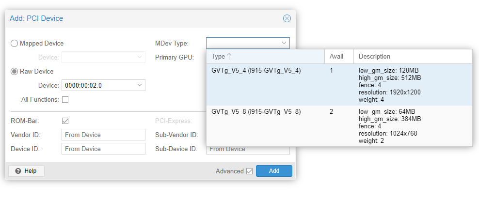
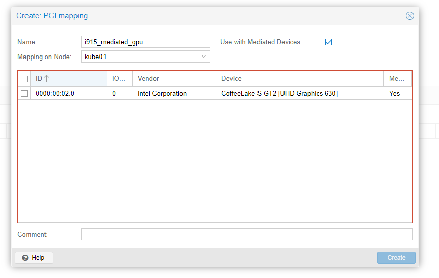

## Proxmox - SR-IOV, and IOMMU for iGPU/GPU/NIC Passthrough to VMs


Make sure your CPU supports IOMMU.
- https://en.wikipedia.org/wiki/List_of_IOMMU-supporting_hardware

Proxmox - PCIe - Passthrough
- https://pve.proxmox.com/wiki/PCI(e)_Passthrough

Proxmox - Nvidia vGPU
- https://pve.proxmox.com/wiki/NVIDIA_vGPU_on_Proxmox_VE

### Why?

#### What is IOMMU

.... ? witchcraft?

### Before actually starting...

##### Clear old kernel versions

!!! info
    My proxmox has bene running for a few years at this point, and this particular host, has a LOT of old kernel versions hanging around.

    If- you have a pretty fresh install, this may not be an issue for you.


To see how many kernel versions you have laying around, run this command: `dpkg --list | grep 'kernel-.*-pve' | awk '{print $2}' | grep -v "$(uname -r)" | sort -V`

Here- is a list of the version I had hanging around-

- proxmox-kernel-6.2.16-8-pve
- proxmox-kernel-6.2.16-15-pve
- proxmox-kernel-6.2.16-19-pve
- proxmox-kernel-6.2.16-20-pve
- proxmox-kernel-6.5.11-4-pve-signed
- proxmox-kernel-6.5.11-7-pve-signed
- proxmox-kernel-6.5.11-8-pve-signed
- proxmox-kernel-6.5.13-5-pve-signed
- pve-kernel-6.2.16-3-pve
- pve-kernel-6.2.16-4-pve
- pve-kernel-6.2.16-5-pve

Keeping- these old kernel versions, will make the following.... steps take much longer...

Here, is a simplified script when can be pasted directly into bash, to automatically clean up your old kernel versions.

If, you want a slightly more elegant solution, you can use the [Original TTECK script](https://tteck.github.io/Proxmox/#proxmox-ve-kernel-clean){target=_blank} that the below script is based on.

``` bash
#!/usr/bin/env bash

# Get current and available kernels
current_kernel=$(uname -r)
available_kernels=$(dpkg --list | grep 'kernel-.*-pve' | awk '{print $2}' | grep -v "$current_kernel" | sort -V)

# Check if there are any old kernels
if [ -z "$available_kernels" ]; then
  echo "No old kernels to remove. Current kernel: $current_kernel."
  exit 0
fi

# Function to remove kernels
remove_kernels() {
  for kernel in $available_kernels; do
    /usr/bin/apt purge -y "$kernel"
  done
}

# Remove old kernels
remove_kernels

# Update GRUB
/usr/sbin/update-grub

echo "Successfully removed old kernels and updated GRUB."
```

##### Update packages

Run `apt-get update && apt-get dist-upgrade`

Since- we will be updating the kernel, and rebooting, you might as well install patches, and upgrade your kernel now.


### Updating boot / kernel options....

#### Update kernel IOMMU settings

Edit /etc/default/grub

FIND GRUB_CMDLINE_LINUX_DEFAULT, ADD `intel_iommu=on iommu=pt`

If, you have an intel i915 GPU, add `i915.enable_gvt=1`

If, you are using an AMD processor, rather then intel, add `amd_iommu=on` instead of `intel_iommu=on`

You should end up with a line somewhat resembling this: (Although, you may have more options- just ensure the iommu options are there)

```
GRUB_CMDLINE_LINUX_DEFAULT="quiet intel_iommu=on iommu=pt i915.enable_gvt=1"
```

#### Add vfio kernel modules.

EDIT `/etc/modules`

ADD

```
vfio
vfio_iommu_type1
vfio_pci
```

#### Blacklist GPU modules

The below script will blacklist GPU driver modules from being loaded.

!!! warn 
    If you are using a display with your proxmox server- This means your display driver will not be loaded upon rebooting the server!

    Only do this, if you want to dedicate the GPU, to one of your VMs.

    You CAN load the driver manually as long as you can access the system via SSH, or a serial port. (if.. you have one.)

``` bash
# Below commands will perform duplicate checking, to prevent from duplicating items.
grep -qxF 'blacklist amdgpu' /etc/modprobe.d/blacklist.conf || echo 'blacklist amdgpu' | sudo tee -a /etc/modprobe.d/blacklist.conf
grep -qxF 'blacklist radeon' /etc/modprobe.d/blacklist.conf || echo 'blacklist radeon' | sudo tee -a /etc/modprobe.d/blacklist.conf
grep -qxF 'blacklist nouveau' /etc/modprobe.d/blacklist.conf || echo 'blacklist nouveau' | sudo tee -a /etc/modprobe.d/blacklist.conf
grep -qxF 'blacklist nvidia*' /etc/modprobe.d/blacklist.conf || echo 'blacklist nvidia*' | sudo tee -a /etc/modprobe.d/blacklist.conf
grep -qxF 'blacklist i915' /etc/modprobe.d/blacklist.conf || echo 'blacklist i915' | sudo tee -a /etc/modprobe.d/blacklist.conf
```

#### Update initramfs

This command, will create a new initramfs, with the current kernel version. If, all else fails, we can revert back to the current version.

`sudo update-initramfs -c -k $(uname -r)`

IF, you are running an older proxmox kernel- like me... you may get a bunch of errors when doing this.

If so- I documented the resolutions for my errors.

If, you don't have errors, you can skip the next few sections.


##### Update initramfs

After fixing all three of the above errors, it is once again time to update the initramfs.

``` bash
# Remount /boot/efi (Need to use YOUR boot partition. Don't copy mine!)
mount /dev/nvme0n1p2 /boot/efi
# And... update initramfs again
update-initramfs -u -k all
```

!!! info
    I noticed it was successfully updating the kernel... and quite a few other older versions.

    At this point, I cleaned out all of the older kernel versions.

    I added this section near the top, before starting any additional steps.

Success!

``` bash
root@kube01:~# update-initramfs -u -k all
update-initramfs: Generating /boot/initrd.img-6.8.4-2-pve
Running hook script 'zz-proxmox-boot'..
Re-executing '/etc/kernel/postinst.d/zz-proxmox-boot' in new private mount namespace..
No /etc/kernel/cmdline found - falling back to /proc/cmdline
Copying and configuring kernels on /dev/disk/by-uuid/D34B-A25D
No initrd-image /boot/initrd.img-6.5.13-5-pve found - skipping
        Copying kernel 6.8.4-2-pve
Generating grub configuration file ...
Found linux image: /boot/vmlinuz-6.8.4-2-pve
Found initrd image: /boot/initrd.img-6.8.4-2-pve
Found linux image: /boot/vmlinuz-6.5.13-5-pve
Found initrd image: /boot/initrd.img-6.5.13-5-pve
Adding boot menu entry for UEFI Firmware Settings ...
done
```

#### Reboot, and cross your fingers

!!! info
    At this point- I also decided to update my system. 

    After, receiving another kernel update.... 
    
    I added another section near the top of this post to update the system BEFORE starting these steps.


Execute the `reboot` command, and cross your fingers...

``` bash
root@kube01:~# reboot
```

``` cmd
"ZEWINDERSSHELL>ping 10.100.4.100 -t

Pinging 10.100.4.100 with 32 bytes of data:
Reply from 10.100.4.100: bytes=32 time<1ms TTL=63
Reply from 10.100.4.100: bytes=32 time<1ms TTL=63
Reply from 10.100.4.100: bytes=32 time<1ms TTL=63
Reply from 10.100.4.100: bytes=32 time<1ms TTL=63
Request timed out.
Request timed out.
Request timed out.
Request timed out.
```

At this point, stick with it, and hope for the best. Prepare to pull out the KVM / Monitor / AMT/vPro...

``` cmd
Request timed out.
Request timed out.
Request timed out.
Request timed out.
Request timed out.
Request timed out.
Request timed out.
Reply from 10.100.4.100: bytes=32 time<1ms TTL=63
Reply from 10.100.4.100: bytes=32 time<1ms TTL=63
Reply from 10.100.4.100: bytes=32 time<1ms TTL=63
Reply from 10.100.4.100: bytes=32 time<1ms TTL=63
```

Now, breathe a very large sigh of relief

### Verify IOMMU is enabled. 

#### Verify Kernel Modules

Verify with `lsmod | grep vfio`

Specifically looking for these modules: vfio, vfio_iommu_type1, vfio_pci

``` bash
root@kube01:~# lsmod | grep vfio
vfio_pci               16384  0
vfio_pci_core          86016  1 vfio_pci
irqbypass              12288  2 vfio_pci_core,kvm
vfio_iommu_type1       49152  0
vfio                   69632  3 vfio_pci_core,vfio_iommu_type1,vfio_pci
iommufd                98304  1 vfio
```

#### Check logs

All good there. Check the logs, look for `IOMMU Enabled`, and look for any errors.

``` bash
root@kube01:~# dmesg | grep -e DMAR -e IOMMU -e AMD-Vi
[    0.008532] ACPI: DMAR 0x0000000079719328 0000A8 (v01 INTEL  EDK2     00000002      01000013)
[    0.008563] ACPI: Reserving DMAR table memory at [mem 0x79719328-0x797193cf]
[    0.052282] DMAR: IOMMU enabled
[    0.142067] DMAR: Host address width 39
[    0.142068] DMAR: DRHD base: 0x000000fed90000 flags: 0x0
[    0.142076] DMAR: dmar0: reg_base_addr fed90000 ver 1:0 cap 1c0000c40660462 ecap 19e2ff0505e
[    0.142078] DMAR: DRHD base: 0x000000fed91000 flags: 0x1
[    0.142081] DMAR: dmar1: reg_base_addr fed91000 ver 1:0 cap d2008c40660462 ecap f050da
[    0.142083] DMAR: RMRR base: 0x0000007a1ac000 end: 0x0000007a3f5fff
[    0.142086] DMAR: RMRR base: 0x0000007d000000 end: 0x0000007f7fffff
[    0.142088] DMAR-IR: IOAPIC id 2 under DRHD base  0xfed91000 IOMMU 1
[    0.142089] DMAR-IR: HPET id 0 under DRHD base 0xfed91000
[    0.142090] DMAR-IR: Queued invalidation will be enabled to support x2apic and Intr-remapping.
[    0.144856] DMAR-IR: Enabled IRQ remapping in x2apic mode
[    0.428707] DMAR: No ATSR found
[    0.428708] DMAR: No SATC found
[    0.428710] DMAR: IOMMU feature fl1gp_support inconsistent
[    0.428711] DMAR: IOMMU feature pgsel_inv inconsistent
[    0.428712] DMAR: IOMMU feature nwfs inconsistent
[    0.428713] DMAR: IOMMU feature pasid inconsistent
[    0.428714] DMAR: IOMMU feature eafs inconsistent
[    0.428715] DMAR: IOMMU feature prs inconsistent
[    0.428715] DMAR: IOMMU feature nest inconsistent
[    0.428716] DMAR: IOMMU feature mts inconsistent
[    0.428717] DMAR: IOMMU feature sc_support inconsistent
[    0.428718] DMAR: IOMMU feature dev_iotlb_support inconsistent
[    0.428719] DMAR: dmar0: Using Queued invalidation
[    0.428722] DMAR: dmar1: Using Queued invalidation
[    0.429330] DMAR: Intel(R) Virtualization Technology for Directed I/O
root@kube01:~#
```

#### Check IOMMU Groups

Run this command: `pvesh get /nodes/$(hostname)/hardware/pci --pci-class-blacklist ""`

It will output a table of IOMMU groups on the current node.

```
| class    | device | id           | iommugroup | vendor | device_name                                                                             | mdev | subsystem_device | subsystem_device_name                      | subsystem_vendor | subsystem |
|----------|--------|--------------|------------|--------|-----------------------------------------------------------------------------------------|------|------------------|--------------------------------------------|------------------|------------|
| 0x010601 | 0xa352 | 0000:00:17.0 | 8          | 0x8086 | Cannon Lake PCH SATA AHCI Controller                                                    |      | 0x085a           |                                            | 0x1028           | Dell       |
| 0x010700 | 0x0087 | 0000:01:00.0 | 2          | 0x1000 | SAS2308 PCI-Express Fusion-MPT SAS-2                                                    |      | 0x3040           | 9207-8e SAS2.1 HBA                         | 0x1000           | Broadcom   |
| 0x010802 | 0x0001 | 0000:02:00.0 | 12         | 0x1e0f | NVMe SSD Controller BG4                                                                 |      | 0x0001           |                                            | 0x1e0f           | KIOXIA Co  |
| 0x020000 | 0x15bb | 0000:00:1f.6 | 11         | 0x8086 | Ethernet Connection (7) I219-LM                                                         |      | 0x085a           |                                            | 0x1028           | Dell       |
| 0x020000 | 0x1003 | 0000:03:00.0 | 13         | 0x15b3 | MT27500 Family [ConnectX-3]                                                             |      | 0x0055           | ConnectX-3 10 GbE Single Port SFP+ Adapter | 0x15b3           | Mellanox   |
| 0x030000 | 0x3e92 | 0000:00:02.0 | 0          | 0x8086 | CoffeeLake-S GT2 [UHD Graphics 630]                                                     |      | 0x085a           |                                            | 0x1028           | Dell       |
| 0x040300 | 0xa348 | 0000:00:1f.3 | 11         | 0x8086 | Cannon Lake PCH cAVS                                                                    |      | 0x085a           |                                            | 0x1028           | Dell       |
| 0x050000 | 0xa36f | 0000:00:14.2 | 5          | 0x8086 | Cannon Lake PCH Shared SRAM                                                             |      | 0x7270           |                                            | 0x8086           | Intel Cor  |
| 0x060000 | 0x3ec2 | 0000:00:00.0 | 1          | 0x8086 | 8th Gen Core Processor Host Bridge/DRAM Registers                                       |      | 0x085a           |                                            | 0x1028           | Dell       |
| 0x060100 | 0xa306 | 0000:00:1f.0 | 11         | 0x8086 | Q370 Chipset LPC/eSPI Controller                                                        |      | 0x085a           |                                            | 0x1028           | Dell       |
| 0x060400 | 0x1901 | 0000:00:01.0 | 2          | 0x8086 | 6th-10th Gen Core Processor PCIe Controller (x16)                                       |      | 0x085a           |                                            | 0x1028           | Dell       |
| 0x060400 | 0xa340 | 0000:00:1b.0 | 9          | 0x8086 | Cannon Lake PCH PCI Express Root Port #17                                               |      | 0x085a           |                                            | 0x1028           | Dell       |
| 0x060400 | 0xa330 | 0000:00:1d.0 | 10         | 0x8086 | Cannon Lake PCH PCI Express Root Port #9                                                |      | 0x085a           |                                            | 0x1028           | Dell       |
| 0x070002 | 0xa363 | 0000:00:16.3 | 7          | 0x8086 | Cannon Lake PCH Active Management Technology - SOL                                      |      | 0x085a           |                                            | 0x1028           | Dell       |
| 0x078000 | 0xa360 | 0000:00:16.0 | 7          | 0x8086 | Cannon Lake PCH HECI Controller                                                         |      | 0x085a           |                                            | 0x1028           | Dell       |
| 0x088000 | 0x1911 | 0000:00:08.0 | 3          | 0x8086 | Xeon E3-1200 v5/v6 / E3-1500 v5 / 6th/7th/8th Gen Core Processor Gaussian Mixture Model |      | 0x085a           |                                            | 0x1028           | Dell       |
| 0x0c0330 | 0xa36d | 0000:00:14.0 | 5          | 0x8086 | Cannon Lake PCH USB 3.1 xHCI Host Controller                                            |      | 0x085a           |                                            | 0x1028           | Dell       |
| 0x0c0500 | 0xa323 | 0000:00:1f.4 | 11         | 0x8086 | Cannon Lake PCH SMBus Controller                                                        |      | 0x085a           |                                            | 0x1028           | Dell       |
| 0x0c8000 | 0xa368 | 0000:00:15.0 | 6          | 0x8086 | Cannon Lake PCH Serial IO I2C Controller #0                                             |      | 0x085a           |                                            | 0x1028           | Dell       |
| 0x0c8000 | 0xa324 | 0000:00:1f.5 | 11         | 0x8086 | Cannon Lake PCH SPI Controller                                                          |      | 0x085a           |                                            | 0x1028           | Dell       |
| 0x118000 | 0xa379 | 0000:00:12.0 | 4          | 0x8086 | Cannon Lake PCH Thermal Controller                                                      |      | 0x085a           |                                            | 0x1028           | Dell       |
```

As an alternate command, I found this: 

`for d in /sys/kernel/iommu_groups/*/devices/*; do n=${d#*/iommu_groups/*}; n=${n%%/*}; printf 'IOMMU group %s ' "$n"; lspci -nns "${d##*/}"; done`

``` bash
root@kube01:/etc/pve/nodes/kube02/qemu-server# for d in /sys/kernel/iommu_groups/*/devices/*; do n=${d#*/iommu_groups/*}; n=${n%%/*}; printf 'IOMMU group %s ' "$n"; lspci -nns "${d##*/}"; done
IOMMU group 0 00:02.0 VGA compatible controller [0300]: Intel Corporation CoffeeLake-S GT2 [UHD Graphics 630] [8086:3e92]
IOMMU group 10 00:1d.0 PCI bridge [0604]: Intel Corporation Cannon Lake PCH PCI Express Root Port #9 [8086:a330] (rev f0)
IOMMU group 11 00:1f.0 ISA bridge [0601]: Intel Corporation Q370 Chipset LPC/eSPI Controller [8086:a306] (rev 10)
IOMMU group 11 00:1f.3 Audio device [0403]: Intel Corporation Cannon Lake PCH cAVS [8086:a348] (rev 10)
IOMMU group 11 00:1f.4 SMBus [0c05]: Intel Corporation Cannon Lake PCH SMBus Controller [8086:a323] (rev 10)
IOMMU group 11 00:1f.5 Serial bus controller [0c80]: Intel Corporation Cannon Lake PCH SPI Controller [8086:a324] (rev 10)
IOMMU group 11 00:1f.6 Ethernet controller [0200]: Intel Corporation Ethernet Connection (7) I219-LM [8086:15bb] (rev 10)
IOMMU group 12 02:00.0 Non-Volatile memory controller [0108]: KIOXIA Corporation NVMe SSD Controller BG4 [1e0f:0001]
IOMMU group 13 03:00.0 Ethernet controller [0200]: Mellanox Technologies MT27500 Family [ConnectX-3] [15b3:1003]
IOMMU group 1 00:00.0 Host bridge [0600]: Intel Corporation 8th Gen Core Processor Host Bridge/DRAM Registers [8086:3ec2] (rev 07)
IOMMU group 2 00:01.0 PCI bridge [0604]: Intel Corporation 6th-10th Gen Core Processor PCIe Controller (x16) [8086:1901] (rev 07)
IOMMU group 2 01:00.0 Serial Attached SCSI controller [0107]: Broadcom / LSI SAS2308 PCI-Express Fusion-MPT SAS-2 [1000:0087] (rev 05)
IOMMU group 3 00:08.0 System peripheral [0880]: Intel Corporation Xeon E3-1200 v5/v6 / E3-1500 v5 / 6th/7th/8th Gen Core Processor Gaussian Mixture Model [8086:1911]
IOMMU group 4 00:12.0 Signal processing controller [1180]: Intel Corporation Cannon Lake PCH Thermal Controller [8086:a379] (rev 10)
IOMMU group 5 00:14.0 USB controller [0c03]: Intel Corporation Cannon Lake PCH USB 3.1 xHCI Host Controller [8086:a36d] (rev 10)
IOMMU group 5 00:14.2 RAM memory [0500]: Intel Corporation Cannon Lake PCH Shared SRAM [8086:a36f] (rev 10)
IOMMU group 6 00:15.0 Serial bus controller [0c80]: Intel Corporation Cannon Lake PCH Serial IO I2C Controller #0 [8086:a368] (rev 10)
IOMMU group 7 00:16.0 Communication controller [0780]: Intel Corporation Cannon Lake PCH HECI Controller [8086:a360] (rev 10)
IOMMU group 7 00:16.3 Serial controller [0700]: Intel Corporation Cannon Lake PCH Active Management Technology - SOL [8086:a363] (rev 10)
IOMMU group 8 00:17.0 SATA controller [0106]: Intel Corporation Cannon Lake PCH SATA AHCI Controller [8086:a352] (rev 10)
IOMMU group 9 00:1b.0 PCI bridge [0604]: Intel Corporation Cannon Lake PCH PCI Express Root Port #17 [8086:a340] (rev f0)
```

Excellent. We now have IOMMU enabled. 

The two lines I am interested in are...

- `CoffeeLake-S GT2 [UHD Graphics 630]` (Quicksync GPU)
- `MT27500 Family [ConnectX-3]` ConnectX-3 NIC. (Not, for direct passthrough, but, SRV-IOV passthrough... more later.)


# WIP - Docs

Finish this guide: https://pve.proxmox.com/wiki/PCI(e)_Passthrough

Also, enable SRV-IOV

https://forum.proxmox.com/threads/enabling-sr-iov-for-intel-nic-x550-t2-on-proxmox-6.56677/


# KVMGT

https://www.linux-kvm.org/images/f/f3/01x08b-KVMGT-a.pdf

After enabling required drivers, and functionality.



These "mediated" devices can also be used with resource mappings at the cluster level. This will allow VMs to "share" GPUs when failing over to other hosts.


=======
Another interesting post:

https://forum.proxmox.com/threads/here-is-how-you-can-get-100-gbps-infiniband-up-and-running.121873/

# Another good read..
https://tech-jungle.com/setting-up-proxmox-with-shared-storage-over-infiniband/


## Enabling srv-iov for ConnectX-3

### Install mstflint

``` bash
root@kube01:~# apt-get install mstflint
Reading package lists... Done
Building dependency tree... Done
Reading state information... Done
The following additional packages will be installed:
  libboost-filesystem1.74.0 libibmad5 libibumad3 libmuparser2v5
The following NEW packages will be installed:
  libboost-filesystem1.74.0 libibmad5 libibumad3 libmuparser2v5 mstflint
0 upgraded, 5 newly installed, 0 to remove and 0 not upgraded.
Need to get 2,492 kB of archives.
After this operation, 19.7 MB of additional disk space will be used.
Do you want to continue? [Y/n]
```

Query card.

``` bash
root@kube05:~/mlnx# mstflint -d 03:00.0 q
Image type:            FS2
FW Version:            2.35.5100
FW Release Date:       6.9.2015
Product Version:       02.35.51.00
Rom Info:              type=PXE version=3.4.648
Device ID:             4099
Description:           Node             Port1            Port2            Sys image
GUIDs:                 ffffffffffffffff ffffffffffffffff ffffffffffffffff ffffffffffffffff
MACs:                                       e41d2ddd88a0     e41d2ddd88a1
VSD:
PSID:                  MT_1170110023
```

Downloading firmware.

``` bash
root@kube05:~/mlnx# wget http://content.mellanox.com/firmware/ConnectX3-rel-2_40_5030.tgz
--2024-06-17 11:31:51--  http://content.mellanox.com/firmware/ConnectX3-rel-2_40_5030.tgz
Resolving content.mellanox.com (content.mellanox.com)... 107.178.241.102
Connecting to content.mellanox.com (content.mellanox.com)|107.178.241.102|:80... connected.
HTTP request sent, awaiting response... 200 OK
Length: 2046870 (2.0M) [application/x-tar]
Saving to: ‘ConnectX3-rel-2_40_5030.tgz’

ConnectX3-rel-2_40_5030.tgz                                  100%[=============================================================================================================================================>]   1.95M  2.92MB/s    in 0.7s

2024-06-17 11:31:52 (2.92 MB/s) - ‘ConnectX3-rel-2_40_5030.tgz’ saved [2046870/2046870]

root@kube05:~/mlnx# tar -xzvf ConnectX3-rel-2_40_5030.tgz
./
./MCX353A-QCB_Ax.ini
./MCX312B-XCB_Bx.ini
./MCX341A-XCG_Ax.ini
./MCX311A-XCA_Ax.ini
./MCX314A-BCB_Ax.ini
./MCX341A-XCE_Ax.ini
./MCX341A-XCD_Ax.ini
./MCX354A-QCB_Ax.ini
./MCX353A-TCB_Ax.ini
./MCX354A-FCB_A2-A5.ini
./MCX342A-XCC_Ax.ini
./MCX353A-FCB_A2-A5.ini
./MCX313A-BCB_A4-A6.ini
./MCX341A-XCA_Ax.ini
./MCX342A-XCE_MCTPOSMBUS_INTERNAL_Ax.ini
./MCX342A-XCE_Ax.ini
./MCX341A-XCC_Ax.ini
./MCX342A-XCB_Ax.ini
./MCX341A-XCE_MCTPOSMBUS_Ax.ini
./MCX341A-XCB_Ax.ini
./MCX342A-XCD_Ax.ini
./MCX354A-TCB_Ax.ini
./MCX312B-XCB_Ax.ini
./MCX313A-BCB_A1-A3.ini
./MCX342A-XCA_Ax.ini
./MCX312A-XCB_A2-A6.ini
./MCX342A-XCG_Ax.ini
./fw-ConnectX3-rel.mlx
./fw-ConnectX3-debug.mlx
./fw-ConnectX3-defaults.ref
```

Dump config
``` bash
mstflint -d 03:00.0 dc > /tmp/ini.ini
```

Edit Config. Add the following under the "[HCA]" section.

num_pfs = 1
total_vfs = 64
sriov_en = true

``` bash
nano /tmp/ini.ini
```

Update firmware, set config.


# Install mellonax software from deb

``` bash
root@kube05:/etc/apt/sources.list.d# wget https://linux.mellanox.com/public/repo/mlnx_ofed/latest/debian12.1/mellanox_mlnx_ofed.list
--2024-06-17 11:43:39--  https://linux.mellanox.com/public/repo/mlnx_ofed/latest/debian12.1/mellanox_mlnx_ofed.list
Resolving linux.mellanox.com (linux.mellanox.com)... 168.62.212.37
Connecting to linux.mellanox.com (linux.mellanox.com)|168.62.212.37|:443... connected.
HTTP request sent, awaiting response... 200 OK
Length: 253
Saving to: ‘mellanox_mlnx_ofed.list’

mellanox_mlnx_ofed.list                                      100%[=============================================================================================================================================>]     253  --.-KB/s    in 0s

2024-06-17 11:43:39 (27.6 MB/s) - ‘mellanox_mlnx_ofed.list’ saved [253/253]
root@kube05:/etc/apt/sources.list.d# wget -qO - https://www.mellanox.com/downloads/ofed/RPM-GPG-KEY-Mellanox | sudo apt-key add -
Warning: apt-key is deprecated. Manage keyring files in trusted.gpg.d instead (see apt-key(8)).
OK
root@kube05:/etc/apt/sources.list.d# apt-get update
Hit:1 http://download.proxmox.com/debian/pve bookworm InRelease
Hit:2 http://deb.debian.org/debian bookworm InRelease
Hit:3 http://security.debian.org/debian-security bookworm-security InRelease
Hit:4 http://download.proxmox.com/debian/ceph-reef bookworm InRelease
Hit:5 http://deb.debian.org/debian bookworm-updates InRelease
Ign:6 http://linux.mellanox.com/public/repo/mlnx_ofed/24.04-0.6.6.0/debian12.1/amd64 ./ InRelease
Get:7 http://linux.mellanox.com/public/repo/mlnx_ofed/24.04-0.6.6.0/debian12.1/amd64 ./ Release [1,329 B]
Get:8 http://linux.mellanox.com/public/repo/mlnx_ofed/24.04-0.6.6.0/debian12.1/amd64 ./ Release.gpg [516 B]
Get:9 http://linux.mellanox.com/public/repo/mlnx_ofed/24.04-0.6.6.0/debian12.1/amd64 ./ Packages [36.8 kB]
Fetched 38.6 kB in 1s (56.4 kB/s)
Reading package lists... Done
W: http://linux.mellanox.com/public/repo/mlnx_ofed/24.04-0.6.6.0/debian12.1/amd64/./Release.gpg: Key is stored in legacy trusted.gpg keyring (/etc/apt/trusted.gpg), see the DEPRECATION section in apt-key(8) for details.
root@kube05:/etc/apt/sources.list.d#
```


## Install MLXBurn

Find the correct version / url here: https://network.nvidia.com/products/adapter-software/firmware-tools/

``` bash
root@kube05:~/mlxburn# wget https://www.mellanox.com/downloads/MFT/mft-4.28.0-92-x86_64-deb.tgz
--2024-06-17 11:50:23--  https://www.mellanox.com/downloads/MFT/mft-4.28.0-92-x86_64-deb.tgz
Resolving www.mellanox.com (www.mellanox.com)... 23.215.55.169, 23.215.55.185
Connecting to www.mellanox.com (www.mellanox.com)|23.215.55.169|:443... connected.
HTTP request sent, awaiting response... 301 Moved Permanently
Location: https://content.mellanox.com/MFT/mft-4.28.0-92-x86_64-deb.tgz [following]
--2024-06-17 11:50:24--  https://content.mellanox.com/MFT/mft-4.28.0-92-x86_64-deb.tgz
Resolving content.mellanox.com (content.mellanox.com)... 107.178.241.102
Connecting to content.mellanox.com (content.mellanox.com)|107.178.241.102|:443... connected.
HTTP request sent, awaiting response... 200 OK
Length: 60344664 (58M) [application/gzip]
Saving to: ‘mft-4.28.0-92-x86_64-deb.tgz’

mft-4.28.0-92-x86_64-deb.tgz                                 100%[=============================================================================================================================================>]  57.55M  9.25MB/s    in 7.1s

2024-06-17 11:50:31 (8.07 MB/s) - ‘mft-4.28.0-92-x86_64-deb.tgz’ saved [60344664/60344664]

root@kube05:~/mlxburn# tar -zxvf mft-4.28.0-92-x86_64-deb.tgz
mft-4.28.0-92-x86_64-deb/DEBS/
mft-4.28.0-92-x86_64-deb/DEBS/mft-autocomplete_4.28.0-92_amd64.deb
mft-4.28.0-92-x86_64-deb/DEBS/mft-oem_4.28.0-92_amd64.deb
mft-4.28.0-92-x86_64-deb/DEBS/mft-pcap_4.28.0-92_amd64.deb
mft-4.28.0-92-x86_64-deb/DEBS/mft_4.28.0-92_amd64.deb
mft-4.28.0-92-x86_64-deb/LICENSE.txt
mft-4.28.0-92-x86_64-deb/SDEBS/
mft-4.28.0-92-x86_64-deb/SDEBS/kernel-mft-dkms_4.28.0-92_all.deb
mft-4.28.0-92-x86_64-deb/install.sh
mft-4.28.0-92-x86_64-deb/old-mft-uninstall.sh
mft-4.28.0-92-x86_64-deb/uninstall.sh
root@kube05:~/mlxburn# cd mft-4.28.0-92-x86_64-deb/DEBS
root@kube05:~/mlxburn/mft-4.28.0-92-x86_64-deb/DEBS# dpkg -i mft_4.28.0-92_amd64.deb
Selecting previously unselected package mft.
(Reading database ... 49112 files and directories currently installed.)
Preparing to unpack mft_4.28.0-92_amd64.deb ...
Unpacking mft (4.28.0-92) ...
Setting up mft (4.28.0-92) ...
Processing triggers for libc-bin (2.36-9+deb12u7) ...
Processing triggers for man-db (2.11.2-2) ...
root@kube05:~/mlxburn/mft-4.28.0-92-x86_64-deb/DEBS# mlx
mlxburn                mlxcables_ext          mlxdump_ext            mlxfwstress_ext        mlxlink_ext            mlxpci                 mlxptrace_ext          mlxtokengenerator      mlxvpd
mlxburn_old            mlxconfig              mlxfwmanager           mlxgearbox             mlxlink_plane_wrapper  mlxphyburn             mlxptrace_int          mlxtrace
mlxcableimgen          mlxdpa                 mlxfwreset             mlxi2c                 mlxmcg                 mlxprivhost            mlxreg                 mlxtrace_ext
mlxcables              mlxdump                mlxfwstress            mlxlink                mlxmdio                mlxptrace              mlxreg_ext             mlxuptime
```


A really good piece of documentation: https://forums.servethehome.com/index.php?threads/connectx-3-custom-firmware-files.39457/

https://access.redhat.com/documentation/en-us/red_hat_enterprise_linux_openstack_platform/7/html/networking_guide/sr-iov-support-for-virtual-networking

## Purge Mellonax packages

``` bash
dpkg -P mft
dpkg -P mstflint
```

## Validate GVT is enabled.

``` bash
root@kube01:~# ls /sys/bus/pci/devices/0000:00:02.0/mdev_supported_types/
i915-GVTg_V5_4  i915-GVTg_V5_8
```