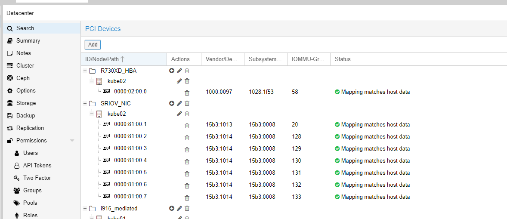

``` bash
root@kube02:/sys/class/infiniband/mlx5_0# echo 8 > /sys/class/infiniband/mlx5_0/device/sriov_numvfs
root@kube02:/sys/class/infiniband/mlx5_0# lspci | grep Mel
81:00.0 Ethernet controller: Mellanox Technologies MT27700 Family [ConnectX-4]
81:00.1 Ethernet controller: Mellanox Technologies MT27700 Family [ConnectX-4]
81:00.2 Ethernet controller: Mellanox Technologies MT27700 Family [ConnectX-4 Virtual Function]
81:00.3 Ethernet controller: Mellanox Technologies MT27700 Family [ConnectX-4 Virtual Function]
81:00.4 Ethernet controller: Mellanox Technologies MT27700 Family [ConnectX-4 Virtual Function]
81:00.5 Ethernet controller: Mellanox Technologies MT27700 Family [ConnectX-4 Virtual Function]
81:00.6 Ethernet controller: Mellanox Technologies MT27700 Family [ConnectX-4 Virtual Function]
81:00.7 Ethernet controller: Mellanox Technologies MT27700 Family [ConnectX-4 Virtual Function]
81:01.0 Ethernet controller: Mellanox Technologies MT27700 Family [ConnectX-4 Virtual Function]
81:01.1 Ethernet controller: Mellanox Technologies MT27700 Family [ConnectX-4 Virtual Function]
```

And... poof

