# Guide: Migrate from Virtualbox to Proxmox

Just a short guide on how to migrate a VirtualBox VM on Windows, to Proxmox.

<!-- more -->

## Step 1. Convert .VDI to raw .IMG

To convert the VDI to a raw image, we can use `VBoxManage.exe`

This, is located in your Virtualbox install directory. I created a simple powershell script which will perform this task for you.

!!! note
    Make sure you have enough space- The .IMG file created will be the FULL SIZE of the disk image.

    If- you notice in my example, I am putting the output IMG on another disk, as my root disk did not have enough free space.

``` powershell
# This needs to be set to the exact path of VBoxManage.exe
$VBoxManage = "C:\Program Files\Oracle\VirtualBox\VBoxManage.exe"
# Set this to the source .vdi file for your VM.
$InputVDI = "C:\Users\YourUser\VirtualBox VMs\YourVM\YourImage.vdi"
# Set this path, to the output file for the raw disk image.
$OutputPath = "I:\Users\YourUser\VirtualBox VMs\YourVM\YourImage.img"

# No need to touch this.
. $VBoxManage clonehd --format RAW $InputVDI $OutputPath
```

The following output will be produced.

``` txt
. $VBoxManage clonehd --format RAW $InputVDI $OutputPath

VBoxManage.exe : 0%...10%...20%...30%...40%...50%...60%...70%...80%...90%...100%
At line:5 char:1
+ . $VBoxManage clonehd --format RAW $InputVDI $OutputPath
+ ~~~~~~~~~~~~~~~~~~~~~~~~~~~~~~~~~~~~~~~~~~~~~~~~~~~~~~~~
    + CategoryInfo          : NotSpecified: (0%...10%...20%....0%...90%...100%:String) [], RemoteException
    + FullyQualifiedErrorId : NativeCommandError
 
Clone medium created in format 'RAW'. UUID: 2915a341-0757-4315-982d-b48bdcd386a2
```

Ignore... the exception... Powershell does very odd things with stderr.

## Step 2. Create a new proxmox VM.

No, special configurations are needed.

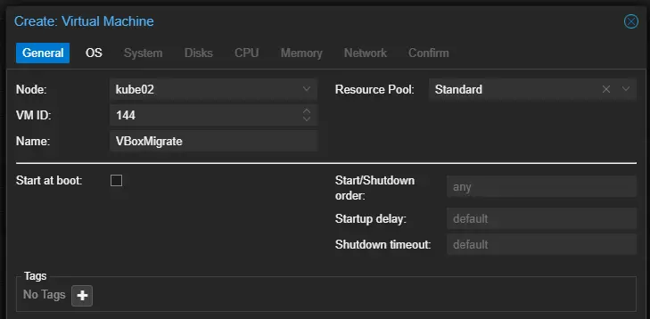

Do not use attach any boot media.

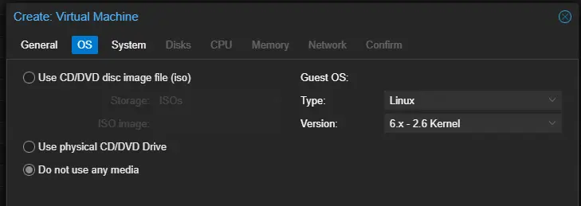

Nothing special needed here.

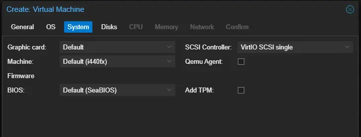

For disks- remove the default disk created. We will manually attach a disk via CLI.

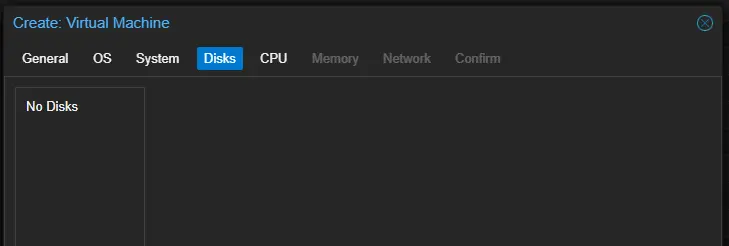

Nothing special needed on CPU. Allocate cores as needed.

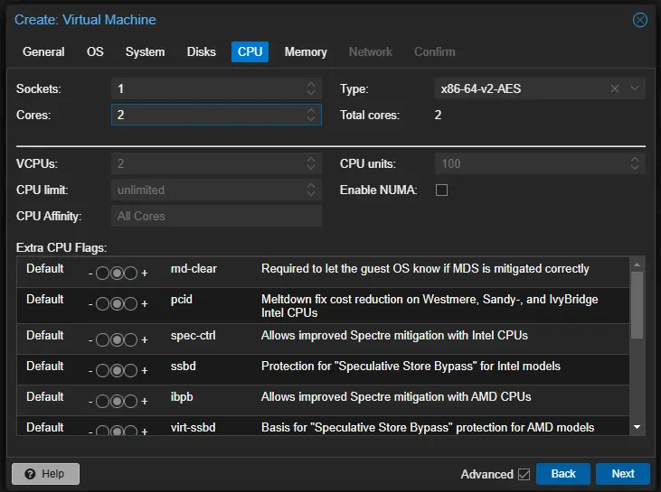

For memory, I personally always disable ballooning.

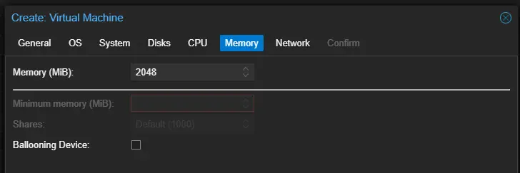

For network, I am not going to specify a NIC at this time. You can specify network as needed for your use-cases.

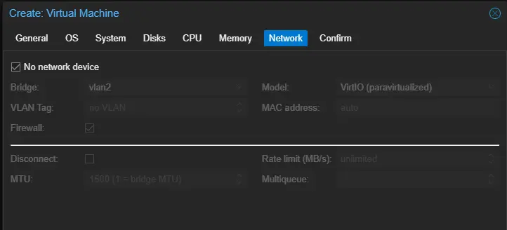

On the confirm screen, make sure "Start after created" is not checked.

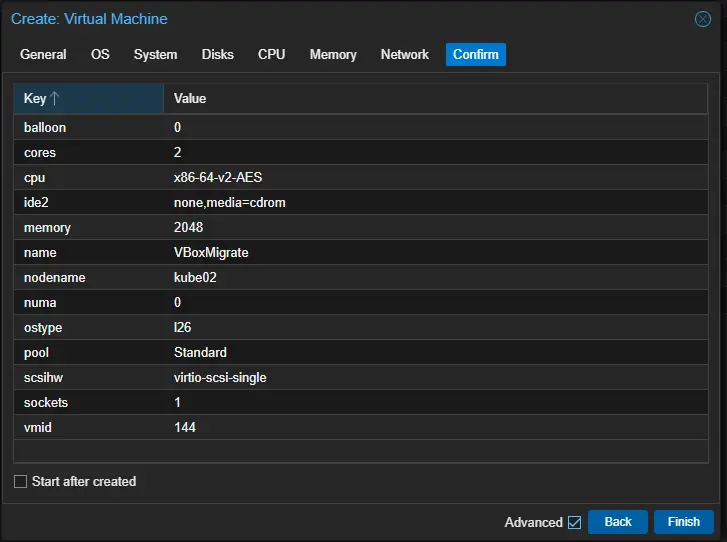

You now have a new VM, without any storage, in a stopped state.

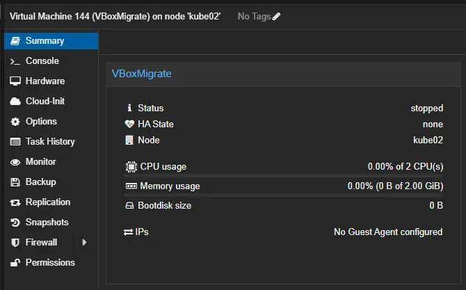

## Step 3. Migrate the .IMG to Proxmox

Ok... make sure you have enough room to copy the disk to proxmox.

I ended up needing to take a detour to [Delete the data partition from Proxmox](2025-02-08-Proxmox-Root-LVM-Full.md){target=_blank}

But- you will need to copy the .IMG over to one of your servers.

I ended up copying it to the ISOs share on my NAS, which is mounted to all of my PVE hosts.

``` bash
root@kube02:~# ls -al /mnt/pve/ISOs/
total 10709368
-rwxr-xr-x 1 root root 4758700032 Feb  8 15:51  DiskImage.img
```

## Step 4. Convert the raw image to QCow2

Suppose- you could do this before copying to your NAS/Hypervisor... But, now is as good of a time as any.

This- will take a while.

``` bash
root@kube02:~# qemu-img convert -f raw -O qcow2 /mnt/pve/ISOs/DiskImage.img NewImage.qcow2
```

If... you are using a remote mounted share- it will have to read over the network. According to Unraid, it was reading around 2g/s.

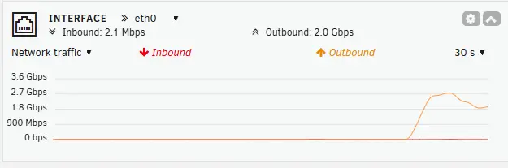

QCow2 stands for QEMU, Copy on Write... It supports compression, snapshots, thin-provisioning, and a few other nice features.

The benefit here, is not having a 100G raw file. 

Instead, we just have a 20G file, as that is how much data is actually used.

``` bash
# Raw .IMG
root@kube02:~# du -h /mnt/pve/ISOs/DiskImage.img
101G    /mnt/pve/ISOs/DiskImage.img
# Qcow2
root@kube02:~# du -h NewImage.qcow2
20G     NewImage.qcow2
```

## Step 4. Import the raw image to the new VM

We can use `qm importdisk` to achieve this. 

You will need to know...

1. The VM's number
2. The name of the storage you wish to use.

The syntax is...

`qm importdisk YOUR_VM_ID /path/to/your/raw/image NAME_OF_YOUR_STORAGE`

``` bash
root@kube02:~# qm importdisk 144 NewImage.qcow2  ceph-block
Use of uninitialized value $dev in hash element at /usr/share/perl5/PVE/QemuServer/Drive.pm line 555.
importing disk 'NewImage.qcow2' to VM 144 ...
transferred 0.0 B of 100.0 GiB (0.00%)
transferred 1.0 GiB of 100.0 GiB (1.00%)
... (truncated logs)
transferred 100.0 GiB of 100.0 GiB (100.00%)
transferred 100.0 GiB of 100.0 GiB (100.00%)
unused0: successfully imported disk 'ceph-block:vm-144-disk-0'
```

For me, this step took... about one minute. Ceph averaged 300-500MB/s

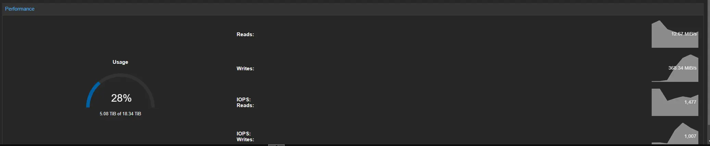

In proxmox, you will now see the new disk.

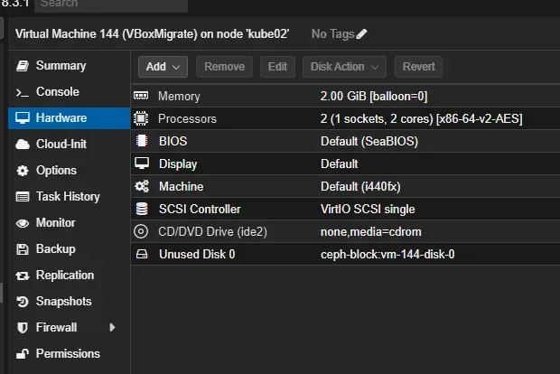

## Step 5. Configure VM

Attach the disk. Click the unused disk, and click edit.

Set your desired bus, and settings, then click add.

I always use VirtIO when possible, as this provides the best performance using para-virtualized drivers.

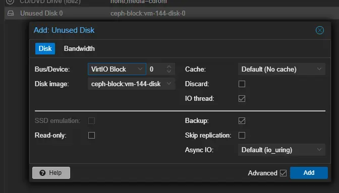

The disk will now show attached.

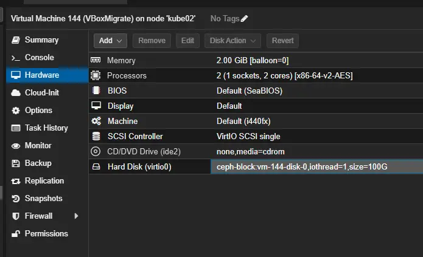

Now, set the boot options. By default, it is set to ide2 (cd-rom drive). You can uncheck this, and select the new disk.

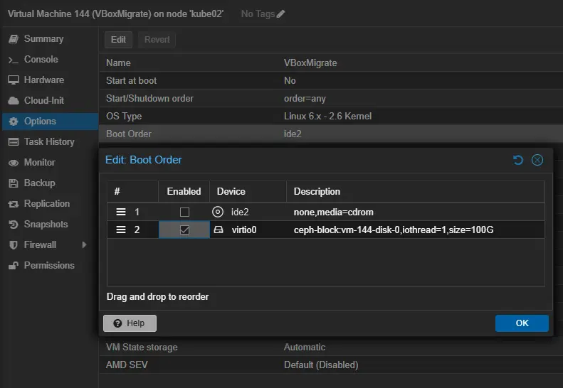

## Step 6. Start VM / Done.

At this point, you can start the VM, and everything should work.

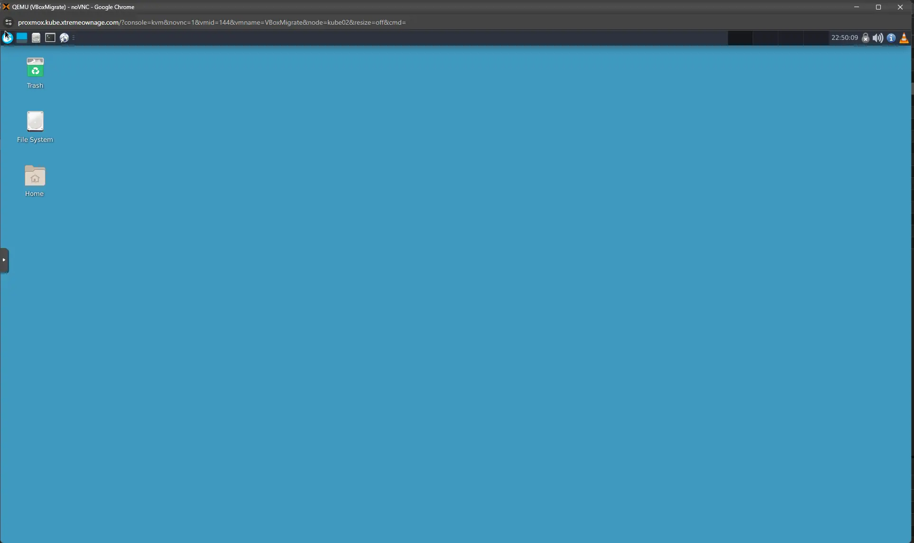

Congratulations, you have successfully migrated your Virtualbox VM to Proxmox.