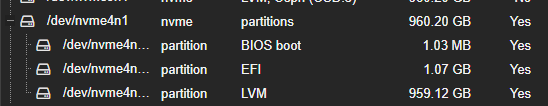
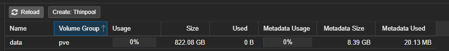

# Guide: Proxmox - Delete "data" thinpool and extend root partition

Have... a full root partition on proxmox?

``` bash
root@kube02:~# df -h
Filesystem                            Size  Used Avail Use% Mounted on
udev                                  126G     0  126G   0% /dev
tmpfs                                  26G   21M   26G   1% /run
/dev/mapper/pve-root                   94G   94G     0 100% /
```

Confused because your boot disk is much larger in size?



Well, its because Proxmox by default, partitions the root disk with LVM, Regardless if you are using it to store data.



This post detail completely removing the data partition and extending the root partition

<!-- more -->

## Just tell me how to fix the problem.

If- you don't want the reading material- here is a script which can be copy and pasted.

If- you prefer reading, and details, skip to the [next section.](#steps)

Here is a script to perform all of the above steps, which can be copy and pasted to proxmox systems.

!!! danger
    This ASSUMES you are not using the data pool for VM Storage.

    If you ARE using the data pool- this will result in data loss.

    Don't do this if you are using the pool.

``` bash
# Umount the data pool
lvchange -an /dev/pve/data
# Delete the data pool
lvremove /dev/pve/data
# Extend the root pool
lvextend -r -l +100%FREE /dev/pve/root
```

Output:

``` bash
root@kube05:~# df -h
Filesystem                            Size  Used Avail Use% Mounted on
/dev/mapper/pve-root                   68G  9.6G   55G  15% /
root@kube05:~# # Umount the data pool
root@kube05:~# lvchange -an /dev/pve/data
root@kube05:~# # Delete the data pool
root@kube05:~# lvremove /dev/pve/data
  Logical volume "data" successfully removed.
root@kube05:~# # Extend the root pool
root@kube05:~# lvextend -r -l +100%FREE /dev/pve/root
  Size of logical volume pve/root changed from <69.37 GiB (17758 extents) to 229.46 GiB (58743 extents).
  Logical volume pve/root successfully resized.
resize2fs 1.47.0 (5-Feb-2023)
Filesystem at /dev/mapper/pve-root is mounted on /; on-line resizing required
old_desc_blocks = 9, new_desc_blocks = 29
The filesystem on /dev/mapper/pve-root is now 60152832 (4k) blocks long.

root@kube05:~# df -h
Filesystem                            Size  Used Avail Use% Mounted on
/dev/mapper/pve-root                  226G  9.6G  206G   5% /
root@kube05:~#
```

## Steps

### Step 1. Collect Data

First- lets collect some data using the , `pgs`, `vgs` and `lvs` commands.

1. `pgs` shows physical volumes. (aka, physical disks)
2. `vgs` shows volume groups (This, is a group of disks)
3. `lvs` shows logical volumes (This, is a logical volume, aka, partition.)

To, explain the differences, here is a table.

| **Component** | **Description** | **Analogy** |
|--------------|---------------|-------------|
| **PV (Physical Volume)** | Raw storage device or partition added to LVM | Disk or partition |
| **VG (Volume Group)** | A collection of PVs forming a storage pool | A warehouse |
| **LV (Logical Volume)** | A virtual partition created from a VG | A shelf in the warehouse |

```
root@kube02:~# pvs
PV             VG                                        Fmt  Attr PSize   PFree
/dev/nvme4n1p3 pve                                       lvm2 a--  893.25g 16.00g

root@kube02:~# vgs
VG                                        #PV #LV #SN Attr   VSize   VFree
pve                                         1   2   0 wz--n- 893.25g 16.00g

root@kube02:~# lvs
LV                                             VG                                        Attr       LSize   Pool Origin Data%  Meta%  Move Log Cpy%Sync Convert
data                                           pve                                       twi-a-tz-- 765.62g             0.00   0.24
root                                           pve                                       -wi-ao----  96.00g
```

#### Collecting even more data

If- you want more detail, you can use the commands....

1. `pvdisplay` - Show more information about physical volumes
2. `pvdisplay -m` - Show more information about physical volumes AND break down extends
1. `vgdisplay` - Show more information about volume groups
2. `lvdisplay` - Show more information about logical volumes

Example:

``` bash
root@kube02:~# pvdisplay /dev/nvme4n1p3
  --- Physical volume ---
  PV Name               /dev/nvme4n1p3
  VG Name               pve
  PV Size               893.25 GiB / not usable <2.32 MiB
  Allocatable           yes
  PE Size               4.00 MiB
  Total PE              228672
  Free PE               4097
  Allocated PE          224575
  PV UUID               SHXo9z-M3jq-1VTk-gO5O-0YS3-EtX8-yFRypB

root@kube02:~# pvdisplay -m /dev/nvme4n1p3
  --- Physical volume ---
  PV Name               /dev/nvme4n1p3
  VG Name               pve
  PV Size               893.25 GiB / not usable <2.32 MiB
  Allocatable           yes
  PE Size               4.00 MiB
  Total PE              228672
  Free PE               4097
  Allocated PE          224575
  PV UUID               SHXo9z-M3jq-1VTk-gO5O-0YS3-EtX8-yFRypB

  --- Physical Segments ---
  Physical extent 0 to 24575:
    Logical volume      /dev/pve/root
    Logical extents     0 to 24575
  Physical extent 24576 to 220574:
    Logical volume      /dev/pve/data_tdata
    Logical extents     0 to 195998
  Physical extent 220575 to 222574:
    Logical volume      /dev/pve/data_tmeta
    Logical extents     0 to 1999
  Physical extent 222575 to 224574:
    Logical volume      /dev/pve/lvol0_pmspare
    Logical extents     0 to 1999
  Physical extent 224575 to 228671:
    FREE

root@kube02:~# vgdisplay pve
  --- Volume group ---
  VG Name               pve
  System ID
  Format                lvm2
  Metadata Areas        1
  Metadata Sequence No  6
  VG Access             read/write
  VG Status             resizable
  MAX LV                0
  Cur LV                2
  Open LV               1
  Max PV                0
  Cur PV                1
  Act PV                1
  VG Size               893.25 GiB
  PE Size               4.00 MiB
  Total PE              228672
  Alloc PE / Size       224575 / <877.25 GiB
  Free  PE / Size       4097 / 16.00 GiB
  VG UUID               TWcjCJ-TYB8-uCy3-TVzP-0KvZ-cDCy-kbx0rM

root@kube02:~# lvdisplay pve/root
  --- Logical volume ---
  LV Path                /dev/pve/root
  LV Name                root
  VG Name                pve
  LV UUID                FHgUow-erI5-FmgY-CkLh-sQH7-Z94p-P5WYx1
  LV Write Access        read/write
  LV Creation host, time proxmox, 2024-07-04 11:55:18 -0500
  LV Status              available
  # open                 1
  LV Size                96.00 GiB
  Current LE             24576
  Segments               1
  Allocation             inherit
  Read ahead sectors     auto
  - currently set to     256
  Block device           252:8
```

#### Identify the issue

From the intro, we know the issue is the root partition being full.

We can see this, by running `df -h`

``` bash
root@kube02:~# df -h
Filesystem                            Size  Used Avail Use% Mounted on
udev                                  126G     0  126G   0% /dev
tmpfs                                  26G   21M   26G   1% /run
/dev/mapper/pve-root                   94G   94G     0 100% /
```

From the path- we can see pve-root is the partition.

From the above data we collected, we know...

1. The logical volume name is "root"
2. The volume group name is "pve"
3. The physical volume/disk is "/dev/nvme4n1p3"

### Remove Data Thinpool

Steps:

1. Unmount partition.
2. Delete thinpool

To umount, we can use `lvchange`

``` bash
root@kube02:~# lvchange -an /dev/pve/data
```

Then, delete the thin pool

``` bash
root@kube02:~# lvremove /dev/pve/data
  Logical volume "data" successfully removed.
```

!!! note
    You will need to reduce the disk usage under 100% in order to remove the thinpool.

    I found 3G worth of journal logs to clean up

    ``` bash
    root@kube02:~# rm -rf /var/log/journal/df694b9549624c8bb72acadbdd282b8d
    ```

### Extend root LVS

Extending the root LVS is pretty easy using `lvextend`

``` bash
root@kube02:~# lvextend -r -l +100%FREE /dev/pve/root
  Size of logical volume pve/root changed from 96.00 GiB (24576 extents) to 893.25 GiB (228672 extents).
  Logical volume pve/root successfully resized.
resize2fs 1.47.0 (5-Feb-2023)
Filesystem at /dev/mapper/pve-root is mounted on /; on-line resizing required
old_desc_blocks = 12, new_desc_blocks = 112
The filesystem on /dev/mapper/pve-root is now 234160128 (4k) blocks long.
```

### Done

``` bash
root@kube02:~# df -h
Filesystem                            Size  Used Avail Use% Mounted on
udev                                  126G     0  126G   0% /dev
tmpfs                                  26G  4.9M   26G   1% /run
/dev/mapper/pve-root                  879G   92G  751G  11% /
```

Your root partition has now been resized to match your disk.