# DIN Mounting my closet - Part 1

So... Near the end of 2024, I ended up cleaning up my rack, and making everything nice and tidy.

If- you missed that, have a look at the [2024 Homelab Summary](../2024/2024-12-28-homelab-2024.md){target=_blank}

For the next problem- my networking closet is an absolute disaster.

There are wires hanging everywhere... There are switches, and cables everywhere... its a mess.

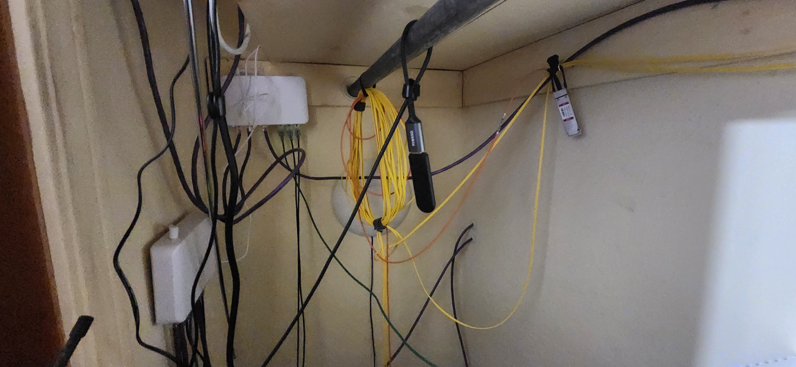

I plan on building a frame, with DIN rails for mounting all of this hardware.

I see tons of racks. I see tons of mini racks. I rarely see DIN-mounted networking.

<!-- more -->

## Cutting raw materials

The frame itself, took roughly a week to build. A lot of time was spent just waiting for glue to harden and cure.

Another design decision- I wanted this to be very easily removable, and installable- I came up with a pretty creative solution for this.

### Taking some measurements.

I wanted to mount this in the back of the closet, out of sight, out of mind. The problem is, there is limited room here.

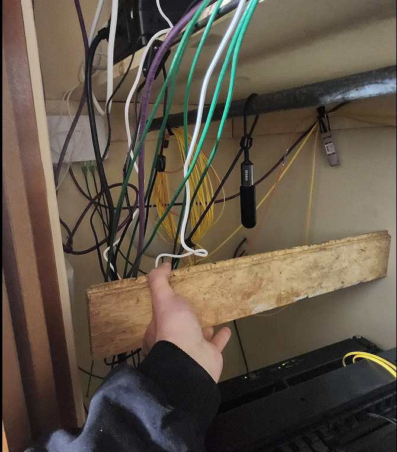

This- is the first constraint of the project. 

I did want to make it wide enough to fit standard-width rack hardware.

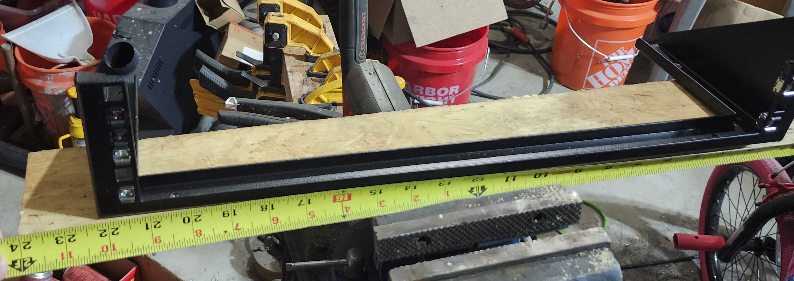

In the end, I came up with around 23.5" wide, and around 22.5" tall.

### Cutting Plywood

For this project, I used around a half sheet of plywood, and a few 1x2s. The overall lumber cost was less then 50$.

Since I had measurements- the next step, was to cut the plywood.

I started by using one of the 1x2s to trace the measurements.

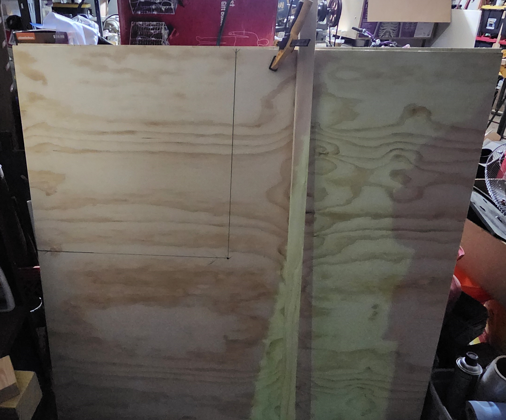

After drawing the lines, and double-checking the measurements, the plywood was moved to a table where I could cut it using a standard skilsaw.

I clamped one of the 1x2s to the plywood as a guide for the saw. (Me + Straight Lines = Not happening!)

Always, double, and then triple-check your measurements.

You can always measure again. But- once you make the cut- you can't go back.

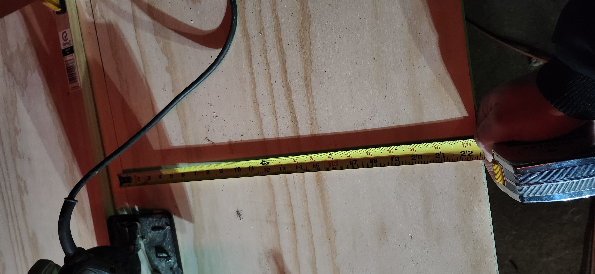

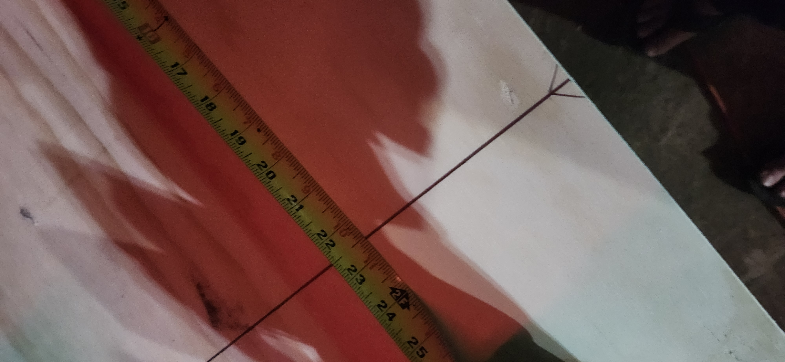

And- when you think everything is spot-on, measure again!

There SHOULD be a picture here of the cut plywood, however, of the 161 pictures I took of this project.... that was not one of them.

### Mitering the trim.

So- instead of just slapping up a basic piece of plywood, I did want to make this look somewhat appealing to the eye.

The purpose of the 1x2s is to make a border around the edge.

I decided to cut the corners at a 45 degree angle, to make nice, neat joins.

So... out came the miter saw. I picked up this metabo for 87$, brand new from [Amazon](https://amzn.to/41pJOyd){target=_blank}.

Worth every penny. (Its- not 87$ anymore. But- only 129$ as of writing this.)

Anyways- first cut down.

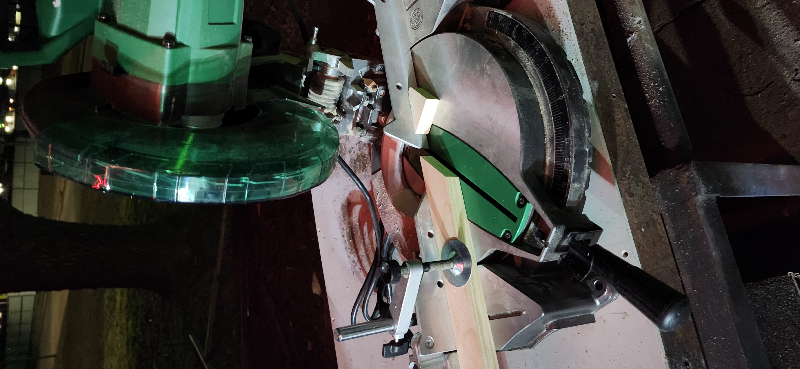

And... another.

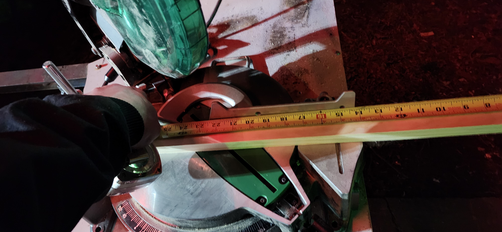

And, after 8 total cuts, I had a frame.

Next step is- to start assembling....

## Basic frame assembly

### Initial Assembly

For this frame, everything is both screwed, and glued together.

Make sure to identify suitable nails, which will not over penetrate.

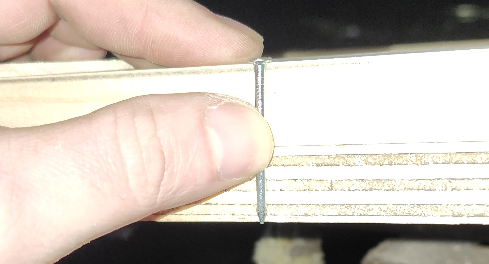

I did cheat- and use a 90 degree welding JIG I had in my shop.

Not required- but, does help to lock a corner to 90 degrees.

As noted above, everything is glued. I used standard construction adhesive as I had a few tubes laying around.

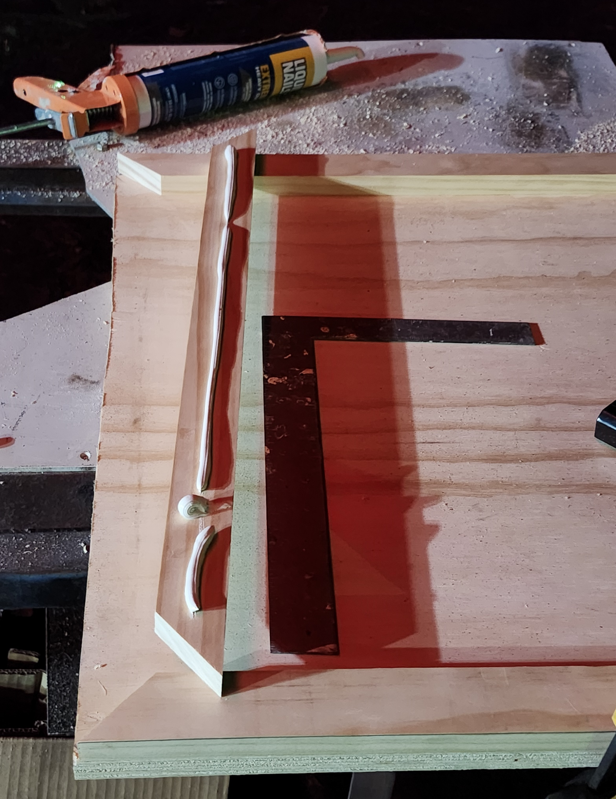

Make sure to check your square before attaching anything!!!!

And, as usual, ensure everything stays square.

### Clamping overnight

For the glue to correctly set, we need to ensure everything is clamped tightly.

For this, you will need... a lot of clamps.

This- was the end of the first night.

After removing the clamps the following evening, we have a pretty solid frame.

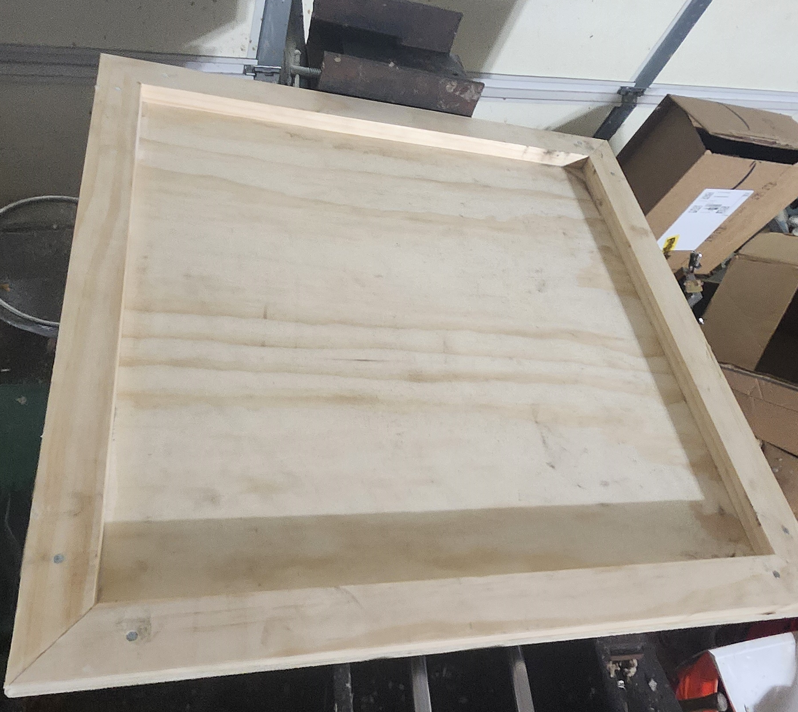

### Hiding Nails

I wanted to hide the visible nails from the final product. So- I started on this next.

I used a hammer and a punch to slightly tap in each of the nails.

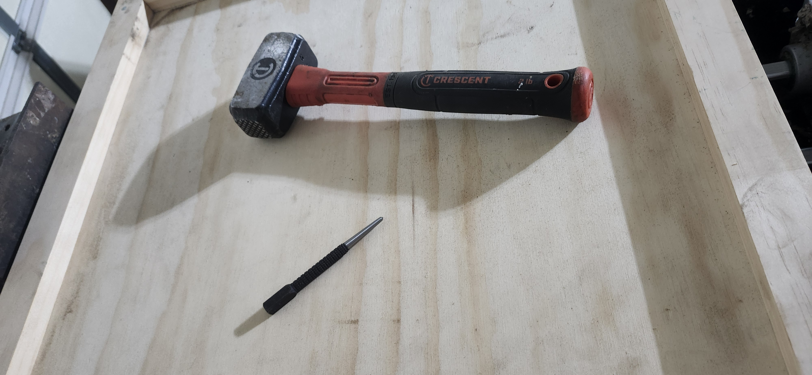

At this point, wood filler will fill in the void. However- I did not have any on hand.

Instead- I had a tube of wood plastic.

This- would be fine, except... it was white. (left over from trim work)

But- I went ahead and used it anyways. Ideally- having it wood-colored would have made things a bit easier.

Finally- I used a putty knife to knock the bulk excess off- and then used a sanding block for the final sanding (not shown here).

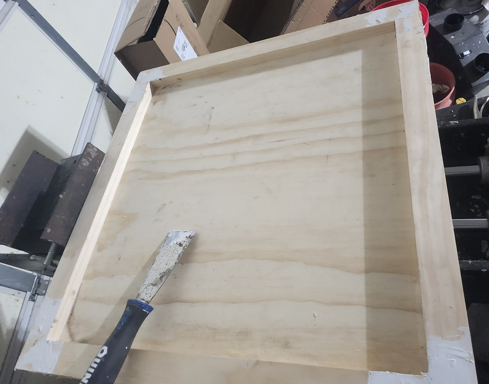

## Closet Mounting Brackets