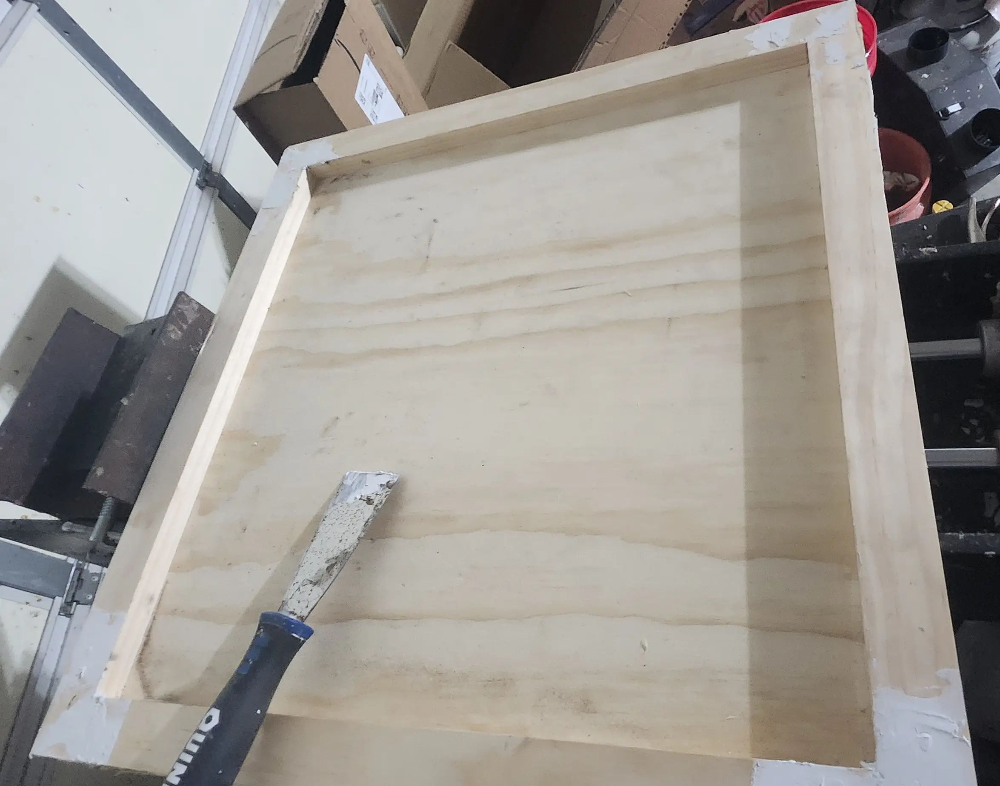
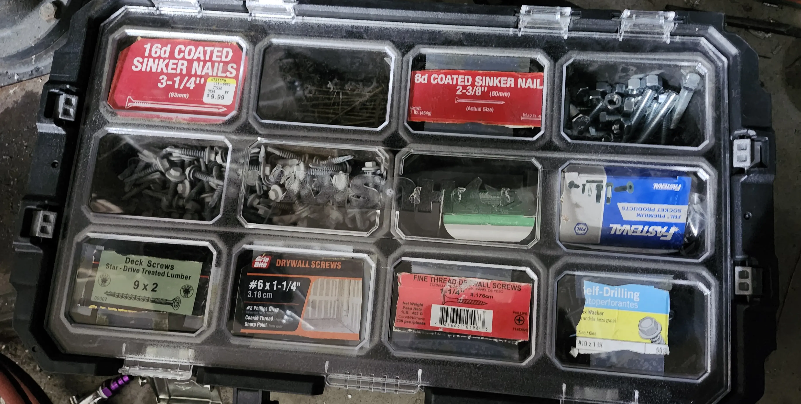

# DIN Mount Network Closet - Part 1 - Building the frame

So... Near the end of 2024, I ended up cleaning up my rack, and making everything nice and tidy.

If- you missed that, have a look at the [2024 Homelab Summary](../2024/2024-12-28-homelab-2024.md){target=_blank}

For the next problem- my networking closet is an absolute disaster.

There are wires hanging everywhere... There are switches, and cables everywhere... its a mess.

I plan on building a frame, with DIN rails for mounting all of this hardware.

I see tons of racks. I see tons of mini racks. I rarely see DIN-mounted networking.

Part 1, is building the frame which will hold all of the components. 

This is all wood and construction. Nothing technical.

<!-- more -->

## Cutting raw materials

The frame itself, took roughly a week to build. A lot of time was spent just waiting for glue to harden and cure.

Another design decision- I wanted this to be very easily removable, and installable- I came up with a pretty creative solution for this.

### Taking some measurements.

I wanted to mount this in the back of the closet, out of sight, out of mind. The problem is, there is limited room here.

This- is the first constraint of the project. 

I did want to make it wide enough to fit standard-width rack hardware.

In the end, I came up with around 23.5" wide, and around 22.5" tall.

### Cutting Plywood

For this project, I used around a half sheet of plywood, and a few 1x2s. The overall lumber cost was less then 50$.

Since I had measurements- the next step, was to cut the plywood.

I started by using one of the 1x2s to trace the measurements.

After drawing the lines, and double-checking the measurements, the plywood was moved to a table where I could cut it using a standard skilsaw.

I clamped one of the 1x2s to the plywood as a guide for the saw. (Me + Straight Lines = Not happening!)

Always, double, and then triple-check your measurements.

You can always measure again. But- once you make the cut- you can't go back.

And- when you think everything is spot-on, measure again!

There SHOULD be a picture here of the cut plywood, however, of the 161 pictures I took of this project.... that was not one of them.

### Mitering the trim.

So- instead of just slapping up a basic piece of plywood, I did want to make this look somewhat appealing to the eye.

The purpose of the 1x2s is to make a border around the edge.

I decided to cut the corners at a 45 degree angle, to make nice, neat joins.

So... out came the miter saw. I picked up this metabo for 87$, brand new from [Amazon](https://amzn.to/41pJOyd){target=_blank}.

Worth every penny. (Its- not 87$ anymore. But- only 129$ as of writing this.)

Anyways- first cut down.

And... another.

And, after 8 total cuts, I had a frame.

Next step is- to start assembling....

## Basic frame assembly

### Initial Assembly

For this frame, everything is both screwed, and glued together.

Make sure to identify suitable nails, which will not over penetrate.

I did cheat- and use a 90 degree welding JIG I had in my shop.

Not required- but, does help to lock a corner to 90 degrees.

As noted above, everything is glued. I used standard construction adhesive as I had a few tubes laying around.

Make sure to check your square before attaching anything!!!!

And, as usual, ensure everything stays square.

### Clamping overnight

For the glue to correctly set, we need to ensure everything is clamped tightly.

For this, you will need... a lot of clamps.

This- was the end of the first night.

After removing the clamps the following evening, we have a pretty solid frame.

### Hiding Nails

I wanted to hide the visible nails from the final product. So- I started on this next.

I used a hammer and a punch to slightly tap in each of the nails.

At this point, wood filler will fill in the void. However- I did not have any on hand.

Instead- I had a tube of wood plastic.

This- would be fine, except... it was white. (left over from trim work)

But- I went ahead and used it anyways. Ideally- having it wood-colored would have made things a bit easier.

Finally- I used a putty knife to knock the bulk excess off- and then used a sanding block for the final sanding (not shown here).

## Mounting Wedge

Remember earlier- I said I wanted it to be easily installable, and removable? I decided to build a self-centering wedge mount.

The goal, you can just pick it up off the wall when needed, and when mounted, it should be perfectly secure without any wobbling.

### Coming up with an idea

Nothing here is being built based on any guide, video, etc. 

I have an idea- and I am winging it to the end result. As a result- there was a bit of experimentation here.

I started with, painting an arrow on the back of the frame, to ensure I don't accidentally mount anything in the wrong direction.

Next, I use the miter saw to slice a few 2x4s into "Wedges"

A quick and dirty mock-up just to see if the idea could work.

!!! info
    Yes- I know they are not cut even.

    Stick with me!!!

After seeing this- I decided I would stick with this course. So- I needed to go miter a few more 2x4s. 

This time- I got the cut perfectly centered.

A new mock with two sets of wedges.

Using two smaller wedges, instead of one large one gives me the ability to place a "alignment device" in the middle, making it easier to install.

### Building a frame around the back

When this is sitting against the wall, I don't want to scratch up the wall.

I decided to go ahead and build a frame around the back.

Starting... with a single piece...

And, of course, everything is screwed, and glued.

Glue- requires overnight clamping for best results.

The clamping also ensures we have everything mounted as flat as possible.

The 2x4s seen here are to ensure even spacing on either side.

!!! info
    The bottom was purposely left open. 

    The reason being, I may drill holes to allow wires and cables to pass through to the back.

At this point, we have a 3-side frame around the rear. Its time to start mounting the "Wedge" assembly.

### Mounting hardware

You may have noticed a few pictures like the next one. The reason- You need to ensure you fasteners have enough penetration, without over penetrating.

I am using a Husky case from Home Depot to organize my hardware, It makes it easy to see what I have at a glance, and to help choose the correct hardware.

Not pictured- I have THREE of these.

Not saying its the best solution- but, I am saying it works extremely well for me.

Its portable, easy to view. Easy to store. And stack-able.

### Glueing the wedge

Ok, for building the wedge assembly, I started with gluing the wedges to a piece of 1x2.

NOW, given these are literally in the shape of a wedge, clamping becomes slightly more difficult.

BUT, with enough clamps.... anything is possible!

### Wedge Continued

The next evening, I had my wedge assembly.

BUT, I did want to add a few screws to better secure it. So, I measured holes, and brought it to the drill press.

!!! info
    A sliding vise was extremely handy here, and sped up this process significantly.

And.... I countersunk holes in the angled piece. 1" of "meat" was left on the wedges to give plenty of material to screw to.

The dial indicator on the drill press is extremely useful in getting the correct depth.

All said and done- we now have countersunk holes.

And, of course, a picture for correct hardware selection.

### Mounting the wedge

With the wedge assemblies themselves, screwed and glued.... it was time to mount them.

And, of course, hardware selection photo...

Adding adhesive to the back of the assembly, in preparation to mount to the frame.

And... clamp everything down tight.... 

Screwing the middle piece in.

## End Result

### Front Side

For the front side- we have a simple frame. Lightly sanded, Not painted. Just- a bare frame to work with.

### Back Side

The end result of the rear, is a self-centering wedge mount.

!!! info
    Note- this is also the back side.

    I'm not investing any time into staining, sanding, painting... Because I will likely never see the backside again.

Also- not pictured was the wedge in the middle.

Its just a piece of scrap wood, which I cut and sanded a point into.

I didn't pre-drill the hole, causing it to split. Its non-load bearing. It will be fine.

The wood is cut at an angle, with a small wedge to align the center. The loose piece, will nail/bolt to the wall.

When closed, it makes a perfectly tight and secure connection, with no wobbles at all.

Another angle, with better lighting.

!!! info
    Ignore... the red cable mounts on the right.

    Remember- the limited space mentioned earlier? Well- There wasn't enough room for these.

    The following image was taken during a test-fit, to ensure everything fitted into the space as expected.

This picture was taken further along in the project. Ignore, the white paint, and the bolts at the bottom... for now. thats part 2.

Weather stripping was added which will help to avoid scratching the wall, and to reduce/prevent any potential noise.

## Next steps?

Part 1 of this post is specifically about building the frame.

For Part 2, we will start mounting DIN rails, networking components, cable management, etc.

### [Part 2](2025-02-13-din-closet-2.md)
