# Does Link Speed Affect Power Consumption?

Will changing the link speed of your current NIC, affect Power Consumption?

For me- I have 100G NICs in my SFFs. I don't need the full throughput. 

So- will reducing the link speed, impact power consumption?

For this post- I will benchmark and determine the impact.

<!-- more -->

## Test Fixture

### Hardware

The hardware being tested, is a Dell Optiplex 5060SFF, with a 100G Mellonax ConnectX-4 NIC. [More Details](https://static.xtremeownage.com/blog/2024/2024-homelab-status/#optiplex-sffs){target=_blank}

The NIC being tested is a Mellanox ConnectX-4 CX-416A 100GBe Dual Port NIC [eBay: ConnectX-4 CX-416A](https://ebay.us/W0nsy0){target=_blank}[^ebay]

!!! info
    Do note, the base consumption on my test machine is pretty high.

    As... it is maxed on RAM, SSDs, and includes a 100G NIC and an external SAS card- these add up.

    There is 20-30 watts worth of PCIe cards here.

### Power Consumption Data

For measuring power consumption, I will be using my [Vertiv rPDU](../2024/2024-08-09-vertiv-giest-pdu.md){target=_blank}

I will be collecting the historical data using [rPDU2MQTT](https://github.com/XtremeOwnage/rPDU2MQTT){target=_blank}, which will insert into emoncms.

!!! info
    rPDU2MQTT is a project I have been **SLOWLY** working on for a while.

    Its... not finished. I really need to get the v1.0 release out....

    ***cough** contributors are always welcome!

The data is collected at a 10 second interval.

I am aiming for around 25 to 30 datapoints for each test, which is around 4-5 minutes.

### Testing Conditions:

1. Different Link Speeds
    - 100G
    - 50G
    - 40G
    - 25G
    - 10G
    - 1G

2. Load
    - Idle Load, with no workflows active, no VMs running.
    - Full Tilt, saturated network bandwidth (at the current link speed)

!!! info
    Originally, I planned on including 2.5g, and 5g, however- my CX-4 nics do not support this.

#### Setting Link Speed

I am setting link speed on my switch- by changing the advertised speeds. Quick and easy.

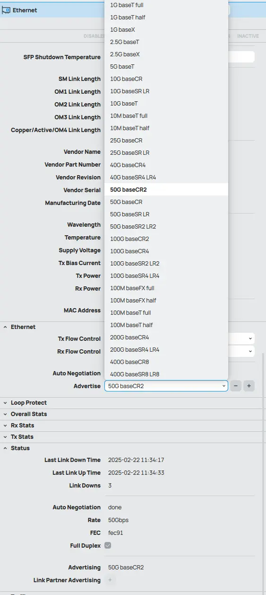

#### Generating Network Load - Using RDMA

Generating network traffic is not as easy as just running iperf. 

Given that is easier to show, then explain.... Here is an example of why:

``` bash
## Server
root@kube01:~# iperf -s

## Client generating traffic
root@kube05:~# iperf -c 10.100.4.100 -t 5000 -i 5 -P 4
```

NIC is consistently saturated at 90Gbits, reported by the switch.

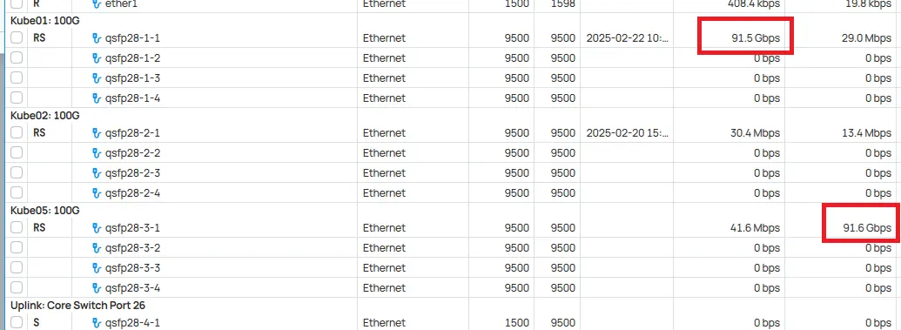

Results? 129 watts.

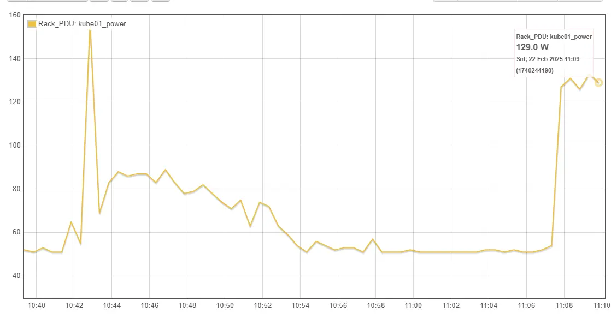

The huge issue- we aren't just measuring the NIC's consumption- we are measuring the entire system's consumption.

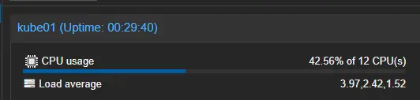

So... how can we measure the NIC alone?

Well, RDMA speed tests have always been handy at isolating the CPU. Lets try that.

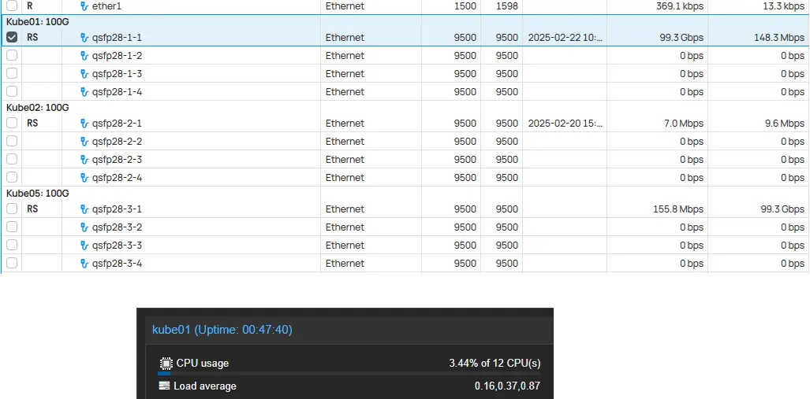

Much better. CPU is nearly idle, And we are passing a FULL 100G of bandwidth.

Results using RMDA? 63 watts.

This is a massive difference. Since- this allows us to isolate CPU, this will be the preferred method.

``` bash
## Server (being tested)
root@kube01# ib_write_bw

## Client (Sending bandwidth)
root@kube05:~# ib_write_bw 10.100.4.100 -D 600
```

!!! note
    For RDMA speed tests, both client and server need to be running at the same link speed.

    Aka- You can't test a 50G client, with a 100G client.

## Preparation

### Step 1. Remote Access

Since- we will be messing with network access, Make sure to have... means of accessing the server for when you find an unsupported link speed, etc.

For this- I will be using my JetKVM.

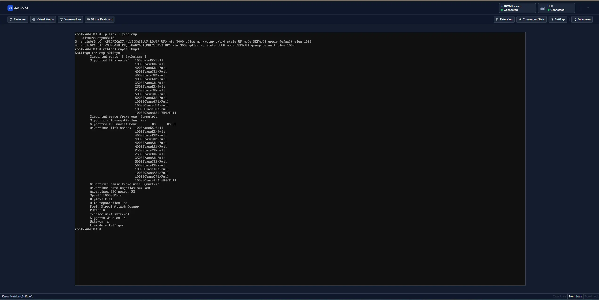

!!! info
    This is honestly the first time I have plugged in the JetKVM.

    It pulled an IP address, went through a simple setup, and boom. It worked.

### Step 2. Proxmox Maintenance

Since... I will be impacting network connectivity, I wanted to ensure I don't impact any of my current VMs.

I have a nice bash alias to easily put the host into maintenance.

``` bash
root@kube01:~# enable-maintenance
root@kube01:~#
```

For- those who don't have such a script, or alias... here is the source for mine.

``` bash
#!/bin/bash

ha-manager crm-command node-maintenance enable $(hostname)
```

This, will cause Proxmox to automatically drain, and migrate VMs/LXCs to other hosts in my cluster.

### Step 3. Update & Reboot

Finally- before benchmarking, I am going to fully update the system, and reboot it for a fresh slate.

``` bash
apt-get update
apt-get dist-upgrade
reboot
```

### Step 4. Stop Proxmox, Ceph, SNMP, etc...

We want to minimize interference as much as possible.

So- I will be stopping Proxmox, Ceph, and SNMP.

``` bash
#!/bin/bash

# Stop Proxmox services and Corosync
services=(
  "ceph.target"
  "snmpd.service"
  "corosync"
  "pve-cluster"
  "pvedaemon"
  "pvestatd"
  "pveproxy"
)

for service in "${services[@]}"; do
  echo "Stopping $service..."
  systemctl stop "$service"
done

echo "All services stopped successfully."
```

### Step 5. Verify

After stopping all services, just needed to verify everything was indeed stopped.

For ceph-

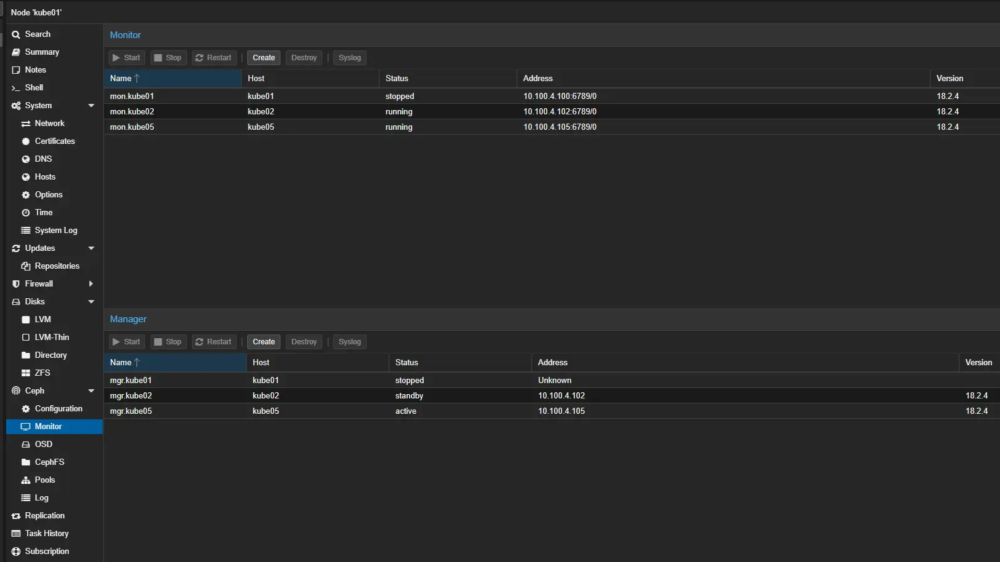

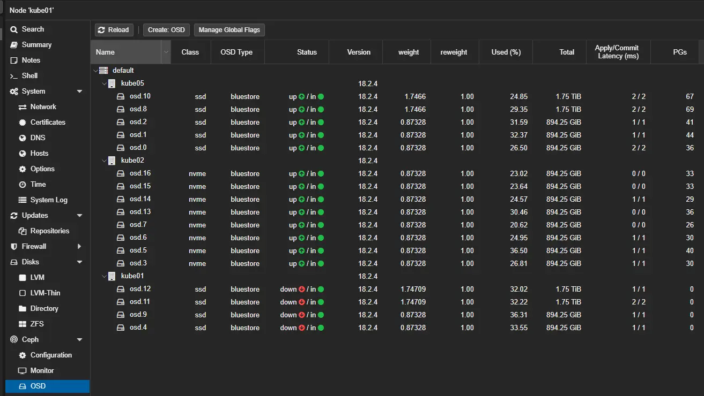

And- watching HTOP for anything unexpected.

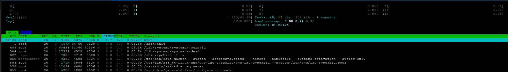

## Running Tests

### 100G

#### Idle - 50w

For the baseline test- we have an idle system, with the NIC running at 100G.

``` bash
root@kube01:~/scripts#  ethtool enp1s0f0np0  | grep -i speed && uptime
        Speed: 100000Mb/s
 12:20:26 up  1:38,  2 users,  load average: 0.10, 0.07, 0.14
```

| Feed                      | Data Points | Min  | Max  | Diff | Mean | Stdev |
|---------------------------|-------------|------|------|------|------|-------|
| 614:Temp:Temp_Benchmark () | 27/31       | 49.0 | 50.0 | 1.0  | 50.0 | 17.9  |


#### Load - 54.8w

With, 100G of network traffic being reported by the switch, I took measurements


| Feed                      | Data Points | Min  | Max  | Diff | Mean | Stdev |
|---------------------------|-------------|------|------|------|------|-------|
| 614:Temp:Temp_Benchmark () | 31/31       | 54.0 | 55.0 | 1.0  | 54.8 | 0.4   |

### 50G

#### Idle - 50w

Next- we are going to run these tests at 50G.

``` bash
root@kube01:~#  ethtool enp1s0f0np0  | grep -i speed
        Speed: 50000Mb/s
root@kube01:~# uptime
 11:35:53 up 53 min,  3 users,  load average: 0.22, 0.29, 0.66
```

 After changing the link speed to 50G, ensuring we were at a near-idle state, I waited a while to capture data.

| Feed                      | Data Points | Min  | Max  | Diff | Mean | Stdev |
|---------------------------|-------------|------|------|------|------|-------|
| 614:Temp:Temp_Benchmark () | 29/31       | 50.0 | 50.0 | 0.0  | 50.0 | 12.7  |

EXTREMELY consistent data. 

#### Load - 51w

After, configuring the servers, I verified at the switch we had the expected bandwidth being sent.


| Feed                      | Data Points | Min  | Max  | Diff | Mean | Stdev |
|---------------------------|-------------|------|------|------|------|-------|
| 614:Temp:Temp_Benchmark () | 26/31       | 51.0 | 51.0 | 0.0  | 51.0 | 20.5  |

### 40G

``` bash
root@kube01:~/scripts#  ethtool enp1s0f0np0  | grep -i speed && uptime
        Speed: 40000Mb/s
 12:30:07 up  1:48,  2 users,  load average: 0.11, 0.05, 0.08
```

#### Idle - 48w

| Feed                      | Data Points | Min  | Max  | Diff | Mean | Stdev |
|---------------------------|-------------|------|------|------|------|-------|
| 614:Temp:Temp_Benchmark () | 28/31       | 47.0 | 49.0 | 2.0  | 48.0 | 14.9  |

#### Load - 53w

Verifying expected bandwidth via switch.

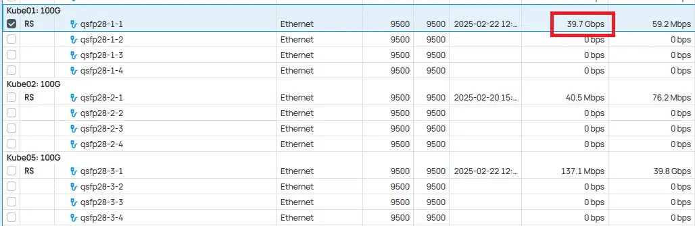

| Feed                      | Data Points | Min  | Max  | Diff | Mean | Stdev |
|---------------------------|-------------|------|------|------|------|-------|
| 614:Temp:Temp_Benchmark () | 26/31       | 53.0 | 53.0 | 0.0  | 53.0 | 21.3  |

### 25G

``` bash
root@kube01:~/scripts#  ethtool enp1s0f0np0  | grep -i speed && uptime
        Speed: 25000Mb/s
 12:42:01 up  2:00,  2 users,  load average: 0.05, 0.05, 0.07
```

#### Idle - 48w

| Feed                      | Data Points | Min  | Max  | Diff | Mean | Stdev |
|---------------------------|-------------|------|------|------|------|-------|
| 614:Temp:Temp_Benchmark () | 29/31       | 47.0 | 48.0 | 1.0  | 48.0 | 12.2  |


#### Load - 52.1w

Verifying bandwidth...

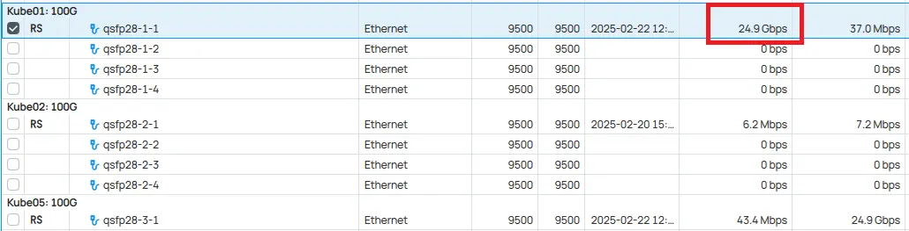

| Feed                      | Data Points | Min  | Max  | Diff | Mean | Stdev |
|---------------------------|-------------|------|------|------|------|-------|
| 614:Temp:Temp_Benchmark () | 31/31       | 52.0 | 53.0 | 1.0  | 52.1 | 0.3   |

### 10G

``` bash
root@kube01:~/scripts#  ethtool enp1s0f0np0  | grep -i speed && uptime
        Speed: 10000Mb/s
 12:55:52 up  2:13,  2 users,  load average: 0.01, 0.03, 0.05
```

#### Idle - 46.3w

| Feed                      | Data Points | Min  | Max  | Diff | Mean | Stdev |
|---------------------------|-------------|------|------|------|------|-------|
| 614:Temp:Temp_Benchmark () | 28/31       | 46.0 | 47.0 | 1.0  | 46.3 | 14.4  |


#### Load - 49.1w

Verify bandwidth...

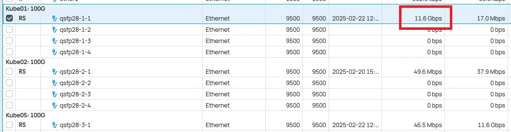

| Feed                      | Data Points | Min  | Max  | Diff | Mean | Stdev |
|---------------------------|-------------|------|------|------|------|-------|
| 614:Temp:Temp_Benchmark () | 28/31       | 49.0 | 50.0 | 1.0  | 49.1 | 15.3  |

### 1G

``` bash
root@kube01:~/scripts#  ethtool enp1s0f0np0  | grep -i speed && uptime
        Speed: 1000Mb/s
 13:13:00 up  2:31,  2 users,  load average: 0.04, 0.05, 0.04
```

#### Idle - 47w

| Feed                      | Data Points | Min  | Max  | Diff | Mean | Stdev |
|---------------------------|-------------|------|------|------|------|-------|
| 614:Temp:Temp_Benchmark () | 31/31       | 46.0 | 47.0 | 1.0  | 47.0 | 0.2   |


#### Load - 47w

Verify bandwidth...

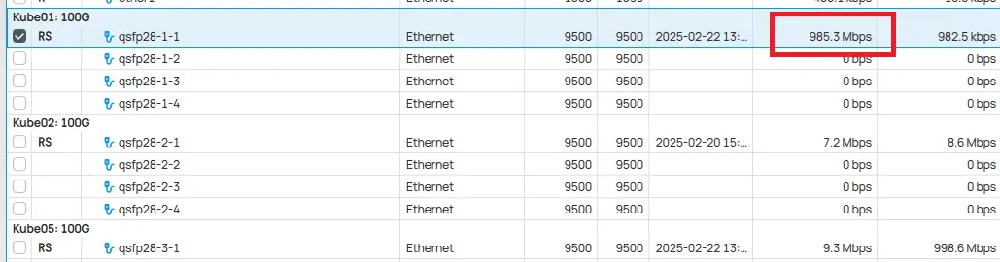

| Feed                      | Data Points | Min  | Max  | Diff | Mean | Stdev |
|---------------------------|-------------|------|------|------|------|-------|
| 614:Temp:Temp_Benchmark () | 28/31       | 47.0 | 47.0 | 0.0  | 47.0 | 14.6  |


## Testing Results

### Raw Data

Here is the results for each test, aggregated into a table.

| Link Speed | Idle/Load | Power (W) | Data Points | Min  | Max  | Diff | Mean | Stdev | Power Diff (W) |
|------------|-----------|-----------|-------------|------|------|------|------|-------|----------------|
| 100G       | Idle      | 50        | 27/31       | 49.0 | 50.0 | 1.0  | 50.0 | 17.9  |                |
| 100G       | Load      | 54.8      | 31/31       | 54.0 | 55.0 | 1.0  | 54.8 | 0.4   | 4.8            |
| 50G        | Idle      | 50        | 29/31       | 50.0 | 50.0 | 0.0  | 50.0 | 12.7  |                |
| 50G        | Load      | 51        | 26/31       | 51.0 | 51.0 | 0.0  | 51.0 | 20.5  | 1.0            |
| 40G        | Idle      | 48        | 28/31       | 47.0 | 49.0 | 2.0  | 48.0 | 14.9  |                |
| 40G        | Load      | 53        | 26/31       | 53.0 | 53.0 | 0.0  | 53.0 | 21.3  | 5.0            |
| 25G        | Idle      | 48        | 29/31       | 47.0 | 48.0 | 1.0  | 48.0 | 12.2  |                |
| 25G        | Load      | 52.1      | 31/31       | 52.0 | 53.0 | 1.0  | 52.1 | 0.3   | 4.1            |
| 10G        | Idle      | 46.3      | 28/31       | 46.0 | 47.0 | 1.0  | 46.3 | 14.4  |                |
| 10G        | Load      | 49.1      | 28/31       | 49.0 | 50.0 | 1.0  | 49.1 | 15.3  | 2.8            |
| 1G         | Idle      | 47        | 31/31       | 46.0 | 47.0 | 1.0  | 47.0 | 0.2   |                |
| 1G         | Load      | 47        | 28/31       | 47.0 | 47.0 | 0.0  | 47.0 | 14.6  | 0.0            |

Here is a screenshot of the entire collected dataset in emonCMS.

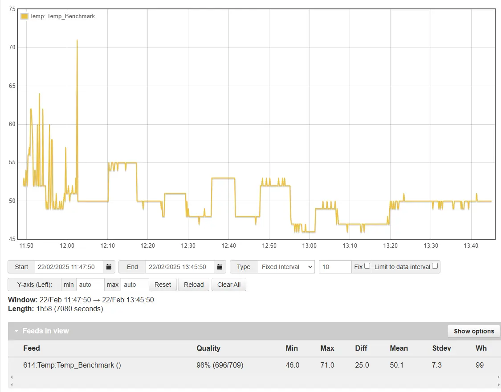

After- disabling all non-essential services to ensure a consistent idle load- you can see the power usage slowly stepping down little by little for each test.

Load tests followed after idle tests. At the end, the NIC was restored to 100G link speed.

### Formatted Data

| Link Speed | Idle Power (W) | Load Power (W) | Idle-Load Diff (W) | Idle % Chg | Load % Chg |
|------------|----------------|----------------|--------------------|------------|------------|
| 100G       | 50             | 54.8           | 4.8                | 0.0%       | 0.0%       |
| 50G        | 50             | 51             | 1.0                | 0.0%       | -6.9%      |
| 40G        | 48             | 53             | 5.0                | -4.0%      | -3.3%      |
| 25G        | 48             | 52.1           | 4.1                | -4.0%      | -4.9%      |
| 10G        | 46.3           | 49.1           | 2.8                | -7.4%      | -10.4%     |
| 1G         | 47             | 47             | 0.0                | -6.0%      | -14.2%     |

### Summary

Based on the data collected, YES, there is a difference in power consumption based on your link speed.

However, the difference is not as huge as I expected to see.

I did, however, find it interesting 50G used less energy under load, as compared to 40G/25G, with identical hardware and setup.

In the future, I will likely swap the 100G NIC out with a 25G NIC to determine any potential savings.

I have the NIC, just need a few breakout cables.

## Footnotes

[^ebay]:
    --8<--- "docs/snippets/ebay-affiliate.md"