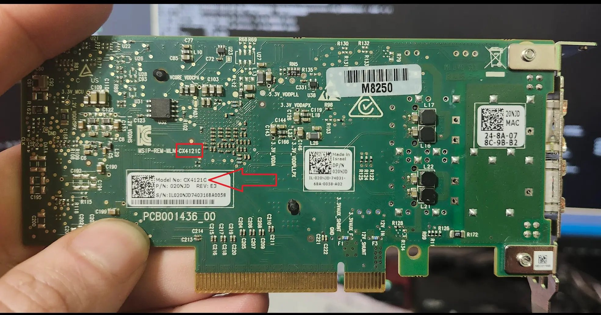
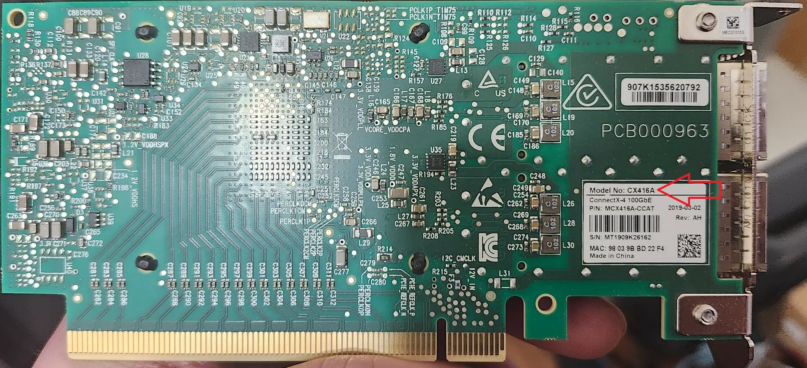
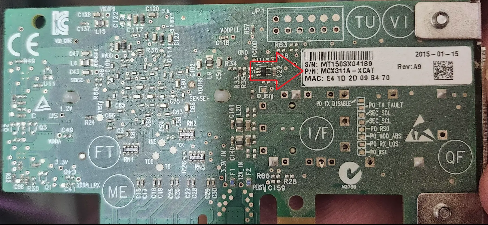
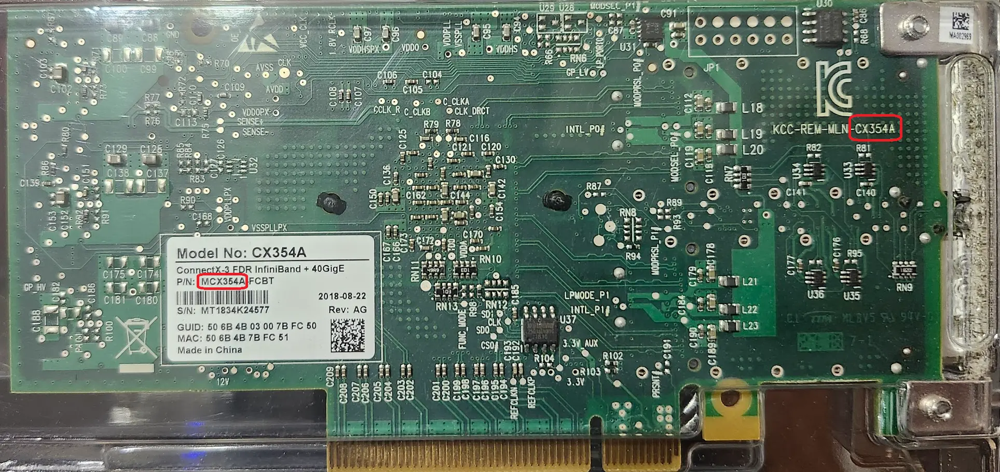
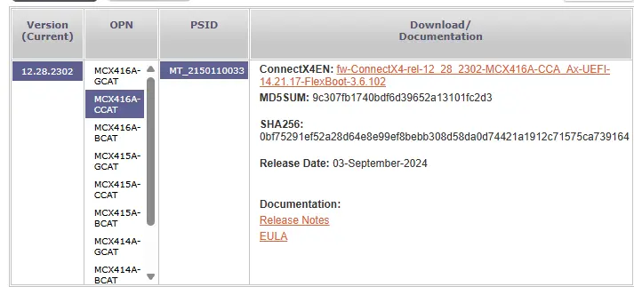
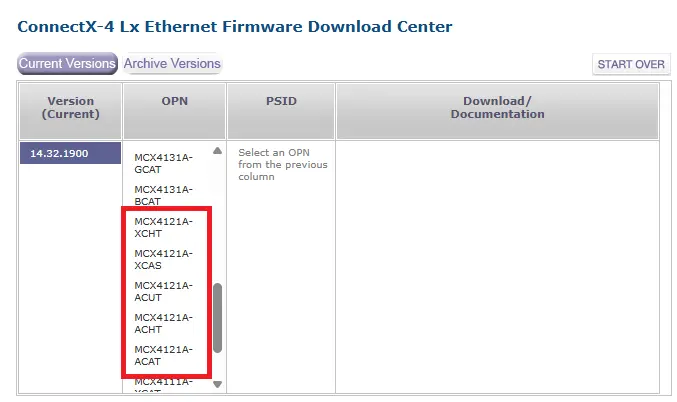
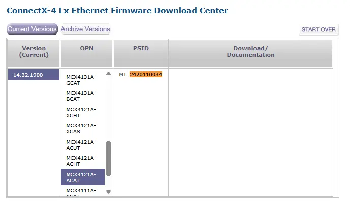

 
# Mellanox ConnectX-NIC Configuration Helper

This post centralizes data for configuration of Mellanox ConnectX Series NIC (Tested with CX3, and CX4)

<!-- more -->

## Tasks

### Packages Used

Packages Used:

- pciutils
        - contains `lspci` used in this post.
- ethtool
- wget
- unzip
        - Used for extracting .zip files. Suppose you could use a tar command too...

**Command**:

``` bash
apt-get update && apt-get install -y pciutils ethtool wget
```

**Output**:

??? info "Install package output"
        root@kube05:~# apt-get update && apt-get install -y pciutils ethtool wget
        Hit:1 http://security.debian.org/debian-security bookworm-security InRelease
        Hit:2 http://deb.debian.org/debian bookworm InRelease
        Hit:3 http://deb.debian.org/debian bookworm-updates InRelease
        Hit:4 http://download.proxmox.com/debian/pve bookworm InRelease
        Hit:5 http://download.proxmox.com/debian/ceph-reef bookworm InRelease
        Reading package lists... Done
        Reading package lists... Done
        Building dependency tree... Done
        Reading state information... Done
        pciutils is already the newest version (1:3.9.0-4).
        ethtool is already the newest version (1:6.1-1).
        The following packages were automatically installed and are no longer required:
        libc-ares2 libyang2
        Use 'apt autoremove' to remove them.
        The following packages will be upgraded:
        wget
        1 upgraded, 0 newly installed, 0 to remove and 30 not upgraded.
        Need to get 937 kB of archives.
        After this operation, 86.0 kB disk space will be freed.
        Get:1 http://deb.debian.org/debian bookworm/main amd64 wget amd64 1.21.3-1+deb12u1 [937 kB]
        Fetched 937 kB in 0s (11.1 MB/s)
        apt-listchanges: Reading changelogs...
        (Reading database ... 63296 files and directories currently installed.)
        Preparing to unpack .../wget_1.21.3-1+deb12u1_amd64.deb ...
        Unpacking wget (1.21.3-1+deb12u1) over (1.21.3-1+b2) ...
        Setting up wget (1.21.3-1+deb12u1) ...
        Processing triggers for man-db (2.11.2-2) ...

### Install MLNX-OFED & MSTFlint

`mlnx-ofed` is the drivers and software for ConnectX IB/Ethernet NICs.

`mstflint` is software provided by Nvidia for the purpose of configuring ConnectX series network adapters. 

It is also used to update firmware.

It is not required for all of the below tasks in this guide, however, does come in handy.

#### Via apt-get (For Proxmox)

Here you go, straight to the point. This was the script I used this week for installing on proxmox.

**Script**:

``` bash
## See available versions here: https://linux.mellanox.com/public/repo/mlnx_ofed/
VERSION="latest"
## See available distributions here: https://linux.mellanox.com/public/repo/mlnx_ofed/latest/
DISTRO="debian12.1"
wget -qO - https://www.mellanox.com/downloads/ofed/RPM-GPG-KEY-Mellanox | sudo apt-key add -
cd /etc/apt/sources.list.d/
wget https://linux.mellanox.com/public/repo/mlnx_ofed/$VERSION/$DISTRO/mellanox_mlnx_ofed.list
apt-get update
apt-get install mlnx-ofed-basic mstflint
```

See the [listing HERE](https://linux.mellanox.com/public/repo/mlnx_ofed/){target=_blank} for available versions.

For other distributions, look at the [repository listing HERE](https://linux.mellanox.com/public/repo/mlnx_ofed/latest/)

**Output**:

As the output was quite long and verbose, I did not embed it on this page.

[View the raw output here](assets-cx4/install-ofed-output.txt){target=_blank}.

#### RPM / Tarball / etc

If, you are using RPM, the directions will be slightly different for you.

[(Official) Nvidia Networking Repository Documentation](https://network.nvidia.com/support/mlnx-ofed-public-repository/){target=_blank}

!!! note
    You can download tarballs for the MLNX_OFED drivers from Nvidia. However, in my case it yielded "Unsupported distribution" using the debian 12 version, on my debian 12.1 proxmox hosts.

    The apt-get method, worked as expected.

### Gathering Information

#### Get PCI Address (Required)

##### via `lspci`

This step is required for basically everything else in this guide. You will need the PCIe address of your card. This is easily obtained using `lspci`

**Command**: 

``` bash
lspci | grep Mellanox
```

**Output**: 

``` bash
# One host with a 25G CX4
root@kube01:/etc/apt/sources.list.d# lspci | grep Mellanox
01:00.0 Ethernet controller: Mellanox Technologies MT27710 Family [ConnectX-4 Lx]
01:00.1 Ethernet controller: Mellanox Technologies MT27710 Family [ConnectX-4 Lx]

# On another host with a 100G CX4
root@kube02:~# lspci | grep Mellanox
81:00.0 Ethernet controller: Mellanox Technologies MT27700 Family [ConnectX-4]
81:00.1 Ethernet controller: Mellanox Technologies MT27700 Family [ConnectX-4]

# Another host, also, 100G CX4
root@kube05:~# lspci | grep Mellanox
01:00.0 Ethernet controller: Mellanox Technologies MT27700 Family [ConnectX-4]
01:00.1 Ethernet controller: Mellanox Technologies MT27700 Family [ConnectX-4]
```

As all of my NICs are dual-port- there are two entries for each NIC.

In the first example, you would want to take note of `01:00.0`, and `01:00.1`. This is the NIC's address.

##### Get PCI Address - From Interface Name - Via ethtool

If- you have the adapter/interface name, you can use this to acquire the PCI address

``` bash
ethtool -i enp1s0f0np0 | grep "bus-info"
```

**Output**:

``` bash
root@kube01:~#  ethtool -i enp1s0f0np0 | grep "bus-info"
bus-info: 0000:01:00.0
```

##### Set Variable

!!! warning
        To make it easier to run commands in this article, I will be using a variable to avoid needing to remember/retype the address name.

        If- you choose not to do this, you can instead replace `$CX_ADDRESS` in the provided scripts, with the address of your network adapter.

To make it easier to run scripts or commands in this post, I am going to set a local variable containing the card's address. 

This will negate the need to remember, or type this in for every command.

**Command**:

``` bash
# Replace the address, with the address of YOUR card.
# If- like me, your cards have multiple ports, choose the .0 port.
CX_ADDRESS="81:00.0"
```

You can paste that directly into a bash prompt to set the variable.

**Output**:

``` bash
root@kube02:~# CX_ADDRESS="81:00.0"
root@kube02:~# echo $CX_ADDRESS
81:00.0
```

#### Get Interface Name (Required)

##### Get Logic Adapter Name - From PCI Address- via `/sys`

To get the network interface name, we can simply `ls` `/sys`

**Command**: 

``` bash
ls /sys/bus/pci/devices/0000:$CX_ADDRESS/net
```

**Output**:

``` bash
root@kube02:~# ls /sys/bus/pci/devices/0000:$CX_ADDRESS/net
enp129s0f0np0
```

##### Set Variable (Required)

!!! warning
        To make it easier to run commands in this article, I will be using a variable to avoid needing to remember/retype the logical interface name.

        If- you choose not to do this, you can instead replace `$CX_INTERFACE` in the provided scripts, with the name of your network interface.

Like before, to simplify this article, I will be using a variable containing the interface name.

**Command**:

``` bash
# Replace the interface name here, with the interface name of YOUR card.
CX_INTERFACE="enp129s0f0np0"

# Alternatively, here is a command which will pick the FIRST interface listed.
CX_INTERFACE=$(ls /sys/bus/pci/devices/0000\:$CX_ADDRESS/net/ | head -n 1)

# Echo out, ensure the variables are correctly set.
echo "$CX_ADDRESS > $CX_INTERFACE"
```

**Output**:

``` bash
## From Kube02
root@kube02:~# CX_INTERFACE=$(ls /sys/bus/pci/devices/0000\:$CX_ADDRESS/net/ | head -n 1)
root@kube02:~# echo "$CX_ADDRESS > $CX_INTERFACE"
81:00.0 > enp129s0f0np0

## From Kube01
root@kube01:~# echo "$CX_ADDRESS > $CX_INTERFACE"
01:00.0 > enp1s0f0np0

## From Kube05
root@kube05:/etc/apt/sources.list.d# echo "$CX_ADDRESS > $CX_INTERFACE"
01:00.0 > enp1s0f0np0
```

#### Lspci - Verbose Information

`lspci` can be used to list many details regarding the card, such as allocated PCIe lanes, potential issues, ASPM status, speed, etc.

This information is crucial for troubleshooting.

Using the device ID, you can query the information as so:

**Command**: 

``` bash
lspci -s $CX_ADDRESS -vvvvv
```

**Output**: 

??? note "Output from Kube01 (CX4121A)"
    ``` bash
    root@kube01: CX_ADDRESS="01:00.0"
    root@kube01:/etc/apt/sources.list.d# lspci -s $CX_ADDRESS -vvvvv
    01:00.0 Ethernet controller: Mellanox Technologies MT27710 Family [ConnectX-4 Lx]
            Subsystem: Mellanox Technologies MT27710 Family [ConnectX-4 Lx]
            Control: I/O- Mem+ BusMaster+ SpecCycle- MemWINV- VGASnoop- ParErr- Stepping- SERR+ FastB2B- DisINTx+
            Status: Cap+ 66MHz- UDF- FastB2B- ParErr- DEVSEL=fast >TAbort- <TAbort- <MAbort- >SERR- <PERR- INTx-
            Latency: 0, Cache Line Size: 64 bytes
            Interrupt: pin A routed to IRQ 16
            IOMMU group: 2
            Region 0: Memory at 92000000 (64-bit, prefetchable) [size=32M]
            Expansion ROM at 95400000 [disabled] [size=1M]
            Capabilities: [60] Express (v2) Endpoint, MSI 00
                    DevCap: MaxPayload 512 bytes, PhantFunc 0, Latency L0s unlimited, L1 unlimited
                            ExtTag+ AttnBtn- AttnInd- PwrInd- RBE+ FLReset+ SlotPowerLimit 75W
                    DevCtl: CorrErr+ NonFatalErr+ FatalErr+ UnsupReq+
                            RlxdOrd+ ExtTag+ PhantFunc- AuxPwr- NoSnoop+ FLReset-
                            MaxPayload 256 bytes, MaxReadReq 512 bytes
                    DevSta: CorrErr+ NonFatalErr- FatalErr- UnsupReq+ AuxPwr- TransPend-
                    LnkCap: Port #0, Speed 8GT/s, Width x8, ASPM not supported
                            ClockPM- Surprise- LLActRep- BwNot- ASPMOptComp+
                    LnkCtl: ASPM Disabled; RCB 64 bytes, Disabled- CommClk+
                            ExtSynch- ClockPM- AutWidDis- BWInt- AutBWInt-
                    LnkSta: Speed 8GT/s, Width x8
                            TrErr- Train- SlotClk+ DLActive- BWMgmt- ABWMgmt-
                    DevCap2: Completion Timeout: Range ABCD, TimeoutDis+ NROPrPrP- LTR-
                            10BitTagComp- 10BitTagReq- OBFF Not Supported, ExtFmt- EETLPPrefix-
                            EmergencyPowerReduction Not Supported, EmergencyPowerReductionInit-
                            FRS- TPHComp- ExtTPHComp-
                            AtomicOpsCap: 32bit- 64bit- 128bitCAS-
                    DevCtl2: Completion Timeout: 50us to 50ms, TimeoutDis- LTR- 10BitTagReq- OBFF Disabled,
                            AtomicOpsCtl: ReqEn-
                    LnkCap2: Supported Link Speeds: 2.5-8GT/s, Crosslink- Retimer- 2Retimers- DRS-
                    LnkCtl2: Target Link Speed: 2.5GT/s, EnterCompliance- SpeedDis-
                            Transmit Margin: Normal Operating Range, EnterModifiedCompliance- ComplianceSOS-
                            Compliance Preset/De-emphasis: -6dB de-emphasis, 0dB preshoot
                    LnkSta2: Current De-emphasis Level: -6dB, EqualizationComplete+ EqualizationPhase1+
                            EqualizationPhase2+ EqualizationPhase3+ LinkEqualizationRequest-
                            Retimer- 2Retimers- CrosslinkRes: unsupported
            Capabilities: [48] Vital Product Data
                    Product Name: Mellanox ConnectX-4 LX Dual Port 25 GbE SFP Network Adapter
                    Read-only fields:
                            [PN] Part number: 020NJD
                            [EC] Engineering changes: A02
                            [MN] Manufacture ID: 1028
                            [SN] Serial number: IL020NJD740316C40056
                            [VA] Vendor specific: DSV1028VPDR.VER1.0
                            [VB] Vendor specific: FFV14.14.23.20
                            [VC] Vendor specific: NPY2
                            [VD] Vendor specific: PMT78
                            [VE] Vendor specific: NMVMellanox Technologies, Inc.
                            [VF] Vendor specific: DTINIC
                            [VG] Vendor specific: DCM10010010C512020010C514030010C516040010C521010010C523020010C525030010C527040010C5
                            [VH] Vendor specific: L1D0
                            [RV] Reserved: checksum good, 3 byte(s) reserved
                    End
            Capabilities: [9c] MSI-X: Enable+ Count=64 Masked-
                    Vector table: BAR=0 offset=00002000
                    PBA: BAR=0 offset=00003000
            Capabilities: [c0] Vendor Specific Information: Len=18 <?>
            Capabilities: [40] Power Management version 3
                    Flags: PMEClk- DSI- D1- D2- AuxCurrent=375mA PME(D0-,D1-,D2-,D3hot-,D3cold+)
                    Status: D0 NoSoftRst+ PME-Enable- DSel=0 DScale=0 PME-
            Capabilities: [100 v1] Alternative Routing-ID Interpretation (ARI)
                    ARICap: MFVC- ACS-, Next Function: 1
                    ARICtl: MFVC- ACS-, Function Group: 0
            Capabilities: [110 v1] Advanced Error Reporting
                    UESta:  DLP- SDES- TLP- FCP- CmpltTO- CmpltAbrt- UnxCmplt- RxOF- MalfTLP- ECRC- UnsupReq- ACSViol-
                    UEMsk:  DLP- SDES- TLP- FCP- CmpltTO- CmpltAbrt- UnxCmplt- RxOF- MalfTLP- ECRC- UnsupReq- ACSViol-
                    UESvrt: DLP+ SDES- TLP- FCP+ CmpltTO- CmpltAbrt- UnxCmplt- RxOF+ MalfTLP+ ECRC- UnsupReq- ACSViol-
                    CESta:  RxErr- BadTLP- BadDLLP- Rollover- Timeout- AdvNonFatalErr+
                    CEMsk:  RxErr- BadTLP- BadDLLP- Rollover- Timeout- AdvNonFatalErr+
                    AERCap: First Error Pointer: 04, ECRCGenCap+ ECRCGenEn- ECRCChkCap+ ECRCChkEn-
                            MultHdrRecCap- MultHdrRecEn- TLPPfxPres- HdrLogCap-
                    HeaderLog: 00000000 00000000 00000000 00000000
            Capabilities: [1c0 v1] Secondary PCI Express
                    LnkCtl3: LnkEquIntrruptEn- PerformEqu-
                    LaneErrStat: 0
            Kernel driver in use: mlx5_core
            Kernel modules: mlx5_core
    ```

??? note "Output from Kube02 (CX416)"
    Here is the output from another server of mine with the 100G CX4

    ``` bash
    root@kube02: CX_ADDRESS="81:00.0"
    root@kube02:~# lspci -vvvvv -s $CX_ADDRESS
    81:00.0 Ethernet controller: Mellanox Technologies MT27700 Family [ConnectX-4]
            Subsystem: Mellanox Technologies ConnectX-4 Stand-up dual-port 100GbE MCX416A-CCAT
            Control: I/O- Mem+ BusMaster+ SpecCycle- MemWINV- VGASnoop- ParErr- Stepping- SERR- FastB2B- DisINTx+
            Status: Cap+ 66MHz- UDF- FastB2B- ParErr- DEVSEL=fast >TAbort- <TAbort- <MAbort- >SERR- <PERR- INTx-
            Latency: 0
            Interrupt: pin A routed to IRQ 407
            NUMA node: 1
            IOMMU group: 19
            Region 0: Memory at ca000000 (64-bit, prefetchable) [size=32M]
            Expansion ROM at cd900000 [disabled] [size=1M]
            Capabilities: [60] Express (v2) Endpoint, MSI 00
                    DevCap: MaxPayload 512 bytes, PhantFunc 0, Latency L0s unlimited, L1 unlimited
                            ExtTag+ AttnBtn- AttnInd- PwrInd- RBE+ FLReset+ SlotPowerLimit 25W
                    DevCtl: CorrErr+ NonFatalErr+ FatalErr+ UnsupReq+
                            RlxdOrd+ ExtTag+ PhantFunc- AuxPwr- NoSnoop+ FLReset-
                            MaxPayload 256 bytes, MaxReadReq 4096 bytes
                    DevSta: CorrErr+ NonFatalErr- FatalErr- UnsupReq+ AuxPwr- TransPend-
                    LnkCap: Port #0, Speed 8GT/s, Width x16, ASPM not supported
                            ClockPM- Surprise- LLActRep- BwNot- ASPMOptComp+
                    LnkCtl: ASPM Disabled; RCB 64 bytes, Disabled- CommClk+
                            ExtSynch- ClockPM- AutWidDis- BWInt- AutBWInt-
                    LnkSta: Speed 8GT/s, Width x8 (downgraded)
                            TrErr- Train- SlotClk+ DLActive- BWMgmt- ABWMgmt-
                    DevCap2: Completion Timeout: Range ABC, TimeoutDis+ NROPrPrP- LTR-
                            10BitTagComp- 10BitTagReq- OBFF Not Supported, ExtFmt- EETLPPrefix-
                            EmergencyPowerReduction Not Supported, EmergencyPowerReductionInit-
                            FRS- TPHComp- ExtTPHComp-
                            AtomicOpsCap: 32bit- 64bit- 128bitCAS-
                    DevCtl2: Completion Timeout: 65ms to 210ms, TimeoutDis- LTR- 10BitTagReq- OBFF Disabled,
                            AtomicOpsCtl: ReqEn-
                    LnkCap2: Supported Link Speeds: 2.5-8GT/s, Crosslink- Retimer- 2Retimers- DRS-
                    LnkCtl2: Target Link Speed: 8GT/s, EnterCompliance- SpeedDis-
                            Transmit Margin: Normal Operating Range, EnterModifiedCompliance- ComplianceSOS-
                            Compliance Preset/De-emphasis: -6dB de-emphasis, 0dB preshoot
                    LnkSta2: Current De-emphasis Level: -6dB, EqualizationComplete+ EqualizationPhase1+
                            EqualizationPhase2+ EqualizationPhase3+ LinkEqualizationRequest-
                            Retimer- 2Retimers- CrosslinkRes: unsupported
            Capabilities: [48] Vital Product Data
                    Product Name: CX416A - ConnectX-4 QSFP28
                    Read-only fields:
                            [PN] Part number: MCX416A-CCAT
                            [EC] Engineering changes: AG
                            [SN] Serial number: MT1838X04950
                            [V0] Vendor specific: PCIeGen3 x16
                            [RV] Reserved: checksum good, 2 byte(s) reserved
                    End
            Capabilities: [9c] MSI-X: Enable+ Count=64 Masked-
                    Vector table: BAR=0 offset=00002000
                    PBA: BAR=0 offset=00003000
            Capabilities: [c0] Vendor Specific Information: Len=18 <?>
            Capabilities: [40] Power Management version 3
                    Flags: PMEClk- DSI- D1- D2- AuxCurrent=375mA PME(D0-,D1-,D2-,D3hot-,D3cold+)
                    Status: D0 NoSoftRst+ PME-Enable- DSel=0 DScale=0 PME-
            Capabilities: [100 v1] Advanced Error Reporting
                    UESta:  DLP- SDES- TLP- FCP- CmpltTO- CmpltAbrt- UnxCmplt- RxOF- MalfTLP- ECRC- UnsupReq- ACSViol-
                    UEMsk:  DLP- SDES- TLP- FCP- CmpltTO- CmpltAbrt+ UnxCmplt+ RxOF- MalfTLP- ECRC- UnsupReq- ACSViol-
                    UESvrt: DLP+ SDES- TLP+ FCP+ CmpltTO+ CmpltAbrt- UnxCmplt- RxOF+ MalfTLP+ ECRC+ UnsupReq- ACSViol-
                    CESta:  RxErr- BadTLP- BadDLLP- Rollover- Timeout- AdvNonFatalErr+
                    CEMsk:  RxErr+ BadTLP+ BadDLLP+ Rollover+ Timeout+ AdvNonFatalErr+
                    AERCap: First Error Pointer: 04, ECRCGenCap+ ECRCGenEn+ ECRCChkCap+ ECRCChkEn+
                            MultHdrRecCap- MultHdrRecEn- TLPPfxPres- HdrLogCap-
                    HeaderLog: 00000000 00000000 00000000 00000000
            Capabilities: [150 v1] Alternative Routing-ID Interpretation (ARI)
                    ARICap: MFVC- ACS-, Next Function: 1
                    ARICtl: MFVC- ACS-, Function Group: 0
            Capabilities: [180 v1] Single Root I/O Virtualization (SR-IOV)
                    IOVCap: Migration- 10BitTagReq- Interrupt Message Number: 000
                    IOVCtl: Enable- Migration- Interrupt- MSE- ARIHierarchy+ 10BitTagReq-
                    IOVSta: Migration-
                    Initial VFs: 8, Total VFs: 8, Number of VFs: 0, Function Dependency Link: 00
                    VF offset: 2, stride: 1, Device ID: 1014
                    Supported Page Size: 000007ff, System Page Size: 00000001
                    Region 0: Memory at 00000000cc800000 (64-bit, prefetchable)
                    VF Migration: offset: 00000000, BIR: 0
            Capabilities: [1c0 v1] Secondary PCI Express
                    LnkCtl3: LnkEquIntrruptEn- PerformEqu-
                    LaneErrStat: 0
            Capabilities: [230 v1] Access Control Services
                    ACSCap: SrcValid- TransBlk- ReqRedir- CmpltRedir- UpstreamFwd- EgressCtrl- DirectTrans-
                    ACSCtl: SrcValid- TransBlk- ReqRedir- CmpltRedir- UpstreamFwd- EgressCtrl- DirectTrans-
            Kernel driver in use: mlx5_core
            Kernel modules: mlx5_core
    ```

## Manage Firmware

### Get Firmware Information

#### via mstflint

We can use mstflint to get details about the currently installed firmware.

**Command**:

``` bash
mstflint -d $CX_ADDRESS query
```

**Output**:

???+ info "From Kube02 (Older firmware)"
        root@kube02:~# mstflint -d $CX_ADDRESS query
        Image type:            FS3
        FW Version:            12.28.2006
        FW Release Date:       15.9.2020
        Product Version:       12.28.2006
        Rom Info:              type=UEFI version=14.21.17 cpu=AMD64,AARCH64
                        type=PXE version=3.6.102 cpu=AMD64
        Description:           UID                GuidsNumber
        Base GUID:             98039b0300688698        4
        Base MAC:              98039b688698            4
        Image VSD:             N/A
        Device VSD:            N/A
        PSID:                  MT_2150110033
        Security Attributes:   N/A

In the above case, this firmware is a bit out of date. We will be updating it later in this guide.

??? info "Output from Kube01 (Before Update / PSID Change)"
        root@kube01:/etc/apt/sources.list.d# mstflint -d $CX_ADDRESS q
        Image type:            FS3
        FW Version:            14.14.2320
        FW Release Date:       10.5.2016
        Product Version:       rel-14_14_2320
        Rom Info:              type=UEFI version=14.9.50
                        type=PXE version=3.4.729
        Description:           UID                GuidsNumber
        Base GUID:             248a070300914da4        8
        Base MAC:              248a07914da4            8
        Image VSD:             N/A
        Device VSD:            N/A
        PSID:                  DEL2420110034
        Security Attributes:   N/A

!!! note "PSID Update"
        Take note of the PSID here- when I updated this card, I flashed back to OEM firmware, rather then the Dell? branded firmwire which was previously on it.

??? info "Output from Kube01 (After Update / PSID Change)"
        root@kube01:~# mstflint -d $CX_ADDRESS query
        Image type:            FS3
        FW Version:            14.32.1900
        FW Release Date:       25.8.2024
        Product Version:       14.32.1900
        Rom Info:              type=UEFI version=14.25.17 cpu=AMD64,AARCH64
                        type=PXE version=3.6.502 cpu=AMD64
        Description:           UID                GuidsNumber
        Base GUID:             248a070300914da4        8
        Base MAC:              248a07914da4            8
        Image VSD:             N/A
        Device VSD:            N/A
        PSID:                  MT_2420110034
        Security Attributes:   N/A

#### via mlxfwmanager

**Command**:

``` bash
mlxfwmanager
```

**Output**:

???+ info "From Kube02 (Older Firmware)"
        root@kube02:~# mlxfwmanager
        Querying Mellanox devices firmware ...

        Device #1:
        ----------

        Device Type:      ConnectX4
        Part Number:      MCX416A-CCA_Ax
        Description:      ConnectX-4 EN network interface card; 100GbE dual-port QSFP28; PCIe3.0 x16; ROHS R6
        PSID:             MT_2150110033
        PCI Device Name:  0000:81:00.0
        Base GUID:        98039b0300688698
        Base MAC:         98039b688698
        Versions:         Current        Available
        FW             12.28.2006     N/A
        PXE            3.6.0102       N/A
        UEFI           14.21.0017     N/A

        Status:           No matching image found

??? info "From Kube01 (BEFORE Updating Firmware)"
        root@kube01:~/mlnx# mlxfwmanager
        Querying Mellanox devices firmware ...

        Device #1:
        ----------

        Device Type:      ConnectX4LX
        Part Number:      020NJD_0MRT0D_Ax
        Description:      Mellanox 25GBE 2P ConnectX-4 Lx Adapter
        PSID:             DEL2420110034
        PCI Device Name:  0000:01:00.0
        Base MAC:         248a07914da4
        Versions:         Current        Available
        FW             14.14.2320     N/A
        PXE            3.4.0729       N/A
        UEFI           14.9.0050      N/A

        Status:           No matching image found

??? info "From Kube01 (Firmware Updated)"
        root@kube01:~# mlxfwmanager
        Querying Mellanox devices firmware ...

        Device #1:
        ----------

        Device Type:      ConnectX4LX
        Part Number:      MCX4121A-ACA_Ax
        Description:      ConnectX-4 Lx EN network interface card; 25GbE dual-port SFP28; PCIe3.0 x8; ROHS R6
        PSID:             MT_2420110034
        PCI Device Name:  0000:01:00.0
        Base MAC:         248a07914da4
        Versions:         Current        Available
        FW             14.32.1900     N/A
        PXE            3.6.0502       N/A
        UEFI           14.25.0017     N/A

        Status:           No matching image found

#### via ethtool

You can use `ethtool -i` to get firmware information from an interface.

**Command**:

``` bash
ethtool -i $CX_INTERFACE
```

**Output**:

``` bash
root@kube01:~# ethtool -i $CX_INTERFACE
driver: mlx5_core
version: 6.8.12-8-pve
firmware-version: 14.32.1900 (MT_2420110034)
expansion-rom-version:
bus-info: 0000:01:00.0
supports-statistics: yes
supports-test: yes
supports-eeprom-access: no
supports-register-dump: no
supports-priv-flags: yes
root@kube02:~# ethtool -i $CX_INTERFACE
driver: mlx5_core
version: 6.8.12-4-pve
firmware-version: 12.28.2006 (MT_2150110033)
expansion-rom-version:
bus-info: 0000:81:00.0
supports-statistics: yes
supports-test: yes
supports-eeprom-access: no
supports-register-dump: no
supports-priv-flags: yes
root@kube05:~# ethtool -i $CX_INTERFACE
driver: mlx5_core
version: 6.8.12-8-pve
firmware-version: 12.28.2006 (MT_2150110033)
expansion-rom-version:
bus-info: 0000:01:00.0
supports-statistics: yes
supports-test: yes
supports-eeprom-access: no
supports-register-dump: no
supports-priv-flags: yes
```

### Locate New Firmware

The first task we need to do, is identify the card.

#### Identify Card

##### via `mlxfwmanager`

To find new firmware, we need the model of your network adapter.

This is the "Part Number" field from `mlxfwmanager`

**Command**:

``` bash
mlxfwmanager | grep -E "Part Number|PSID" 
```

???+ info "Output"
        # Before updating with Dell Firmware
        root@kube01:~# mlxfwmanager | grep -E "Part Number|PSID"
        Part Number:      020NJD_0MRT0D_Ax
        PSID:             DEL2420110034
        # After updating & flashing back to OEM Firmware
        root@kube01:~# mlxfwmanager | grep -E "Part Number|PSID"
        Part Number:      MCX4121A-ACA_Ax
        PSID:             MT_2420110034
        root@kube02:~# mlxfwmanager | grep -E "Part Number|PSID"
        Part Number:      MCX416A-CCA_Ax
        PSID:             MT_2150110033
        root@kube05:/etc/apt/sources.list.d# mlxfwmanager | grep -E "Part Number|PSID"
        Part Number:      MCX416A-CCA_Ax
        PSID:             MT_2150110033

In the above output, Kube01 has a CX-4121A, while Kube02/Kube05 have CX-416A

##### via Physical Inspection

The back of the card "should" contain both a sticker, and label on the PCB with the specific model of your card.



This was from a dead card 25G CX-4121C I had on hand. It is a CX-4121C

Digging through my stash, I found a few more examples.

Here is the CX-416A 100G NIC used in Kube02, and Kube05 currently.



Here is an older CX-311A-XCAT (Single-port 10G. Dirt cheap. But old.)



And, finally, a ConnectX-3 CX-354A (Dual-Port 40G Ethernet / 56G Infiniband)



#### Find Firmware

We can download firmware from Nvidia.

!!! info
        Links.. subject to change.

        Don't come at me with pitchforks with Nvidia moves these links... again...

* [Master Listing](https://network.nvidia.com/support/firmware/firmware-downloads/){target=_blank}
* [ConnectX-3 EN Firmware](https://network.nvidia.com/support/firmware/connectx4en/){target=_blank}
* [ConnectX-3 Pro EN Firmware](https://network.nvidia.com/support/firmware/connectx3proen/){target=_blank}
* [ConnectX-4 LX Firmware](https://network.nvidia.com/support/firmware/connectx4lxen/){target=_blank}
* [ConnectX-4 EN Firmware](https://network.nvidia.com/support/firmware/connectx4en/){target=_blank}

##### Example - CX-416A (Kube05)

For this demo, I will be updating the firmware for the CX-416A on Kube05.

First- I navigate to the listings for [ConnectX-4 EN Firmware](https://network.nvidia.com/support/firmware/connectx4en/){target=_blank}.

Next, we need to locate the PSID.

From the output from before- we have these details:

``` bash
root@kube05:/etc/apt/sources.list.d# mlxfwmanager | grep -E "Part Number|PSID"
Part Number:      MCX416A-CCA_Ax
PSID:             MT_2150110033
```

Using both the part number, and PSID, we can locate the correct firmware.

!!! info
        If you cannot exactly match the part number, look through the various categories and try to match the PSID.



Copy the download link for later.

In this example, the link is: `https://www.mellanox.com/downloads/firmware/fw-ConnectX4-rel-12_28_2302-MCX416A-CCA_Ax-UEFI-14.21.17-FlexBoot-3.6.102.bin.zip`

##### Example - Dell-Branded CX4121A

Using the data from Kube01, we have these details:

``` bash
root@kube01:~# mlxfwmanager | grep -E "Part Number|PSID|Description"
Part Number:      020NJD_0MRT0D_Ax
PSID:             DEL2420110034
Description:      Mellanox 25GBE 2P ConnectX-4 Lx Adapter
```

The first thing to note- this is a Dell product number. As well, the PSID prefixed with "DEL", also hints at Dell.

For this, getting the firmware was slightly tricker.

But- lets start at the [ConnectX-4 LX Firmware](https://network.nvidia.com/support/firmware/connectx4lxen/){target=_blank}

We know this is a CX-4121A, based on the back of the card.


However, we run into an issue- this doesn't help us narrow it down.



So- at this point, you have to do a tiny bit of guess work.

Take the original PSID: `DEL2420110034`

Strip the `DEL`, which leaves `2420110034`

And search through each category until you find `2420110034`

In this example, I found the matching partial PSID under "MCX4121A-ACAT"



The resulting URL being: `https://www.mellanox.com/downloads/firmware/fw-ConnectX4Lx-rel-14_32_1900-MCX4121A-ACA_Ax-UEFI-14.25.17-FlexBoot-3.6.502.bin.zip`


### Flash Card

Since... I have a few of these to update, I am going to script out the process.

!!! info
        Normally, when updating firmware... Especially the NIC, I recommend you do so with a physically connected console (or IP-KVM).

        However, from my experiences doing this process- it can be done "relatively safely" over SSH as the firmware does not seem to apply until after boot.

``` bash
# Using this URL as example: https://www.mellanox.com/downloads/firmware/fw-ConnectX4-rel-12_28_2302-MCX416A-CCA_Ax-UEFI-14.21.17-FlexBoot-3.6.102.bin.zip
# Set Firmware URL
FW_URL="https://www.mellanox.com/downloads/firmware/fw-ConnectX4-rel-12_28_2302-MCX416A-CCA_Ax-UEFI-14.21.17-FlexBoot-3.6.102.bin.zip"
# Get the archive name from the URL.
FW_ARCHIVE_NAME=$(basename $FW_URL)
# Get the resulting fw bin filename. (Remove the .zip extension)
FW_FILE_NAME=$(basename "$FW_ARCHIVE_NAME" .zip)

# Debug output
echo "Archive Name: $FW_ARCHIVE_NAME"
echo "Bin Name: $FW_FILE_NAME"
echo "PCI Address: $CX_ADDRESS"

# Download firmware
wget $FW_URL
# Extract Firmware
unzip $FW_ARCHIVE_NAME
# Burn the new firmware.
mstflint --allow_psid_change -d $CX_ADDRESS -i $FW_FILE_NAME burn 

# Finally, cleanup the files we downloaded.
rm $FW_ARCHIVE_NAME
rm $FW_FILE_NAME
```

??? info "Output from Kube05"
        root@kube05:~# # Using this URL as example: https://www.mellanox.com/downloads/firmware/fw-ConnectX4-rel-12_28_2302-MCX416A-CCA_Ax-UEFI-14.21.17-FlexBoot-3.6.102.bin.zip
        root@kube05:~# # Set Firmware URL
        root@kube05:~# FW_URL="https://www.mellanox.com/downloads/firmware/fw-ConnectX4-rel-12_28_2302-MCX416A-CCA_Ax-UEFI-14.21.17-FlexBoot-3.6.102.bin.zip"
        root@kube05:~# # Get the archive name from the URL.
        root@kube05:~# FW_ARCHIVE_NAME=$(basename $FW_URL)
        root@kube05:~# # Get the resulting fw bin filename. (Remove the .zip extension)
        root@kube05:~# FW_FILE_NAME=$(basename "$FW_ARCHIVE_NAME" .zip)
        root@kube05:~#
        root@kube05:~# # Debug output
        root@kube05:~# echo "Archive Name: $FW_ARCHIVE_NAME"
        Archive Name: fw-ConnectX4-rel-12_28_2302-MCX416A-CCA_Ax-UEFI-14.21.17-FlexBoot-3.6.102.bin.zip
        root@kube05:~# echo "Bin Name: $FW_FILE_NAME"
        Bin Name: fw-ConnectX4-rel-12_28_2302-MCX416A-CCA_Ax-UEFI-14.21.17-FlexBoot-3.6.102.bin
        root@kube05:~# echo "PCI Address: $CX_ADDRESS"
        PCI Address: 01:00.0
        root@kube05:~#
        root@kube05:~# # Download firmware
        root@kube05:~# wget $FW_URL
        --2025-03-15 09:32:44--  https://www.mellanox.com/downloads/firmware/fw-ConnectX4-rel-12_28_2302-MCX416A-CCA_Ax-UEFI-14.21.17-FlexBoot-3.6.102.bin.zip
        Resolving www.mellanox.com (www.mellanox.com)... 23.220.161.68, 23.220.161.71
        Connecting to www.mellanox.com (www.mellanox.com)|23.220.161.68|:443... connected.
        HTTP request sent, awaiting response... 301 Moved Permanently
        Location: https://content.mellanox.com/firmware/fw-ConnectX4-rel-12_28_2302-MCX416A-CCA_Ax-UEFI-14.21.17-FlexBoot-3.6.102.bin.zip [following]
        --2025-03-15 09:32:44--  https://content.mellanox.com/firmware/fw-ConnectX4-rel-12_28_2302-MCX416A-CCA_Ax-UEFI-14.21.17-FlexBoot-3.6.102.bin.zip
        Resolving content.mellanox.com (content.mellanox.com)... 107.178.241.102
        Connecting to content.mellanox.com (content.mellanox.com)|107.178.241.102|:443... connected.
        HTTP request sent, awaiting response... 200 OK
        Length: 2366377 (2.3M) [application/zip]
        Saving to: ‘fw-ConnectX4-rel-12_28_2302-MCX416A-CCA_Ax-UEFI-14.21.17-FlexBoot-3.6.102.bin.zip’

        fw-ConnectX4-rel-12_28_2302-MCX416A-CCA_Ax-UEFI-14.21.17-Fl 100%[========================================================================================================================================>]   2.26M  8.35MB/s    in 0.3s

        2025-03-15 09:32:45 (8.35 MB/s) - ‘fw-ConnectX4-rel-12_28_2302-MCX416A-CCA_Ax-UEFI-14.21.17-FlexBoot-3.6.102.bin.zip’ saved [2366377/2366377]

        root@kube05:~# # Extract Firmware
        root@kube05:~# unzip $FW_ARCHIVE_NAME
        Archive:  fw-ConnectX4-rel-12_28_2302-MCX416A-CCA_Ax-UEFI-14.21.17-FlexBoot-3.6.102.bin.zip
        inflating: fw-ConnectX4-rel-12_28_2302-MCX416A-CCA_Ax-UEFI-14.21.17-FlexBoot-3.6.102.bin
        root@kube05:~# mstflint --allow_psid_change -d $CX_ADDRESS -i $FW_FILE_NAME burn

        Current FW version on flash:  12.28.2006
        New FW version:               12.28.2302

        FSMST_INITIALIZE -   OK
        Writing Boot image component -   OK
        -I- To load new FW run mstfwreset or reboot machine.
        root@kube05:~# rm $FW_ARCHIVE_NAME
        root@kube05:~# rm $FW_FILE_NAME

### PSID Mismatch

!!! info
        This flag is already included with the above script.

        However- this dedicated section was added to assist others with this issue.

If you have a Dell/HP branded version, you may run into a PSID Mismatch.

You will receive this error:

``` bash
root@kube01:~/mlnx# mstflint -d $CX_ADDRESS -i $FW_FILE_NAME burn
Done.
    Current FW version on flash:  14.14.2320
    New FW version:               14.32.1900


-E- PSID mismatch. The PSID on flash (DEL2420110034) differs from the PSID in the given image (MT_2420110034).
```

This will stop the flashing process. To, enable changing the PSID, we can use this flag: `--allow_psid_change`

``` bash
root@kube01:~/mlnx# mstflint --allow_psid_change -d $CX_ADDRESS -i $FW_FILE_NAME burn
Done.
    Current FW version on flash:  14.14.2320
    New FW version:               14.32.1900


    You are about to replace current PSID on flash - "DEL2420110034" with a different PSID - "MT_2420110034".
    Note: It is highly recommended not to change the PSID.

  Do you want to continue ? (y/n) [n] : y
Burning FW image without signatures -   1%

Burning FW image without signatures - OK
Restoring signature                     - OK
-I- To load new FW run mstfwreset or reboot machine.
```

After, you will have a card with Mellanox firmware, instead of Dell/HP/etc firmware.

## Configuration

### Read Configuration

#### via `ethtool`

`ethtool` can be used to query information from ethernet interfaces.

Please read [ethtool manpages](https://man7.org/linux/man-pages/man8/ethtool.8.html){target=_blank} for additional options.

``` bash
# Query basic information, link modes, FEC, Speed, Duplex, etc...
# Ie. Layer 2 Data / Parameters
echo "Layer 2 Configuration"
ethtool $CX_INTERFACE
# Show ring / buffer parameters
echo "Ring parameters"
ethtool -g $CX_INTERFACE
# Hardware Offload Parameters
echo "Offload Parameters"
ethtool -k $CX_INTERFACE
# Driver Information
echo "Driver Information"
ethtool -i $CX_INTERFACE
# Coalesce Configuration
echo "Pause Information"
ethtool -c $CX_INTERFACE
# Channel Configuration
echo "Channel Information"
ethtool -l $CX_INTERFACE
```

!!! info
        ethtool can also set parameters. However, these changes are not persistent!

        The changes would need to be saved somewhere, or placed in a script.

??? info "Output from Kube01"
        root@kube01:~# # Query basic information, link modes, FEC, Speed, Duplex, etc...
        root@kube01:~# # Ie. Layer 2 Data / Parameters
        root@kube01:~# echo "Layer 2 Configuration"
        Layer 2 Configuration
        root@kube01:~# ethtool $CX_INTERFACE
        Settings for enp1s0f0np0:
                Supported ports: [ Backplane ]
                Supported link modes:   1000baseKX/Full
                                        10000baseKR/Full
                                        25000baseCR/Full
                                        25000baseKR/Full
                                        25000baseSR/Full
                Supported pause frame use: Symmetric
                Supports auto-negotiation: Yes
                Supported FEC modes: None        RS      BASER
                Advertised link modes:  1000baseKX/Full
                                        10000baseKR/Full
                                        25000baseCR/Full
                                        25000baseKR/Full
                                        25000baseSR/Full
                Advertised pause frame use: Symmetric
                Advertised auto-negotiation: Yes
                Advertised FEC modes: RS
                Speed: 25000Mb/s
                Duplex: Full
                Auto-negotiation: on
                Port: Direct Attach Copper
                PHYAD: 0
                Transceiver: internal
                Supports Wake-on: d
                Wake-on: d
                Link detected: yes
        root@kube01:~# # Show ring / buffer parameters
        root@kube01:~# echo "Ring parameters"
        Ring parameters
        root@kube01:~# ethtool -g $CX_INTERFACE
        Ring parameters for enp1s0f0np0:
        Pre-set maximums:
        RX:             8192
        RX Mini:        n/a
        RX Jumbo:       n/a
        TX:             8192
        Current hardware settings:
        RX:             1024
        RX Mini:        n/a
        RX Jumbo:       n/a
        TX:             1024
        RX Buf Len:             n/a
        CQE Size:               n/a
        TX Push:        off
        TCP data split: off
        root@kube01:~# # Hardware Offload Parameters
        root@kube01:~# echo "Offload Parameters"
        Offload Parameters
        root@kube01:~# ethtool -k $CX_INTERFACE
        Features for enp1s0f0np0:
        rx-checksumming: on
        tx-checksumming: on
                tx-checksum-ipv4: off [fixed]
                tx-checksum-ip-generic: on
                tx-checksum-ipv6: off [fixed]
                tx-checksum-fcoe-crc: off [fixed]
                tx-checksum-sctp: off [fixed]
        scatter-gather: on
                tx-scatter-gather: on
                tx-scatter-gather-fraglist: off [fixed]
        tcp-segmentation-offload: on
                tx-tcp-segmentation: on
                tx-tcp-ecn-segmentation: off [fixed]
                tx-tcp-mangleid-segmentation: off
                tx-tcp6-segmentation: on
        generic-segmentation-offload: on
        generic-receive-offload: on
        large-receive-offload: off
        rx-vlan-offload: on
        tx-vlan-offload: on
        ntuple-filters: off
        receive-hashing: on
        highdma: on [fixed]
        rx-vlan-filter: on
        vlan-challenged: off [fixed]
        tx-lockless: off [fixed]
        netns-local: off [fixed]
        tx-gso-robust: off [fixed]
        tx-fcoe-segmentation: off [fixed]
        tx-gre-segmentation: on
        tx-gre-csum-segmentation: on
        tx-ipxip4-segmentation: off [fixed]
        tx-ipxip6-segmentation: off [fixed]
        tx-udp_tnl-segmentation: on
        tx-udp_tnl-csum-segmentation: on
        tx-gso-partial: on
        tx-tunnel-remcsum-segmentation: off [fixed]
        tx-sctp-segmentation: off [fixed]
        tx-esp-segmentation: off [fixed]
        tx-udp-segmentation: on
        tx-gso-list: off [fixed]
        fcoe-mtu: off [fixed]
        tx-nocache-copy: off
        loopback: off [fixed]
        rx-fcs: off
        rx-all: off
        tx-vlan-stag-hw-insert: on
        rx-vlan-stag-hw-parse: off [fixed]
        rx-vlan-stag-filter: on [fixed]
        l2-fwd-offload: off [fixed]
        hw-tc-offload: off
        esp-hw-offload: off [fixed]
        esp-tx-csum-hw-offload: off [fixed]
        rx-udp_tunnel-port-offload: on
        tls-hw-tx-offload: off [fixed]
        tls-hw-rx-offload: off [fixed]
        rx-gro-hw: off [fixed]
        tls-hw-record: off [fixed]
        rx-gro-list: off
        macsec-hw-offload: on
        rx-udp-gro-forwarding: off
        hsr-tag-ins-offload: off [fixed]
        hsr-tag-rm-offload: off [fixed]
        hsr-fwd-offload: off [fixed]
        hsr-dup-offload: off [fixed]
        root@kube01:~# # Driver Information
        root@kube01:~# echo "Driver Information"
        Driver Information
        root@kube01:~# ethtool -i $CX_INTERFACE
        driver: mlx5_core
        version: 6.8.12-8-pve
        firmware-version: 14.32.1900 (MT_2420110034)
        expansion-rom-version:
        bus-info: 0000:01:00.0
        supports-statistics: yes
        supports-test: yes
        supports-eeprom-access: no
        supports-register-dump: no
        supports-priv-flags: yes
        root@kube01:~# # Coalesce Configuration
        root@kube01:~# echo "Pause Information"
        Pause Information
        root@kube01:~# ethtool -c $CX_INTERFACE
        Coalesce parameters for enp1s0f0np0:
        Adaptive RX: on  TX: on
        stats-block-usecs: n/a
        sample-interval: n/a
        pkt-rate-low: n/a
        pkt-rate-high: n/a

        rx-usecs: 8
        rx-frames: 128
        rx-usecs-irq: n/a
        rx-frames-irq: n/a

        tx-usecs: 8
        tx-frames: 128
        tx-usecs-irq: n/a
        tx-frames-irq: n/a

        rx-usecs-low: n/a
        rx-frame-low: n/a
        tx-usecs-low: n/a
        tx-frame-low: n/a

        rx-usecs-high: n/a
        rx-frame-high: n/a
        tx-usecs-high: n/a
        tx-frame-high: n/a

        CQE mode RX: on  TX: off

        root@kube01:~# # Channel Configuration
        root@kube01:~# echo "Channel Information"
        Channel Information
        root@kube01:~# ethtool -l $CX_INTERFACE
        Channel parameters for enp1s0f0np0:
        Pre-set maximums:
        RX:             n/a
        TX:             n/a
        Other:          n/a
        Combined:       12
        Current hardware settings:
        RX:             n/a
        TX:             n/a
        Other:          n/a
        Combined:       12
        root@kube01:~#

#### via `mlxconfig`

`mlxconfig` does exactly what its name says. It gets, and sets configurations.

!!! info
        Unlike ethtool, changes made using `mlxconfig` are persistent.

**Command**:

``` bash
mlxconfig -d $CX_ADDRESS query
```

**Output**:

??? info "From Kube01"
        root@kube01:~# mlxconfig -d $CX_ADDRESS q

        Device #1:
        ----------

        Device type:        ConnectX4LX
        Name:               MCX4121A-ACA_Ax
        Description:        ConnectX-4 Lx EN network interface card; 25GbE dual-port SFP28; PCIe3.0 x8; ROHS R6
        Device:             01:00.0

        Configurations:                                          Next Boot
                MEMIC_BAR_SIZE                              0
                MEMIC_SIZE_LIMIT                            _256KB(1)
                FLEX_PARSER_PROFILE_ENABLE                  0
                FLEX_IPV4_OVER_VXLAN_PORT                   0
                ROCE_NEXT_PROTOCOL                          254
                PF_NUM_OF_VF_VALID                          False(0)
                NON_PREFETCHABLE_PF_BAR                     False(0)
                VF_VPD_ENABLE                               False(0)
                STRICT_VF_MSIX_NUM                          False(0)
                VF_NODNIC_ENABLE                            False(0)
                NUM_PF_MSIX_VALID                           True(1)
                NUM_OF_VFS                                  8
                NUM_OF_PF                                   2
                SRIOV_EN                                    False(0)
                PF_LOG_BAR_SIZE                             5
                VF_LOG_BAR_SIZE                             0
                NUM_PF_MSIX                                 63
                NUM_VF_MSIX                                 11
                INT_LOG_MAX_PAYLOAD_SIZE                    AUTOMATIC(0)
                PCIE_CREDIT_TOKEN_TIMEOUT                   0
                ACCURATE_TX_SCHEDULER                       False(0)
                PARTIAL_RESET_EN                            False(0)
                SW_RECOVERY_ON_ERRORS                       False(0)
                RESET_WITH_HOST_ON_ERRORS                   False(0)
                PCI_BUS0_RESTRICT_SPEED                     PCI_GEN_1(0)
                PCI_BUS0_RESTRICT_ASPM                      False(0)
                PCI_BUS0_RESTRICT_WIDTH                     PCI_X1(0)
                PCI_BUS0_RESTRICT                           False(0)
                PCI_DOWNSTREAM_PORT_OWNER                   Array[0..15]
                CQE_COMPRESSION                             BALANCED(0)
                IP_OVER_VXLAN_EN                            False(0)
                MKEY_BY_NAME                                False(0)
                UCTX_EN                                     True(1)
                PCI_ATOMIC_MODE                             PCI_ATOMIC_DISABLED_EXT_ATOMIC_ENABLED(0)
                TUNNEL_ECN_COPY_DISABLE                     False(0)
                LRO_LOG_TIMEOUT0                            6
                LRO_LOG_TIMEOUT1                            7
                LRO_LOG_TIMEOUT2                            8
                LRO_LOG_TIMEOUT3                            13
                ICM_CACHE_MODE                              DEVICE_DEFAULT(0)
                TX_SCHEDULER_BURST                          0
                LOG_MAX_QUEUE                               17
                LOG_DCR_HASH_TABLE_SIZE                     14
                MAX_PACKET_LIFETIME                         0
                DCR_LIFO_SIZE                               16384
                NUM_OF_PLANES_P1                            0
                NUM_OF_PLANES_P2                            0
                IB_PROTO_WIDTH_EN_MASK_P1                   0
                IB_PROTO_WIDTH_EN_MASK_P2                   0
                ROCE_CC_PRIO_MASK_P1                        255
                ROCE_CC_CNP_MODERATION_P1                   DEVICE_DEFAULT(0)
                ROCE_CC_PRIO_MASK_P2                        255
                ROCE_CC_CNP_MODERATION_P2                   DEVICE_DEFAULT(0)
                CLAMP_TGT_RATE_AFTER_TIME_INC_P1            True(1)
                CLAMP_TGT_RATE_P1                           False(0)
                RPG_TIME_RESET_P1                           300
                RPG_BYTE_RESET_P1                           32767
                RPG_THRESHOLD_P1                            1
                RPG_MAX_RATE_P1                             0
                RPG_AI_RATE_P1                              5
                RPG_HAI_RATE_P1                             50
                RPG_GD_P1                                   11
                RPG_MIN_DEC_FAC_P1                          50
                RPG_MIN_RATE_P1                             1
                RATE_TO_SET_ON_FIRST_CNP_P1                 0
                DCE_TCP_G_P1                                1019
                DCE_TCP_RTT_P1                              1
                RATE_REDUCE_MONITOR_PERIOD_P1               4
                INITIAL_ALPHA_VALUE_P1                      1023
                MIN_TIME_BETWEEN_CNPS_P1                    4
                CNP_802P_PRIO_P1                            6
                CNP_DSCP_P1                                 48
                CLAMP_TGT_RATE_AFTER_TIME_INC_P2            True(1)
                CLAMP_TGT_RATE_P2                           False(0)
                RPG_TIME_RESET_P2                           300
                RPG_BYTE_RESET_P2                           32767
                RPG_THRESHOLD_P2                            1
                RPG_MAX_RATE_P2                             0
                RPG_AI_RATE_P2                              5
                RPG_HAI_RATE_P2                             50
                RPG_GD_P2                                   11
                RPG_MIN_DEC_FAC_P2                          50
                RPG_MIN_RATE_P2                             1
                RATE_TO_SET_ON_FIRST_CNP_P2                 0
                DCE_TCP_G_P2                                1019
                DCE_TCP_RTT_P2                              1
                RATE_REDUCE_MONITOR_PERIOD_P2               4
                INITIAL_ALPHA_VALUE_P2                      1023
                MIN_TIME_BETWEEN_CNPS_P2                    4
                CNP_802P_PRIO_P2                            6
                CNP_DSCP_P2                                 48
                LLDP_NB_DCBX_P1                             False(0)
                LLDP_NB_RX_MODE_P1                          OFF(0)
                LLDP_NB_TX_MODE_P1                          OFF(0)
                LLDP_NB_DCBX_P2                             False(0)
                LLDP_NB_RX_MODE_P2                          OFF(0)
                LLDP_NB_TX_MODE_P2                          OFF(0)
                ROCE_RTT_RESP_DSCP_P1                       0
                ROCE_RTT_RESP_DSCP_MODE_P1                  DEVICE_DEFAULT(0)
                ROCE_RTT_RESP_DSCP_P2                       0
                ROCE_RTT_RESP_DSCP_MODE_P2                  DEVICE_DEFAULT(0)
                DCBX_IEEE_P1                                True(1)
                DCBX_CEE_P1                                 True(1)
                DCBX_WILLING_P1                             True(1)
                DCBX_IEEE_P2                                True(1)
                DCBX_CEE_P2                                 True(1)
                DCBX_WILLING_P2                             True(1)
                KEEP_ETH_LINK_UP_P1                         True(1)
                KEEP_IB_LINK_UP_P1                          False(0)
                KEEP_LINK_UP_ON_BOOT_P1                     False(0)
                KEEP_LINK_UP_ON_STANDBY_P1                  False(0)
                DO_NOT_CLEAR_PORT_STATS_P1                  False(0)
                AUTO_POWER_SAVE_LINK_DOWN_P1                False(0)
                KEEP_ETH_LINK_UP_P2                         True(1)
                KEEP_IB_LINK_UP_P2                          False(0)
                KEEP_LINK_UP_ON_BOOT_P2                     False(0)
                KEEP_LINK_UP_ON_STANDBY_P2                  False(0)
                DO_NOT_CLEAR_PORT_STATS_P2                  False(0)
                AUTO_POWER_SAVE_LINK_DOWN_P2                False(0)
                NUM_OF_VL_P1                                _4_VLs(3)
                NUM_OF_TC_P1                                _8_TCs(0)
                NUM_OF_PFC_P1                               8
                VL15_BUFFER_SIZE_P1                         0
                NUM_OF_VL_P2                                _4_VLs(3)
                NUM_OF_TC_P2                                _8_TCs(0)
                NUM_OF_PFC_P2                               8
                VL15_BUFFER_SIZE_P2                         0
                DUP_MAC_ACTION_P1                           LAST_CFG(0)
                SRIOV_IB_ROUTING_MODE_P1                    LID(1)
                IB_ROUTING_MODE_P1                          LID(1)
                DUP_MAC_ACTION_P2                           LAST_CFG(0)
                SRIOV_IB_ROUTING_MODE_P2                    LID(1)
                IB_ROUTING_MODE_P2                          LID(1)
                PHY_FEC_OVERRIDE_P1                         DEVICE_DEFAULT(0)
                PHY_FEC_OVERRIDE_P2                         DEVICE_DEFAULT(0)
                PF_SD_GROUP                                 0
                ROCE_CONTROL                                ROCE_ENABLE(2)
                PCI_WR_ORDERING                             per_mkey(0)
                MULTI_PORT_VHCA_EN                          False(0)
                PORT_OWNER                                  True(1)
                ALLOW_RD_COUNTERS                           True(1)
                RENEG_ON_CHANGE                             True(1)
                TRACER_ENABLE                               True(1)
                IP_VER                                      IPv4(0)
                BOOT_UNDI_NETWORK_WAIT                      0
                UEFI_HII_EN                                 True(1)
                BOOT_DBG_LOG                                False(0)
                UEFI_LOGS                                   DISABLED(0)
                BOOT_VLAN                                   1
                LEGACY_BOOT_PROTOCOL                        NONE(0)
                BOOT_INTERRUPT_DIS                          False(0)
                BOOT_LACP_DIS                               False(0)
                BOOT_VLAN_EN                                True(1)
                BOOT_PKEY                                   0
                DYNAMIC_VF_MSIX_TABLE                       False(0)
                EXP_ROM_UEFI_ARM_ENABLE                     False(0)
                EXP_ROM_UEFI_x86_ENABLE                     False(0)
                EXP_ROM_PXE_ENABLE                          True(1)
                ADVANCED_PCI_SETTINGS                       False(0)
                SAFE_MODE_THRESHOLD                         10
                SAFE_MODE_ENABLE                            True(1)


## Common Settings

Note, these configurations are all set using `mlxconfig`

!!! info
        You can also configure the network adapters at boot-time, by pressing the displayed key-combination during the boot process.

        This method, might be a bit easier for you.

If- you have a dual-port NIC, you will need to set many of these commands for BOTH PCI Addresses.

To view all support configurations, with documentation, use this command:

``` bash
mlxconfig -d $CX_ADDRESS show_confs
```

I will be using these variables for the below configurations. 

If- your adapter does not have multiple PHYSICAL addresses displayed- remove the line referencing CX_ADDRESS_2

!!! info
        Physical is mentioned here, as these cards support SR-IOV, which will present multiple "virtual" copies of the card, which can be directly passed into virtual machines, kubernetes, etc.

``` bash
lspci | grep Mellanox

# Fill in your addresses.
CX_ADDRESS_1="01:00.0"
CX_ADDRESS_2="01:00.1"
```

### Enable/Disable PXE/iSCSI Boot / Set Boot Parameters

I personally, don't PXE boot my hypervisors. As such, eliminating the extra 30+ seconds during boot, is ideal for me.

[Configuration Documentation](https://docs.nvidia.com/networking/display/prebootdriversv15/nic+configuration#src-99400801_NICConfiguration-LegacyBootProtocol){target=_blank}

This can also be set to do iSCSI boot as well. (aka, You can boot from an iSCSI disk on a remote NAS)

Each physical port is set independantly. 

The NICs support IPv4, and 6, Vlans, PXE and iSCSI, and quite a few other boot-related settings.

**Command**:

``` bash
# Set desired mode: Options:
# - None 
# - PXE - With failover 
# - iSCSI - Will failover to PXE after failures
# - PXE_WO_FAIL_ISCSI - PXE without failover to iSCSI
# - ISCSI_WO_FAIL_PXE - iSCSI boot without failover to PXE

CX_1_BOOTMODE="None"
CX_2_BOOTMODE="None"

## Enable, or Disable setting vlan for PXE/iSCSI boot
CX_1_BOOT_VLAN_ENABLE=0
CX_2_BOOT_VLAN_ENABLE=0

## Sets the VLAN used for PXE/iSCSI boot (if the above setting is enabled.)
CX_1_BOOT_VLAN=1
CX_2_BOOT_VLAN=1

mlxconfig -d $CX_ADDRESS_1 set LEGACY_BOOT_PROTOCOL=$CX_1_BOOTMODE BOOT_VLAN_EN=$CX_1_BOOT_VLAN_ENABLE BOOT_VLAN=$CX_1_BOOT_VLAN
mlxconfig -d $CX_ADDRESS_2 set LEGACY_BOOT_PROTOCOL=$CX_2_BOOTMODE BOOT_VLAN_EN=$CX_2_BOOT_VLAN_ENABLE BOOT_VLAN=$CX_2_BOOT_VLAN
```

If- you want to enable booting PXE/iSCSI via these NIC's, I'd recommend using the boot-time configuration utility, as it exposes the options in a much easier to use way.

### Enable/Disable SR-IOV

SR-IOV is used to present multiple "virtual" copies of your physical NIC. These instances can be passed into a VM, allowing the VM **DIRECT** access to the network, skipping the hypervisor's networking stack.

The benefit here- is potentially dramatically increased networking performance. However- there are some trade-offs...

A few examples being-

1. Proxmox firewall rules will have no-effect
2. Work-arounds are needed for VM to be able to talk to Host, and vise-versa.

Each physical port is set independantly. 

``` bash
# 1 = Enable, 0 = Disable
CX_1_SRIOV=0
CX_2_SRIOV=0

# Set number of VFS (SRIOV Virtual Functions)
CX_1_SRIOV_NUMVFS=16
CX_2_SRIOV_NUMVFS=16

# Set the desired configurations.
mlxconfig -d $CX_ADDRESS_1 set SRIOV_EN=$CX_1_SRIOV NUM_OF_VFS=$CX_1_SRIOV_NUMVFS
mlxconfig -d $CX_ADDRESS_2 set SRIOV_EN=$CX_2_SRIOV NUM_OF_VFS=$CX_2_SRIOV_NUMVFS
```

### Power Saving Features

Here are a few power savings features:

!!! info
        YES. The ConnectX-4 cards supports ASPM.

        Doesn't work for you? Update your firmware. The feature is relatively new. Make sure you have a ConnextX-4 or higher.

        ``` bash
        root@kube01:~# lspci -vvvv -s $CX_ADDRESS | grep ASPM
                LnkCap: Port #0, Speed 8GT/s, Width x8, ASPM L1, Exit Latency L1 <4us
                        ClockPM- Surprise- LLActRep- BwNot- ASPMOptComp+
                LnkCtl: ASPM L1 Enabled; RCB 64 bytes, Disabled- CommClk+
        ```

``` bash
settings=(
# 1 = Power down NIC when not in use, 0 = Keep Link Powered
    "AUTO_POWER_SAVE_LINK_DOWN_P1=1"
    "AUTO_POWER_SAVE_LINK_DOWN_P2=1"
# 0 = ASPM Enabled, 1 = ASPM Disabled
    "PCI_BUS0_RESTRICT_ASPM=0"
)

mlxconfig -d $CX_ADDRESS set "${settings[@]}"
```

### Set Port Mode Infiniband or Ethernet

ConnectX-4 infiniband NICs can set each port individually to either Infiniband mode, or Ethernet mode.

For most cases, unless you have a Infiniband switch, running in IB mode, and the knowlege/setup for IB, you should be running in ethernet mode.

``` bash
settings=(
        # 1 = Infiniband, 2 = Ethernet
        LINK_TYPE_P1=2
        LINK_TYPE_P2=2
)


# Set the desired configurations.
mlxconfig -d $CX_ADDRESS set "${settings[@]}"
```

### Persistent Ethtool Tuning (Hardware offload, Jumbo Frames, etc)

As ethtool changes are not directly persistent... We need to fix that.

#### Method 1. Put settings in /etc/network/interfaces

This method is simple, just add the correct settings to `/etc/network/interfaces`

``` bash title="/etc/network/interfaces"
iface enp1s0 inet dhcp
    # Ring Buffer Size
    HARDWARE_DMA_RING_rx=8192
    HARDWARE_DMA_RING_tx=8192
    # Hardware Offload Features
    OFFLOAD_rx=on
    OFFLOAD_tx=on
    OFFLOAD_tso=on
    OFFLOAD_gso=on
    OFFLOAD_tx_gso_partial=on
    OFFLOAD_gro=on
    OFFLOAD_lro=off
    OFFLOAD_rxvlan=on
    OFFLOAD_txvlan=on
    OFFLOAD_rxhash=on
    OFFLOAD_rx_vlan_filter=on
    OFFLOAD_tx_gre_segmentation=on
    OFFLOAD_tx_gre_csum_segmentation=on
    OFFLOAD_tx_udp_tnl_segmentation=on
    OFFLOAD_tx_udp_tnl_csum_segmentation=on
    OFFLOAD_tx_udp_segmentation=on
    OFFLOAD_rx_udp_tunnel_port_offload=on
    OFFLOAD_macsec_hw_offload=off
    # Disable Flow Control
    IF_ETHERNET_PAUSE_rx=off
    IF_ETHERNET_PAUSE_tx=off
    # Enable Adaptive Coalescing
    HARDWARE_IRQ_COALESCE_adaptive_rx=on
    HARDWARE_IRQ_COALESCE_adaptive_tx=on
    # Disable Wake on LAN
    IF_ETHERNET_WOL=d
```

#### Method 2. Custom if-up script.

(This- is the method I went with. I feel, its easier to maintain.)

Copy and paste the below block into a terminal. It will automatically create the script.

``` bash
CUSTOM_SCRIPT_NAME="ethtool-custom"
# Create empty file
touch /etc/network/if-up.d/$CUSTOM_SCRIPT_NAME
# Mark as executable
chmod +x /etc/network/if-up.d/$CUSTOM_SCRIPT_NAME
# Create script using text-editor.
# The rest of the lines will be automatially added.
nano /etc/network/if-up.d/$CUSTOM_SCRIPT_NAME
#!/bin/bash

IFACE="$1"

case "$IFACE" in
  enp1s0f0np0|enp1s0f1np1)
    # Increase ring buffer size
    ethtool -G "$IFACE" rx 8192 tx 8192
    # Enable hardware checksum
    ethtool -K "$IFACE" rx on tx on
    # TCP Segmentation Offload
    ethtool -K "$IFACE" tso on
    # Generic Segmentation Offload
    ethtool -K "$IFACE" gso on tx-gso-partial on
    # Generic Receive Offload
    ethtool -K "$IFACE" gro on
    # DISABLE large receive offload - Known to cause issues with certain applications
    ethtool -K "$IFACE" lro off
    # Enable Vlan Offload TX & TX
    ethtool -K "$IFACE" rxvlan on txvlan on
    # Enable receive hashing
    ethtool -K "$IFACE" rxhash on
    # Enable receive vlan filtering
    ethtool -K "$IFACE" rx-vlan-filter on
    # More segmentation-related features
    ethtool -K "$IFACE" tx-gre-segmentation on tx-gre-csum-segmentation on tx-udp_tnl-segmentation on tx-udp_tnl-csum-segmentation on tx-udp-segmentation on
    # No idea.
    ethtool -K "$IFACE" rx-udp_tunnel-port-offload on
    # Disable Macsec hardware offload - Adds additional overhead if we aren't using this.
    ethtool -K "$IFACE" macsec-hw-offload off
    # Disable Flow-Control
    ethtool -A "$IFACE" rx off tx off
    # Set Coalescing parameters to reduce Interrupts, adaptive if possible.
    ethtool -C "$IFACE" adaptive-rx on adaptive-tx on
    # Disable Wake on LAN.
    ethtool -s "$IFACE" wol d
    ;;
  #eth1)
    # eth1- specific goes here.
    # ;;
  *)
    echo "Did not match expected interface name. No actions taken"
    echo "Interface Name: $IFACE"
    ;;
esac

exit 0
```

To test, execute the script and pass the first argument as the interface name

??? info "Kube01 Results"
        root@kube01:/etc/network/if-up.d# ./ethtool-custom  enp1s0f0np0
        Actual changes:
        tx-checksum-ipv4: off [requested on]
        tx-checksum-ipv6: off [requested on]
        tx-checksum-fcoe-crc: off [requested on]
        tx-checksum-sctp: off [requested on]
        Actual changes:
        tx-tcp-ecn-segmentation: off [requested on]
        root@kube01:/etc/network/if-up.d# ./ethtool-custom  enp1s0f1np1
        Actual changes:
        tx-checksum-ipv4: off [requested on]
        tx-checksum-ipv6: off [requested on]
        tx-checksum-fcoe-crc: off [requested on]
        tx-checksum-sctp: off [requested on]
        Actual changes:
        tx-tcp-ecn-segmentation: off [requested on]
        tx-tcp-mangleid-segmentation: on

??? info "Kube05 Results"
        root@kube05:~# /etc/network/if-up.d/$CUSTOM_SCRIPT_NAME enp1s0f0np0
        Actual changes:
        tx-checksum-ipv4: off [requested on]
        tx-checksum-ipv6: off [requested on]
        tx-checksum-fcoe-crc: off [requested on]
        tx-checksum-sctp: off [requested on]
        Actual changes:
        tx-tcp-ecn-segmentation: off [requested on]
        tx-tcp-mangleid-segmentation: on
        root@kube05:~# /etc/network/if-up.d/$CUSTOM_SCRIPT_NAME enp1s0f1np1
        Actual changes:
        tx-checksum-ipv4: off [requested on]
        tx-checksum-ipv6: off [requested on]
        tx-checksum-fcoe-crc: off [requested on]
        tx-checksum-sctp: off [requested on]
        Actual changes:
        tx-tcp-ecn-segmentation: off [requested on]
        tx-tcp-mangleid-segmentation: on
        root@kube05:~#

## Other

### Which NICs or Switches to buy?

If- you are looking to buy 10/25/40/100G NICs, please see [This Post](../2024/2024-12-18-faster-networking.md).