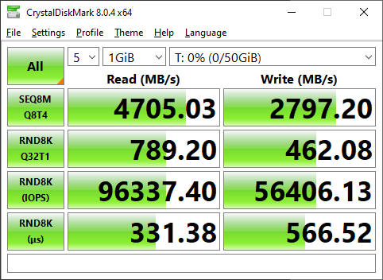

# 40 Gigabit NAS Journey

Speedtest going over ethernet to my remote NAS in the other room.

This speedtest was achieved after migrating to Core. If I can manage better results, I will update this image.

## Summary

I have been trying to see exactly how fast I can push my existing hardware, without dumping ridiculous amounts of money on it.

I have tried many things to maximize the amount of performance, including even temporarily buying a pair of 100GBe nics a while back. (TLDR; lots of driver issues….)

Well, after months and months of tinkering, I have finally reached my goal of being able to easily saturate 40GBe ethernet.

If you wish to read more of the details which led me to this point, here are a few of the previous posts:

## Projects

### 2020-07 [The Original NAS.](https://xtremeownage.com/2020/07/24/closet-mini-server-build/){target=_blank}

I started my current NAS journey, with a 500$ build, after being disappointed at the high prices of synology / drobo / qnap systems. I wanted to prove I could build a more capable system for less money. I did succeed.

This unit was eventually replaced due to the underpowered CPU.

### 2021-03 [Round 2. Combined NAS and Gaming PC](https://xtremeownage.com/2021/03/16/2021-server-and-gaming-pc-build/){target=_blank}

I ended up selling the above build, and for a few months, I turned my gaming PC into a combined gaming PC and server. Overall, it worked great. The only downside was the amount of heat being put into my bedroom. Oh, and limited number of PCIe lanes.

This was replaced by a Dell R720XD, which I picked up for 500$ shipped, with 128GB of ram included.

### 2021-09 [Upgrading my home network to 10/40G backbone](https://xtremeownage.com/2021/09/04/10-40g-home-network-upgrade/){target=_blank}

Sept of 2021, I picked up a pair of brocade ICX-6610 10/40G switches. As well, this is the first article where my Dell R720XD was mentioned. I never did a formal write up on obtaining it. However, it replaced my Combined GamingPC/Server.

As apart of this project, I also ran 10GBe to my office.

### 2021-11 [Adding a server rack](https://xtremeownage.com/2021/11/05/rack-em-up/){target=_blank}

Self explanatory, however, since having all of your hardware sitting on buckets and cardboard boxes is not the best thing to do, I invested in a rack… and made everything somewhat presentable.

### 2021-12 [Reducing Power Consumption. Part 1. Retiring the Brocade ICX-6610](https://xtremeownage.com/2021/12/12/reducing-power-consumption-without-reducing-performance/){target=_blank}

Turns out, the brocade ICX-6610 produces more heat/noise then I was happy with. In this post, I retired the old switches. This saved a big chunk of power, but, also meant, I no longer had a 40GBe network core. Instead, I leveraged my opnsense firewall for providing a 10G core, although routed.

### 2022-01 [Running 40Gigabit Fiber](https://xtremeownage.com/2022/01/26/40gb-ethernet-cost-and-benchmarks/){target=_blank}

Since, 10GBe just wasn’t cutting it for me, I finally got around to running 40Gbe fiber from my server closet to my office. This also added a Chelsio 40GBe NIC to my Gaming PC.

Since the 40GB was point to point, no switches, no routers, etc, This also improved performance significantly over the 10GBe routed iscsi from previous steps.

### 2022-01 [Adding "Bifurcation" to my Poweredge r720XD](./../../blog/posts/Technology/2022-01/R720XD-Bifurcation.md)

Since, my r720XD does not support bifurcation, I found a few PCIe cards to work as switches for my NVMes. This allowed me to run many more NVMe drives rather then only being able to leverage a single NVMe per PCIe-slot.

### 2022-03 [Trying Infiniband](https://xtremeownage.com/2022/03/26/truenas-scale-infiniband/){target=_blank}

One day a few months back, I experimented with using Infiniband.

This involved custom compiling drivers for TrueNAS, and having to hack up a lot of bits and pieces you generally do not want to touch.

As well, the [community forums are quite toxic](https://www.truenas.com/community/threads/chelsio-t520-cr.97081/#post-690618){target=_blank} to you doing anything that isn’t supported out of the box. But, I did manage to successfully get infiniband up and running. However, I was unable to perform any reasonable tests as I didn’t want to hack up the system anymore.

### 2022-04 [Reducing Power Consumption. Part 2. Moving Compute to SFF PCs](https://xtremeownage.com/2022/04/10/attempting-to-reduce-power-consumption-and-improving-performance/){target=_blank}

Given electricity costs money, and power usage means heat production, I continued down the path of reducing the energy consumption of my home lab.

In this post, I reduced power consumption by ADDING new servers. Overall, I was able to reduce my R720XD’s power consumption by a pretty good chunk by moving services to the new SFF optiplex machines I had acquired.

Since, the server was no longer handling containers/VMs, I also removed its second CPU which actually helped performance out a good bit.

On the downside, I now only have 96G of ram instead of 128G.

### 2022-04 [Migrating from Scale, to Core](https://xtremeownage.com/2022/04/29/moving-from-truenas-scale-to-core/){target=_blank}

The final step to achieve the performance numbers I have been hunting for- I installed TrueNAS core, and rebuilt my configuration from scratch.

Out of the box, with no tuning whatsoever, it had no issues at all besting every performance metric from Scale.

### 2023-01 [Death of my r720XD](./../../blog/posts/Technology/2023-01/r720xd-death.md)

While my [Home Solar Project](Solar-Project.md) was being installed, I powered down my r720xd to save a bit on battery, since I had to go a full day without any grid connection. Well, low and behold, when I went to power the machine back online, it wasn't having it.

After the fact, I did find it was able to boot after installing a new PSU, however, it has long since been replaced by a r730.